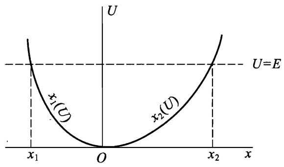

# 根据振动周期确定势能

现在让我们来研究这样的问题, 当一个质点在场中振动时, 通过振动周期 $T$ 与能量 $E$ 的关系在多大程度上可以确定该场的势能 $U ( x )$ 的形式. 从数学的角度看, 这是求解[一维运动](./11一维运动.md)中的积分方程：
$$
T ( E ) = \sqrt { 2 m } \int _ { x _ { 1 } ( E ) } ^ { x _ { 2 } ( E ) } \frac { \mathrm { d } x } { \sqrt { E - U ( x ) } }
$$
其中 $U ( x )$ 是未知函数, 而 $T ( E )$ 是已知函数.

我们先不考虑积分方程是否存在不符合下述条件的解的问题, 假定所求函数 $U ( x )$ 在所考虑的空间区域中只有一个极小值.为了方便起见, 我们假设势能极小值等于零, 并将坐标原点选在势能极小值处(如图).

  
对积分做变换, 将坐标 $x$ 当作 $U$ 的函数. 函数 $x ( U )$ 是双值的, 即每个 $U$ 对应两个不同的 $x$ 值. 用 $\frac { \mathrm { d } x } { \mathrm { d } U } \mathrm { d } U$ 代替 ${ \mathrm { d } } x$ , 积分变为两个积分之和：从 $x = x _ { 1 }$ 到 $x = 0$ 的积分, 从 $x = 0$ 到 $x = x _ { 2 }$ 的积分. 我们将这两个区域中的函数 $x ( U )$ 分别写为 $x = x _ { 1 } ( U )$ 和 $x = x _ { 2 } ( \mathrm { ~ } U )$ .

显然, 对 $U$ 积分的上下限分别为 $E$ 和0, 于是有

$$
\begin{array} { l }  { T ( E ) = \sqrt { 2 m } { \displaystyle \int _ { 0 } ^ { E } } { \displaystyle { \frac { { \mathrm { d } } x _ { 2 } ( U ) } { { \mathrm { d } } U } } \ { \displaystyle { \frac { { \mathrm { d } } U } { \sqrt { E - U } } } } + \sqrt { 2 m } { \displaystyle \int _ { E } ^ { 0 } } { \displaystyle { \frac { { \mathrm { d } } x _ { 1 } ( U ) } { { \mathrm { d } } U } } \ { \displaystyle { \frac { { \mathrm { d } } U } { \sqrt { E - U } } } } } } } \\  { { \mathrm { ~ } = \sqrt { 2 m } { \displaystyle \int _ { 0 } ^ { E } } \left( { \displaystyle { \frac { { \mathrm { d } } x _ { 2 } ( U ) } { { \mathrm { d } } U } } - \frac { { \mathrm { d } } x _ { 1 } ( U ) } { { \mathrm { d } } U } } \right) { \displaystyle { \frac { { \mathrm { d } } U } { \sqrt { E - U } } } } . } } \end{array}
$$

将这个方程两边除以 $\sqrt { \alpha - E }$ , 其中 $\alpha$ 是参数, 然后对 $E$ 从零到 $\alpha$ 积分：

$$
\int _ { 0 } ^ { \alpha } \frac { T ( E ) { \mathrm { d } } E } { \sqrt { \alpha - E } } = \sqrt { 2 m } \int _ { 0 } ^ { \alpha } \int _ { 0 } ^ { E } \biggl ( \frac { { \mathrm { d } } x _ { 2 } ( U ) } { { \mathrm { d } } U } - \frac { { \mathrm { d } } x _ { 1 } ( U ) } { { \mathrm { d } } U } \biggr ) \frac { { \mathrm { d } } U { \mathrm { d } } E } { \sqrt { ( \alpha - E ) ( E - U ) } } ,
$$

或者改变积分顺序写成

$$
\int_{0}^{\alpha} \frac { T (E)\mathrm { d } E } { \sqrt { \alpha - E } } \mathrm { \Large ~ = ~ } \sqrt { 2 m } \displaystyle \int _ { 0 } ^ { \alpha } \biggl ( \frac { \mathrm { d } x _ { 2 } ( U ) } { \mathrm { d } U } - \frac { \mathrm { d } x _ { 1 } ( U ) } { \mathrm { d } U } \biggr ) \mathrm { d } U \displaystyle \int _ { U } ^ { \alpha } \frac { \mathrm { d } E } { \sqrt { ( \alpha - E ) ( E - U ) } } \mathrm { \ . }
$$

对 $E$ 的积分是初等积分, 其值等于 $\pi$ . 而对 $U$ 的积分是平凡的, 则有

$$
\int _ { 0 } ^ { \alpha } \frac { T ( E ) \mathrm { d } E } { \sqrt { \alpha - E } } = \pi \sqrt { 2 m } \big [ x _ { 2 } \big ( \alpha \big ) - x _ { 1 } \big ( \alpha \big ) \big ]
$$

（计算中已考虑到 $x _ { 2 } ( 0 ) = x _ { 1 } ( 0 ) = 0$) . 将 $\alpha$ 替换为 $U$ , 最终得

$$
x _ { 2 } ( U ) - x _ { 1 } ( U ) = \frac { 1 } { \pi \sqrt { 2 m } } \int _ { 0 } ^ { U } \frac { T ( E ) \mathrm { d } E } { \sqrt { U - E } } .\tag{1}\label{eq1}
$$

因此, 由已知的函数 $T ( E )$ 可以确定 $x _ { 2 } ( U ) - x _ { 1 } ( U )$ ,但函数 $x _ { 2 } ( \ U )$ 和$x _ { 1 } ( U )$ 本身仍然无法确定.这就是说, 相应于给定的周期与能量的关系, 存在不止一条而是无穷多条曲线 $U = U ( x )$ ,但是曲线的不同不改变同一 $U$ 对应的两个 $x$ 的差值.

如果要求曲线 $U = U ( x )$ 关于 $U$ 轴对称, 即

$$
x _ { 2 } ( U ) = - x _ { 1 } ( U ) { \equiv } x ( U ) ,
$$

则不存在解的多值性问题. 这时公式$\eqref{eq1}$给出 $U ( x )$ 的单值表达式：

$$
x ( U ) = \frac { 1 } { 2 \pi \sqrt { 2 m } } { \int _ { 0 } ^ { U } \frac { T ( E ) \mathrm { d } E } { \sqrt { U - E } } } .
$$

