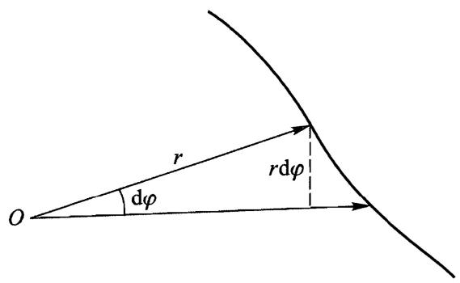
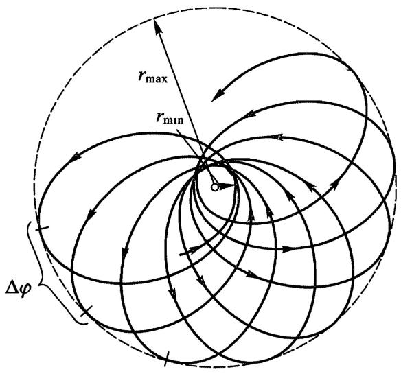

# 有心力场内的运动

当将二体问题约化为一个单体运动问题时，我们仅需确定单个质点在某种外场中的运动，该外场中质点的势能只与质点到某一固定点的距离有关，这样的外场称为有心力场.作用在质点上的力

$$
\boldsymbol { F } =  - \frac { \partial U ( \mathbf { \nabla } _ { r } ) } { \partial \boldsymbol { r } } = - \frac { \mathrm { d } U } { \mathrm { d } r } \ \frac { \boldsymbol { r } } { r } ,
$$

的大小仅依赖于 $r$ ,方向总是沿着质点的径矢.

在 [角动量](./角动量.md) 已经证明，在有心力场内的运动对场中心的角动量守恒.对于一个质点，这个角动量就是

$$
\pmb { M } = \pmb { r } \times \pmb { p } .
$$

由于 $\boldsymbol{M}$ 和 $\boldsymbol{r}$ 相互垂直， $\boldsymbol{M}$ 不变就意味着在运动过程中质点的径矢总是位于一个平面内，该平面垂直于 $\boldsymbol{M}$ 。

因此质点在有心力场内运动的整条轨道都位于一个平面内.在该平面内引入极坐标 $r , \varphi$ ，写出拉格朗日函数(参见[自由质点的拉格朗日函数](./4自由质点的拉格朗日函数.md))

$$
L = \frac { m } { 2 } ( \dot { r } ^ { 2 } + r ^ { 2 } \dot { \varphi } ^ { 2 } ) - U ( r ) .
$$

这个函数不显含坐标 $\varphi$ .拉格朗日函数不显含的广义坐标称为循环坐标.根据拉格朗日方程，对于循环坐标 $q _ { i }$ ,有

$$
\frac { \mathrm { d } } { \mathrm { d } t } \frac { \partial L } { \partial \dot { q } _ { i } } = \frac { \partial L } { \partial  q _ { i } } = 0 ,
$$

即相应的广义动量 $p  _ { i }  = \partial L / \partial \dot { q } _ { i }$ 是运动积分.这将在存在循环坐标情况下大大简化积分运动方程的问题.

在现在的情况下，广义动量

$$
 p _ { \varphi } = m r ^ { 2 } \dot { \varphi }
$$

就是角动量 $M _ { z } = M$ (参见 [角动量](./角动量.md) )，因此我们又回到了熟知的角动量守恒定律

$$
M = m r ^ { 2 } \ { \dot { \varphi } } = \mathrm { c o n s t . }\tag{1}\label{eq1}
$$

对于单一质点在有心力场内作平面运动的情况，角动量守恒定律有一个简单的几何解释.无限邻近的两个径矢和轨道微元围成的扇形面积(下图)等于$( 1 / 2 ) \boldsymbol { r } \cdot \boldsymbol { r } { \mathrm { d } } { \varphi }$ ，将它表示为 $\mathrm { d } f$ . 质点的角动量可以写成

$$
M = 2 m { \dot { f } } ,
$$

其中 $\dot { f }$ 称为掠面速度.所以角动量守恒意味着掠面速度为常数，即在相等时间间隔内质点径矢扫过相同的面积(开普勒第二定律)[^1].

  
从能量和角动量守恒出发，无需写出运动方程，就可以很容易地完全解决质点在有心力场中的运动问题.利用$\eqref{eq1}$用 $M$ 表示 $\dot { \varphi }$ ,代入能量的表达式,我们得到
$$
E = { \frac { m } { 2 } } ( { \dot { r } } ^ { 2 } + r ^ { 2 } { \dot { \varphi } } ^ { 2 } ) + U ( r ) = { \frac { m { \dot { r } } ^ { 2 } } { 2 } } + { \frac { M ^ { 2 } } { 2 m r ^ { 2 } } } + U ( r ) .\tag{2}\label{eq2}
$$

由此可得

$$
\dot { r } \equiv \frac { \mathrm { d } r } { \mathrm { d } t } = \sqrt { \frac { 2 } { m } [ E - U ( r ) ] - \frac { M ^ { 2 } } { { m } ^ { 2 } r ^ { 2 } } } ,\tag{3}\label{eq3}
$$

分离变量并积分得

$$
t = \int \frac { \mathrm { d } { r } } { \sqrt { \frac { 2 } { m } [ E - U ( r ) ] - \frac { M ^ { 2 } } { m ^ { 2 } r ^ { 2 } } } } + \mathrm { c o n s t . }\tag{4}\label{eq4}
$$

将$\eqref{eq1}$写成

$$
\mathrm { d } \varphi = \frac { M } { m r ^ { 2 } } \mathrm { d } t \ ,
$$

从$\eqref{eq3}$求出 $\mathrm { d } t$ 代入上式并积分得

$$
\varphi = \int \frac { ( M / r ^ { 2 } ) \mathrm { d } r } { \sqrt { 2 m \left[ E - U ( r ) \right] - M ^ { 2 } / r ^ { 2 } } } + \mathrm { c o n s t } \ .\tag{5}\label{eq5}
$$

公式$\eqref{eq4}$和$\eqref{eq5}$给出了问题的通解.公式$\eqref{eq5}$给出了 $r$ 和 $\varphi$ 的关系，即轨道方程，而公式$\eqref{eq4}$给出了质点到力心距离 $r$ 随时间变化的隐函数.应该注意到，由公式$\eqref{eq1}$可知 $\dot { \varphi }$ 的符号总不会改变，因此 $\varphi$ 总是随时间单调变化.

公式$\eqref{eq3}$表明，径向运动可以看作是在某个场中的一维运动，该场的“有效”势能为

$$
U _ { \mathrm { e f f } } = U ( r ) + { \frac { M ^ { 2 } } { 2 m r ^ { 2 } } } .
$$

其中 $M ^ { 2 } / ( 2 m r ^ { 2 } )$ 称为离心势能.从

$$
U ( r ) + { \frac { M ^ { 2 } } { 2 m r ^ { 2 } } } = E
$$

中求出的 $r$ 给出了运动区域边界到力心的距离.上式成立时径向速度 $\dot { r }$ 等于零.但这不能说明质点像在真正的一维运动中那样是静止的，这是因为角速度 $\dot { \varphi }$ 不为零.等式 $\dot { r } = 0$ 表示轨道的“转折点”,函数 $r ( t )$ 在这个点从增加变为减小或者相反.

如果 $r$ 的变化区域只受 $r \geqslant r _ { \operatorname* { m i n } }$ 的限制，则运动是无界的，即质点从无穷远处来又回到无穷远处去.

如果 $r$ 的变化区域有两个边界 $r _ { \mathrm { m n } }$ 和 $r _ { \mathrm { m a x } }$ ,则运动是有界的，轨道完全位于$r = r _ { \operatorname* { m i n } }$ 和 $r = r _ { \operatorname* { m a x } }$ 确定的环形区域内.然而，这并不表明轨道必定是封闭曲线.

根据$\eqref{eq5}$，在 $r$ 从 $r _ { \mathrm { m a x } }$ 变到 $r _ { \mathrm { m i n } }$ 再回到 $r _ { \mathrm { m a x } }$ 这一时间间隔內径矢转过的角度$\Delta \varphi$ 等于

$$
\Delta \varphi = 2 \int _ { r _ { \mathrm { m i n } } } ^ { r _ { \mathrm { m a x } } } \frac { \left( M / r ^ { 2 } \right) \mathrm { d } r } { \sqrt { 2 m \left[ E - U \left( r \right) \right] - M ^ { 2 } / r ^ { 2 } } } .
$$

轨道封闭的条件是这个转角等于 $2 \pi$ 的有理数倍，即 $\Delta \varphi = 2 \pi m / n$ ,其中 $m, n$ 是整数.在这种情况下，经过 $n$ 个运动周期，质点径矢转过 $m$ 圈后，回到初始位置,即轨道封闭.

然而这是很特殊的情况，对于任意形式 $U ( r )$ ,角 $\Delta \varphi$ 不等于 $2 \pi$ 的有理数倍.因此一般情况下作有界运动的质点的轨道不是封闭的.轨道无穷多次到达最大和最小距离，最终覆盖两个有界圆环之间的整个环形区域(下图所示轨道是一个例子）.

  

只有两种类型的有心力场，其中的一切有界运动的轨道是封闭的，这两种场的势能与 $\frac { 1 } { r }$ 或者 $r ^ { 2 }$ 成正比.第一种将在[开普勒问题](15开普勒问题.md)讨论，第二种相应于空间振子(参见[多自由度系统振动](23多自由度系统振动.md)习题3).

公式$\eqref{eq3}$(以及公式$\eqref{eq4}$和$\eqref{eq5}$的被积函数)中平方根在转折点改变符号.如果角 $\varphi$ 从指向转折点的径矢方向算起，则轨道在该转折点两侧的每个部分，对同一 $r$ 值，其区别仅在于 $\varphi$ 的符号不同.就是说，轨道相对 $\varphi = 0$ 的线是对称的.比如，质点从某个 $r = r _ { \operatorname* { m a x } }$ 点开始，经历一段轨道到达 $r = r _ { \operatorname* { m i n } }$ 点，然后经历一段对称的轨道到达下一个 $r = r _ { \operatorname* { m a x } }$ 点，依此类推，即整个轨道可以通过来回重复相同的轨道段得到.对于由两个从转折点 $r = r _ { \operatorname* { m i n } }$ 到无穷远延伸对称分支组成的无界轨道也是如此.

当 $r \rightarrow 0$ 时,离心势能(对 $M { \ne } 0$ 的运动)像 ${ \frac { 1 } { r ^ { 2 } } } .$ 一样趋向无穷大，因此质点通常不可能通过场的中心，即使场本身具有吸引特性也是如此.只有当 $r \to 0$ 时势能足夠快速地趋向 $- \infty$ ,质点才可能“坠落”到场的中心.由不等式

$$
\frac { m \dot { r ^ { 2 } } } { 2 } = E - U ( r ) - \frac { M ^ { 2 } } { 2 m r ^ { 2 } } { > } 0
$$

或者

$$
r ^ { 2 } U ( r ) + \frac { M ^ { 2 } } { 2 m } < E r ^ { 2 }
$$

可知， $r$ 可能趋於零的条件是

$$
r ^ { 2 } U ( r ) \mid _ { r \rightarrow 0 } < - \frac { M ^ { 2 } } { 2 m } ,
$$

即 $U ( r )$ 应该或者像 $-  \frac { \alpha } { r ^ { 2 } } ( \alpha > \frac { M } { 2 m } )$ ，或者正比于 $- \frac { 1 } { r ^ { n } } ( n > 2 )$ 这样的方式趋向$- \infty$ .

[^1]:在有心力场内运动质点角动量守恒定律有时也被称为面积积分
