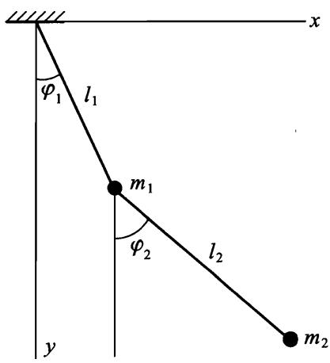
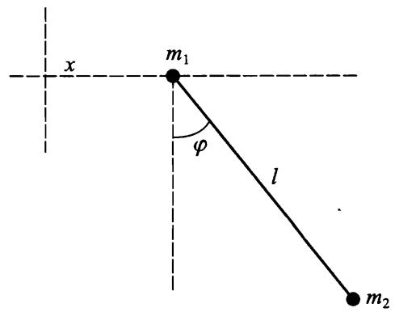
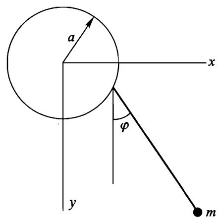
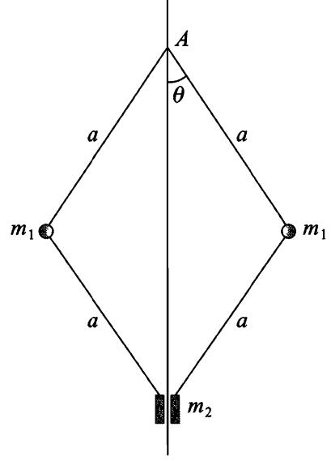

# 第一章运动方程

# $\ S \textbf { 1 }$ 广义坐标

质点是力学的基本概念之一，是指那些在描述其运动时可以忽略大小的物体.当然，可否忽略大小因不同问题的具体条件而异.例如，研究行星绕太阳的运动时，可以认为行星是质点，但是在研究行星自转时就不能当作质点.

质点在空间的位置由其径矢 $r$ 确定，其分量用笛卡儿坐标 $x , y , z$ 表示.径矢 $r$ 对时间的导数

$$
{ \pmb v } = \frac { \mathrm { d } { \pmb r } } { \mathrm { d } t }
$$

称为质点的速度，其二阶导数 $\mathrm { d } ^ { 2 } r / \mathrm { d } t ^ { 2 }$ 称为质点的加速度.今后，对时间的导数经常用符号上面的点表示，如 ${ \textbf { \em v } } = { \dot { r } }$ .

为了确定由 $N$ 个质点组成的系统在空间的位置，需要给定 $N$ 个径矢，即给定 $3 N$ 个坐标.

通常，唯一地确定系统位置所需独立变量的数目称为系统的自由度 $\mathbb { O } , N$ 个质点组成的系统的自由度为 $3 N$ .这些独立变量不一定是质点的笛卡儿坐标，根据问题的条件，有时选取其它坐标更加方便.

对于 $s$ 个自由度的系统，可以完全刻画其位置的任意 $s$ 个变量 $\boldsymbol { q } _ { 1 } , \boldsymbol { q } _ { 2 } , \cdots , \boldsymbol { q } _ { s }$ 称为该系统的广义坐标，其导数 $\dot { \boldsymbol { q } } _ { \iota }$ 则称为广义速度.

然而，给定广义坐标的数值并不能确定系统在给定时刻的“力学状态”，因为还不足以预测下一时刻系统的位置.对于给定的广义坐标值，系统可以具有任意的速度，因此下一时刻(即经过无穷小的时间间隔 $\mathrm { d } t$ 后)系统的位置可能不同.

经验表明，同时给定系统的所有广义坐标和速度就可以确定系统的状态，并且原则上也可以预测以后的运动.从数学观点看，在某时刻给定所有广义坐标 $q$ 和速度 $\dot { q }$ 就唯一地确定了该时刻的加速度 $\ddot { q } ^ { \textregistered }$ .

加速度与坐标、速度的关系式称为运动方程.对于函数 $q \left( \mathbf { \Lambda } _ { t } \right)$ 来说,这个关系式是二阶微分方程，原则上，将其积分可以求出函数 $q \left( \mathbf { \Lambda } _ { t } \right)$ ,进而确定系统的运动轨迹．

# $\ S \ O 2$ 最小作用量原理

力学系统运动规律的最一般表述由最小作用量原理(或者哈密顿原理)给出.根据这个原理，每一个力学系统都可以用一个确定的函数

$$
L \left( q _ { 1 } , q _ { 2 } , \cdots , q _ { s } , \dot { q _ { 1 } } , \dot { q _ { 2 } } , \cdots , \dot { q _ { s } } , t \right) ,
$$

或者简记为 $L \left( { q , \dot { q } , t } \right)$ 所表征，并且系统的运动还要满足下面的条件.

假设在时刻 $t = t _ { 1 }$ 和 $t = t _ { 2 }$ 系统的位置由两组坐标 $q ^ { ( 1 ) }$ 和 $q ^ { ( 2 ) }$ 确定.那么，系统在这两个位置之间的运动使得积分

$$
S = \int _ { t _ { 1 } } ^ { t _ { 2 } } L \big ( q , \dot { q } , t \big ) \mathrm { d } t
$$

取最小值 $\textcircled{2}$ .函数 $L$ 称为给定系统的拉格朗日函数，积分(2.1)称为作用量.

拉格朗日函数中只包含 $q$ 和 $\dot { q }$ ,而不包含更高阶导数 ${ \ddot { q } } , { \overset { \cdots } { q } } , \cdots$ ，这反映了前面提到的物理事实，即系统的力学状态完全由坐标和速度确定.

下面我们通过求解使积分(2.1)取最小值的问题来推导运动微分方程.为了书写简便，我们先假设系统仅有一个自由度，只需确定一个函数 $q \left( \mathbf { \Lambda } _ { t } \right)$ .

设 $q = q \left( t \right)$ 是使 $S$ 取最小值的函数，就是说用任意函数

$$
q \left( \mathbf { \Theta } _ { t } \right) + \delta q \left( \mathbf { \Theta } _ { t } \right)
$$

代替 $q \left( \mathbf { \Lambda } _ { t } \right)$ 都会使 $S$ 增大，其中函数 $\delta q \left( t \right)$ (也称为函数 $q \left( \mathbf { \Lambda } _ { t } \right)$ 的变分)在从 $t _ { 1 }$ 到$t _ { 2 }$ 的整个时间间隔内都是小量.由于比较函数(2.2)在时刻 $t = t _ { 1 }$ 和 $t = t _ { 2 }$ 也应该分别取值为 $q ^ { ( 1 ) }$ 和 $q ^ { ( 2 ) }$ ，于是有：

$$
\delta q \left( t _ { 1 } \right) = \delta q \left( t _ { 2 } \right) = 0 .
$$

用 $q ( t ) + \delta q ( t )$ 代替 $q \left( \mathbf { \Lambda } _ { t } \right)$ 使 $S$ 产生的增量为

$$
\int _ { t _ { 1 } } ^ { t _ { 2 } } L \left( \boldsymbol { q } + \mathfrak { d } \boldsymbol { q } , \dot { \boldsymbol { q } } + \mathfrak { d } \dot { \boldsymbol { q } } , \boldsymbol { t } \right) \mathrm { d } t - \int _ { t _ { 1 } } ^ { t _ { 2 } } L \left( \boldsymbol { q } , \dot { \boldsymbol { q } } , \boldsymbol { t } \right) \mathrm { d } t .
$$

这个差中的被积函数按 $\delta \boldsymbol { q }$ 和 $\delta \dot { q }$ 的幂展开式是从一阶项开始的.S 取最小值 $\textcircled{1}$ 的必要条件是这些项之和等于零.这个和称为积分的一阶变分（或者简称为变分）.于是，最小作用量原理可以写成

$$
\begin{array} { r } { \delta S = \delta \int _ { t _ { 1 } } ^ { t _ { 2 } } L \big ( q , \dot { q } , t \big ) \mathrm { d } t = 0 , } \end{array}
$$

或者变分后的形式：

$$
\int _ { t _ { 1 } } ^ { t _ { 2 } } \biggl ( \frac { \partial L } { \partial q } \delta q + \frac { \partial L } { \partial \dot { q } } \delta \dot { q } \biggr ) { \mathrm { d } } t = 0 .
$$

注意到 $\delta { \dot { q } } = { \frac { \mathrm { d } } { \mathrm { d } t } } \delta q$ ，将第二项分部积分得：

$$
\delta S = \left. \frac { \partial L } { \partial \dot { \bar { q } } } \delta q \right| _ { t _ { 1 } } ^ { t _ { 2 } } + \int _ { t _ { 1 } } ^ { t _ { 2 } } \biggl ( \frac { \partial L } { \partial q } - \frac { \mathrm { d } } { \mathrm { d } t } \left. \frac { \partial L } { \partial \dot { q } } \right) \delta q \mathrm { d } t = 0 .
$$

根据(2.3)上式中第一项等于零．剩下的积分在 $\delta \boldsymbol { q }$ 任意取值时都应该等于零.这只有在被积函数恆等於零的情况下才有可能.於是我们得到方程

$$
\frac { \mathrm { d } } { \mathrm { d } t } \ \frac { \partial L } { \partial \dot { q } } { \dot { - } \frac { \partial L } { \partial q } } = 0 .
$$

对于有 $s$ 个自由度的系统，在最小作用量原理中有 $s$ 个不同的函数 $q _ { \ i } \left( \ t \right)$ 应该独立地变分.显然我们可以得到 $s$ 个方程：

$$
\frac { \mathrm { d } } { \mathrm { d } t } \frac { \partial L } { \partial \dot { q } _ { \ i } } - \frac { \partial L } { \partial q _ { i } } = 0 ( i = 1 , 2 , \cdots , s ) .
$$

这就是我们要推导的运动微分方程，在力学中称为拉格朗日方程 $\textcircled{2}$ .如果给定力学系统的拉格朗日函数已知，则方程(2.6)建立了加速度、速度和坐标之间的联系，它们是系统的运动方程.

从数学的观点看，方程(2.6)是包含 $s$ 个未知函数 $q _ { i } \left( \mathbf { \sigma } _ { t } \right)$ 的 $s$ 个二阶微分方程组.这个方程组的通解包含 $2 s$ 个任意常数.为了确定这些常数，从而完全确定力学系统的运动，必须知道描述系统在某给定时刻状态的初始条件，例如所有坐标和速度的初值.

设力学系统由 $A$ 和 $B$ 两部分组成，如果每个部分都是封闭的，拉格朗日函数分別是 $L _ { A }$ 和 $L _ { B }$ .在两个部分相距足够远以至它们的相互作用可以忽略的极限情况下，系统的拉格朗日函数趋向于极限：

$$
\operatorname * { l i m } { \cal L } = { \cal L } _ { A } + { \cal L } _ { B } .
$$

拉格朗日函数的这种可加性反映了一个事实:每一个独立部分的运动方程不可能包含与另一部分相关的物理量.

显然，将力学系统的拉格朗日函数乘以一个任意常数，不会改变运动微分方程.这似乎导致一种重要的不确定性:各个孤立力学系统的拉格朗日函数可以乘以不同的任意常数.然而，可加性消除了这个不确定性，只允许所有力学系统的拉格朗日函数都乘以同一个任意常数，而这归结为选择这个物理量度量单位的自然任意性，我们还将在 $\ S 4$ 中继续讨论这个问题.

我们还需要进行以下的一般性讨论.考虑两个拉格朗日函数 $L ^ { ' } ( q , \dot { q } , t )$ 和$L \left( { q , \dot { q } } , t \right)$ ,它们相差某个坐标和时间的函数 $f ( q , t )$ 对时间的全导数：

$$
L ^ { \prime } ( q , \dot { q } , t ) = L \left( q , \dot { q } , t \right) + \frac { \mathrm { d } } { \mathrm { d } t } f ( q , t ) .
$$

计算这两个拉格朗日函数对应的积分(2.1)可得关系式：

$$
\begin{array} { r c l } { { } } & { { \displaystyle { S ^ { \prime } } } } & { { = \displaystyle { \int _ { t _ { 1 } } ^ { t _ { 2 } } } { \cal L } ^ { \prime } ( q , \dot { q } , t ) \mathrm { d } t } } \\ { { } } & { { } } & { { = S + f \big ( q ^ { ( 2 ) } , t _ { 2 } \big ) - f \big ( q ^ { ( 1 ) } , t _ { 1 } \big ) , } } \end{array}
$$

即 $S$ 和 $S ^ { \prime }$ 相差一个附加项.该附加项在变分时将消失，条件 $\delta S ^ { \prime } = 0$ 和 $\delta S = 0$ 完全等价，因而运动微分方程也相同.

可见，拉格朗日函数仅可以定义到相差一个对时间和坐标的任意函数的时间全导数项.

# $\ S 3$ 伽利略相对性原理

为了研究力学现象必须选择参考系.一般来说运动规律在不同的参考系下具有不同的形式.假如任意选择参考系，则可能使确定非常简单现象的规律在形式上变得十分繁琐.这自然会产生一个问题，即如何选择参考系使得力学规律在形式上最简单.

相对于任意参考系，空间是非均匀且各向异性的.这就是说，如果某个物体与其它物体之间没有相互作用，它在空间中的不同位置和不同指向在力学意义上是不等价的.同样，一般情况下任意参考系中时间也是非均匀的，即不同时刻也是不等价的.显然，时间和空间的这些性质使力学现象的描述变得复杂.例如，自由物体(即不受任何外力作用)不可能保持静止:如果在某个时刻其速度等于零，但在下一个时刻它开始向某个方向运动.

然而，似乎总是存在某种参考系，空间相对它是均匀的各向同性的，时间相对它是均匀的.这样的参考系称为惯性参考系.特别是，在这样的惯性参考系中，在某个时刻静止的自由物体将永远保持静止.

对于在惯性参考系中自由运动的质点，我们立即可以得到其拉格朗日函数形式的一些结论.时间和空间的均匀性意味着这个函数不显含质点的径矢 $r$ 和时间 $t$ ,即 $L$ 只能是速度 $\pmb { v }$ 的函数.由于空间各向同性，拉格朗日函数也必是不依赖于矢量 $\pmb { v }$ 的方向，只能是速度大小的函数，也就是说 $L$ 是 ${ \pmb v } ^ { 2 } = { \tau } ^ { 2 }$ 的函数：

$$
L = L ( \boldsymbol { v } ^ { 2 } ) .
$$

由拉格朗日函数不显含质点的径矢 $\pmb { r }$ 可知 $\partial L / \partial r = 0$ ，拉格朗日方程可写成 $\textcircled{1}$

$$
\frac { \mathrm { d } } { \mathrm { d } t } \ \frac { \partial L } { \partial \mathbf { v } } = 0 ,
$$

由此可得 ${ \partial L } / { \partial { \bf { v } } } = \mathrm { c o n s t }$ .而 $\partial L / \partial { \bf { v } }$ 只是速度的函数，故

$$
\begin{array} { r } { \pmb { \mathscr { v } } = \mathrm { c o n s t } . } \end{array}
$$

可见，在惯性参考系中质点任何自由运动的速度的大小和方向都不改变.这就是惯性定律.

如果在我们已有的这个惯性参考系以外，再引进另一个惯性参考系，它相对第一个惯性参考系作匀速直线运动，则相对这两个参考系的自由运动规律完全相同:自由运动仍是匀速直线运动.

实验证明，不仅自由运动规律相对这两个参考系完全相同，所有力学关系式相对这两个参考系都是等价的.因此存在不只是一个，而是无穷多个惯性参考系，它们相互作匀速直线运动.在这些参考系中时间和空间的性质都是相同的，力学规律也是相同的.这个结论称为伽利略相对性原理，这是力学中最重耀的原理之一.

上面的论述充分表明，惯性参考系的特殊性决定了人们通常采用惯性系来研究力学现象.今后如果不特别声明，我们只在惯性参考系中研究问题.

无穷多个这样的参考系的力学上的完全等价性还表明，不存在比其它参考系更优先选取的一个“绝对”惯性参考系.

设有两个不同的参考系K和 $\mathrm { K } ^ { \prime }$ ,其中 $\mathrm { K } ^ { \prime }$ 相对 K以速度 $\mathbb { V }$ 运动,同一个质点相对这两个参考系的坐标 $\boldsymbol { r }$ 和 $\boldsymbol { r ^ { \prime } }$ 满足关系式

$$
\pmb { r } = \pmb { r } ^ { \prime } + \pmb { V } t .
$$

我们认为这两个参考系中的时间是相同的：

$$
t = t ^ { ' } .
$$

绝对时间假设是经典力学的基础之一 $\textcircled{2}$ .

公式(3.3)和(3.4)称为伽利略变换.伽利略相对性原理可以表述为:力学运动方程在伽利略变换下具有不变性．.

# $\ S 4$ 自由质点的拉格朗日函数

下面研究拉格朗日函数的形式，首先研究一个最简单的例子——质点相对惯性参考系的自由运动.我们已经知道，这种情况下拉格朗日函数只能依赖于速度的平方.我们利用伽利略相对性原理来确定这个依赖关系的形式.如果惯性参考系K以无穷小速度 $\pmb { \varepsilon }$ 相对另一惯性参考系 $\mathrm { K } ^ { \prime }$ 运动，则有 ${ \pmb v } ^ { \prime } = { \pmb v } ^ { \prime } + { \pmb \varepsilon }$ .拉格朗日函数 $L \left( \boldsymbol { v } ^ { 2 } \right)$ 经过伽利略变换后得到 $L ^ { ' }$ ，由于在所有惯性参考系中运动方程的形式都相同，故如果 $L ^ { ' }$ 与 $L \left(  { v } ^ { 2 } \right)$ 存在差异的话，只能相差某个关于时间和坐标的函数的全导数(参见 $\ S 2$ 末）.

于是有

$$
L ^ { ' } = L \left( v ^ { ' 2 } \right) = L \left( v ^ { 2 } + 2 \textbf { \em } \cdot \boldsymbol { \varepsilon } + \boldsymbol { \varepsilon } ^ { 2 } \right) .
$$

将这个表达式展开成 $\pmb { \varepsilon }$ 的幂级数并忽略一阶以上的无穷小量得：

$$
L \left( \boldsymbol { \ v } ^ { \prime 2 } \right) = L \left( \boldsymbol { \ v } ^ { 2 } \right) + 2 \ \frac { \partial L } { \partial \boldsymbol { v } ^ { 2 } } \boldsymbol { \ v } \cdot \boldsymbol { \varepsilon } .
$$

只有当该等式右边第二项与速度 $\pmb { v }$ 呈线性依赖关系时，它才能是时间的全导数.因此 $\frac { \partial L } { \partial { v ^ { 2 } } }$ 不依赖于速度，即该情况下拉格朗日函数与速度平方成正比：

$$
L = { \frac { m } { 2 } } v ^ { 2 } ,
$$

其中 $_ m$ 为常数.

由拉格朗日函数在速度无穷小变換下满足伽利略相对性原理可知，在参考系K以有限速度 $\mathbf { V }$ 相对 $\mathrm { K } ^ { \prime }$ 运动情况下，拉格朗日函数也满足该原理.事实上，

$$
L ^ { ' } = { \frac { m } { 2 } } v ^ { ' 2 } = { \frac { m } { 2 } } ( \mathbf { \nabla } v \mathbf { \nabla } + \mathbf { \nabla } V ) ^ { 2 } = { \frac { m } { 2 } } v ^ { 2 } + 2 \ { \frac { m } { 2 } } v \mathbf { \nabla } \cdot \mathbf { V } + { \frac { m } { 2 } } V ^ { 2 }
$$

或者

$$
L ^ { ' } = L + \frac { \mathrm { d } } { \mathrm { d } t } \left( 2 ~ \frac { m } { 2 } \pmb { r } \cdot \pmb { V } + \frac { m } { 2 } \pmb { V } ^ { 2 } t \right) .
$$

第二项是时间的全导数，可以略去.

出现在自由运动质点的拉格朗日函数(4.1)中的物理量 $_ m$ 称为质点的质量.根据拉格朗日函数的可加性，对于无相互作用的质点组成的自由质点系，有 $\textcircled{1}$

$$
L \ = \ \sum _ { a } \frac { m _ { a } v _ { a } ^ { 2 } } { 2 } .
$$

必须强调，只有考虑到可加性，给出的质量定义才有实际物理意义.在 $\ S 2$

曾经指出，总是可以将拉格朗日函数乘以常数而不改变方程.对于函数(4.2)，乘以常数就相当于改变了质量的单位，不同质点的质量之间的比例关系却是具有实际物理意义的，不会发生改变.

容易看出，质量不可能是负的.事实上，根据最小作用量原理，质点从空间点1到空间点2的真实运动，使得积分

$$
S = \int _ { 1 } ^ { 2 } \frac { m v ^ { 2 } } { 2 } \mathrm { d } t
$$

取最小值.假如质量是负的，对于质点快速离开点1再快速接近点2的轨迹，作用量可以取绝对值任意大的负值，不可能有最小值 $\textcircled{1}$ .

注意到

$$
v ^ { 2 } = \left( { \frac { \mathrm { d } l } { \mathrm { d } t } } \right) ^ { 2 } = { \frac { \mathrm { d } l ^ { 2 } } { \mathrm { d } t ^ { 2 } } } ,
$$

是有用的.因此为了得到拉格朗日函数只需求出在特定坐标系中弧长微元 $\mathrm { d } l$ 的平方.

例如，在笛卡儿坐标系中 $\mathrm { d } l ^ { 2 } = \mathrm { d } x ^ { 2 } + \mathrm { d } y ^ { 2 } + \mathrm { d } z ^ { 2 }$ ,进而有

$$
L = \frac { m } { 2 } ( \dot { x } ^ { 2 } + \dot { y } ^ { 2 } + \dot { z } ^ { 2 } ) ,
$$

在柱坐标系中 $\mathrm { d } l ^ { 2 } = \mathrm { d } r ^ { 2 } + r ^ { 2 } \mathrm { d } \varphi ^ { 2 } + \mathrm { d } z ^ { 2 }$ ,进而有

$$
L = \frac { m } { 2 } \big ( \dot { r } ^ { 2 } + r ^ { 2 } \dot { \varphi } ^ { 2 } + \dot { z } ^ { 2 } \big ) ,
$$

在球坐标系中 $\mathrm { d } \boldsymbol { l } ^ { 2 } = \mathrm { d } \boldsymbol { r } ^ { 2 } + \boldsymbol { r } ^ { 2 } \mathrm { d } \theta ^ { 2 } + \boldsymbol { r } ^ { 2 } \sin ^ { 2 } \theta \mathrm { d } \varphi ^ { 2 }$ ,进而有

$$
L = { \frac { m } { 2 } } ( { \dot { r } } ^ { 2 } + r ^ { 2 } { \dot { \theta ^ { 2 } } } + r ^ { 2 } \mathrm { s i n } ^ { 2 } \theta { \dot { \varphi ^ { 2 } } } ) .
$$

# $\$ 5$ 质点系的拉格朗日函数

下面研究一种质点系，其质点之间有相互作用，但不受外部任何物体作用，称为封闭质点系.为了描述质点之间的相互作用，可以在自由质点系的拉格朗日函数(4.2)中增加坐标的某一函数(根据相互作用的性质确定）. $\textcircled{2}$ 将这个函数记为$- \ U$ ，则有

$$
L ~ = ~ \sum _ { \alpha } { \frac { m _ { \alpha } v _ { \alpha } ^ { 2 } } { 2 } } - ~ U ( r _ { 1 } , r _ { 2 } , \cdots )
$$

其中 $r _ { a }$ 是第 $_ { a }$ 个质点的径矢.这是封闭质点系拉格朗日函数的一般形式.

函数 $U$ 称为质点系的势能，而

$$
T = \sum _ { a } \frac { m _ { a } v _ { a } ^ { 2 } } { 2 }
$$

称为质点系的动能，这些名称的含义将在 $\ S 6$ 中解释.

势能仅依赖于所有质点在同一时刻的位置，这意味着其中任何质点位置的改变立刻影响到所有其它质点，可以说相互作用瞬间传递.这个相互作用的性质在经典力学中是必然的，它紧密联系着经典力学的基本前提，即绝对时间假设和伽利略相对性原理.如果相互作用不是瞬间传递的，即以一个有限速度传递，而时间的绝对性意味着通常的速度相加法则适用于所有现象，因此在有相对运动的不同参考系中传递速度不相同.于是相互作用的物体的运动规律在不同惯性参考系中也不相同，这就违背了伽利略相对性原理.

在 $\ S 3$ 中我们只提到了时间的均匀性.拉格朗日函数的形式(5.1)表明，时间不仅是均匀的，而且是各向同性的，即时间的性质在两个方向上都是相同的.事实上，用 $- \textit { t }$ 代替 $t$ 不会改变拉格朗日函数，进而也不会改变运动方程.换句话说，如果在参考系中某种运动是可能的，则逆运动也是可能的，即可以按照相反的顺序经历前述运动中相同的状态.在这个意义下，遵循经典力学定律的所有运动都是可逆的.

知道拉格朗日函数后就可以建立运动方程：

$$
{ \frac { \mathrm { d } } { \mathrm { d } t } } \ { \frac { \partial L } { \partial { \pmb v } _ { a } } } = { \frac { \partial L } { \partial { \pmb r } _ { a } } } .
$$

将(5.1)代入后得：

$$
m _ { a } \ { \frac { \mathrm { d } \ { \pmb v } _ { a } } { \mathrm { d } t } } = - \ { \frac { \partial U } { \partial { \pmb r } _ { a } } } .
$$

这种形式的运动方程称为牛顿方程，是相互作用质点系力学的基础.方程(5.3)右端的矢量

$$
\mathbf { } F _ { \alpha } = \mathbf { } - { \frac { \partial U } { \partial r _ { \alpha } } }
$$

称为作用在第 $^ a$ 个质点上的力.它与 $U$ 一样，只依赖于所有质点的坐标，而不依赖于速度.因此，方程(5.3)表明，质点的加速度矢量也只是坐标的函数.

势能可以增减任意常数而不改变运动方程（这是在 $\ S 2$ 末讲到的拉格朗日函数不确定性的特殊情况）.选择这个任意常数的最自然和最通用的方法是，当无限增大质点间距离时势能趋向于零.

如果描述运动不是用笛卡儿坐标，而是用任意的广义坐标 $q _ { i }$ ，则为了得到新的拉格朗日函数必须进行相应的变换：

$$
x _ { \alpha } = f _ { \alpha } ( q _ { 1 } , q _ { 2 } , \cdots , q _ { s } ) , \quad \dot { x } _ { \alpha } = \sum _ { k } \frac { \partial f _ { \alpha } } { \partial q _ { k } } \dot { q } _ { k } , \quad \cdots ,
$$

将这些表达式代入函数

$$
L = \frac { 1 } { 2 } \sum _ { a } m _ { a } ( \stackrel { . } { \dot { x } } _ { a } ^ { 2 } + \stackrel { . } { \dot { y } } _ { a } ^ { 2 } + \stackrel { . } { \dot { z } } _ { a } ^ { 2 } ) - U ,
$$

可得如下形式的拉格朗日函数：

$$
L = \frac { 1 } { 2 } \sum _ { \ i , k } a _ { i k } ( q ) \dot { q } _ { \ i } \dot { q } _ { k } - U ( q ) ,
$$

其中 $a _ { \scriptscriptstyle { \imath k } }$ 只是广义坐标的函数.用广义坐标写出的动能仍是速度的二次函数，但也可以依赖于广义坐标.

到此为止我们只研究了封闭质点系.下面研究非封闭质点系 $A$ ，它与运动完全已知的质点系 $B$ 相互作用.这种情况下称 $A$ 在（由 $B$ 产生的）给定的外场中运动.根据最小作用量原理推导运动方程是要对每个广义坐标进行独立变分（即把其余坐标看作好像是已知的），因此，可将质点系 $A + B$ 的拉格朗日函数 $L$ 中广义坐标 $q _ { B }$ 用给定的时间函数代替，由此得到质点系 $A$ 的拉格朗日函数$L _ { A }$ .

假设质点系 $A + B$ 是封闭的，则有

$$
L = T _ { A } ( q _ { A } , \dot { q } _ { A } ) + T _ { B } ( q _ { B } , \dot { q } _ { B } ) - U ( q _ { A } , q _ { B } ) ,
$$

其中前两项分别是系统 $A$ 和 $B$ 的动能，第三项是 $A + B$ 的势能.将广义坐标 $q _ { B }$ 用已知的时间函数代替后， $T _ { B } ( q _ { B } , \dot { q } _ { B } )$ 是只依赖于时间的函数(因此也是某个时间函数的全导数)，可以从 $L$ 中略去.于是

$$
L _ { A } = T _ { A } ( q _ { A } , \dot { q } _ { A } ) - { \cal U } ( q _ { A } , q _ { B } ( t ) ) .
$$

可见，在外场中的质点系的运动由通常形式的拉格朗日函数描述，仅有的差别就在于势能可能显含时间.

例如，对于在外场中运动的单个质点，拉格朗日函数的一般形式为

$$
L = \frac { m v ^ { 2 } } { 2 } - U ( r , t ) ,
$$

而运动方程写成

$$
m { \dot { \pmb v } } = - \frac { \partial U } { \partial r } .
$$

如果一质点在一个场中的任意位置都受到相同的力 $\pmb { F }$ ,则称这样的外场是均匀的.显然在均匀外场中势能可以写成

$$
U = - \ : F \cdot r . 
$$

在结束本节之前，我们还需对拉格朗日方程在各种问题中如何应用做些说明.我们经常需要处理这样的力学系统，其中不同物体(或质点)之间的相互作用以约束的形式呈现，即限制它们的相对位置.

实际上这种约束是通过杆、线、铰等实现的.这给运动带来新的影响因素，即运动伴有接触处的摩擦.一般来说，这个问题超越了纯力学的范畴(参见 $\ S 2 5 )$ ·

然而，很多情况下摩擦是比较弱的，它对运动的影响可以忽略.如果还可以忽略“连接物”的质量,则约束的作用仅仅是减少系统的自由度 $s$ 到小于 $3 N$ 的值.这样又可以利用拉格朗日函数(5.5)来确定运动，独立的广义坐标数就等于实际自由度.

# 习 题

试求下面在均匀重力场(重力加速度为 $^ { g }$ )中各系统的拉格朗日函数.

习题1平面双摆(图1).

解：取绳 $l _ { 1 }$ 和 $l _ { 2 }$ 分别与竖直方向的夹角 $\varphi _ { 1 }$ 和 $\varphi _ { 2 }$ 为广义坐标.对质点 $m _ { 1 }$ 有

$$
T _ { 1 } = \frac { 1 } { 2 } m _ { 1 } l _ { 1 } ^ { 2 } \dot { \varphi } _ { 1 } ^ { 2 } , \qquad U _ { 1 } = - m _ { 1 } g l _ { 1 } \mathrm { c o s } \varphi _ { 1 } .
$$

为了求出第二个质点的动能，我们用角 $\varphi _ { 1 }$ 和 $\varphi _ { 2 }$ 表示第二个质点的笛卡儿坐标$x _ { 2 } , y _ { 2 }$ （坐标原点取在悬挂点， $_ y$ 轴竖直向下)：

$$
x _ { 2 } = l _ { 1 } \mathrm { s i n } \varphi _ { 1 } + l _ { 2 } \mathrm { s i n } \varphi _ { 2 } , \qquad y _ { 2 } = l _ { 1 } \mathrm { c o s } \varphi _ { 1 } + l _ { 2 } \mathrm { c o s } \varphi _ { 2 } .
$$

于是有

$$
T _ { 2 } = \frac { 1 } { 2 } m _ { 2 } ( \dot { x } _ { 2 } ^ { 2 } + \dot { y } _ { 2 } ^ { 2 } ) = \frac { m _ { 2 } } { 2 } \bigl [ l _ { 1 } ^ { 2 } \dot { \varphi } _ { 1 } ^ { 2 } + l _ { 2 } ^ { 2 } \dot { \varphi } _ { 2 } ^ { 2 } + 2 l _ { 1 } l _ { 2 } \cos ( \varphi _ { 1 } - \varphi _ { 2 } ) \dot { \varphi } _ { 1 } \dot { \varphi } _ { 2 } \bigr ] .
$$

$$
U _ { 2 } = { \mathrm { ~ - ~ } } m _ { 2 } g { \left( y _ { 1 } + y _ { 2 } \right) } = { \mathrm { ~ - ~ } } m _ { 2 } g { \left( l _ { 1 } \mathrm { c o s } \varphi _ { 1 } + l _ { 2 } \mathrm { c o s } \varphi _ { 2 } \right) }
$$

最后得

$$
{ \cal L } = \frac { m _ { 1 } + m _ { 2 } } { 2 } l _ { 1 } ^ { 2 } \dot { \varphi } _ { 1 } ^ { 2 } + \frac { m _ { 2 } } { 2 } l _ { 2 } ^ { 2 } \dot { \varphi } _ { 2 } ^ { 2 } + m _ { 2 } l _ { 1 } l _ { 2 } \cos ( \varphi _ { 1 } - \varphi _ { 2 } ) \dot { \varphi } _ { 1 } \dot { \varphi } _ { 2 } +
$$

$$
\left( m _ { 1 } + m _ { 2 } \right) g l _ { 1 } \mathrm { c o s } \varphi _ { 1 } + m _ { 2 } g l _ { 2 } \mathrm { c o s } \varphi _ { 2 } .
$$

习题2质量为 $m _ { 2 }$ 的平面摆，其悬挂点（质量为 $m _ { 1 }$ )可以沿着位于 $m _ { 2 }$ 运动平面内的水平直线运动(图2).

  
图1

  
图2

解：设质点 $m _ { 1 }$ 的坐标为 $_ { \mathcal { X } }$ ,绳与竖直方向夹角为 $\varphi$ ，则有

$$
L = { \frac { m _ { 1 } + m _ { 2 } } { 2 } } { \dot { x } } ^ { 2 } + { \frac { m _ { 2 } } { 2 } } ( \ l ^ { 2 } { \dot { \varphi } } ^ { 2 } + 2 l { \dot { x } } { \dot { \varphi } } \mathrm { c o s } \varphi ) + m _ { 2 } g l \mathrm { c o s } \varphi .
$$

习题3设有一平面摆，其悬挂点：

a．沿着竖直圆以定常圆频率 $\gamma$ 运动(图3)，b.按规律 $\alpha { \cos \gamma t }$ 在摆的运动平面内水平振动，C.按规律 $\alpha \cos \gamma t$ 竖直振动.

解：

a．质点 $_ m$ 的坐标为：$x = a \cos \gamma t + l \sin \varphi , \qquad y = - \arcsin \gamma t + l \cos \varphi .$

拉格朗日函数为

$$
L = { \frac { m l ^ { 2 } } { 2 } } { \dot { \varphi } } ^ { 2 } + m l a \gamma ^ { 2 } \sin ( \varphi - \gamma t ) + m g l \cos \varphi .
$$

这里略去了仅仅依赖于时间的项以及可以写为 $m l a \gamma \mathrm { c o s } ( \varphi - \gamma t )$ 对时间的全导数的项.

b.质点 $_ m$ 的坐标为：

$$
x = \alpha \cos \gamma t + l \sin \varphi , y = l \cos \varphi .
$$

略去全导数项后的拉格朗日函数为

$$
L = { \frac { m l ^ { 2 } } { 2 } } { \dot { \varphi } } ^ { 2 } + m l \alpha \gamma ^ { 2 } \cos \gamma t \sin \varphi + m g l \cos \varphi .
$$

C.类似地，可得：

$$
L = { \frac { m l ^ { 2 } } { 2 } } { \dot { \varphi } } ^ { 2 } + m l a \gamma ^ { 2 } \cos \gamma t \cos \varphi + m g l \cos \varphi .
$$

习题4•在图4所示的力学系统中，质点 $m _ { 2 }$ 沿着竖直轴运动，整个系统以常角速度 $\varOmega$ 绕该轴转动.

  
图3

  
图4

解：设线段 $_ { \alpha }$ 与竖直方向夹角为 $\theta$ ，系统绕竖直轴转动的角度为 $\varphi$ ,则 $\dot { \varphi } =$ $\Omega$ .对于每个质点 $m _ { 1 }$ 的微小位移有

$$
\mathrm { d } l _ { 1 } ^ { 2 } = \alpha ^ { 2 } \mathrm { d } \theta ^ { 2 } + \alpha ^ { 2 } \sin ^ { 2 } \theta \mathrm { d } \varphi ^ { 2 } .
$$

质点 $m _ { 2 }$ 到悬掛点 $A$ 的距离为 $2 a \cos \theta$ ,因此

$$
\mathrm { d } l _ { 2 } = - 2 \alpha \sin \theta \mathrm { d } \theta .
$$

拉格朗日函数为

$$
\begin{array} { c } { { L = m _ { 1 } \alpha ^ { 2 } ( \dot { \theta ^ { 2 } } + \Omega ^ { 2 } { \sin } ^ { 2 } \theta ) + 2 m _ { 2 } \alpha ^ { 2 } { \sin } ^ { 2 } \theta \dot { \theta ^ { 2 } } + } } \\ { { { } } } \\ { { 2 g \alpha ( m _ { 1 } + m _ { 2 } ) \mathrm { c o s } \theta . } } \end{array}
$$