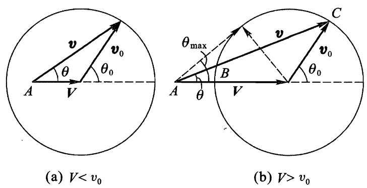
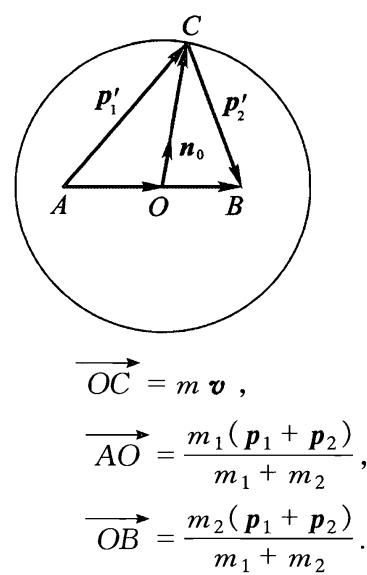
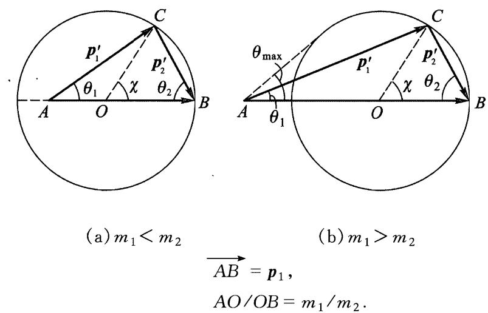
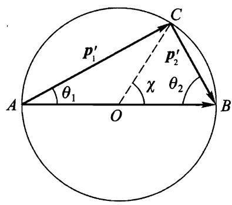
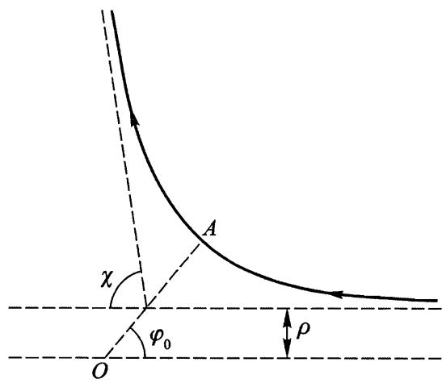
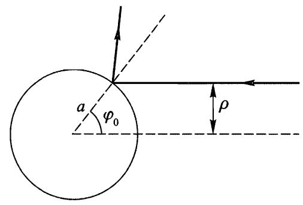
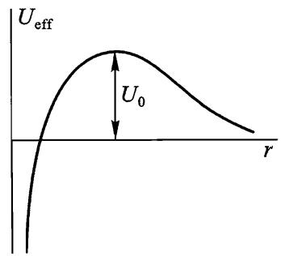
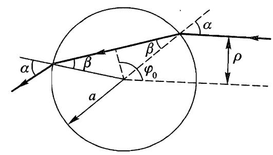

# 第四章

# 质点碰撞

# $\ S \Im \emptyset$ 质点分裂①

在许多情形下，利用动量守恒和能量守恒定律可以得到一系列关于各种力学过程特性的重要结果.应当注意的是，这些性质完全不依赖于质点间相互作用的具体形式.

首先，我们研究一个质点“自发”（即不是外力引起的）分裂成两个“组成部分”，即两个分裂后各自独立运动的其它质点的过程.

在质点(分裂前)静止的参考系中描述这个过程是最简单的.根据动量守恒定律，分裂后两个质点的动量之和仍为零，即两个质点以大小相等方向相反的动量相背运动.动量的大小 $\mathbf { \Gamma } ( \mathbf { \Gamma } _ { \mathcal { P 0 } } )$ 可以由能量守恆定律

$$
E _ { \mathrm { \scriptsize { n t } } } = E _ { \mathrm { \scriptsize { 1 i n t } } } + \frac {  { p _ { 0 } } ^ { 2 } } { 2 m _ { 1 } } + E _ { \mathrm { \scriptsize { 2 i n t } } } + \frac {  { p _ { 0 } } ^ { 2 } } { 2 m _ { 2 } }
$$

确定，其中 $m _ { 1 }$ 和 $m _ { 2 }$ 是两个质点的质量， $E _ { \mathrm { 1 1 n t } }$ 和 $E _ { 2 \mathrm { i n t } }$ 是它们的内能，而 $E _ { \mathrm { i n t } }$ 是原来(即将分裂的)质点的内能.用 $\varepsilon$ 表示“分裂能”,即差值

$$
\varepsilon = E _ { \mathrm { { \scriptscriptstyle 1 n t } } } - E _ { 1 \mathrm { { \scriptscriptstyle 1 n t } } } - E _ { 2 \mathrm { { \ i n t } } }
$$

（显然，这个量应该是正的，这样分裂才可能发生）.这时有

$$
\varepsilon = \frac { \phi _ { 0 } ^ { 2 } } { 2 } \left( \frac { 1 } { m _ { 1 } } + \frac { 1 } { m _ { 2 } } \right) = \frac { \phi _ { 0 } ^ { 2 } } { 2 m } ,
$$

由此确定 $\phi _ { 0 } ( \boldsymbol { m }$ 是两个质点的约化质量)，两个质点的速度分别为 $\upsilon _ { 1 0 } = \upsilon _ { 0 } / m _ { 1 }$

和 $v _ { 2 0 } = p _ { 0 } / m _ { 2 }$

下面我们换一个参考系，分裂前原来的质点以速度 $\mathbf { V }$ 相对该参考系运动.通常称这个参考系为实验室参考系，也叫 $L$ 系，它不同于其中系统总动量等于零的质心参考系，也叫 $C$ 系.设 $\pmb { v }$ 和 ${ \bf { \dot { v } } } _ { 0 }$ 是分裂后其中一个质点分别相对实验室参考系和质心参考系的速度.显然，有 ${ \pmb v } = { \pmb V } + { \pmb v } _ { 0 }$ 或者 ${ \pmb v } - { \pmb V } = { \pmb v } _ { 0 }$ 可得

$$
\begin{array} { r } { v ^ { 2 } + V ^ { 2 } - 2 v V \mathrm { c o s } \theta = v _ { 0 } ^ { 2 } , } \end{array}
$$

其中 $\theta$ 是质点相对速度 $\mathbf { V }$ 的方向飞出的角度.这个方程给出了在实验室参考系中分裂后质点速度对飞出方向的函数关系.

  
图14

图14 借助图解法示出了这个关系.点 $A$ 距圆心的距离为 $V$ ,速度矢量 $\pmb { v }$ 由从 $A$ 点指向半径为 $\boldsymbol { v } _ { 0 }$ 的圆周上任一点的矢量表示①.图14(a)和(b)分别相应于$V < v _ { 0 }$ 和 $V > \upsilon _ { 0 }$ 的情况.第一种情况下质点可以任意角度 $\theta$ 飞出，第二种情况下质点只能向前飞出，飞出角度θ 不超过下式给出的θmax，

$$
\sin \theta _ { \mathrm { { m a x } } } = \frac { v _ { 0 } } { V }
$$

（这是从 $A$ 作圆的切线的方向）.

在实验室参考系和质心参考系中飞出角 $\theta$ 和 $\theta _ { 0 }$ 的关系，显然也可以由图解法给出：

$$
\tan \theta = \frac { v _ { 0 } \sin \theta _ { 0 } } { v _ { 0 } \cos \theta _ { 0 } + V } .
$$

如果解这个方程求 $\cos \theta _ { 0 }$ ，则经过初等的变换可得

$$
\mathrm { c o s } \theta _ { 0 } = - { \frac { V } { v _ { 0 } } } \mathrm { s i n } ^ { 2 } \theta \pm \mathrm { c o s } \theta \sqrt { 1 - { \frac { V ^ { 2 } } { v _ { 0 } ^ { 2 } } } \mathrm { s i n } ^ { 2 } \theta } .
$$

由图14(a)可以看出，当 $v _ { 0 } > V$ 时 $\theta$ 和 $\theta _ { 0 }$ 之间的关系是一一对应的.这时在公式(16.6)中根号前面取“ $+ \mathbf { \omega } ^ { \prime \prime }$ 号(使得 $\theta = 0$ 时 $\theta _ { 0 } = 0$ ).如果 $\mathit { v } _ { 0 } < V , \theta$ 和 $\theta _ { 0 }$ 之间的关系不是一一对应的：每个 $\theta$ 对应两个 $\theta _ { 0 }$ （图14（b）），它们相应于从圆心指向$B$ 或者 $C$ 的矢量 ${ \pmb v } _ { 0 }$ ,也对应于公式(16.6)中根号前两个符号．

在物理应用中通常要处理的不是一个，而是很多个相同质点的分裂，这就产生了分裂后的质点按方向、能量等分布的问题.这时我们假设，原始质点在空间中运动方向是随机的，即在平均意义下是各向同性的.

在质心参考系中这个问题是容易求解的:所有（相同类型的)分裂后的质点具有相同的能量，它们飞出方向分布是各向同性的，这与原始质点的运动方向是随机的假设相关.就是说，进入立体角微元 $\mathrm { d } O _ { 0 }$ 的质点数所占的比例正比于该微元的大小，即等于 $\mathrm { d } O _ { 0 } / 4 \pi$ .代入 $\mathrm { d } O _ { 0 } = 2 \pi \mathrm { s i n } \theta _ { 0 } \mathrm { d } \theta _ { 0 }$ 后可得按角 $\theta _ { 0 }$ 的分布：

$$
\frac { 1 } { 2 } \mathrm { s i n } \theta _ { 0 } \mathrm { d } \theta _ { 0 } .
$$

在实验室参考系中的分布可以通过适当的变换得到.例如，我们来计算在实验室参考系中的动能分布.将等式 ${ \pmb v } = { \pmb v } _ { 0 } + { \pmb V }$ 平方得

$$
{ v ^ { 2 } } = { v _ { 0 } } ^ { 2 } + V ^ { 2 } + 2 v _ { 0 } V \mathrm { c o s } \theta _ { 0 } ,
$$

由此有

$$
\mathrm { d } \mathrm { c o s } \theta _ { 0 } = \frac { \mathrm { d } ( \boldsymbol { v } ^ { 2 } ) } { 2 v _ { 0 } V } .
$$

利用动能 $T = m v ^ { 2 } / 2$ （其中 $_ m$ 是 $m _ { 1 }$ 或者 $m _ { 2 }$ ，取决于我们研究哪类分裂质点）并代入(16.7)即可得所要求的分布

$$
{ \frac { \mathrm { d } T } { 2 m v _ { 0 } V } } .
$$

动能的取值范围从最小值 $T _ { \mathrm { m i n } } = ( \textit { m } / 2 ) ( \textit { v } _ { 0 } - \textit { V } ) ^ { 2 }$ 到最大值 $T _ { \mathrm { m a x } } = \left( \ m / 2 \right)$ $( \mathit { v _ { 0 } } + \mathit { V } ) ^ { 2 }$ .在这个范围内质点按照(16.8)均匀分布.

在质点分裂成多于两个部分时，动量守恒和能量守恒定律自然允许分裂后的质点的速度和方向可以有更大的任意性.特别是，在质心参考系中这些分裂后的质点的能量不再具有确定的值，但是其中的每个质点的动能存在上限.

为了确定这个上限，除了一个给定质点(质量为 $m _ { 1 }$ )，我们将所有其它质点看作一个系统,其内能用 $E _ { \mathrm { i n t } } ^ { \prime }$ 表示.根据(16.1)和(16.2),质点 $m _ { 1 }$ 的动能等于

$$
T _ { 1 0 } = \frac { \phi _ { 0 } ^ { 2 } } { 2 m _ { 1 } } { = } \frac { M - m _ { 1 } } { M } ( E _ { \mathrm { i n t } } - E _ { \mathrm { 1 n t } } - E _ { \mathrm { i n t } } ^ { \prime } )
$$

其中 $M$ 是原始质点的质量.显然，当 $E _ { \mathrm { i n t } } ^ { \prime }$ 最小时 $T _ { 1 0 }$ 取最大值.为此，除了 $m _ { 1 }$ 以外所有其它分裂后的质点必须以相同的速度运动，那么 $E ^ { ' } _ { \mathrm { i n t } }$ 就是它们的內能之和，而差值 $E _ { \mathrm { i n t } } - E _ { \mathrm { 1 i n t } } - E _ { \mathrm { i n t } } ^ { \prime }$ 就是分裂能 $\varepsilon$ .于是有

$$
\left( \mathbf { \nabla } T _ { 1 0 } \right) _ { \mathrm { m a x } } = \frac { M - m _ { 1 } } { M } \varepsilon .
$$

# 习 题

习题1试求质点分裂后两个质点飞出角 $\theta _ { 1 }$ 和 $\theta _ { 2 }$ 之间的关系(在实验室参 考系中）.

解：在质 $\therefore \Delta$ 参考系中两个飞出角满足关系 $\theta _ { 1 0 } = \pi - \theta _ { 2 0 }$ .将 $\theta _ { 1 0 }$ 简记为 $\theta _ { 0 }$ ,对每个分裂后的质点利用公式(16.5)可得

$$
\begin{array} { r } { V + v _ { 1 0 } \mathrm { c o s } \theta _ { 0 } = v _ { 1 0 } \mathrm { s i n } \theta _ { 0 } \mathrm { c o t } \theta _ { 1 } , } \\ { V - v _ { 2 0 } \mathrm { c o s } \theta _ { 0 } = v _ { 2 0 } \mathrm { s i n } \theta _ { 0 } \mathrm { c o t } \theta _ { 2 } . } \end{array}
$$

应该从这两个等式中消去 $\theta _ { 0 }$ .为此，首先从中求出 $\sin \theta _ { 0 }$ 和 $\cos \theta _ { 0 }$ ，然后代入$\cos ^ { 2 } \theta _ { 0 } + \sin ^ { 2 } \theta _ { 0 } = 1$ .再考虑到 $v _ { 1 0 } / v _ { 2 0 } = m _ { 2 } / m _ { 1 }$ ,利用公式(16.2)可得

$$
\frac { m _ { 2 } } { m _ { 1 } } \mathrm { s i n } ^ { 2 } \theta _ { 2 } + \frac { m _ { 1 } } { m _ { 2 } } \mathrm { s i n } ^ { 2 } \theta _ { 1 } - 2 \mathrm { s i n } \theta _ { 1 } \mathrm { s i n } \theta _ { 2 } \mathrm { c o s } \big ( \theta _ { 1 } + \theta _ { 2 } \big ) = \frac { 2 \varepsilon } { \big ( m _ { 1 } + m _ { 2 } \big ) V ^ { 2 } } \mathrm { s i n } ^ { 2 } \big ( \theta _ { 1 } + \theta _ { 2 } \big ) .
$$

习题2 试求实验室参考系中分裂后的质点的飞出方向分布.

解：当 $ { \boldsymbol { v } } _ { 0 } > V$ 时将(16.6)代入(16.7),其中根号前面取正号，可得

$$
\frac { \sin \theta \mathrm { d } \theta } { 2 } \bigg [ 2 \frac { V } { v _ { 0 } } \mathrm { c o s } \theta + \frac { 1 + ( \mathrm { \nabla } V ^ { 2 } / v _ { 0 } ^ { 2 } ) \mathrm { c o s } 2 \theta } { \sqrt { 1 - ( \mathrm { \nabla } V ^ { 2 } / v _ { 0 } ^ { 2 } ) \mathrm { s i n } ^ { 2 } \theta } } \bigg ] \quad ( 0 \leqslant \theta \leqslant \pi ) .
$$

当 $\mathit { v _ { 0 } } < \mathit { V }$ 时，应该考虑 $\theta$ 和 $\theta _ { 0 }$ 的两种可能关系.当 $\theta$ 增大时，与之对应的两个 $\theta _ { 0 }$ 中有一个也增大，另一个则减小，因此应该取(16.6)中根号前两个符号对应表达式之差(而不是和)，来计算 $\deg { \theta _ { 0 } }$ .最后得

$$
\sin \theta \mathrm { d } \theta \frac { 1 + \big ( V ^ { 2 } / v _ { 0 } ^ { 2 } \big ) \mathrm { c o s } 2 \theta } { \sqrt { 1 - \big ( V ^ { 2 } / v _ { 0 } ^ { 2 } \big ) \mathrm { s i n } ^ { 2 } \theta } } \quad \left( 0 \leqslant \theta \leqslant \theta _ { \operatorname* { m a x } } \right) .
$$

习题3试求在实验室参考系中两个分裂后的质点飞出方向之间夹角 $\theta$ 的取值范围.

解：角 $\theta$ 是 $\theta _ { 1 }$ 与 $\theta _ { 2 }$ 之和，角 $\theta _ { 1 }$ 和 $\theta _ { 2 }$ 由公式(16.5)确定(参见习题1).最简单的是计算 $\tan \theta$ .研究所得表达式的极值可以给出 $\theta$ 的可能取值范围，这依赖于 $V , v _ { 1 0 } , v _ { 2 0 }$ 的相对大小(为了确定起见，我们假设 $\begin{array} { r } { v _ { 2 0 } > v _ { 1 0 } , } \end{array}$

如果 $v _ { 1 0 } < V < v _ { 2 0 }$ ，则 $0 < \theta < \pi$ ,

如果 $V < v _ { 1 0 }$ ，则 $\pi - \theta _ { m } < \theta < \pi$

如果 $V > v _ { 2 0 }$ ，则 $0 < \theta < \theta _ { m }$ ，其中 $\theta _ { m }$ 之值由下式给出

$$
\sin \theta _ { m } = \frac { V ( \boldsymbol { \upsilon } _ { 1 0 } + \boldsymbol { \upsilon } _ { 2 0 } ) } { V ^ { 2 } + \boldsymbol { \upsilon } _ { 1 0 } v _ { 2 0 } } .
$$

# $\S 1 7$ 质点弹性碰撞

如果两个质点碰撞不改变它们的内部状态，则称为弹性碰撞. 因此，对于这样的碰撞应用能量守恆定律时可以不考虑质点的內能.

在两个质点的质心静止的参考系（即 $C$ 系）中研究碰撞最简单. 像上节一样，我们用下标0表示物理量在这个参考系中的值. 碰撞前两个质点在质心参考系中的速度与实验室参考系中的速度 ${ \pmb v }_ { 1 }$ 和 ${ \pmb v } _ { 2 }$ 的关系为

$$
{ \pmb v } _ { 1 0 } = \frac { m _ { 2 } } { m _ { 1 } + m _ { 2 } } { \pmb v } ~ , ~ { \pmb v } _ { 2 0 } = - \frac { m _ { 1 } } { m _ { 1 } + m _ { 2 } } { \pmb v } ~ ,
$$

其中 ${ \pmb v } = { \pmb v } _ { 1 } - { \pmb v } _ { 2 }$ (参见(13.2)).

根据动量守恒定律，碰撞后两个质点动量的大小相等方向相反，又根据能量守恒定律，它们的绝对值也不变.于是，在质心参考系中碰撞的结果仅是转动了两个质点的速度，而这些速度的方向保持相反，大小不变.如果用 ${ \pmb n } _ { 0 }$ 表示沿碰撞后质点 $m _ { 1 }$ 的速度方向的单位矢量，则两个质点碰撞后的速度(用撇号区别)为

$$
{ \pmb v } _ { 1 0 } ^ { \prime } = \frac { m _ { 2 } } { m _ { 1 } + m _ { 2 } } v { \pmb n } _ { 0 } , \quad { \pmb v } _ { 2 0 } ^ { \prime } = - \frac { m _ { 1 } } { m _ { 1 } + m _ { 2 } } v { \pmb n } _ { 0 } .
$$

为了变换到实验室参考系，需要在这些表达式中加上质心速度 ${ \pmb V }$ . 于是，两个质点在实验室参考系中的碰撞后速度为

$$
\begin{array} 
\displaystyle \pmb { v } _ { 1 } ^ { \prime } = \cfrac { m _ { 2 } } { m _ { 1 } + m _ { 2 } } v \pmb { n } _ { 0 } + \cfrac { m _ { 1 } \pmb { v } _ { 1 } + m _ { 2 } \pmb { v } _ { 2 } } { m _ { 1 } + m _ { 2 } } , \quad \pmb { v } _ { 2 } ^ { \prime } = - \cfrac { m _ { 1 } } { m _ { 1 } + m _ { 2 } } v \pmb { n } _ { 0 } + \cfrac { m _ { 1 } \pmb { v } _ { 1 } + m _ { 2 } \pmb { v } _ { 2 } } { m _ { 1 } + m _ { 2 } } .
\end{array}
$$

利用动量和能量守恒定律只能得到这些关于碰撞的结论.矢量 ${ \pmb n } _ { 0 }$ 的方向与质点之间相互作用规律以及碰撞时它们的相对位置有关.

对于上述结果可以给出几何解释，为此将速度换为动量会更加方便. 将等式(17.2)分别乘以 $m _ { 1 }$ 和 $m _ { 2 }$ 可得

$$
{ \pmb p }_ { 1 } ^ { \prime } = m v { \pmb n} _ { 0 } + \frac { m _ { 1 } } { m _ { 1 } + m _ { 2 } } ( { \pmb p } _ { 1 } + { \pmb p } _ { 2 } ) , \quad { \pmb p } _ { 2 } ^ { \prime } = - m v { \pmb n} _ { 0 } + \frac { m _ { 2 } } { m _ { 1 } + m _ { 2 } } ( { \pmb p } _ { 1 } + { \pmb p } _ { 2 } ) .
$$

(${m} = \frac { m _ { 1 } m _ { 2 } } { m _ { 1 } + m _ { 2 } }$ 是约化质量). 作半径为 $mv$ 的圆，并使用示于图 15 中的构造. 如果单位矢量 ${ \pmb n } _ { 0 }$ 沿着 $\overrightarrow { O C }$ ，则矢量 $\overrightarrow { A C }$ 和 $\overrightarrow { C B }$ 分别给出动量 ${ \pmb p } _ { 1 } ^ { \prime }$ 和 ${ \pmb p } _ { 2 } ^ { \prime }$ .在给定 ${ \pmb p } _ { 1 }$ 和 ${ \pmb p } _ { 2 }$ 时，圆的半径确定， $A$ 和 $B$ 点的位置也确定，而 $C$ 点可以位于圆周上任何位置.

  
图15

我们更详细地考虑碰撞前有一个质点(设为 $m _ { 2 }$ )静止的情况. 这种情况下 $O B =$ $\frac { m _ { 2 } } { m _ { 1 } + m _ { 2 } } p _ { 1 } = m v$ 的长度与半径相等，即 $B$ 点在圆周上. 矢量 $\overrightarrow { A B }$ 等于碰撞前第一个质点 $m _ { 1 }$ 的动量 ${ \pmb p } _ { 1 }$ . 点 $A$ 位于圆内(当 $m _ { 1 } < m _ { 2 }$ 时)或者圆外(当 $m _ { 1 } > m _ { 2 }$ 时). 相应的情况如图 16(a)和(b)所示. 图中的 $\theta _ { 1 }$ 和 $\theta _ { 2 }$ 是碰撞后质点运动方向偏离撞击方向 ${ \pmb p } _ { 1 }$ 方向)的角度. 图中用 $\chi$ 表示的圆心角（它给出 ${ \pmb n } _ { 0 }$ 的方向)是第一个质点 $m _ { 1 }$ 在质心参考系中的偏转角. 由图中可见，角 $\theta _ { 1 }$ 和 $\theta _ { 2 }$ 可以用 $\chi$ 表示出来

$$
\tan \theta _ { 1 } = { \frac { m _ { 2 } \sin \chi } { m _ { 1 } + m _ { 2 } \cos \chi } } , \quad \theta _ { 2 } = { \frac { \pi - \chi } { 2 } } .
$$

  
图16

我们还可以用χ写出碰撞后两个质点的速度的大小的表示式：

$$
v _ { 1 } ^ { ' } = \frac { \sqrt { \displaystyle { m _ { 1 } } ^ { 2 } + m _ { 2 } ^ { 2 } + 2 m _ { 1 } m _ { 2 } { \cos } \chi } } { m _ { 1 } + m _ { 2 } } v , \quad v _ { 2 } ^ { ' } = \frac { 2 m _ { 1 } v } { m _ { 1 } + m _ { 2 } } { \sin \frac { \chi } { 2 } } .
$$

$\theta _ { 1 } + \theta _ { 2 }$ 是碰撞后质点飞出方向之间的夹角. 显然，当 $m _ { 1 } < m _ { 2 }$ 时 $\theta _ { 1 } + \theta _ { 2 } >$ $\pi / 2$ ,当 $m _ { 1 } > m _ { 2 }$ 时 $\theta _ { 1 } + \theta _ { 2 } { < } \pi / 2$ .

当碰撞后两个质点沿着一条直线运动(正碰)时，相应有 $\chi = \pi$ ,即 $C$ 点或者位于过 $A$ 点的直径上并在 $A$ 点左边(图16(a),这时 ${ \pmb p } _ { 1 } ^ { \prime }$ 和 ${ \pmb p } _ { 2 } ^ { \prime }$ 相互反向),或者位于 $A$ 和 $O$ 之间（图16(b),这时 ${ \pmb p } _ { 1 } ^ { \prime }$ 和 ${ \pmb p } _ { 2 } ^ { \prime }$ 的方向相同）.

这种情况下碰撞后质点速度等于

$$
{ \pmb v } _ { 1 } ^ { ' } = \frac { m _ { 1 } - m _ { 2 } } { m _ { 1 } + m _ { 2 } } { \pmb v } ~ , ~ { \pmb v } _ { 2 } ^ { ' } = \frac { 2 m _ { 1 } } { m _ { 1 } + m _ { 2 } } { \pmb v } ~ .
$$

这时 ${ \pmb v } _ { 2 } ^ { \prime }$ 取最大可能值，因此原来静止的质点碰撞后获得的最大能量等于

$$
E _ { 2 \mathrm { m a x } } ^ { \prime } = \frac { m _ { 2 } v ^ { ' 2 } _{2 \mathrm { m a x }} } { 2 } = \frac { 4 m _ { 1 } m _ { 2 } } { ( m _ { 1 } + m _ { 2 } ) ^ { 2 } } E _ { 1 } ,
$$

其中 $E _ { 1 } = \frac { m _ { 1 } v _ { 1 } ^ { 2 } } { 2 }$ 是原来运动质点的初始能量。

当 $m _ { 1 } < m _ { 2 }$ 时，碰撞后第一个质点的速度可以沿着任意方向. 然而，如果 $m _ { 1 } > m _ { 2 }$ ,则该质点偏离原来方向的偏角不能超过某个最大值 $\theta _ { \mathrm { 1 m a x } }$ ,这个 $\theta _ { 1 }$ 的最大值所对应的 $C$ 点位置是 $AC$ 与圆相切（图16（b））.显然， $\sin \theta _ { 1 \mathrm { { m a x } } } = OC / OA$，或者

$$
\sin \theta _ { 1 \mathrm { { m a x } } } = { \frac { m _ { 2 } } { m _ { 1 } } } .
$$

两个质量相同的质点(一个初始静止)的碰撞特别简单. 这种情况下 $A$ 点和 $B$ 点都位于圆周上(图17). 这时有

$$
\theta _ { 1 } = \frac { \chi } { 2 } , \quad \theta _ { 2 } = \frac { \pi - \chi } { 2 } ,
$$

$$
v _ { 1 } ^ { ' } = v \cos \frac { \chi } { 2 } , ~ v _ { 2 } ^ { ' } = v \sin \frac { \chi } { 2 } .
$$

  
图17

可见，碰撞后两个质点飞出方向相互垂直.

# 习 题

习题运动质点 $m _ { 1 }$ 和静止质点 $m _ { 2 }$ 发生碰撞，试用实验室参考系中的偏角表示两个质点碰撞后速度.

解：由图16有 $\left. p _ { 2 } ^ { \prime } = 2 O B \cos \theta _ { 2 } \right.$ 或者 $\tau _ { 2 } ^ { ' } = 2 \upsilon \frac { m } { m _ { 2 } } \mathrm { c o s } \theta _ { 2 }$ .对于动量 $ { p _ { 1 } } ^ { \prime } = A C$ 有方程

$$
O C ^ { 2 } = A O ^ { 2 } + \beta _ { 1 } ^ { ' 2 } - 2 A O \cdot \beta _ { 1 } ^ { ' } \mathrm { c o s } \theta _ { 1 }
$$

或者

$$
\left( { \frac { v _ { 1 } ^ { ' } } { v } } \right) ^ { 2 } - { \frac { 2 m } { m _ { 2 } } } \ { \frac { v _ { 1 } ^ { ' } } { v } } \mathrm { c o s } \theta _ { 1 } + { \frac { m _ { 1 } - m _ { 2 } } { m _ { 1 } + m _ { 2 } } } = 0 .
$$

由此得

$$
\frac { v _ { 1 } ^ { ' } } { v } = \frac { m _ { 1 } } { m _ { 1 } + m _ { 2 } } { \cos } \theta _ { 1 } \pm \frac { 1 } { m _ { 1 } + m _ { 2 } } \sqrt { \ m _ { 2 } ^ { 2 } - m _ { 1 } ^ { 2 } { \sin } ^ { 2 } \theta _ { 1 } }
$$

（当 $m _ { 1 } > m _ { 2 }$ 时根号前两个符号均可，当 $m _ { 2 } > m _ { 1 }$ 时根号前只能取正号）.

# $\S 18$ 质点散射

上一节已经指出，要完全确定两个质点的碰撞结果(即确定偏转角 $\chi$ )，必须求解计及质点相互作用具体规律的运动方程.

首先，我们按照一般法则来研究一个等效的问题，这是一个质量为 $m$ 的质点在中心(位于原来问题中两粒子的质心)静止的力场 $U ( r )$ 中的偏转问题.

在 $\S 14$ 已经指出，质点在有心力场中的轨道，相对于过中心和轨道近心点的直线(图18上的 $OA$ )对称. 所以，轨道的两条渐近线与该直线的夹角相同. 如果记该角为 $\varphi _ { 0 }$ ，则由图18可见，质点飞过中心附近产生的偏转角 $\chi$ 等于

$$
\chi = \mid \pi - 2 \varphi _ { 0 } \mid .
$$

  
图18

根据(14.7),确定 $\varphi _ { 0 }$ 的积分是从轨道近心点到无穷远：

$$
\varphi _ { 0 } = \int _ { r _ { \mathrm { min } } } ^ { \infty } \frac { ( M / r ^ { 2 } ) \mathrm { d } r } { \sqrt { 2 m \left[ E - U ( r ) \right] - M ^ { 2 } / r ^ { 2 } } } .
$$

需要注意， $r _ { \mathrm { m i n } }$ 是上式根号内表达式的根.

在这里所讨论的无界运动情况下，引入质点在无穷远处速度 $v _ { \infty }$ 和瞄准距离 $\rho$ 来代替常数 $E$ 和 $M$ 更为方便. 瞄准距离是指中心到 $v _ { \infty }$ 的方向的垂直距离，即不存在力场情况下质点飞过中心时的距离(图18). 用这些量，能量和角动量可表示为

$$
E = \frac { m v _ { \infty } ^ { 2 } } { 2 } , \quad M = m \rho v _ { \infty } ,
$$

而公式(18.2)变为

$$
\varphi _ { 0 } = \int _ { r _ { \mathrm { m i n } } } ^ { \infty } \frac { ( \rho / r ^ { 2 } ) \mathrm { d } r } { \sqrt { 1 - \rho ^ { 2 } / r ^ { 2 } - 2 U / m v _ { \infty } ^ { 2 } } } . ~ .
$$

由方程(18.1)和(18.4)可以求出 $\chi$ 对 $\rho$ 的函数的表达式.

在物理应用中经常遇到的不是一个质点的偏转问题，而是以相同速度 ${ \pmb v } _ { \infty }$ 飞过散射中心的全同质点束的散射. 束中不同的质点有不同的瞄准距离，因此以不同的角度 $\chi$ 散射. 我们用 $\mathrm { d } N$ 表示单位时间內偏转角在 $\chi$ 和 $\chi + \mathrm { d } \chi$ 之间的散射质点数. 因为这个数正比于入射质点束的密度，它对于刻画散射过程并不方便. 所以我们引入比值

$$
\mathrm { d } \sigma = \mathrm { d } N / n \ ,
$$

其中 $n$ 是单位时间内通过质点束单位横截面积上的质点数（当然，我们假设质点束在横截面上是均匀的）. 这个量具有面积量纲，称为有效散射截面. 它完全由散射场的形式决定，是描述散射过程最重要的参量.

我们将假定 $\chi$ 和 $\rho$ 之间的关系是一一对应的. 如果散射角是瞄准距离的单调递减函数，两者之间的关系就是如此. 这种情况下，只有瞄准距离在 $\rho ( \chi )$ 和 $\rho ( \chi ) + \mathrm { d } \rho ( \chi )$ 之间的那些质点被散射到 $\chi$ 和 $\chi + \mathrm { d } \chi$ 之间. 这样的质点数等于 $n$ 乘以内外径为 $\rho$ 和 $\rho + \mathrm { d } \rho$ 圆环的面积，即 $\mathrm{d} N = 2 \pi \rho \mathrm { d } \rho \cdot n$ . 由此可得有效截面

$$
\mathrm { d } \sigma = 2 \pi \rho \mathrm { d } \rho .
$$

为了求得有效截面 $\mathrm { d } \sigma$ 对散射角的依赖关系，将上式改写成

$$
\mathrm { d } \sigma = 2 \pi \rho ( \chi ) \left| \frac { \mathrm { d } \rho ( \chi ) } { \mathrm { d } \chi } \right| \mathrm { d } \chi .
$$

这里我们加上绝对值符号是因为 $\mathrm { d } \rho / \mathrm { d } \chi$ 可能(通常就是)取负值. 通常 $\mathrm { d } \sigma$ 不是对应平面角微元$\mathrm { d } \chi$，而是立体角微元$\mathrm { d } o$. 在对顶角为 $\chi$ 和 $\chi + \mathrm { d } \chi$ 的两圆锥体之间的立体角微元为 $\mathrm { d } o = 2 \pi \mathrm { s i n } \chi \mathrm { d } \chi$ . 因此，由(18.7)有

$$
\mathrm { d } \sigma = \frac { \rho ( \chi ) } { \sin \chi } \left| \frac { \mathrm { d } \rho } { \mathrm { d } \chi } \right| \mathrm { d } o .
$$

回到质点束不是被力心固定的力场，而是被初始静止的其它质点所散射的实际问题时，我们可以说公式(18.7)给出了质心参考系中有效截面对散射角的依赖关系. 为了得到实验室参考系中有效截面对散射角 $\theta$ 的依赖关系，需要用公式(17.4),将(18.7)中的 $\chi$ 用 $\theta$ 表示出来. 这样可以得到入射质点束散射截面的表达式(用 $\theta _ { 1 }$ 表示的 $\chi$ )和初始静止质点的散射截面的表达式(用 $\theta _ { 2 }$ 表示的 $\chi$ ).

# 习 题

习题1试求质点在半径为 $^ a$ 的刚性球上散射的有效截面(即作用规律是当 $r < a$ 时 $U = \infty$ ,当 $r > a$ 时 $U = 0$ ) .

解：质点在球外自由运动，又不可能进入球内，因此质点的轨道由两条直线组成，这两条直线相对于过质点与球撞击点的半径对称(图19).由图可见，

$$
\rho = { \alpha } \sin { \varphi _ { 0 } } = { \alpha } \sin { \frac { \pi - \chi } { 2 } } = { \alpha } \cos { \frac { \chi } { 2 } } .
$$

代入公式(18.7)或(18.8)可得

$$
\mathrm { d } \sigma = \frac { \pi a ^ { 2 } } { 2 } \mathrm { s i n } \chi \mathrm { d } \chi = \frac { a ^ { 2 } } { 4 } \mathrm { d } o \ : ,
$$

即在质心参考系中散射各向同性.对所有角度积分 $\mathrm { d } \sigma$ 可得总截面 $\sigma = \pi a ^ { 2 }$ ,这与“瞄准面积”就是球面的截面面积的事实一致.瞄准面积即是质点要被散射必须击中的面积.

  
图19

为了转换到实验室参考系中，要根据(17.4)用 $\theta _ { 1 }$ 表示 $\chi$ .计算完全与 $\ S 1 6$ 习题2类似，因为(17.4)与(16.5)在形式上是相似的.当 $m _ { 1 } < m _ { 2 }$ 时（ $m _ { 1 }$ 是质点的质量， $m _ { 2 }$ 是球的质量），可得

$$
\mathrm { d } \sigma _ { 1 } = \frac { \alpha ^ { 2 } } { 4 } \biggl [ 2 \ \frac { m _ { 1 } } { m _ { 2 } } \mathrm { c o s } \theta _ { 1 } + \frac { 1 + ( \ m _ { 1 } ^ { 2 } / m _ { 2 } ^ { 2 } ) \mathrm { c o s } 2 \theta _ { 1 } } { \sqrt { 1 - ( \ m _ { 1 } ^ { 2 } / m _ { 2 } ^ { 2 } ) \mathrm { s i n } ^ { 2 } \theta _ { 1 } } } \ \biggr ] \mathrm { d } o _ { 1 }
$$

$\mathrm { \Delta } \mathrm { \cdot } \mathrm { d } o _ { 1 } = 2 \pi \mathrm { s i n } \theta _ { 1 } \mathrm { d } \theta _ { 1 } )$ .如果 $m _ { 2 } < m _ { 1 }$ ，则

$$
\mathrm { d } \sigma _ { 1 } = \frac { \alpha ^ { 2 } } 2 \ \frac { 1 + \big ( m _ { 1 } ^ { 2 } / m _ { 2 } ^ { 2 } \big ) \cos 2 \theta _ { 1 } } { \sqrt { 1 - \big ( m _ { 1 } ^ { 2 } / m _ { 2 } ^ { 2 } \big ) \sin ^ { 2 } \theta _ { 1 } } } \mathrm { d } o _ { 1 } .
$$

当 $m _ { 1 } = m _ { 2 }$ 时，有

$$
\mathrm { d } \sigma _ { 1 } = \alpha ^ { 2 } \vert \cos \theta _ { 1 } \vert \mathrm { d } o _ { 1 } ,
$$

这也可以直接将(17.9)中的关系 $\chi = 2 \theta _ { 1 }$ 代入(1)得到.

对于初始静止的球总是有 $\chi = \pi - 2 \theta _ { 2 }$ ,代入(1)可得

$$
\begin{array} { r } { \mathrm { d } \sigma _ { 2 } = a ^ { 2 } \vert \cos \theta _ { 2 } \vert \mathrm { d } o _ { 2 } . } \end{array}
$$

习题2 在习题1同样情况下，试将有效截面表示为散射质点损失能量 $\varepsilon$ 的函数.

解：质点 $m _ { 1 }$ 损失的能量等于球 $m _ { 2 }$ 获得的能量.根据(17.5)和(17.7)有

$$
\varepsilon = E _ { 2 } ^ { \prime } = \frac { 2 m _ { 1 } ^ { 2 } m _ { 2 } } { ( m _ { 1 } + m _ { 2 } ) ^ { 2 } } v _ { \infty } ^ { 2 } \sin ^ { 2 } \frac { \chi } { 2 } = \varepsilon _ { \mathrm { m a x } } \sin ^ { 2 } \frac { \chi } { 2 } ,
$$

由此可得

$$
\mathrm { d } \varepsilon = \frac 1 2 \varepsilon _ { \mathrm { m a x } } \sin \chi _ { \mathrm { d } } \chi ,
$$

再代入习题1的(1)可得

$$
\mathrm { d } \sigma = \pi \alpha ^ { 2 } \frac { \mathrm { d } \varepsilon } { \varepsilon _ { \mathrm { m a x } } } .
$$

在 $\varepsilon$ 从零到 $\varepsilon _ { \mathrm { m a x } }$ 区间内散射质点的分布是均匀的.

习题3在场 $U \sim r ^ { - { n } }$ 内散射的质点，其有效截面对速度 $\mathcal { V } \infty$ 依赖关系是什么？

解:根据(10.3),如果势能是 $k = - \ n$ 阶齐次函数，则对于相似的轨道， $\rho \sim$ $\tau ^ { - 2 / n }$ 或者

$$
\rho = v _ { \infty } ^ { - 2 / n } f ( \chi )
$$

(对于相似的轨道，偏转角X都相同）.代入(18.6)得

$$
\begin{array} { r } { \mathrm { d } \sigma \sim v _ { \infty } ^ { - 4 / n } \mathrm { d } o . } \end{array}
$$

习题4试求“坠落”至场 $U = - \left. \alpha \mathcal { I } r ^ { 2 } \right.$ 中心的质点的有效截面.

解:满足条件 $2 \alpha > { m \rho ^ { 2 } \upsilon _ { \infty } ^ { 2 } }$ 的质点才能“坠落”至中$\therefore \Delta$ (参见(14.11))，即瞄准距离不大于 $\rho _ { \mathrm { m a x } } =$ $\sqrt { 2 \alpha / m v _ { \infty } ^ { 2 } }$ .所以有效截面为

$$
\sigma = \pi \rho _ { \mathrm { m a x } } ^ { 2 } = \frac { 2 \pi \alpha } { m v _ { \infty } ^ { 2 } } .
$$

习题5同上题，但 $U = - \ \alpha / r ^ { n } ( n > 2 , \alpha > 0 )$ .

解:有效势能

  
图20

$$
U _ { \mathrm { e f f } } = \frac { m \rho ^ { 2 } v _ { \infty } ^ { 2 } } { 2 r ^ { 2 } } - \frac { \alpha } { r ^ { n } }
$$

·依赖于 $r$ 的关系如图20所示，其最大值为

$$
\left( \mathrm { \Delta } U _ { \mathrm { e f f } } \right) _ { \mathrm { m a x } } { \equiv } U _ { 0 } { = } \frac { \left( n - 2 \right) \alpha } { 2 } { \left( \frac { m \rho ^ { 2 } v _ { \infty } ^ { 2 } } { n \alpha } \right) } ^ { \frac { n } { n - 2 } } .
$$

“坠落”至场中心的质点满足条件 $U _ { 0 } < E$ .由条件 $U _ { 0 } = E$ 求出 $\rho _ { \mathrm { m a x } }$ 后，可得

$$
\sigma = \pi n \left( n - 2 \right) ^ { \frac { 2 - n } { n } } \left( \frac { \alpha } { m v _ { \infty } ^ { 2 } } \right) ^ { 2 / n } .
$$

习题6质点(质量为 $m _ { 1 }$ )落向球体(质量为 $m _ { 2 }$ ，半径为 $R$ )表面，它们之间 的引力符合牛顿定律，试求有效截面.

解：质点落到球面上的条件是 $r _ { \operatorname* { m i n } } < R$ ,其中 $r _ { \mathrm { m i n } }$ 是质点轨道上离球 $\aleph _ { }$ 最近的点. $\rho$ 的最大可能值由条件 $r _ { \operatorname* { m i n } } = R$ 确定，这等价于求解方程 $\cdot U _ { \mathrm { e f f } } ( R ) = E$ 或者

$$
\frac { m _ { 1 } v _ { \infty } ^ { 2 } \rho _ { \mathrm { m a x } } ^ { 2 } } { 2 R ^ { 2 } } - \frac { \alpha } { R } = \frac { m _ { 1 } v _ { \infty } ^ { 2 } } { 2 } ,
$$

其中 $\alpha = \gamma _ { m _ { 1 } m _ { 2 } } ( \gamma$ 是引力常数)，并且在假定了 $m _ { 2 } \gg m _ { 1 }$ ,我们已令 $m \approx m _ { 1 }$ .从上面方程中求得 $\rho _ { \mathrm { m a x } } ^ { 2 }$ ,进而可得

$$
\sigma = \pi R ^ { 2 } \left( 1 + \frac { 2 \gamma m _ { 2 } } { R v _ { \infty } ^ { 2 } } \right) .
$$

当 $\tau _ { \infty } \to \infty$ 时，自然地，有效截面就趋向于球的几何截面.

习题7给定能量 $E$ 时，已知有效截面与散射角的函数关系，试求散射场的形式 $U ( r )$ .假设 $U ( r )$ 是 $r$ 的单调递减函数(排斥场),并且 $U ( 0 ) > E , U ( \infty )$ $= 0 ( \cdot \mathrm { O } . \mathrm { B } .$ 飞尔萨夫， $1 9 5 3 ^ { \textregistered }$ ) .

解:根据公式

$$
\int _ { \chi } ^ { \pi } \frac { \mathrm { d } \sigma } { \mathrm { d } \chi } \mathrm { d } \chi = \pi \rho ^ { 2 }
$$

对散射角 $\chi$ 求 $\mathrm { d } \sigma$ 的积分给出瞄准距离的平方，因此，函数 $\rho ( \mathcal { X } )$ （以及 $\chi ( \rho ) )$ 也可以看作是已知的.

引入记号

$$
s = \frac { 1 } { r } , \quad x = \frac { 1 } { \rho ^ { 2 } } , \quad w = \sqrt { 1 - \frac { U } { E } } .
$$

公式(18.1)和(18.2)可写成

$$
{ \frac { \pi - \chi ( \chi ) } { 2 } } = \int _ { 0 } ^ { s _ { 0 } } { \frac { \mathrm { d } s } { \sqrt { x w ^ { 2 } - s ^ { 2 } } } } ,
$$

其中 $s _ { 0 }$ 是方程

$$
x w ^ { 2 } ( s _ { 0 } ) - s _ { 0 } ^ { 2 } = 0
$$

的根.

方程(3)是函数 $\boldsymbol { \varpi } \left( \boldsymbol { s } \right)$ 的积分方程，可以用类似于 $\ S 1 2$ 中所采用的方法求解.将方程(3)两边除以 $\sqrt { \alpha - x }$ ,然后对 $_ { x }$ 从零到 $\alpha$ 积分得

$$
\begin{array} { r l } & { \displaystyle \int _ { 0 } ^ { \alpha } \frac { \pi - \chi ( \chi ) } { 2 } \ \frac { \mathrm { d } x } { \sqrt { \alpha - x } } = \int _ { 0 } ^ { \alpha } \int _ { 0 } ^ { s _ { 0 } ( x ) } \frac { \mathrm { d } s \mathrm { d } x } { \sqrt { ( \chi w ^ { 2 } - s ^ { 2 } ) ( \alpha - x ) } } } \\ & { \qquad = \displaystyle \int _ { 0 } ^ { s _ { 0 } ( \alpha ) } \int _ { x ( s _ { 0 } ) } ^ { \alpha } \frac { \mathrm { d } x \mathrm { d } s } { \sqrt { ( \chi w ^ { 2 } - s ^ { 2 } ) ( \alpha - x ) } } = \pi \int _ { 0 } ^ { s _ { 0 } ( \alpha ) } \frac { \mathrm { d } s } { w } , } \end{array}
$$

或者，将等式左边分部积分，

$$
\pi \sqrt { \alpha } - \int _ { 0 } ^ { \alpha } \sqrt { \alpha - x } \frac { \mathrm { d } \chi } { \mathrm { d } x } \mathrm { d } x = \pi \int _ { 0 } ^ { s _ { 0 } ( \alpha ) } \frac { \mathrm { d } s } { w } .
$$

将得到的关系式对 $\alpha$ 求导,再将 $s _ { 0 } ( \alpha )$ 简记为 $s$ ,并相应地将 $\alpha$ 替换为 $s ^ { 2 } / { \varpi ^ { 2 } }$ ,得到微分形式表示的结果

$$
\pi \mathrm { d } \left( \frac { s } { w } \right) - \frac { 1 } { 2 } \mathrm { d } \left( \frac { s ^ { 2 } } { w ^ { 2 } } \right) \int _ { 0 } ^ { s ^ { 2 } / w ^ { 2 } } \frac { \chi ^ { \prime } ( x ) \mathrm { d } x } { \sqrt { \frac { s ^ { 2 } } { w ^ { 2 } } - { \mathrm { \Delta } } x } } = \frac { \pi } { w } \mathrm { d } s
$$

或者

$$
- \pi \mathrm { ~ d ~ } \ln \varpi = \mathrm { ~ d ~ } \biggl ( \frac { s } { \varpi } \biggr ) \int _ { 0 } ^ { s ^ { 2 } / w ^ { 2 } } \frac { \chi ^ { \prime } ( \chi ) \mathrm { d } x } { \sqrt { \frac { s ^ { 2 } } { w ^ { 2 } } - \chi } }
$$

如果改变右边对 $_ { \mathcal { X } }$ 和对 $s / w$ 积分的顺序，这个方程可直接积分.考虑到当 $s = 0$ （即 $r { \to } \infty$ )时必有 $\ w = 1$ （即 $U = 0$ )，在换回到原来的变量 $r$ 和 $\rho$ 时，则得到（两个等价形式的)最终结果：

$$
w = \exp \left( \frac { 1 } { \pi } \int _ { r w } ^ { \infty } \mathrm { a r c o s h } \frac { \rho } { r w } \cdot \frac { \mathrm { d } \chi } { \mathrm { d } \rho } \mathrm { d } \rho \right) = \exp \left( - \frac { 1 } { \pi } \int _ { r w } ^ { \infty } \frac { \chi ( \rho ) \mathrm { d } \rho } { \sqrt { \rho ^ { 2 } - r ^ { 2 } w ^ { 2 } } } \right) .
$$

对所有的 $r > r _ { \mathrm { m i n } }$ ,即具有给定能量 $E$ 的质点发生散射可能到达的 $r$ 范围内，这个公式隐含地确定了函数 $w ( r )$ (因而确定 $U ( r ) )$

# $\S 1 9$ 卢瑟福公式

前面所得公式的一个重要应用就是带电粒子在库仑场中的散射. 在公式(18.4)中令 $U = \alpha / r$ 并进行初等积分可得

$$
\varphi _ { 0 } = \mathrm { a r c c o s } \frac { \frac { \alpha } { m v _ { \infty } ^ { 2 } \rho } } { \sqrt { 1 + \left( \frac { \alpha } { m v _ { \infty } ^ { 2 } \rho } \right) ^ { 2 } } }
$$

由此得

$$
\rho ^ { 2 } = { \frac { \alpha ^ { 2 } } { m ^ { 2 } v _ { \infty } ^ { 4 } } } \mathrm { t a n } ^ { 2 } \varphi _ { 0 } ,
$$

或者，根据(18.1)， $\varphi _ { 0 } = ( \pi - \chi ) / 2$ ,得

$$
\rho ^ { 2 } = \frac { \alpha ^ { 2 } } { m ^ { 2 } \upsilon _ { \infty . } ^ { 4 } } \cot ^ { 2 } \frac { \chi } { 2 } .
$$

将该等式对 $\chi$ 求导并代入(18.7)或者(18.8),得

$$
\mathrm { d } \sigma = \pi \bigg ( \frac { \alpha } { m v _ { \infty } ^ { 2 } } \bigg ) ^ { 2 } \frac { \cos \bigg ( \frac { \chi } { 2 } \bigg ) } { \sin ^ { 3 } \bigg ( \frac { \chi } { 2 } \bigg ) } \mathrm { d } \chi
$$

或者

$$
\mathrm { d } \sigma = \left( \frac { \alpha } { 2 m v _ { \infty } ^ { 2 } } \right) ^ { 2 } \frac { \mathrm { d } o } { \sin ^ { 4 } \left( \frac { \chi } { 2 } \right) } .
$$

这就是卢瑟福公式. 需要指出的是，有效截面不依赖于 $\alpha$ 的符号，所得的结果对于库仑引力和斥力场都是同等适用的.

公式(19.3)给出碰撞质点的质心静止的参考系中的有效截面. 利用公式(17.4)可以变换到实验室参考系中. 对于初始静止的质点，将 $\chi = \pi - 2 \theta _ { 2 }$ 代人公式(19.2),可得

$$
\mathrm { d } \sigma _ { 2 } = 2 \pi \left( { \frac { \alpha } { 2 m v _ { \infty } ^ { 2 } } } \right) ^ { 2 } { \frac { \sin \theta _ { 2 } } { \cos ^ { 3 } \theta _ { 2 } } } \mathrm { d } \theta _ { 2 } = \left( { \frac { \alpha } { m v _ { \infty } ^ { 2 } } } \right) ^ { 2 } { \frac { \mathrm { d } o _ { 2 } } { \cos ^ { 3 } \theta _ { 2 } } }
$$

对于入射质点，这个变换一般将导致非常复杂的公式,我们将仅注意两种特殊情况.

如果散射质点的质量 $m _ { 2 }$ 远大于被散射质点的质量 $m _ { 1 }$ ,则 $\chi \approx \theta _ { 1 }$ , $m \approx$ $m _ { 1 }$ ,故

$$
\mathrm { d } \sigma _ { 1 } = \left( \frac { \alpha } { 4 E _ { 1 } } \right) ^ { 2 } \frac { \mathrm { d } o _ { 1 } } { \sin ^ { 4 } ( \theta _ { 1 } / 2 ) } ,
$$

其中 $E _ { 1 } = m _ { 1 } v _ { \infty } ^ { 2 } / 2$ 是入射质点的能量.

如果两个质点的质量相等 $( m _ { 1 } =  m _ { 2 } , m = m _ { 1 } / 2 )$ ，则根据（17.9)， $\chi = 2 \theta _ { 1 }$ ,代入(19.2)得

$$
\mathrm { d } \sigma _ { 1 } = 2 \pi \bigg ( \frac { \alpha } { E _ { 1 } } \bigg ) ^ { 2 } \frac { \mathrm { c o s } \theta _ { 1 } } { \mathrm { s i n } ^ { 3 } \theta _ { 1 } } \mathrm { d } \theta _ { 1 } = \bigg ( \frac { \alpha } { E _ { 1 } } \bigg ) ^ { 2 } \frac { \mathrm { c o s } \theta _ { 1 } } { \mathrm { s i n } ^ { 4 } \theta _ { 1 } } \mathrm { d } o _ { 1 } .
$$

如果两个质点不仅质量相等，而且是完全相同的质点，则散射后无法区分哪一个质点原来是静止的.将 $\mathrm { d } \sigma _ { 1 }$ 和 ${ \mathrm { d } } \sigma _ { 2 }$ 相加，并将 $\theta _ { 1 }$ 和 $\theta _ { 2 }$ 用共同的值 $\theta$ 代替，可得所有质点的总有效截面：

$$
\mathrm { d } \sigma = \left( \frac { \alpha } { E _ { 1 } } \right) ^ { 2 } \left( \frac { 1 } { \sin ^ { 4 } \theta } + \frac { 1 } { \cos ^ { 4 } \theta } \right) \cos \theta \mathrm { d } o .
$$

我们重新回到一般公式(19.2)，并利用它确定散射质点按碰撞中损失能量的分布.对于任意的散射质点质量 $\left( { { m _ { 2 } } } \right)$ 和被散射质点质量 $\left( \boldsymbol { m } _ { 1 } \right)$ ,散射质点所获得的速度用质心参考系中的散射角表示为

$$
\boldsymbol { v } _ { 2 } ^ { \prime } = \frac { 2 m _ { 1 } } { m _ { 1 } + m _ { 2 } } \boldsymbol { v } _ { \infty } \sin \frac { \chi } { 2 }
$$

(参见(17.5)).相应地，这个质点获得的能量就是质点 $m _ { 1 }$ 损失的能量,等于

$$
\varepsilon = { \frac { m _ { 2 } v _ { 2 } ^ { \prime 2 } } { 2 } } = { \frac { 2 m ^ { 2 } } { m _ { 2 } } } v _ { \infty } ^ { 2 } \sin ^ { 2 } { \frac { \chi } { 2 } } .
$$

由此将 $\sin ( \chi / 2 )$ 用 $\varepsilon$ 表示并代入(19.2),得

$$
\mathrm { d } \sigma = 2 \pi \frac { \alpha ^ { 2 } } { m _ { 2 } v _ { \infty } ^ { 2 } } \frac { \mathrm { d } \varepsilon } { \varepsilon ^ { 2 } } .
$$

这个公式确定了有效截面对损失能量 $\varepsilon$ 的依赖关系，损失能量的取值范围从零到 $\varepsilon _ { \mathrm { m a x } } = 2 m ^ { 2 } v _ { \infty } ^ { 2 } / m _ { 2 }$ .

# 习 题

习题1试求在场 $U = \alpha / r ^ { 2 } ( \alpha > 0 )$ 中散射的有效截面.

解：偏转角：

$$
\chi = \pi \bigg [ 1 - \frac { 1 } { \sqrt { 1 + 2 \alpha / \big ( m \rho ^ { 2 } v _ { \infty } ^ { 2 } \big ) } } \bigg ] .
$$

有效截面

$$
\mathrm { d } \sigma = { \frac { 2 \pi ^ { 2 } \alpha } { m v _ { \infty } ^ { 2 } } } \ { \frac { \pi - \chi } { \chi ^ { 2 } ( 2 \pi - \chi ) ^ { 2 } } } \ { \frac { \mathrm { d } o } { \sin \chi } } .
$$

习题2 试求被半径为 $\alpha$ 深度为 $U _ { 0 }$ 的球形势阱(即当 $r > a$ 时 $U = 0$ ,当 $r$ $< a$ 时 $U = - \ U _ { 0 }$ 的势场)散射的有效截面.

解：质点进入和离开势阱时，其直线轨迹被“折射”.根据7习题，入射角α和折射角 $\beta$ (图21)的关系为

$$
\frac { \sin \alpha } { \sin \beta } = n , n = \sqrt { 1 + \frac { 2 U _ { 0 } } { m v _ { \infty } ^ { 2 } } } .
$$

偏转角为 $\chi = 2 ( \alpha - \beta )$ .所以有

$$
{ \frac { \sin ( \alpha - \chi / 2 ) } { \sin \alpha } } = \cos { \frac { \chi } { 2 } } - \cot \alpha \sin { \frac { \chi } { 2 } } = { \frac { 1 } { n } } .
$$

由该方程以及由图显然有关系

$$
\alpha \sin \alpha = \rho
$$

  
图21

消去 $\alpha$ ,可得 $\rho$ 和 $\chi$ 的关系如下：

$$
\rho ^ { 2 } = a ^ { 2 } \frac { n ^ { 2 } \sin ^ { 2 } \left( \frac { \chi } { 2 } \right) } { n ^ { 2 } + 1 - 2 n \cos \left( \displaystyle \frac { \chi } { 2 } \right) } .
$$

最后，对这个等式求微分可得有效截面

$$
\mathrm { d } \sigma = \frac { \alpha ^ { 2 } n ^ { 2 } } { 4 \cos \left( \displaystyle \frac { \chi } { 2 } \right) } \frac { \left[ n \cos \left( \displaystyle \frac { \chi } { 2 } \right) - 1 \right] \left[ n - \cos \left( \displaystyle \frac { \chi } { 2 } \right) \right] } { \left[ 1 + n ^ { 2 } - 2 n \cos \left( \displaystyle \frac { \chi } { 2 } \right) \right] ^ { 2 } } \mathrm { d } o \mathrm { . }
$$

角 $\chi$ 取值范围从零(当 $\rho = 0$ 时)到下式确定的 $\chi _ { \mathrm { m a x } }$ （当 $\rho = a$ 时）：

$$
\cos \left( { \frac { \chi _ { \mathrm { m a x } } } { 2 } } \right) = { \frac { 1 } { n } } .
$$

将 $\mathrm { d } \sigma$ 对锥体 $\chi < \chi _ { \mathrm { m a x } }$ 内所有角度积分可得总有效截面，显然，就等于几何截面$\pi \alpha ^ { 2 }$ .

# $\S 20$ 小角度散射

如果仅考虑那些碰撞，其瞄准距离很大，场 $U$ 很弱因而偏转角很小，则有效截面的计算非常简单.这时可以直接在实验室参考系中计算，不必采用质心参考系．

我们取 $x$ 轴沿着散射质点（质量为 $m _ { 1 }$ )初始动量的方向，而 $x y$ 平面为散射平面.用 ${ \pmb p } _ { 1 } ^ { \prime }$ 表示散射后质点的动量，显然有

$$
\mathrm{sin} \theta _ { 1 } = \frac { p _ { 1 y } ^ { ' } } { p _ { 1 } ^ { ' } } .
$$

对于小偏转角，可以近似地用 $\theta _ { 1 }$ 代替 $\mathrm{sin} \theta _ { 1 }$ ,在分母中将 $p _ { 1 } ^ { ' }$ 代以初始动量 $p_{1} = m_{1}v_{\infty}$ :

$$
\theta _ { 1 } { \approx } \rho _ { 1 y } ^ { \prime } / ( \ m _ { 1 } v _ { \infty } )
$$

其次，由于 ${ \dot { p } } _ { y } = F _ { y }$ ,故 $y$ 轴方向动量总的增量为

$$
\phi _ { 1 y } ^ { \prime } = \int _ { - \infty } ^ { \infty } F _ { y } \mathrm { d } t
$$

这时，力

$$
F _ { y } = - \frac { \partial U } { \partial y } = - \frac { \mathrm { d } U } { \mathrm { d } r } \ : \frac { \partial r } { \partial y } = - \frac { \mathrm { d } U } { \mathrm { d } r } \ : \frac { y } { r } .
$$

因为积分(20.2)已经包含小量 $U$ ，所以计算该积分时在相同的近似下可以假设质点完全没有偏离初始路径，即质点沿着直线 $y = \rho$ 以速度 $\scriptstyle { \mathcal { V } } _ { \infty }$ 匀速运动.相应地，在(20.2)中代入

$$
F _ { y } = - \frac { \mathrm { d } U } { \mathrm { d } r } \ \frac { \rho } { r } , \quad \mathrm { d } t = \frac { \mathrm { d } x } { v _ { \infty } }
$$

可得

$$
\begin{array} { r } { \hat { p _ { 1 y } ^ { ' } } = - \displaystyle \frac { \rho } { v _ { \infty } } \int _ { - \infty } ^ { \infty } \frac { \mathrm { d } U } { \mathrm { d } r } \displaystyle \frac { \mathrm { d } x } { r } . } \end{array}
$$

最后，我们将对 $_ { x }$ 的积分变换为对 $r$ 的积分.由于对直线轨道有 $r ^ { 2 } = { \boldsymbol { x } } ^ { 2 } +$ $\rho ^ { 2 }$ ,故当 $_ { x }$ 从 $- \infty$ 变到 $+ \infty$ 时， $r$ 从 $\infty$ 变到 $\rho$ 再变回到 $\infty$ .所以对 $_ { x }$ 的积分变为两倍的对 $r$ 从 $\rho$ 到 $\infty$ 的积分，并且 ${ \mathrm { d } } x$ 变为：

$$
\mathrm { d } x = { \frac { r \mathrm { d } r } { \sqrt { r ^ { 2 } - \rho ^ { 2 } } } } .
$$

最后得散射角(20.1)的表达式如下： $\textcircled{1}$

$$
\theta _ { 1 } = - \frac { 2 \rho } { m _ { 1 } v _ { \infty } ^ { 2 } } \int _ { 0 } ^ { \infty } \frac { \mathrm { d } U } { \mathrm { d } r } \frac { \mathrm { d } r } { \sqrt { r ^ { 2 } - \rho ^ { 2 } } } .
$$

此式给定小偏转角情况下 $\theta _ { 1 }$ 对 $\rho$ 的依赖关系.(在实验室参考系中的）有效散射截面可以由公式(18.8)将χ换为 $\theta _ { 1 }$ ，以及 $\sin \theta _ { 1 }$ 代以 $\theta _ { 1 }$ 而得到：

$$
\mathrm { d } \sigma = \left| \frac { \mathrm { d } \rho } { \mathrm { d } \theta _ { 1 } } \right| \frac { \rho ( \theta _ { 1 } ) } { \theta _ { 1 } } \mathrm { d } o _ { 1 } .
$$

# 习 题

习题1试从公式(18.4)推导公式(20.3).

解:为了避免下面推导中出现伪发散积分，将公式(18.4)写成下面形式：

$$
\varphi _ { 0 } = - \left. \frac { \partial } { \partial \rho } \right. _ { r _ { \mathrm { m n } } } ^ { R } \sqrt { 1 - \frac { \rho ^ { 2 } } { r ^ { 2 } } - \frac { 2 U } { m v _ { \infty } ^ { 2 } } } \mathrm { d } r ,
$$

这里我们將很大的有限量 $R$ 作为积分上限，以后令 $R \to \infty$ 再求原积分的值.由

于 $U$ 很小，我们将根号按 $U$ 的幂次展开，用 $\rho$ 近似代替 $r _ { \mathrm { m i n } }$

$$
\varphi _ { 0 } = \int _ { \rho } ^ { R } \frac { \rho \mathrm { d } r } { r ^ { 2 } \sqrt { 1 - \displaystyle \frac { \rho ^ { 2 } } { r ^ { 2 } } } } + \frac { \partial } { \partial \rho } \int _ { \rho } ^ { \infty } \frac { U ( r ) \mathrm { d } r } { m v _ { \infty } ^ { 2 } \sqrt { 1 - \displaystyle \frac { \rho ^ { 2 } } { r ^ { 2 } } } } .
$$

取极限 $R \to \infty$ 后，第一个积分等于 $\pi / 2$ .对第二项积分分部积分，可得表达式

$$
\chi = \pi - 2 \varphi _ { 0 } = 2 ~ \frac { \partial } { \partial \rho } \int _ { \rho } ^ { \infty } \frac { \sqrt { r ^ { 2 } - \rho ^ { 2 } } } { m v _ { \infty } ^ { 2 } } ~ \frac { \mathrm { d } U } { \mathrm { d } r } \mathrm { d } r = - \frac { 2 \rho } { m v _ { \infty } ^ { 2 } } \int _ { \rho } ^ { \infty } \frac { \mathrm { d } U } { \mathrm { d } r } ~ \frac { \cdot \mathrm { d } r } { \sqrt { r ^ { 2 } - \rho ^ { 2 } } } ,
$$

它等价于(20.3).

习题2试求在场 $U = \alpha / r ^ { n } ( n > 0 )$ 内小角度散射的有效截面.

解：根据(20.3)有

$$
\theta _ { 1 } = \frac { 2 \rho \alpha n } { m _ { 1 } v _ { \infty } ^ { 2 } } \int _ { \rho } ^ { \infty } \frac { \mathrm { d } r } { r ^ { n + 1 } \sqrt { r ^ { 2 } - \rho ^ { 2 } } } .
$$

作变量代換 $\rho ^ { 2 } / r ^ { 2 } = u$ ，将积分变为B函数，它可用 $\Gamma$ 函数表示为

$$
\theta _ { 1 } = \frac { 2 \alpha \sqrt { \pi } } { m _ { 1 } v _ { \infty } ^ { 2 } \rho ^ { n } } \ \frac { \Gamma \Big ( \displaystyle \frac { n + 1 } { 2 } \Big ) } { \Gamma \Big ( \displaystyle \frac { n } { 2 } \Big ) } .
$$

由此用 $\theta _ { 1 }$ 表示 $\rho$ 并代入(20.4)得

$$
\mathsf { d } \sigma = \frac { 1 } { n } \left[ \frac { 2 \sqrt { \pi } \Gamma \Big ( \displaystyle \frac { n + 1 } { 2 } \Big ) } { \Gamma \Big ( \displaystyle \frac { n } { 2 } \Big ) } \frac { \alpha } { m _ { 1 } v _ { \infty } ^ { 2 } } \right] ^ { 2 / n } \theta _ { 1 } ^ { - 2 ( 1 + 1 / n ) } \mathsf { d } o _ { 1 } .
$$