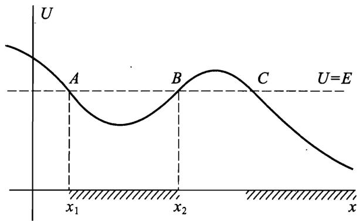

# 一维运动

一个自由度系统的运动称为一维运动. 若系统处于定常外部条件下, 拉格朗日函数的一般形式为

$$
L = \frac 1 2 a \left( q \right) \dot { q } ^ { 2 } - U \left( q \right) ,
$$

其中 $a ( q )$ 是广义坐标 $q$ 的函数. 特别地, 如果 $q$ 为笛卡儿坐标（我们就取为 $x$ ), 则

$$
L = \frac { m \dot { x } ^ { 2 } } { 2 } - U \big ( x \big ) .
$$

相应于这些拉格朗日函数的运动方程可以在一般形式下积分. 这时甚至没必要给出运动方程本身, 可以直接由运动方程的第一积分——能量守恒定律给出. 于是, 对于上述拉格朗日函数有

$$
{ \frac { m { \dot { x } } ^ { 2 } } { 2 } } + U ( x ) = E .
$$

这是一阶微分方程, 可以通过分离变量积分出来：

$$
\frac { \mathrm { d } x } { \mathrm { d } t } { = } \sqrt { \frac { 2 } { m } [ E - U ( x ) ] } ,
$$

进而得到

$$
t = { \sqrt { \frac { m } { 2 } } } { \int { \frac { \mathrm { d } x } { \sqrt { E - U ( x ) } } } + \mathrm { c o n s t . } } \tag{1}\label{eq1}
$$

这里总能量 $E$ 和积分常数 const 表示运动方程解里的两个任意常数.

由于动能实际上是正值, 运动中总能量总是大于势能, 即运动只能发生在 $U ( x ) < E$ 的空间区域.

例如, 假设函数 $U ( x )$ 的形式如下图所示. 在图中画出相应于给定总能量的水平直线, 立即可以得到可能的运动区域, 即图中 AB 之间和 $C$ 右侧的区域.

势能等于总能量的点确定了运动边界：

$$
U ( x ) { \dot { = } } E .\tag{2}\label{eq2}
$$

由于在这些点速度为零, 故称之为转折点. 如果运动区域由两个转折点限定, 则运动发生在空间的有限区域内, 称为有界运动. 如果运动区域不受限制或者只有单侧限制, 则运动是无限的, 质点可以运动到无穷远处, 称为无界运动.

一维有界运动是振动, 质点在两个边界之间往复运动 (在上图的点 $x _ { 1 }$ 和 $x _ { 2 }$ 之间的势阱 $A B$ 中). 根据时间的可逆性, 从 $x _ { 1 }$ 到 $x _ { 2 }$ 的运动时间等于从 $x _ { 2 }$ 到 $x _ { 1 }$ 的时间. 所以, 振动周期（从 $x _ { 1 }$ 运动到 $x _ { 2 }$ 并返回的时间) 等于从 $x _ { 1 }$ 到 $x _ { 2 }$ 运动时间的两倍, 根据 $\eqref{eq1}$ 有

$$
T ( E ) = \sqrt { 2 m } \int _ { x _ { 1 } ( E ) } ^ { x _ { 2 } ( E ) } \frac { \mathrm { d } x } { \sqrt { E - U ( x ) } } ,
$$

积分上下限 $x _ { 1 }$ 和 $x _ { 2 }$ 是 $E$ 给定方程 $\eqref{eq2}$ 根. 这个公式给出了振动周期对质点的总能量的依赖关系.
