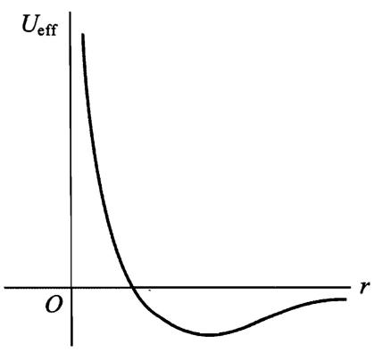
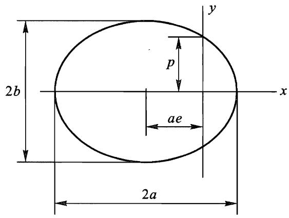
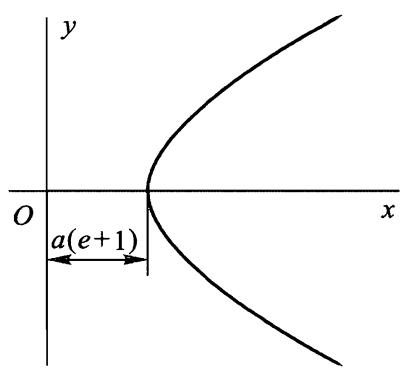

# 开普勒问题

势能与 $r$ 成反比，因而力与 $r ^ { 2 }$ 成反比的有心力场是非常重要的一类有心力场.牛顿万有引力场和库仑静电相互作用力场都属于这种情况，后者可能是吸引的也可能是排斥的力场.

我们首先研究引力场，设

$$
U = - \alpha / r ,\tag{1}\label{eq1}
$$

其中 $\alpha$ 是正数.“有效”势能

$$
U _ { \mathrm { e f f } } = - \frac { \alpha } { r } + \frac { M ^ { 2 } } { 2 m r ^ { 2 } }\tag{2}\label{eq2}
$$

的曲线如图所示：

当 $r \to 0$ 时 $U _ { \mathrm { e f f } }$ 趋于 $+ \infty$ ,当 $r \to \infty$ 时 $U _ { \mathrm { e f f } }$ 从负方向趋于零，当 $r = M ^ { 2 } / m \alpha$ 时取极小值

$$
\big (  U _ { \mathrm { e f f } } \big ) _ { \mathrm { m u n } } = - { \frac { m \alpha ^ { 2 } } { 2 M ^ { 2 } } } .\tag{3}\label{eq3}
$$

由曲线显而易见，当 $E > 0$ 时质点运动是无界的，$E < 0$ 时运动是有界的.

根据 [有心力场内的运动](14有心力场内的运动.md) 一般公式可得轨道形状.代入 $U$ $= - \alpha / r$ 并积分可得

$$
\varphi = \operatorname { a r c c o s } { \frac { M / r - m \alpha / M } { \sqrt { 2 m E + \left. m ^ { 2 } \alpha ^ { 2 } / M ^ { 2 } \right.}  } } + \mathrm { c o n s t . }
$$

选择 $\varphi$ 的起始位置使得 $\mathrm { c o n s t } = 0$ ，并引入记号

$$
p = { \frac { M ^ { 2 } } { m \alpha } } , \quad e = \sqrt { 1 + { \frac { 2 E M ^ { 2 } } { m \alpha ^ { 2 } } } } ,\tag{4}\label{eq4}
$$

轨道方程可以重新写成

$$
p / r = 1 + e \cos \varphi .\tag{5}\label{eq5}
$$

这是焦点位于坐标原点的圆锥曲线方程， $2 p$ 和 $e$ 分别称为轨道的正焦弦和偏心率.由上式可以看出，选择 $\varphi$ 的起始位置，就是使 $\varphi = 0$ 的点离中心最近 (称该点为轨道近心点）.

在按 $\eqref{eq1}$ 相互作用的两个质点的等价问题中，每个质点的轨道都是圆锥曲线，其焦点之一位于两质点系统的质心处.

由 $\eqref{eq4}$ 可知，当 $E < 0$ 时 $e < 1$ ,即轨道为椭圆（下图）,运动是有界的，和本节前面所说的结果一致.根据解析几何公式，椭圆的半长轴和半短轴为

$$
\alpha = \displaystyle \frac { p } { 1 - e ^ { 2 } } = \displaystyle \frac { \alpha } { 2 \mid E \mid } , \quad \displaystyle b = \displaystyle \frac { p } { \sqrt { 1 - e ^ { 2 } } } = \displaystyle \frac { M } { \sqrt { 2 m \mid E \mid } } .\tag{6}\label{eq6}
$$

能量的最小可能值对应于 $\eqref{eq3}$，这时 $e = 0$ ,即椭圆变成圆.需要指出，椭圆轨道的半长轴仅仅依赖于质点的能量（而与角动量无关），到场中心（椭圆焦点) 的最小和最大距离等于

$$
r _ { \operatorname* { m i n } } = \frac { p } { 1 + e } = \alpha \left( 1 - e \right) , \quad r _ { \operatorname* { m a x } } = \frac { p } { 1 - e } = \alpha \left( 1 + e \right) .
$$

当然这两个表达式（ $a$ 由 $\eqref{eq6}$ 确定， $e$ 由 $\eqref{eq4}$ 确定）也可以直接从方程 $U _ { \mathrm { e f f } } = E$ 求根得到.

运用以面积积分形式表示的角动量守恒定律 [有心力场内的运动](14有心力场内的运动.md)，可以方便地求得质点沿椭圆轨道运动的周期 $T$ .对时间从零到 $T$ 积分这个等式，可得

$$
2 m f = T M ,
$$

其中 $f$ 是轨道面积.对于椭圆 $f = \pi a b$ ，根据 $\eqref{eq6}$ 得

$$
T = 2 \pi a ^ { 3 / 2 } { \sqrt { \frac { m } { \alpha } } } = \pi \alpha { \sqrt { \frac { m } { 2 \mid E \mid ^ { 3 } } } } .
$$

在 [力学相似性](10力学相似性.md) 已经指出，周期平方正比于轨道线度（半长轴) 的立方.还需指出，周期仅仅依赖于质点的能量．

当 $E \geq 0$ 时运动是无界的.如果 $E > 0$ 则偏心率 $e > 1$ ,即轨道是原点为内焦点的双曲线，如上图所示.近心点到中心的距离

$$
r _ { \text {min} } = \frac { p } { 1 + e } = \alpha \left( e - 1 \right) ,
$$

其中

$$
\alpha = \frac { p } { e ^ { 2 } - 1 } = \frac { \alpha } { 2 E }
$$

是双曲线的“半轴”.

在 $E = 0$ 情况下偏心率 $e = 1$ ,即质点沿着近心点距离为 $r _ { \text{min} } = p / 2$ 的抛物线运动.如果质点自无穷远处从静止开始运动，就会出现这种情况.

质点沿着轨道运动时，坐标对时间的依赖关系可以利用 [有心力场内的运动](14有心力场内的运动.md) 得到.它可以表示为下面所述的一种方便的参数形式.

首先研究椭圆轨道.根据 $\eqref{eq4}$ 和 $\eqref{eq6}$ 引入的 $\alpha$ 和 $e$ ，确定时间的积分可以写成

$$
t = \sqrt { \frac { m } { 2 \mid E \mid } } \int \frac { r \mathrm { d } r } { \sqrt { - { r } ^ { 2 } + \frac { \alpha } { \mid E \mid } r - \frac { M ^ { 2 } } { 2 m \mid E \mid } } } = \sqrt { \frac { m \alpha } { \alpha } } \int \frac { r \mathrm { d } r } { \sqrt { \alpha ^ { 2 } e ^ { 2 } - ( { r } -  a) ^ { 2 } } } .
$$

利用变换

$$
r - \alpha = - a e \cos \xi ,
$$

这个积分写成

$$
t = { \sqrt { \frac { m a ^ { 3 } } { \alpha } } } \int ( 1 - e \cos \xi ) \mathrm { d } \xi = { \sqrt { \frac { m a ^ { 3 } } { \alpha } } } { \left( \xi - e \sin \xi \right) } + \mathrm { c o n s t } .
$$

选择时间起点使得 $\mathrm { c o n s t } = 0$ ,最终可得 $r$ 依赖于 $t$ 的参数方程：

$$
r = a \left( 1 - e \cos \xi \right) , \quad t = \sqrt { \frac { m a ^ { 3 } } { \alpha } } ( \xi - e \sin \xi )\tag{10}\label{eq10}
$$

（在 $t = 0$ 时刻质点位于近心点）.用参数 $\xi$ 还可以表示出质点的笛卡儿坐标 $x = r \mathrm { c o s } \varphi$ , $y = r \mathrm { s i n } \varphi$ ( $x$ 轴和 $y$ 轴分别沿着椭圆的半长轴和半短轴）.由 $\eqref{eq5}$ 和 $\eqref{eq10}$ 有

$$
e x = p - r = a \left( 1 - e ^ { 2 } \right) - a \left( 1 - e \cos \xi \right) = \alpha e \left( \cos \xi - e \right) ,
$$

再利用 $y = { \sqrt { \ r ^ { 2 } - x ^ { 2 } } }$ 求出 $y$ .最终可得：

$$
x = a \left( \cos \xi - e \right) , \quad y = a \ \sqrt { 1 - e ^ { 2 } } \mathrm { s i n } \xi .
$$

沿着椭圆轨道运动一整圈对应着参数 $\xi$ 从零到 $2 \pi$ .

对于双曲线轨道，完全类似地计算可得

$$
r = a \left( e\cosh \xi - 1 \right) , \quad t = \sqrt { m a ^ { 3 } / \alpha } \left( e \sinh \xi - \xi \right) ,
$$

$$
x = a \left( e - \cosh \xi \right) , \quad y = a \ \sqrt { e ^ { 2 } - 1 } \sinh \xi ,
$$

其中参数 $\xi$ 取值范围从 $- \infty$ 到 $+ \infty$ .

下面研究相斥场中的运动，势能为

$$
U = { \frac { \alpha } { r } }
$$

$( \alpha > 0 )$ .这种情况下，有效势能为

$$
U _ { \mathrm { e f f } } = \frac { \alpha } { r } + \frac { M ^ { 2 } } { 2 m r ^ { 2 } }
$$

当 $r$ 从零到 $\infty$ 变化时，它从 $+ \infty$ 单调减少到零.质点能量只能是正的，运动总是无限的.完全像上面对吸引场一样计算可知，轨道是双曲线

$$
\frac { p } { r } = - 1 + e \cos \varphi
$$

( $p$ 和 $e$ 由公式 $\eqref{eq4}$ 确定），轨道以下图所示的方式通过场的中心附近.

近心点距离为

$$
r _ { \operatorname* { m i n } } = { \frac { \phi } { e - 1 } } = \alpha \left( e + 1 \right) .
$$

运动与时间的关系由参数方程给出：

$$
r = \alpha \left( e \cosh \xi + 1 \right) , \quad t = \sqrt { m a ^ { 3 } / \alpha } \left( e \sinh \xi + \xi \right) ,
$$

$$
x = a \left( e + \cosh \xi \right) , \quad y = a \sqrt { e ^ { 2 } - 1 } \sinh \xi .
$$

在本节的最后我们来证明，仅在有心力场 $U = \alpha / r ( \alpha$ 的符号任意) 内的运动有其特有的运动积分.很容易直接计算验证：

$$
{ \boldsymbol v } \times { \boldsymbol M } + \frac { \alpha { \boldsymbol r } } { r } = \mathrm { c o n s t . }
$$

这是所谓的**拉普拉斯 - 龙格 - 楞次矢量**。事实上，上式对时间的全导数等于

$$
\dot { \boldsymbol { v } } \times \boldsymbol { M } + \frac { \alpha \boldsymbol { v } } { r } - \frac { \alpha \boldsymbol { r } \left( \boldsymbol { v } \cdot \boldsymbol { r } \right) } { r ^ { 3 } } ,
$$

将 $\boldsymbol { M } = m \boldsymbol { r } \times \boldsymbol { v }$ 代入后得

$$
m \boldsymbol r \left( \boldsymbol v \cdot { \dot { \boldsymbol v } } \right) - m \boldsymbol v \left( \boldsymbol r \cdot { \dot { \boldsymbol v } } \right) + { \frac { \alpha \boldsymbol v } { r } } - { \frac { \alpha \boldsymbol r \left( \boldsymbol v \cdot \boldsymbol r \right) } { r ^ { 3 } } } .
$$

再根据运动方程 $ m \dot { \boldsymbol { v } } = \alpha \boldsymbol { r }  / r ^ { 3 }$ 可知上面表达式等于零.

拉普拉斯 - 龙格 - 楞次矢量的方向沿着长轴从焦点指向近心点，其大小等于 $\alpha e$ .这很容易通过计算该矢量在近心点的值来验证.

需要着重指出，运动积分拉普拉斯 - 龙格 - 楞次矢量像 $\boldsymbol M$ 和 $E$ 一样，是质点状态（位置和速度) 的单值函数.在 [条件周期运动](52条件周期运动.md) 我们将看到，存在这个附加的单值积分是因为运动的简并性.
