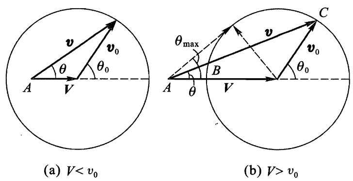

# 质点分裂

在许多情形下，利用动量守恒和能量守恒定律可以得到一系列关于各种力学过程特性的重要结果.应当注意的是，这些性质完全不依赖于质点间相互作用的具体形式.

首先，我们研究一个质点“自发”（即不是外力引起的）分裂成两个“组成部分”，即两个分裂后各自独立运动的其它质点的过程.

在质点 (分裂前) 静止的参考系中描述这个过程是最简单的.根据动量守恒定律，分裂后两个质点的动量之和仍为零，即两个质点以大小相等方向相反的动量相背运动.动量的大小 ($\mathcal { P_0 }$) 可以由能量守恆定律

$$
E _ { \mathrm { \scriptsize { n t } } } = E _ { \mathrm { \scriptsize { 1 i n t } } } + \frac {  { p _ { 0 } } ^ { 2 } } { 2 m _ { 1 } } + E _ { \mathrm { \scriptsize { 2 i n t } } } + \frac {  { p _ { 0 } } ^ { 2 } } { 2 m _ { 2 } }
$$

确定，其中 $m _ { 1 }$ 和 $m _ { 2 }$ 是两个质点的质量， $E _ { 1 \mathrm { i n t } }$ 和 $E _ { 2 \mathrm { i n t } }$ 是它们的内能，而 $E _ { \mathrm { i n t } }$ 是原来 (即将分裂的) 质点的内能.用 $\varepsilon$ 表示“分裂能”,即差值

$$
\varepsilon = E _ { \mathrm { { \scriptscriptstyle 1 n t } } } - E _ { 1 \mathrm { { \scriptscriptstyle 1 n t } } } - E _ { 2 \mathrm { { \ i n t } } }
$$

（显然，这个量应该是正的，这样分裂才可能发生）.这时有

$$
\varepsilon = \frac { p _ { 0 } ^ { 2 } } { 2 } \left( \frac { 1 } { m _ { 1 } } + \frac { 1 } { m _ { 2 } } \right) = \frac { p _ { 0 } ^ { 2 } } { 2 m } ,
$$

由此确定 $p _ { 0 } ( \boldsymbol { m }$ 是两个质点的约化质量)，两个质点的速度分别为 $v _ { 1 0 } = p _ { 0 } / m _ { 1 }$ 和 $v _ { 2 0 } = p _ { 0 } / m _ { 2 }$.

下面我们换一个参考系，分裂前原来的质点以速度 $\mathbf { V }$ 相对该参考系运动. 通常称这个参考系为实验室参考系，也叫 $L$ 系，它不同于其中系统总动量等于零的质心参考系，也叫 $C$ 系. 设 ${\pmb v }$ 和 ${ \pmb v } _ { 0 }$ 是分裂后其中一个质点分别相对实验室参考系和质心参考系的速度. 显然，有 ${ \pmb v } = { \pmb V } + { \pmb v } _ { 0 }$ 或者 ${ \pmb v } - { \pmb V } = { \pmb v } _ { 0 }$ 可得

$$
\begin{array} { r } { v ^ { 2 } + V ^ { 2 } - 2 v V \mathrm { c o s } \theta = v _ { 0 } ^ { 2 } , } \end{array}
$$

其中 $\theta$ 是质点相对速度 $\mathbf { V }$ 的方向飞出的角度.这个方程给出了在实验室参考系中分裂后质点速度对飞出方向的函数关系.

图 14

图 14 借助图解法示出了这个关系.点 $A$ 距圆心的距离为 $V$ ,速度矢量 ${ \pmb v }$ 由从 $A$ 点指向半径为 $v  _ { 0 }$ 的圆周上任一点的矢量表示.图 14(a) 和 (b) 分别相应于 $V < v _ { 0 }$ 和 $V > v _ { 0 }$ 的情况.第一种情况下质点可以任意角度 $\theta$ 飞出，第二种情况下质点只能向前飞出，飞出角度θ 不超过下式给出的θmax，

$$
\sin \theta _ { \mathrm { { m a x } } } = \frac { v _ { 0 } } { V }
$$

（这是从 $A$ 作圆的切线的方向）.

在实验室参考系和质心参考系中飞出角 $\theta$ 和 $\theta _ { 0 }$ 的关系，显然也可以由图解法给出：

$$
\tan \theta = \frac { v _ { 0 } \sin \theta _ { 0 } } { v _ { 0 } \cos \theta _ { 0 } + V } .
$$

如果解这个方程求 $\cos \theta _ { 0 }$ ，则经过初等的变换可得

$$
\mathrm { c o s } \theta _ { 0 } = - { \frac { V } { v _ { 0 } } } \mathrm { s i n } ^ { 2 } \theta \pm \mathrm { c o s } \theta \sqrt { 1 - { \frac { V ^ { 2 } } { v _ { 0 } ^ { 2 } } } \mathrm { s i n } ^ { 2 } \theta } .
$$

由图 14(a) 可以看出，当 $v _ { 0 } > V$ 时 $\theta$ 和 $\theta _ { 0 }$ 之间的关系是一一对应的.这时在公式 (16.6) 中根号前面取 “+” 号 (使得 $\theta = 0$ 时 $\theta _ { 0 } = 0$ ). 如果 $\mathit { v } _ { 0 } < V , \theta$ 和 $\theta _ { 0 }$ 之间的关系不是一一对应的：每个 $\theta$ 对应两个 $\theta _ { 0 }$ （图 14（b）），它们相应于从圆心指向 $B$ 或者 $C$ 的矢量 ${ \pmb v } _ { 0 }$ ,也对应于公式 (16.6) 中根号前两个符号．

在物理应用中通常要处理的不是一个，而是很多个相同质点的分裂，这就产生了分裂后的质点按方向、能量等分布的问题. 这时我们假设，原始质点在空间中运动方向是随机的，即在平均意义下是各向同性的.

在质心参考系中这个问题是容易求解的: 所有（相同类型的) 分裂后的质点具有相同的能量，它们飞出方向分布是各向同性的，这与原始质点的运动方向是随机的假设相关.就是说，进入立体角微元 $\mathrm {d}O _ { 0 }$ 的质点数所占的比例正比于该微元的大小，即等于 $\mathrm {d}O _ { 0 } / 4 \pi$. 代入 $\mathrm {d}O _ { 0 } = 2 \pi \mathrm { s i n } \theta _ { 0 } \mathrm { d } \theta _ { 0 }$ 后可得按角 $\theta _ { 0 }$ 的分布：

$$
\frac { 1 } { 2 } \mathrm { s i n } \theta _ { 0 } \mathrm { d } \theta _ { 0 }
$$

在实验室参考系中的分布可以通过适当的变换得到.例如，我们来计算在实验室参考系中的动能分布.将等式 ${ \pmb v } = { \pmb v } _ { 0 } + { \pmb V }$ 平方得

$$
{ v ^ { 2 } } = { v _ { 0 } } ^ { 2 } + V ^ { 2 } + 2 v _ { 0 } V \mathrm { c o s } \theta _ { 0 } ,
$$

由此有

$$
\mathrm { d } \mathrm { c o s } \theta _ { 0 } = \frac { \mathrm { d } ( v ^ { 2 } ) } { 2 v _ { 0 } V } .
$$

利用动能 $T = m v ^ { 2 } / 2$ （其中 $m$ 是 $m _ { 1 }$ 或者 $m _ { 2 }$ ，取决于我们研究哪类分裂质点）并代入 (16.7) 即可得所要求的分布

$$
{ \frac { \mathrm { d }T } { 2 m v _ { 0 } V } } .
$$

动能的取值范围从最小值 $T _ { \mathrm { m i n } } = ( m / 2 ) ( v _ { 0 } - V ) ^ { 2 }$ 到最大值 $T _ { \mathrm { m a x } } = \left( \ m / 2 \right)$ $( \mathit { v _ { 0 } } + \mathit { V } ) ^ { 2 }$ .在这个范围内质点按照 (16.8) 均匀分布.

在质点分裂成多于两个部分时，动量守恒和能量守恒定律自然允许分裂后的质点的速度和方向可以有更大的任意性.特别是，在质心参考系中这些分裂后的质点的能量不再具有确定的值，但是其中的每个质点的动能存在上限.

为了确定这个上限，除了一个给定质点 (质量为 $m _ { 1 }$ )，我们将所有其它质点看作一个系统,其内能用 $E _ { \mathrm { i n t } } ^ { \prime }$ 表示.根据 (16.1) 和 (16.2),质点 $m _ { 1 }$ 的动能等于

$$
T _ { 1 0 } = \frac { p _ { 0 } ^ { 2 } } { 2 m _ { 1 } } { = } \frac { M - m _ { 1 } } { M } ( E _ { \mathrm { i n t } } - E _ { \mathrm { 1 n t } } - E _ { \mathrm { i n t } } ^ { \prime } )
$$

其中 $M$ 是原始质点的质量.显然，当 $E _ { \mathrm { i n t } } ^ { \prime }$ 最小时 $T _ { 1 0 }$ 取最大值. 为此，除了 $m _ { 1 }$ 以外所有其它分裂后的质点必须以相同的速度运动，那么 $E ^ { ' } _ { \mathrm { i n t } }$ 就是它们的內能之和，而差值 $E _ { \mathrm { i n t } } - E _ { \mathrm { 1 i n t } } - E _ { \mathrm { i n t } } ^ { \prime }$ 就是分裂能 $\varepsilon$ .于是有

$$
\left( \mathbf T _ { 1 0 } \right) _ { \mathrm { m a x } } = \frac { M - m _ { 1 } } { M } \varepsilon .
$$
