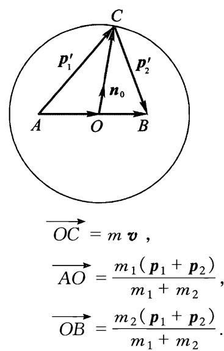
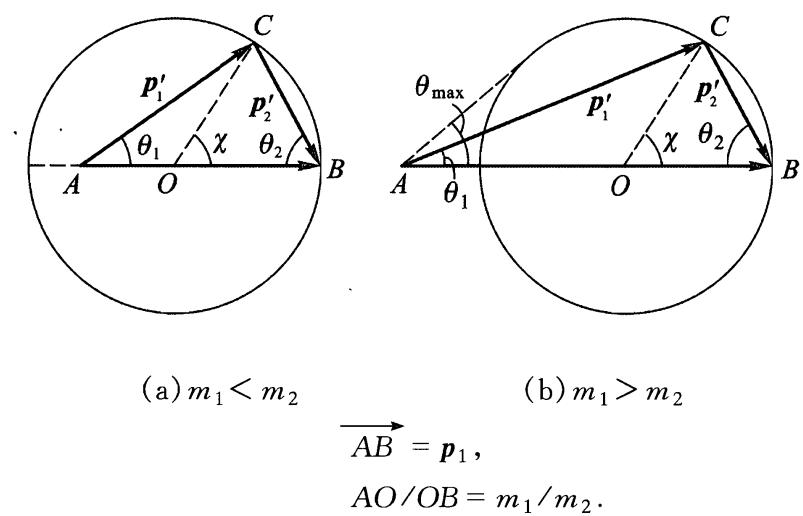
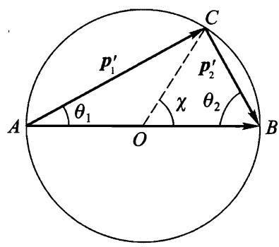

# $\S 1 7$ 质点弹性碰撞

如果两个质点碰撞不改变它们的内部状态，则称为弹性碰撞. 因此，对于这样的碰撞应用能量守恆定律时可以不考虑质点的內能.

在两个质点的质心静止的参考系（即 $C$ 系）中研究碰撞最简单. 像上节一样，我们用下标0表示物理量在这个参考系中的值. 碰撞前两个质点在质心参考系中的速度与实验室参考系中的速度 ${ \pmb v }_ { 1 }$ 和 ${ \pmb v } _ { 2 }$ 的关系为

$$
{ \pmb v } _ { 1 0 } = \frac { m _ { 2 } } { m _ { 1 } + m _ { 2 } } { \pmb v } ~ , ~ { \pmb v } _ { 2 0 } = - \frac { m _ { 1 } } { m _ { 1 } + m _ { 2 } } { \pmb v } ~ ,
$$

其中 ${ \pmb v } = { \pmb v } _ { 1 } - { \pmb v } _ { 2 }$ (参见(13.2)).

根据动量守恒定律，碰撞后两个质点动量的大小相等方向相反，又根据能量守恒定律，它们的绝对值也不变.于是，在质心参考系中碰撞的结果仅是转动了两个质点的速度，而这些速度的方向保持相反，大小不变.如果用 ${ \pmb n } _ { 0 }$ 表示沿碰撞后质点 $m _ { 1 }$ 的速度方向的单位矢量，则两个质点碰撞后的速度(用撇号区别)为

$$
{ \pmb v } _ { 1 0 } ^ { \prime } = \frac { m _ { 2 } } { m _ { 1 } + m _ { 2 } } v { \pmb n } _ { 0 } , \quad { \pmb v } _ { 2 0 } ^ { \prime } = - \frac { m _ { 1 } } { m _ { 1 } + m _ { 2 } } v { \pmb n } _ { 0 } .
$$

为了变换到实验室参考系，需要在这些表达式中加上质心速度 ${ \pmb V }$ . 于是，两个质点在实验室参考系中的碰撞后速度为

$$
\begin{array} 
\displaystyle \pmb { v } _ { 1 } ^ { \prime } = \cfrac { m _ { 2 } } { m _ { 1 } + m _ { 2 } } v \pmb { n } _ { 0 } + \cfrac { m _ { 1 } \pmb { v } _ { 1 } + m _ { 2 } \pmb { v } _ { 2 } } { m _ { 1 } + m _ { 2 } } , \quad \pmb { v } _ { 2 } ^ { \prime } = - \cfrac { m _ { 1 } } { m _ { 1 } + m _ { 2 } } v \pmb { n } _ { 0 } + \cfrac { m _ { 1 } \pmb { v } _ { 1 } + m _ { 2 } \pmb { v } _ { 2 } } { m _ { 1 } + m _ { 2 } } .
\end{array}
$$

利用动量和能量守恒定律只能得到这些关于碰撞的结论.矢量 ${ \pmb n } _ { 0 }$ 的方向与质点之间相互作用规律以及碰撞时它们的相对位置有关.

对于上述结果可以给出几何解释，为此将速度换为动量会更加方便. 将等式(17.2)分别乘以 $m _ { 1 }$ 和 $m _ { 2 }$ 可得

$$
{ \pmb p }_ { 1 } ^ { \prime } = m v { \pmb n} _ { 0 } + \frac { m _ { 1 } } { m _ { 1 } + m _ { 2 } } ( { \pmb p } _ { 1 } + { \pmb p } _ { 2 } ) , \quad { \pmb p } _ { 2 } ^ { \prime } = - m v { \pmb n} _ { 0 } + \frac { m _ { 2 } } { m _ { 1 } + m _ { 2 } } ( { \pmb p } _ { 1 } + { \pmb p } _ { 2 } ) .
$$

(${m} = \frac { m _ { 1 } m _ { 2 } } { m _ { 1 } + m _ { 2 } }$ 是约化质量). 作半径为 $mv$ 的圆，并使用示于图 15 中的构造. 如果单位矢量 ${ \pmb n } _ { 0 }$ 沿着 $\overrightarrow { O C }$ ，则矢量 $\overrightarrow { A C }$ 和 $\overrightarrow { C B }$ 分别给出动量 ${ \pmb p } _ { 1 } ^ { \prime }$ 和 ${ \pmb p } _ { 2 } ^ { \prime }$ .在给定 ${ \pmb p } _ { 1 }$ 和 ${ \pmb p } _ { 2 }$ 时，圆的半径确定， $A$ 和 $B$ 点的位置也确定，而 $C$ 点可以位于圆周上任何位置.

  
图15

我们更详细地考虑碰撞前有一个质点(设为 $m _ { 2 }$ )静止的情况. 这种情况下 $O B =$ $\frac { m _ { 2 } } { m _ { 1 } + m _ { 2 } } p _ { 1 } = m v$ 的长度与半径相等，即 $B$ 点在圆周上. 矢量 $\overrightarrow { A B }$ 等于碰撞前第一个质点 $m _ { 1 }$ 的动量 ${ \pmb p } _ { 1 }$ . 点 $A$ 位于圆内(当 $m _ { 1 } < m _ { 2 }$ 时)或者圆外(当 $m _ { 1 } > m _ { 2 }$ 时). 相应的情况如图 16(a)和(b)所示. 图中的 $\theta _ { 1 }$ 和 $\theta _ { 2 }$ 是碰撞后质点运动方向偏离撞击方向 ${ \pmb p } _ { 1 }$ 方向)的角度. 图中用 $\chi$ 表示的圆心角（它给出 ${ \pmb n } _ { 0 }$ 的方向)是第一个质点 $m _ { 1 }$ 在质心参考系中的偏转角. 由图中可见，角 $\theta _ { 1 }$ 和 $\theta _ { 2 }$ 可以用 $\chi$ 表示出来

$$
\tan \theta _ { 1 } = { \frac { m _ { 2 } \sin \chi } { m _ { 1 } + m _ { 2 } \cos \chi } } , \quad \theta _ { 2 } = { \frac { \pi - \chi } { 2 } } .
$$

  
图16

我们还可以用χ写出碰撞后两个质点的速度的大小的表示式：

$$
v _ { 1 } ^ { ' } = \frac { \sqrt { \displaystyle { m _ { 1 } } ^ { 2 } + m _ { 2 } ^ { 2 } + 2 m _ { 1 } m _ { 2 } { \cos } \chi } } { m _ { 1 } + m _ { 2 } } v , \quad v _ { 2 } ^ { ' } = \frac { 2 m _ { 1 } v } { m _ { 1 } + m _ { 2 } } { \sin \frac { \chi } { 2 } } .
$$

$\theta _ { 1 } + \theta _ { 2 }$ 是碰撞后质点飞出方向之间的夹角. 显然，当 $m _ { 1 } < m _ { 2 }$ 时 $\theta _ { 1 } + \theta _ { 2 } >$ $\pi / 2$ ,当 $m _ { 1 } > m _ { 2 }$ 时 $\theta _ { 1 } + \theta _ { 2 } { < } \pi / 2$ .

当碰撞后两个质点沿着一条直线运动(正碰)时，相应有 $\chi = \pi$ ,即 $C$ 点或者位于过 $A$ 点的直径上并在 $A$ 点左边(图16(a),这时 ${ \pmb p } _ { 1 } ^ { \prime }$ 和 ${ \pmb p } _ { 2 } ^ { \prime }$ 相互反向),或者位于 $A$ 和 $O$ 之间（图16(b),这时 ${ \pmb p } _ { 1 } ^ { \prime }$ 和 ${ \pmb p } _ { 2 } ^ { \prime }$ 的方向相同）.

这种情况下碰撞后质点速度等于

$$
{ \pmb v } _ { 1 } ^ { ' } = \frac { m _ { 1 } - m _ { 2 } } { m _ { 1 } + m _ { 2 } } { \pmb v } ~ , ~ { \pmb v } _ { 2 } ^ { ' } = \frac { 2 m _ { 1 } } { m _ { 1 } + m _ { 2 } } { \pmb v } ~ .
$$

这时 ${ \pmb v } _ { 2 } ^ { \prime }$ 取最大可能值，因此原来静止的质点碰撞后获得的最大能量等于

$$
E _ { 2 \mathrm { m a x } } ^ { \prime } = \frac { m _ { 2 } v ^ { ' 2 } _{2 \mathrm { m a x }} } { 2 } = \frac { 4 m _ { 1 } m _ { 2 } } { ( m _ { 1 } + m _ { 2 } ) ^ { 2 } } E _ { 1 } ,
$$

其中 $E _ { 1 } = \frac { m _ { 1 } v _ { 1 } ^ { 2 } } { 2 }$ 是原来运动质点的初始能量。

当 $m _ { 1 } < m _ { 2 }$ 时，碰撞后第一个质点的速度可以沿着任意方向. 然而，如果 $m _ { 1 } > m _ { 2 }$ ,则该质点偏离原来方向的偏角不能超过某个最大值 $\theta _ { \mathrm { 1 m a x } }$ ,这个 $\theta _ { 1 }$ 的最大值所对应的 $C$ 点位置是 $AC$ 与圆相切（图16（b））.显然， $\sin \theta _ { 1 \mathrm { { m a x } } } = OC / OA$，或者

$$
\sin \theta _ { 1 \mathrm { { m a x } } } = { \frac { m _ { 2 } } { m _ { 1 } } } .
$$

两个质量相同的质点(一个初始静止)的碰撞特别简单. 这种情况下 $A$ 点和 $B$ 点都位于圆周上(图17). 这时有

$$
\theta _ { 1 } = \frac { \chi } { 2 } , \quad \theta _ { 2 } = \frac { \pi - \chi } { 2 } ,
$$

$$
v _ { 1 } ^ { ' } = v \cos \frac { \chi } { 2 } , ~ v _ { 2 } ^ { ' } = v \sin \frac { \chi } { 2 } .
$$

  
图17

可见，碰撞后两个质点飞出方向相互垂直.
