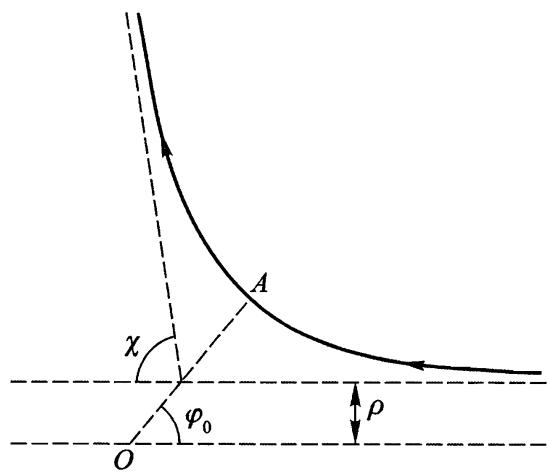

# $\S 18$ 质点散射

上一节已经指出，要完全确定两个质点的碰撞结果(即确定偏转角 $\chi$ )，必须求解计及质点相互作用具体规律的运动方程.

首先，我们按照一般法则来研究一个等效的问题，这是一个质量为 $m$ 的质点在中心(位于原来问题中两粒子的质心)静止的力场 $U ( r )$ 中的偏转问题.

在 $\S 14$ 已经指出，质点在有心力场中的轨道，相对于过中心和轨道近心点的直线(图18上的 $OA$ )对称. 所以，轨道的两条渐近线与该直线的夹角相同. 如果记该角为 $\varphi _ { 0 }$ ，则由图18可见，质点飞过中心附近产生的偏转角 $\chi$ 等于

$$
\chi = \mid \pi - 2 \varphi _ { 0 } \mid .
$$

  
图18

根据(14.7),确定 $\varphi _ { 0 }$ 的积分是从轨道近心点到无穷远：

$$
\varphi _ { 0 } = \int _ { r _ { \mathrm { min } } } ^ { \infty } \frac { ( M / r ^ { 2 } ) \mathrm { d } r } { \sqrt { 2 m \left[ E - U ( r ) \right] - M ^ { 2 } / r ^ { 2 } } } .
$$

需要注意， $r _ { \mathrm { m i n } }$ 是上式根号内表达式的根.

在这里所讨论的无界运动情况下，引入质点在无穷远处速度 $v _ { \infty }$ 和瞄准距离 $\rho$ 来代替常数 $E$ 和 $M$ 更为方便. 瞄准距离是指中心到 $v _ { \infty }$ 的方向的垂直距离，即不存在力场情况下质点飞过中心时的距离(图18). 用这些量，能量和角动量可表示为

$$
E = \frac { m v _ { \infty } ^ { 2 } } { 2 } , \quad M = m \rho v _ { \infty } ,
$$

而公式(18.2)变为

$$
\varphi _ { 0 } = \int _ { r _ { \mathrm { m i n } } } ^ { \infty } \frac { ( \rho / r ^ { 2 } ) \mathrm { d } r } { \sqrt { 1 - \rho ^ { 2 } / r ^ { 2 } - 2 U / m v _ { \infty } ^ { 2 } } } . ~ .
$$

由方程(18.1)和(18.4)可以求出 $\chi$ 对 $\rho$ 的函数的表达式.

在物理应用中经常遇到的不是一个质点的偏转问题，而是以相同速度 ${ \pmb v } _ { \infty }$ 飞过散射中心的全同质点束的散射. 束中不同的质点有不同的瞄准距离，因此以不同的角度 $\chi$ 散射. 我们用 $\mathrm { d } N$ 表示单位时间內偏转角在 $\chi$ 和 $\chi + \mathrm { d } \chi$ 之间的散射质点数. 因为这个数正比于入射质点束的密度，它对于刻画散射过程并不方便. 所以我们引入比值

$$
\mathrm { d } \sigma = \mathrm { d } N / n \ ,
$$

其中 $n$ 是单位时间内通过质点束单位横截面积上的质点数（当然，我们假设质点束在横截面上是均匀的）. 这个量具有面积量纲，称为有效散射截面. 它完全由散射场的形式决定，是描述散射过程最重要的参量.

我们将假定 $\chi$ 和 $\rho$ 之间的关系是一一对应的. 如果散射角是瞄准距离的单调递减函数，两者之间的关系就是如此. 这种情况下，只有瞄准距离在 $\rho ( \chi )$ 和 $\rho ( \chi ) + \mathrm { d } \rho ( \chi )$ 之间的那些质点被散射到 $\chi$ 和 $\chi + \mathrm { d } \chi$ 之间. 这样的质点数等于 $n$ 乘以内外径为 $\rho$ 和 $\rho + \mathrm { d } \rho$ 圆环的面积，即 $\mathrm{d} N = 2 \pi \rho \mathrm { d } \rho \cdot n$ . 由此可得有效截面

$$
\mathrm { d } \sigma = 2 \pi \rho \mathrm { d } \rho .
$$

为了求得有效截面 $\mathrm { d } \sigma$ 对散射角的依赖关系，将上式改写成

$$
\mathrm { d } \sigma = 2 \pi \rho ( \chi ) \left| \frac { \mathrm { d } \rho ( \chi ) } { \mathrm { d } \chi } \right| \mathrm { d } \chi .
$$

这里我们加上绝对值符号是因为 $\mathrm { d } \rho / \mathrm { d } \chi$ 可能(通常就是)取负值. 通常 $\mathrm { d } \sigma$ 不是对应平面角微元$\mathrm { d } \chi$，而是立体角微元$\mathrm { d } o$. 在对顶角为 $\chi$ 和 $\chi + \mathrm { d } \chi$ 的两圆锥体之间的立体角微元为 $\mathrm { d } o = 2 \pi \mathrm { s i n } \chi \mathrm { d } \chi$ . 因此，由(18.7)有

$$
\mathrm { d } \sigma = \frac { \rho ( \chi ) } { \sin \chi } \left| \frac { \mathrm { d } \rho } { \mathrm { d } \chi } \right| \mathrm { d } o .
$$

回到质点束不是被力心固定的力场，而是被初始静止的其它质点所散射的实际问题时，我们可以说公式(18.7)给出了质心参考系中有效截面对散射角的依赖关系. 为了得到实验室参考系中有效截面对散射角 $\theta$ 的依赖关系，需要用公式(17.4),将(18.7)中的 $\chi$ 用 $\theta$ 表示出来. 这样可以得到入射质点束散射截面的表达式(用 $\theta _ { 1 }$ 表示的 $\chi$ )和初始静止质点的散射截面的表达式(用 $\theta _ { 2 }$ 表示的 $\chi$ ).
