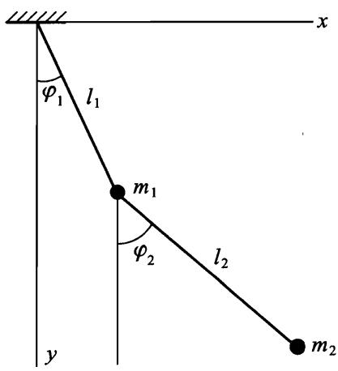
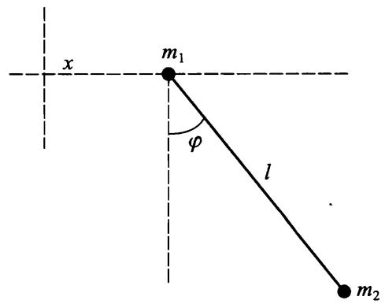
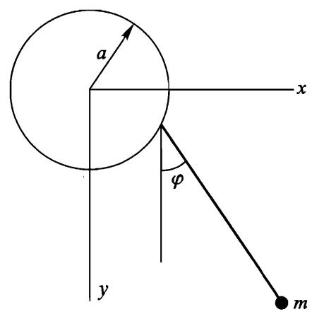
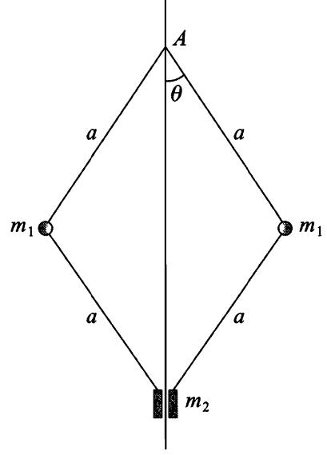

# 习 题

试求下面在均匀重力场 (重力加速度为 $^ { g }$ ) 中各系统的拉格朗日函数.

习题 1 平面双摆 (图 1).

解：取绳 $l _ { 1 }$ 和 $l _ { 2 }$ 分别与竖直方向的夹角 $\varphi _ { 1 }$ 和 $\varphi _ { 2 }$ 为广义坐标.对质点 $m _ { 1 }$ 有

$$
T _ { 1 } = \frac { 1 } { 2 } m _ { 1 } l _ { 1 } ^ { 2 } \dot { \varphi } _ { 1 } ^ { 2 } , \qquad U _ { 1 } = - m _ { 1 } g l _ { 1 } \mathrm { c o s } \varphi _ { 1 } .
$$

为了求出第二个质点的动能，我们用角 $\varphi _ { 1 }$ 和 $\varphi _ { 2 }$ 表示第二个质点的笛卡儿坐标 $x _ { 2 } , y _ { 2 }$ （坐标原点取在悬挂点， $_ y$ 轴竖直向下)：

$$
x _ { 2 } = l _ { 1 } \mathrm { s i n } \varphi _ { 1 } + l _ { 2 } \mathrm { s i n } \varphi _ { 2 } , \qquad y _ { 2 } = l _ { 1 } \mathrm { c o s } \varphi _ { 1 } + l _ { 2 } \mathrm { c o s } \varphi _ { 2 } .
$$

于是有

$$
T _ { 2 } = \frac { 1 } { 2 } m _ { 2 } ( \dot { x } _ { 2 } ^ { 2 } + \dot { y } _ { 2 } ^ { 2 } ) = \frac { m _ { 2 } } { 2 } \bigl [ l _ { 1 } ^ { 2 } \dot { \varphi } _ { 1 } ^ { 2 } + l _ { 2 } ^ { 2 } \dot { \varphi } _ { 2 } ^ { 2 } + 2 l _ { 1 } l _ { 2 } \cos ( \varphi _ { 1 } - \varphi _ { 2 } ) \dot { \varphi } _ { 1 } \dot { \varphi } _ { 2 } \bigr ] .
$$

$$
U _ { 2 } = { \mathrm { ~ - ~ } } m _ { 2 } g { \left( y _ { 1 } + y _ { 2 } \right) } = { \mathrm { ~ - ~ } } m _ { 2 } g { \left( l _ { 1 } \mathrm { c o s } \varphi _ { 1 } + l _ { 2 } \mathrm { c o s } \varphi _ { 2 } \right) }
$$

最后得

$$
{ \cal L } = \frac { m _ { 1 } + m _ { 2 } } { 2 } l _ { 1 } ^ { 2 } \dot { \varphi } _ { 1 } ^ { 2 } + \frac { m _ { 2 } } { 2 } l _ { 2 } ^ { 2 } \dot { \varphi } _ { 2 } ^ { 2 } + m _ { 2 } l _ { 1 } l _ { 2 } \cos ( \varphi _ { 1 } - \varphi _ { 2 } ) \dot { \varphi } _ { 1 } \dot { \varphi } _ { 2 } +
$$

$$
\left( m _ { 1 } + m _ { 2 } \right) g l _ { 1 } \mathrm { c o s } \varphi _ { 1 } + m _ { 2 } g l _ { 2 } \mathrm { c o s } \varphi _ { 2 } .
$$

习题 2 质量为 $m _ { 2 }$ 的平面摆，其悬挂点（质量为 $m _ { 1 }$ ) 可以沿着位于 $m _ { 2 }$ 运动平面内的水平直线运动 (图 2).

图 1

图 2

解：设质点 $m _ { 1 }$ 的坐标为 $_ { \mathcal { X } }$ ,绳与竖直方向夹角为 $\varphi$ ，则有

$$
L = { \frac { m _ { 1 } + m _ { 2 } } { 2 } } { \dot { x } } ^ { 2 } + { \frac { m _ { 2 } } { 2 } } ( \ l ^ { 2 } { \dot { \varphi } } ^ { 2 } + 2 l { \dot { x } } { \dot { \varphi } } \mathrm { c o s } \varphi ) + m _ { 2 } g l \mathrm { c o s } \varphi .
$$

习题 3 设有一平面摆，其悬挂点：

a．沿着竖直圆以定常圆频率 $\gamma$ 运动 (图 3)，b.按规律 $\alpha { \cos \gamma t }$ 在摆的运动平面内水平振动，C.按规律 $\alpha \cos \gamma t$ 竖直振动.

解：

a．质点 $_ m$ 的坐标为：$x = a \cos \gamma t + l \sin \varphi , \qquad y = - \arcsin \gamma t + l \cos \varphi .$

拉格朗日函数为

$$
L = { \frac { m l ^ { 2 } } { 2 } } { \dot { \varphi } } ^ { 2 } + m l a \gamma ^ { 2 } \sin ( \varphi - \gamma t ) + m g l \cos \varphi .
$$

这里略去了仅仅依赖于时间的项以及可以写为 $m l a \gamma \mathrm { c o s } ( \varphi - \gamma t )$ 对时间的全导数的项.

b.质点 $_ m$ 的坐标为：

$$
x = \alpha \cos \gamma t + l \sin \varphi , y = l \cos \varphi .
$$

略去全导数项后的拉格朗日函数为

$$
L = { \frac { m l ^ { 2 } } { 2 } } { \dot { \varphi } } ^ { 2 } + m l \alpha \gamma ^ { 2 } \cos \gamma t \sin \varphi + m g l \cos \varphi .
$$

C.类似地，可得：

$$
L = { \frac { m l ^ { 2 } } { 2 } } { \dot { \varphi } } ^ { 2 } + m l a \gamma ^ { 2 } \cos \gamma t \cos \varphi + m g l \cos \varphi .
$$

习题 4•在图 4 所示的力学系统中，质点 $m _ { 2 }$ 沿着竖直轴运动，整个系统以常角速度 $\varOmega$ 绕该轴转动.

图 3

图 4

解：设线段 $_ { \alpha }$ 与竖直方向夹角为 $\theta$ ，系统绕竖直轴转动的角度为 $\varphi$ ,则 $\dot { \varphi } =$ $\Omega$ .对于每个质点 $m _ { 1 }$ 的微小位移有

$$
\mathrm { d } l _ { 1 } ^ { 2 } = \alpha ^ { 2 } \mathrm { d } \theta ^ { 2 } + \alpha ^ { 2 } \sin ^ { 2 } \theta \mathrm { d } \varphi ^ { 2 } .
$$

质点 $m _ { 2 }$ 到悬掛点 $A$ 的距离为 $2 a \cos \theta$ ,因此

$$
\mathrm { d } l _ { 2 } = - 2 \alpha \sin \theta \mathrm { d } \theta .
$$

拉格朗日函数为

$$
\begin{array} { c } { { L = m _ { 1 } \alpha ^ { 2 } ( \dot { \theta ^ { 2 } } + \Omega ^ { 2 } { \sin } ^ { 2 } \theta ) + 2 m _ { 2 } \alpha ^ { 2 } { \sin } ^ { 2 } \theta \dot { \theta ^ { 2 } } + } } \\ { { { } } } \\ { { 2 g \alpha ( m _ { 1 } + m _ { 2 } ) \mathrm { c o s } \theta . } } \end{array}
$$
