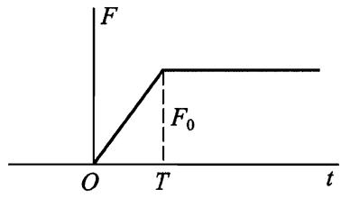
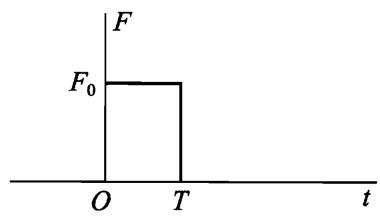
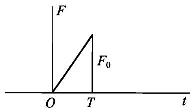
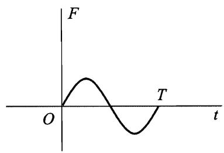

# 强迫振动

现在我们研究可变外力场作用下系统的振动，这种振动称为强迫振动，以区别于 §21 研究的自由振动。因为前面也假定是微振动，则意味着外力场很弱，否则它会引起过大的位移 $x$ 。

这种情况下，系统除了固有势能 (1/2) $kx^2$ 以外，还有与外力场作用相关的势能 $U_e(x,t)$ 。将这个附加势能展开为小量 $x$ 的幂级数，得：

$$U_e(x,t) \approx U_e(0,t) + x \left. \frac{\partial U_e}{\partial x} \right|_{x=0}$$

第一项只是时间的函数，可以从拉格朗日函数中略去 (作为另一个时间的函数对时间的全导数)。第二项中 $\partial U_e / \partial x$ 是外力，作用于处在平衡位置的系统上，是时间的给定函数，用 $F(t)$ 表示。于是势能中出现了一 $xF(t)$ 项，所以系统的拉格朗日函数为：

$$L = \frac{m \dot{x}^2}{2} - \frac{kx^2}{2} + x F(t) \tag{22.1}$$

相应的运动方程为：

$$m \ddot{x} + kx = F(t)$$

或者：

$$\ddot{x} + \omega^2 x = \frac{1}{m} F(t) \tag{22.2}$$

这里我们再次引入了自由振动频率 $\omega$。

众所周知，非齐次常系数线性微分方程的通解为两项之和： $x = x_0 + x_1$ ，其中 $x_0$ 是齐次方程的通解， $x_1$ 是非齐次方程的特解。在现在的情况下， $x_0$ 就是 §21 研究的自由振动。

我们来看一种特别有意义的情况，强迫力是频率为 $\gamma$ 的简单时间周期函数，即：

$$F(t) = f \cos(\gamma t + \beta) \tag{22.3}$$

我们寻找方程 (22.2) 形式为 $x_1 = b \cos(\gamma t + \beta)$ 的特解，它具有与强迫力同样的周期因子。代入方程可得： $b = f / [ m (\omega^2 - \gamma^2)]$ ，加上齐次方程的解，有下列形式的通解：

$$x = a \cos(\omega t + \alpha) + \frac{f}{m (\omega^2 - \gamma^2)} \cos(\gamma t + \beta) \tag{22.4}$$

任意积分常数 $a$ 和 $\alpha$ 由初始条件确定。

于是，在周期性强迫力作用下，系统的运动是两个振动的合成，两个振动的频率分别为系统的固有频率 $\omega$ 和强迫力的频率 $\gamma$ 。

解 (22.4) 不适用于所谓的共振情况，即强迫力的频率 $\gamma$ 与固有频率 $\omega$ 相等的情况。为了求这种情况下方程的通解，将 (22.4) 改写成如下形式：

$$x = a \cos(\omega t + \alpha) + \frac{f}{m (\omega^2 - \gamma^2)} [ \cos(\gamma t + \beta) - \cos(\omega t + \beta)]$$

其中常数 $a$ 现在有不同的值。当 $\gamma \to \omega$ 时，第二项变为 0/0 的不确定形式。按照洛必达法则消除不确定性可得：

$$x = a \cos(\omega t + \alpha) + \frac{f}{2m \omega} t \sin(\omega t + \beta) \tag{22.5}$$

于是，在共振情况下，振动的振幅随时间线性增大（直到不再是微振动，上述所有理论都不适用为止）。

我们再来研究共振附近的微振动的性质，即 $\gamma = \omega + \epsilon$ ，其中 $\epsilon$ 是小量。我们将通解写成复数形式：

$$x = A e^{i \omega t} + B e^{i (\omega + \epsilon) t} = (A + B e^{i \epsilon t}) e^{i \omega t} \tag{22.6}$$

因为 $A + B e^{i \epsilon t}$ 在因子 $e^{i \omega t}$ 的周期 $2 \pi / \omega$ 内变化很小，所以共振附近的运动可以看作是微振动，但振幅是变化的。

用 $C$ 表示振幅，有：

$$C = |A + B e^{i \epsilon t}|$$

将 $A$ 和 $B$ 分别表示为 $a e^{i \alpha}$ 和 $b e^{i \beta}$ ，可得：

$$C^2 = a^2 + b^2 + 2ab \cos (\epsilon t + \beta - \alpha) \tag{22.7}$$

于是，振幅以频率 $\epsilon$ 周期变化，其变化范围是：

$$|a - b| \leq C \leq a + b$$

这种现象称为拍。

对任意强迫力 $F(t)$ ，可以在一般形式下对方程 (22.2) 积分求解。这很容易做到，只要将方程重写为：

$$\frac{d}{dt} (\dot{x} + i \omega x) - i \omega (\dot{x} + i \omega x) = \frac{1}{m} F(t)$$

或者：

$$\frac{d \xi}{dt} - i \omega \xi = \frac{1}{m} F(t) \tag{22.8}$$

这里引入了复变量：

$$\xi = \dot{x} + i \omega x \tag{22.9}$$

方程 (22.8) 不是二阶，而是一阶微分方程。如果没有右边部分，它的解是 $\xi = A e^{i \omega t}$ ，其中 $A$ 是常数。如同前面一样，我们寻找非齐次方程形式为 $\xi = A(t) e^{i \omega t}$ 的解，对于函数 $A(t)$ 可得方程：

$$\dot{A}(t) = \frac{1}{m} F(t) e^{-i \omega t}$$

积分后，可得方程 (22.8) 的解：

$$\xi = e^{i \omega t} \left[ \int_{0}^{t} \frac{1}{m} F(t) e^{-i \omega t} dt + \xi_0 \right] \tag{22.10}$$

其中积分常数 $\xi_0$ 是 $t = 0$ 时 $\xi$ 的值。这就是需要寻找的通解，函数 $x(t)$ 由 (22.10) 的虚部除以 $\omega$ 给出。

系统做强迫振动时能量显然是不守恒的，因为系统靠外场源获得能量。假设初始能量为零，我们来求在外力作用时间内 (从 $-\infty$ 到 $+\infty$ ) 传递到系统的总能量。根据公式 (22.10)(积分下限用 $-\infty$ 代替零，并且 $\xi(-\infty)=0$ )，在 $t \to \infty$ 时有：

$$|\xi(\infty)|^2 = \frac{1}{m^2} \left| \int_{-\infty}^{\infty} F(t) e^{-i \omega t} dt \right|^2$$

另一方面，系统的能量表达式为：

$$E = \frac{m}{2} (\dot{x}^2 + \omega^2 x^2) = \frac{m}{2} |\xi|^2 \tag{22.11}$$

将 $|\xi(\infty)|^2$ 代入此式，可得所要求的转移能量：

$$E = \frac{1}{2m} \left| \int_{-\infty}^{\infty} F(t) e^{-i \omega t} dt \right|^2 \tag{22.12}$$

其值由力 $F(t)$ 的傅里叶分量模的平方所决定，该力的频率等于系统的固有频率。

特别地，如果外力作用的时间与 $1/\omega$ 相比很短，则可以令 $e^{-i \omega t} \approx 1$ 。于是有：

$$E = \frac{1}{2m} \left( \int_{-\infty}^{\infty} F(t) dt \right)^2$$

这个结果是显然的，它表明短时间的力给系统提供冲量 $\int F dt$ ，但来不及使系统产生显著的位移。

# 习 题

## 习题 1

如果初始时刻 $t=0$ 系统静止在平衡位置 $(x=\dot{x}=0)$ ，试求系统在下列几种形式的外力 $F(t)$ 作用下的强迫振动。

a) $F = \text{const} = F_0$ 。

**答**： $x = \frac{F_0}{m \omega^2} (1 - \cos \omega t)$ ，常力作用的结果是使振动所围绕的平衡位置产生位移。

b) $F = a t$ 。

**答**： $x = \frac{a}{m \omega^3} (\omega t - \sin \omega t)$ 。

c) $F = F_0 e^{-a t}$ 。

**答**： $x = \frac{F_0}{m (\omega^2 + a^2)} (e^{-a t} - \cos \omega t + \frac{a}{\omega} \sin \omega t)$ 。

d) $F = F_0 e^{-a t} \cos \beta t$ 。

**答**：

$$x = \frac{F_0}{m [(\omega^2 + a^2 - \beta^2)^2 + 4 a^2 \beta^2]} \left[ -(\omega^2 + a^2 - \beta^2) \cos \omega t + \frac{a}{\omega} (\omega^2 + a^2 + \beta^2) \sin \omega t + e^{-a t} [(\omega^2 + a^2 - \beta^2) \cos \beta t - 2 a \beta \sin \beta t] \right]$$

（在求解过程中将力写成复数形式 $F = F_0 e^{-(a + i \beta) t}$ 比较方便）。

## 习题 2

设直到 $t=0$ 时系统静止在平衡位置，力 $F$ 的变化规律为：当 $t<0$ 时 $F=0$ ，当 $0<t<T$ 时 $F=F_0 t / T$ ，当 $t>T$ 时 $F=F_0$ (图 24)。试求在该力作用后系统振动的最后振幅。

**解**：在时间间隔 $0<t<T$ 内满足初始条件的振动为：

$$x = \frac{F_0}{m T \omega^3} (\omega t - \sin \omega t)$$

当 $t>T$ 时我们求下面形式的解：

$$x = c_1 \cos [\omega (t - T)] + c_2 \sin [\omega (t - T)] + \frac{F_0}{m \omega^2}$$

由 $x$ 和 $\dot{x}$ 在 $t=T$ 处连续的条件，可求出：

$$c_1 = -\frac{F_0}{m T \omega^3} \sin \omega T, \quad c_2 = \frac{F_0}{m T \omega^3} (1 - \cos \omega T)$$

这样得振幅：

$$a = \sqrt{c_1^2 + c_2^2} = \frac{2 F_0}{m T \omega^3} \sin \frac{\omega T}{2}$$

可见，施加力 $F_0$ 越缓慢（即 $T$ 越大），这个振幅越小。

图 24

## 习题 3

同习题 2，力 $F_0$ 是常数，只在有限时间间隔 $T$ 内作用（图 25）。

**解**：可以像习题 2 那样求解，但利用公式 (22.10) 更简单。当 $t>T$ 时系统在平衡位置 $x=0$ 处自由振动，有：

$$\xi = \frac{F_0}{m} e^{i \omega t} \int_{0}^{T} e^{-i \omega t} dt = \frac{F_0}{i \omega m} (1 - e^{-i \omega T}) e^{i \omega t}$$

根据关系 $|\xi|^2 = a^2 \omega^2$ ， $\xi$ 的模的平方给出振幅。于是求得：

$$a = \frac{2 F_0}{m \omega^2} \sin \frac{\omega T}{2}$$

图 25

图 26

## 习题 4

同习题 2，但力在从零到 $T$ 时间间隔内按规律 $F = F_0 t / T$ 作用（图 26）。

**解**：用同样方法可求得：

$$a = \frac{F_0}{T m \omega^3} \sqrt{\omega^2 T^2 - 2 \omega T \sin \omega T + 2(1 - \cos \omega T)}$$

## 习题 5

同习题 2，但力在从零到 $T = 2 \pi / \omega$ 时间间隔内按规律 $F = F_0 \sin \omega t$ 作用（图 27）。

**解**：将：

$$F(t) = F_0 \sin \omega t = \frac{F_0}{2i} (e^{i \omega t} - e^{-i \omega t})$$

代入公式 (22.10) 并从零到 $T$ 积分，可得：

$$a = \frac{F_0 \pi}{m \omega^2}$$

图 27
