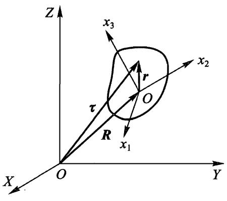

# $\S 31$ 角速度

在力学中刚体可以定义为质点间距离保持不变的质点组成的系统. 当然，自然界中实际存在的系统仅是近似地满足这个条件. 然而，在通常条件下，大部分固体的形状和尺寸变化很小，在研究它作为一个整体的运动规律时，完全可以不考虑这些变化.

为了推导方便，我们下面将刚体当作离散质点的集合. 然而，这与力学中将刚体通常当作连续体而不考虑内部结构的主张一点也不矛盾. 将当作离散质点系得到的公式转换为当作连续体的公式，只需将质点的质量换成体积微元 $\mathrm{d}V$ 包含的质量 $\rho \mathrm{d} V$ （其中 $\rho$ 是刚体的密度) 以及将求和换为对这个刚体的体积积分.

为了描述刚体的运动，我们引入两个坐标系：“固定”坐标系，即惯性坐标系 $X Y Z$，以及与刚体刚性固连并参与刚体全部运动的动坐标系 $x _ { 1 } = x , x _ { 2 } = y , x _ { 3 } = z$. 取刚体质心为动坐标系原点比较方便.

刚体相对固定坐标系的位置完全由动坐标系的位置确定. 设径矢 ${\pmb R}$ 表示动坐标系原点的位置（图 35）. 动坐标系的坐标轴相对固定坐标系的指向由 3 个独立的角确定，连同径矢 ${\pmb R}$ 的三个分量共有 6 个坐标. 因此，刚体是一个有 6 个自由度的力学系统.

图 35

我们研究刚体的无穷小位移，可以将其表示为两个位移之和. 其中一个是刚体的无穷小平移，使质心从初位置运动到末位置，但不改变动坐标系各轴的指向. 第二个是绕质心的无穷小转动，这样刚体的其余部分移动到末位置.

我们将刚体上任意点 $P$ 在动坐标系中的径矢用 $r$ 表示，而该点在固定坐标系中的径矢用 ${\pmb { \tau }}$ 表示. 那么 $P$ 点的无穷小位移 $\mathrm {d} {\pmb \tau}$ 等于质心位移 $\mathrm {d} {\pmb { R }}$ 与绕质心转动无穷小角度 $\mathrm {d} {\pmb { \varphi }}$ 产生的位移 $\mathrm {d} {\pmb{\varphi}} \times {\pmb{r}}$ 之和 (参见 (9.1))：

$$
\mathrm { d } {\pmb { \tau }} = \mathrm { d } {\pmb { R }} + \mathrm { d } {\pmb { \varphi }} \times {\pmb { r }} .
$$

将等式除以位移发生的时间 $\mathrm { d } t$，令①

$$
\frac { \mathrm { d } {\pmb { \tau }} } { \mathrm { d } t } = {\pmb { \ v }} \ , \quad \frac { \mathrm { d } {\pmb { R }} } { \mathrm { d } t } = {\pmb { V }} , \quad \frac { \mathrm { d } {\pmb { \varphi }} } { \mathrm { d } t } = {\pmb { \Omega }} ,
$$

可得关系

$$
{ \pmb v } = { \pmb V } + { \pmb \Omega } \times { \pmb r } .
$$

矢量 ${\pmb {V}}$ 是刚体质心的速度，也是刚体的平动速度. 矢量 $\pmb { \Omega }$ 称为刚体转动角速度，其方向 (也是 $\mathrm { d } \pmb { \varphi }$ 的方向) 与转动轴方向一致. 于是，刚体上任意点的速度（相对固定坐标系），可以用刚体平动速度和转动角速度表示.

需要着重指出，在推导公式 (31.2) 时并没有利用坐标原点位于质心这个事实. 在后面计算运动刚体动能时，这样选坐标原点的好处就变得一目了然了.

下面设与刚体固连的坐标系的原点不在质心 $O$，而在距离 $O$ 点为 $\pmb { a }$ 的 $O ^ { \prime }$ 点. 设坐标原点 $O ^ { \prime }$ 的平移速度为 $\mathbf { V } ^ { \prime }$，这个新坐标系的角速度为 $\pmb { \Omega } ^ { \prime }$

我们重新研究刚体上某点 $P$，用 $\boldsymbol { r ^ { \prime } }$ 表示其相对 $O ^ { \prime }$ 点的径矢. 因此有 $\boldsymbol { r } = \boldsymbol { r } ^ { \prime }$ $\textbf { + a }$，代入 (31.2) 得

$$
{ \pmb v } = { \pmb V } + { \pmb \Omega } \times { \pmb a } + { \pmb \Omega } \times { \pmb r } ^ { \prime } .
$$

另一方面，根据 $\mathbf { V } ^ { \prime }$ 和 $\pmb { \Omega } ^ { \prime }$ 的定义，应该有 ${\pmb { v }} = {\pmb { V }} ^ { \prime } + {\pmb { \Omega }} ^ { \prime } \times {\pmb { r }} ^ { \prime }$ . 所以我们可得如下结论：

$$
{\pmb { V }} ^ { \prime } = {\pmb { V }} + {\pmb { \Omega }} \times {\pmb { a }} , {\pmb { \Omega }} ^ { \prime } = {\pmb { \Omega }} .
$$

第二个等式非常重要. 我们可以看出，与刚体固连的坐标系在任意时刻的转动角速度与这个所选取的特定坐标系无关. 所有这样的坐标系均以角速度 ${\pmb { \Omega }}$ 旋转，它们大小相等，方向相互平行.这使我们有理由将 ${\pmb { \Omega }}$ 称为刚体的角速度. 而平动速度没有这样“绝对的”性质.

由 (31.3) 的第一个公式可知，如果在坐标原点 $O$ 的某种选择下 ${\pmb {V}}$ 与 ${\pmb { \Omega }}$ （在给定时刻) 相互垂直，则对于任意选择的原点 $\boldsymbol { O } ^ { \prime } , {\pmb {V}} ^ { \prime }$ 和 ${\pmb { \Omega }} ^ { \prime }$ 也是相互垂直的. 由 (31.2) 可知，这种情况下刚体中的所有点的速度 ${\pmb { V }}$ 都垂直于 ${\pmb { \Omega }}$ . 这时总可以选择坐标原点 $O ^ { \prime }$ 使速度 ${\pmb {V}} ^ { \prime } = 0$，刚体在那个特定瞬时的运动就是绕过 $O ^ { \prime }$ 的轴的纯转动.这个轴称为刚体瞬时转动轴②.

今后我们总是假设动坐标系原点选在刚体质心，因此转动轴也通过质心. 一般来说，当刚体运动时， ${\pmb { \Omega }}$ 的大小和方向也都会变化.

① 当然，它可以选在刚体之外.

② 在 ${\pmb {\Delta V}}$ 与 ${\pmb { \mathscr {L} }}$ 不垂直的一般情况下，可以选择坐标原点使 ${\pmb {\Delta V}}$ 与 ${\pmb { \mathscr {a} }}$ 平行，即运动（在给定时刻）是绕某个轴的转动与沿该轴的平动之和.

