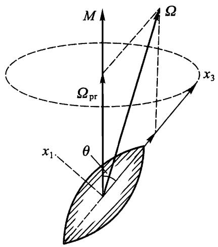

# $\S 33$ 刚体的角动量

我们知道，系统的角动量取决于它相对哪个点定义.在刚体力学中最合适选取的点是动坐标系的原点，即刚体的质心.以后我们将这样定义的角动量记为 $M$ .

根据公式 (9.6)，当选择刚体质心为坐标原点时， $M$ 就是“内禀”角动量，仅与刚体相对质心的运动有关.换句话说，在定义 $\begin{array} { r } { \pmb { M } = \sum m \pmb { r } \times \pmb { v } } \end{array}$ 中应该用 $\pmb { \Omega } \times \pmb { r }$ 代替 ${ \bf \Pi } _ { { \pmb v } }$

$$
\begin{array} { r } { \pmb { M } = \sum m \pmb { r } \times ( \pmb { \Omega } \times \pmb { r } ) = \sum m \left[ \boldsymbol { r } ^ { 2 } \pmb { \Omega } - \boldsymbol { r } \cdot ( \pmb { \Omega } \cdot \boldsymbol { r } ) \right] , } \end{array}
$$

或者用张量表示为

$$
\begin{array} { r } { M _ { \iota } = \sum m \left( \boldsymbol { x } _ { l } ^ { 2 } \boldsymbol { \Omega } _ { \iota } - \boldsymbol { x } _ { i } \boldsymbol { x } _ { k } \boldsymbol { \Omega } _ { k } \right) = \boldsymbol { \Omega } _ { k } \sum m \left( \boldsymbol { x } _ { l } ^ { 2 } \boldsymbol { \hat { \partial } } _ { \iota k } - \boldsymbol { x } _ { i } \boldsymbol { x } _ { k } \right) . } \end{array}
$$

最后,考虑到惯量张量定义 (32.2) 得

$$
\boldsymbol { M } _ { \iota } = \boldsymbol { I } _ { \iota } \Omega _ { k } .
$$

如果坐标轴 $x _ { 1 } , x _ { 2 } ^ { \prime } , x _ { 3 }$ 的方向沿着刚体惯量主轴，则公式 (33.1) 给出

$$
\begin{array} { r } { M _ { 1 } = I _ { 1 } \Omega _ { 1 } , \qquad M _ { 2 } = I _ { 2 } \Omega _ { 2 } , \qquad M _ { 3 } = I _ { 3 } \Omega _ { 3 } . } \end{array}
$$

对于球形陀螺的特殊情况，3 个主转动惯量都相等，有

$$
M = I { \pmb \Omega } ,
$$

即角动量矢量正比于角速度矢量，并且有相同的指向.

然而，对任意刚体，矢量 $M$ 一般不与矢量 $\pmb { \Omega }$ 方向相同，只有在刚体绕某个惯量主轴转动时， $M$ 和 $\pmb { \Omega }$ 方向才相同.

我们研究不受任何外力作用的自由刚体的运动.我们假定消除了不感兴趣的任何匀速平动，仅考虑刚体的自由转动.

像所有封闭系统一样，自由转动刚体的角动量是常量.对于球形陀螺， $M =$ const 导致 $\pmb { \Omega } = \mathrm { c o n s t }$ .这就是说，球形陀螺的最一般自由运动是绕空间固定轴的匀速转动.

转子的情况同样简单.这时也有 $M = I \pmb { \Omega }$ ,并且矢量 $\pmb { \Omega }$ 垂直于转子轴.所以，转子的自由转动是在一个平面内绕着垂直于该平面的轴匀速转动.

利用角动量守恆定律可以确定更复杂的对称陀螺的自由转动.

利用惯量主轴 $x _ { 1 } , x _ { 2 }$ 方向（垂直于陀螺对称轴 $x _ { 3 }$ ) 选择的任意性，我们选 $x _ { 2 }$ 垂直于矢量 $M$ 和 $x _ { 3 }$ 轴的瞬时位置确定的平面.那么 $M _ { 2 } = 0$ ，由公式 (33.2) 可知， $\varOmega _ { 2 } = 0$ .这就是说，在每个时刻 $M , \pmb { \Omega }$ 的方向和陀螺对称轴位于同一个平面（图 46).由此可得，在陀螺对称轴上所有点的速度 $\pmb { v }$ $= \pmb { \Omega } \times \pmb { r }$ ,在每个时刻都垂直于这个平面，换言之，陀螺轴绕 $M$ 的方向匀速（见下面) 转动，画出一个圆锥，这称为陀螺的规则进动）.同时，陀螺绕自身的轴匀速转动.

图 46

这两个转动的角速度可以容易地用给定的角动量 $M$ 以及陀螺轴与 $M$ 方向的夹角 $\theta$ 表示.陀螺绕自身轴的转动角速度就是矢量 $\pmb { \Omega }$ 在该轴上的投影 $\varOmega _ { 3 }$

$$
\Omega _ { 3 } = \frac { M _ { 3 } } { I _ { 3 } } = \frac { M } { I _ { 3 } } \mathrm { c o s } \theta .
$$

为了求进动角速度 $\varOmega _ { \mathrm { p r } }$ ，应该利用平行四边形法则将矢量 $\pmb { \Omega }$ 沿着 $x _ { 3 }$ 和 $M$ 方向分解.第一个分量不会使陀螺轴产生任何位移，第二个分量因而给出所要求的进动角速度.由图 46 可知， $\Omega _ { \mathrm { p r } } \sin \theta = \Omega _ { 1 }$ ,由于 $\Omega _ { 1 } = M _ { 1 } / I _ { 1 } = M \sin \theta / I _ { 1 }$ ，所以得

$$
\Omega _ { \mathrm { p r } } = M / I _ { 1 } .
$$
