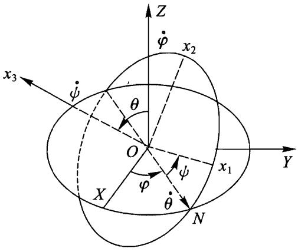

# 欧拉角

我们已经提到，描述刚体运动可以用质心的 3 个坐标和 3 个描述动坐标轴 $x _ { 1 } , x _ { 2 } , x _ { 3 }$ 相对固定坐标轴 $X , Y , Z$ 取向的角度.这些角常常可以方便地取为所谓的欧拉角.

因为我们现在只对坐标轴之间的夹角感兴趣，可以选择同一个点为两个坐标系的原点 (图 47).动坐标系的平面 $x _ { 1 } x _ { 2 }$ 与固定平面 $X Y$ 相交于某一直线（在图 47 上的 $O N$ )，该直线称为节线.节线显然垂直于 $Z$ 轴和 $x _ { 3 }$ 轴，我们选择矢量积 ${ \pmb z } \times { \pmb x } _ { 3 }$ 的方向为节线正方向 (其中 $z , x _ { 3 }$ 分别是坐标轴 $Z , x _ { 3 }$ 方向的单位矢量）.

我们用下面 3 个角确定动坐标轴 $x _ { 1 }$ $x _ { 2 } , x _ { 3 }$ 相对固定坐标轴 $X , Y , Z$ 的位置： $Z$ 轴和 $x _ { 3 }$ 轴之间的夹角 $\theta , X$ 轴和 ON 轴之间的夹角 $\varphi , O N$ 轴和 $x _ { 1 }$ 轴之间的夹角 $\psi$ .按螺旋法则确定的方向分别绕 $Z$ 和 $x _ { 3 }$ 轴转动来计算角 $\varphi$ 和 $\psi$ .角 $\theta$ 取值范围是从零到 $\pi$ ,而角 $\varphi$ 和 $\psi$ 的取值范围是从零到 $2 \pi$ ①.

下面我们用欧拉角及其导数表示角速度矢量 ${\pmb { \Omega }}$ 在动坐标轴 $x _ { 1 } , x _ { 2 } , x _ { 3 }$ 上的分量.为此需要将角速度 $\dot { \theta } , \dot { \varphi } , \dot { \psi }$ 向这些轴投影.角速度 $\dot { \theta }$ 的方向沿着节线 $O N$ ,它沿着 $x _ { 1 } , x _ { 2 } , x _ { 3 }$ 的分量等于

图 47

$$
\begin{array} { r } { \dot { \theta } _ { 1 } = \dot { \theta } \cos \phi , \qquad \dot { \theta } _ { 2 } = - \dot { \theta } \sin \phi , \quad \dot { \theta } _ { 3 } = 0 . } \end{array}
$$

角速度 $\dot { \varphi }$ 的方向沿着 $Z$ 轴，它沿着 $x _ { 3 }$ 的分量等于 $\dot { \varphi } _ { 3 } = \dot { \varphi } \cos \theta$ ,而在平面 $x _ { 1 } x _ { 2 }$ 上的投影等於 $\dot { \varphi } \mathrm { s i n } \theta$ .将后者再分解到 $x _ { 1 }$ 和 $x _ { 2 }$ 轴,可得

$$
\dot { \varphi } _ { 1 } = \dot { \varphi } \mathrm { s i n } \theta \mathrm { s i n } \psi , \quad \dot { \varphi } _ { 2 } = \dot { \varphi } \mathrm { s i n } \theta \mathrm { c o s } \psi .
$$

最后，角速度 $\dot { \psi }$ 的方向沿着 $x _ { 3 }$ 轴.

汇集这些沿着每个轴的分量，最终得

$$
\begin{array} { r l } & { \Omega _ { 1 } = \dot { \varphi } \mathrm { s i n } \theta \mathrm { s i n } \psi + \dot { \theta } \mathrm { c o s } \psi , } \\ & { } \\ & { \Omega _ { 2 } = \dot { \varphi } \mathrm { s i n } \theta \mathrm { c o s } \psi - \dot { \theta } \mathrm { s i n } \psi , } \\ & { } \\ & { \Omega _ { 3 } = \dot { \varphi } \mathrm { c o s } \theta + \dot { \psi } . } \end{array}
$$

如果选择刚体的惯量主轴为坐标轴 $x _ { 1 } , x _ { 2 } , x _ { 3 }$ ,则将 (35.1) 代入 (32.8),可得用欧拉角表示的转动动能.

对于对称陀螺， $I _ { 1 } = I _ { 2 } { \neq } I _ { 3 }$ ，经过简单推导可得

$$
T _ { \mathrm { r o t } } = { \frac { I _ { 1 } } { 2 } } ( { \dot { \varphi } } ^ { 2 } { \sin } ^ { 2 } \theta + { \dot { \theta } } ^ { 2 } ) + { \frac { I _ { 3 } } { 2 } } ( { \dot { \varphi } } { \cos } \theta + { \dot { \psi } } ) ^ { 2 } .
$$

应该指出，利用对称陀螺惯量主轴 $x _ { 1 } , x _ { 2 }$ 方向选择的任意性，也可以更简单地得到这些表达式.如果认为 $x _ { 1 }$ 轴沿着节线 $O N$ ,即 $\psi = 0$ ,可得角速度分量的简单表达式

$$
\begin{array} { r } { \Omega _ { 1 } = \dot { \theta } , \qquad \Omega _ { 2 } = \dot { \varphi } \mathrm { s i n } \theta , \qquad \Omega _ { 3 } = \dot { \varphi } \mathrm { c o s } \theta + \dot { \psi } . } \end{array}
$$

作为应用欧拉角的一个简单的例子，我们研究对称陀螺的自由运动，这在 $\ S \ 3 3$ 已经求出.

我们取固定坐标系的 $Z$ 轴沿着陀螺的定常角动量 $\pmb { M }$ 的方向，取动坐标系的 $x _ { 3 }$ 轴沿着陀螺对称轴，而 $x _ { 1 }$ 轴在给定时刻与节线重合.利用公式 (35.3) 可得矢量 $M$ 的分量

$M _ { 1 } = I _ { 1 } \Omega _ { 1 } = I _ { 1 } { \dot { \theta } } , M _ { 2 } = I _ { 2 } \Omega _ { 2 } = I _ { 2 } { \dot { \varphi } } { \sin } \theta , M _ { 3 } = I _ { 3 } \Omega _ { 3 } = I _ { 3 } ( \dot { \varphi } \mathrm { c o s } \theta + \dot { \psi } ) .$ 另一方面，因为 $x _ { 1 }$ 轴（节线）垂直于 $Z$ 轴，我们有

$$
M _ { 1 } = 0 , \qquad M _ { 2 } = M \sin \theta , \qquad M _ { 3 } = M \cos \theta .
$$

比较这些等式可得下面方程：

$$
\dot { \theta } = 0 , \quad I _ { 1 } \dot { \varphi } = M , \quad I _ { 3 } ( \dot { \varphi } \mathrm { c o s } \theta + \dot { \phi } ) = M \mathrm { c o s } \theta .
$$

第一个方程给出 $\theta = \mathrm { c o n s t }$ ,即陀螺轴与 $M$ 方向的夹角为常数.第二个方程确定进动角速度 (与 (33.5) 一致) $\dot { \varphi } = M / I _ { 1 }$ .最后，第三个方程确定陀螺绕自身轴转动的角速度 $\Omega _ { 3 } = M \mathrm { c o s } \theta / I _ { 3 }$ .
