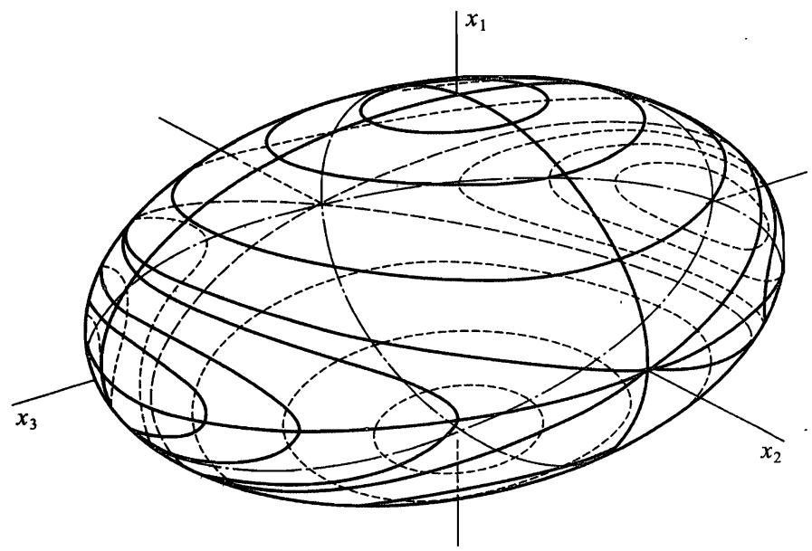

# $\S 3 7$ 非对称陀螺

我们利用欧拉方程研究更复杂的问题，即研究 3 个主转动惯量各不相等的非对称陀螺的自由转动.为确定起见，假定

$$
I _ { 3 } > I _ { 2 } > I _ { 1 } .
$$

我们早就知道欧拉方程的两个积分，分别由能量守恒定律和角动量守恆定律给出

$$
\begin{array} { r } { I _ { 1 } \Omega _ { 1 } ^ { 2 } + I _ { 2 } \Omega _ { 2 } ^ { 2 } + I _ { 3 } \Omega _ { 3 } ^ { 2 } = 2 E , } \\ { I _ { 1 } ^ { 2 } \Omega _ { 1 } ^ { 2 } + I _ { 2 } ^ { 2 } \Omega _ { 2 } ^ { 2 } + I _ { 3 } ^ { 2 } \Omega _ { 3 } ^ { 2 } = M ^ { 2 } , } \end{array}
$$

其中能量 $E$ 和角动量的大小 $M$ 是给定常数.这两个等式可以用 $M$ 的分量表示为

$$
\frac { M _ { 1 } ^ { 2 } } { I _ { 1 } } + \frac { M _ { 2 } ^ { 2 } } { I _ { 2 } } + \frac { M _ { 3 } ^ { 2 } } { I _ { 3 } } = 2 E ,
$$

$$
M _ { 1 } ^ { 2 } + M _ { 2 } ^ { 2 } + M _ { 3 } ^ { 2 } = M ^ { 2 } .
$$

由这些方程可以得出陀螺运动的一些特性.为此我们注意到，在以 $M _ { 1 }$ ,$M _ { 2 } , M _ { 3 }$ 为轴的坐标系中，方程 (37.3) 和 (37.4) 分别是半轴为

$$
\sqrt { 2 E I _ { 1 } } , ~ \sqrt { 2 E I _ { 2 } } , ~ \sqrt { 2 E I _ { 3 } }
$$

图 51

的椭球面方程和半径为 $M$ 的球面方程.当矢量 $M$ 相对陀螺的惯量轴移动时，其端点沿着这两个曲面的交线运动.图 51 中画出了椭球与不同半径的球面的一系列这样的交线.交线存在的条件由显然成立的不等式给出

$$
2 E I _ { 1 } < M ^ { 2 } < 2 E I _ { 3 } ,
$$

它表示球 (37.4) 的半径介于椭球 (37.3) 的长半轴和短半轴之间.

我们研究 (给定能量 $E$ 时） $M$ 的变化引起矢量 $M$ 端点 $\textcircled{1}$ 的轨迹性质的变化.当 $M ^ { 2 }$ 略大於 $2 E I _ { 1 }$ 时，球和椭球相交于椭球极点附近围绕 $x _ { 1 }$ 轴的两条很小的封闭曲线.当 $M ^ { 2 } {  } 2 E I _ { 1 }$ 时，两条曲线分别收缩到极点.随着 $M ^ { 2 }$ 继续增大曲线扩大，当 $M ^ { 2 } = 2 E I _ { 2 }$ 时，曲线变成两条平面曲线 (椭圆），并相交于椭球在 $x _ { 2 }$ 轴上的极点. $M ^ { 2 }$ 再继续增大，两条分离的封闭曲线重现，但这次是围绕 $x _ { 3 }$ 轴上的极点.当 $M ^ { 2 } {  } 2 E I _ { 3 }$ 时，这两条曲线收缩到两个极点.

首先应该指出，轨迹的封闭性意味着矢量 $M$ 相对陀螺的运动是周期性的，在一个周期内矢量 $M$ 画出某条圆锥曲线并回到原来位置.

其次，应该注意到，在椭球不同极点附近的轨迹的性质有本质的差别.在 $x _ { 1 }$ 轴和 $x _ { 3 }$ 轴附近，轨迹完全位于相应的极点周围，但是，通过 $x _ { 2 }$ 轴上的极点附近的轨迹将远离这些极点.这种差别相应于陀螺绕 3 个惯量主轴转动有不同的稳定性.绕 $x _ { 1 }$ 轴和 $x _ { 3 }$ 轴（相应于陀螺 3 个转动惯量中的最小值和最大值）的转动是稳定的，即如果使陀螺偏离这些状态很小时，陀螺将继续在初始状态附近运动.然而，绕 $x _ { 2 }$ 轴的转动是不稳定的，即任意小的偏离都足以引起陀螺远离其初始位置的运动.

为了确定 $\pmb { \Omega }$ 的分量 (或者正比于它们的 $M$ 的分量) 对时间的依赖关系，我们利用欧拉方程 (36.5).利用方程 (37.2) 将 $\varOmega _ { 1 }$ 和 $\varOmega _ { 3 }$ 用 $\Omega _ { 2 }$ 表示：

$$
\Omega _ { 1 } ^ { 2 } = \frac { 1 } { I _ { 1 } ( I _ { 3 } - I _ { 1 } ) } [ \left( 2 E I _ { 3 } - M ^ { 2 } \right) - I _ { 2 } ( I _ { 3 } - I _ { 2 } ) \Omega _ { 2 } ^ { 2 } ] ,
$$

$$
\Omega _ { 3 } ^ { 2 } = \frac { 1 } { I _ { 3 } ( I _ { 3 } - I _ { 1 } ) } [ ( M ^ { 2 } - 2 E I _ { 1 } ) - I _ { 2 } ( I _ { 2 } - I _ { 1 } ) \Omega _ { 2 } ^ { 2 } ] ,
$$

并代入 (36.5) 的第二个方程，得

$$
\frac { \mathrm { d } \Omega _ { 2 } } { \mathrm { d } t } = \frac { I _ { 3 } - I _ { 1 } } { I _ { 2 } } \Omega _ { 1 } \Omega _ { 3 } = \frac { 1 } { I _ { 2 } \sqrt { I _ { 1 } I _ { 3 } } } \{ \left[ 2 E I _ { 3 } - M ^ { 2 } \right) -
$$

$$
I _ { 2 } ( I _ { 3 } - I _ { 2 } ) \varOmega _ { 2 } ^ { 2 } ] \bigl [ \left( M ^ { 2 } - 2 E I _ { 1 } \right) - I _ { 2 } ( I _ { 2 } - I _ { 1 } ) \varOmega _ { 2 } ^ { 2 } \bigr ] \bigr \} ^ { 1 / 2 } .
$$

将这个方程分离变量并积分，得到用椭圆积分表示的函数 $t \left( \varOmega _ { 2 } \right)$ .在化为标准形式时，为确定起见我们假设

$$
M ^ { 2 } > 2 E I _ { 2 }
$$

如果不等式反向，在下面的所有公式中对调下标 1 和 3.我们用下列新变量替换 $t$ 和 $\boldsymbol { \varOmega } _ { 2 }$

$$
\tau = t \sqrt { \frac { ( I _ { 3 } - I _ { 2 } ) ( M ^ { 2 } - 2 E I _ { 1 } ) } { I _ { 1 } I _ { 2 } I _ { 3 } } } , \quad s = \Omega _ { 2 } \sqrt { \frac { I _ { 2 } ( I _ { 3 } - I _ { 2 } ) } { 2 E I _ { 3 } - M ^ { 2 } } } ,
$$

并引进正参数 $k ^ { 2 } < 1$ 如下：

$$
k ^ { 2 } = \frac { \big ( I _ { 2 } - I _ { 1 } \big ) \big ( 2 E I _ { 3 } - M ^ { 2 } \big ) } { \big ( I _ { 3 } - I _ { 2 } \big ) \big ( M ^ { 2 } - 2 E I _ { 1 } \big ) } .
$$

于是有

$$
\tau = \int _ { 0 } ^ { s } \frac { \mathrm { d } s } { \sqrt { ( 1 - s ^ { 2 } ) ( 1 - k ^ { 2 } s ^ { 2 } ) } }
$$

（选择时间起始点为 $\varOmega _ { 2 } = 0$ 时刻）.反解这个积分可得雅可比椭圆函数

$$
s = \mathsf { s n } \tau ,
$$

由此函数给出 $\boldsymbol { \Omega } _ { 2 }$ 对时间的依赖关系.根据等式 (37.6),函数 $\Omega _ { 1 } ( t )$ 和 $\varOmega _ { 3 } ( t )$ 可由 $\Omega _ { 2 } ( t )$ 的代数函数给出.考虑到另外两个椭圆函数的定义

$$
\mathtt { c n } \tau = \sqrt { 1 - \mathrm { s n } ^ { 2 } \tau } , \quad \mathtt { d n } \tau = \sqrt { 1 - k ^ { 2 } \mathrm { s n } ^ { 2 } \tau } ,
$$

最后可得下面公式：

$$
\begin{array} { r } { \Omega _ { 1 } = \sqrt { \displaystyle \frac { 2 E I _ { 3 } - M ^ { 2 } } { I _ { 1 } ( I _ { 3 } - I _ { 1 } ) } } \mathrm { c n } \tau , } \\ { \Omega _ { 2 } = \sqrt { \displaystyle \frac { 2 E I _ { 3 } - M ^ { 2 } } { I _ { 2 } ( I _ { 3 } - I _ { 2 } ) } } \mathrm { s n } \tau , } \\ { \Omega _ { 3 } = \sqrt { \displaystyle \frac { M ^ { 2 } - 2 E I _ { 1 } } { I _ { 3 } ( I _ { 3 } - I _ { 1 } ) } } \mathrm { d n } \tau . } \end{array}
$$

函数 (37.10) 是周期的,对变量 $\tau$ 的周期为 $4 K$ ,其中 $K$ 是第一类完全椭圆积分：

$$
K = \int _ { 0 } ^ { 1 } { \frac { \mathrm { d } s } { \sqrt { ( 1 - s ^ { 2 } ) ( 1 - k ^ { 2 } s ^ { 2 } ) } } } = \int _ { 0 } ^ { \pi / 2 } { \frac { \mathrm { d } u } { \sqrt { 1 - k ^ { 2 } \sin ^ { 2 } u } } } .
$$

因而对时间 $t$ 的周期为

$$
T = 4 K \sqrt { \frac { I _ { 1 } I _ { 2 } I _ { 3 } } { ( I _ { 3 } - I _ { 2 } ) ( M ^ { 2 } - 2 E I _ { 1 } ) } } .
$$

经过这段时间 $T$ 之后，相对于陀螺的轴而言，矢量 $\pmb { \Omega }$ 回到原位置.然而相对固定坐标系，陀螺自身并不会回到原位置，见下文.

当 $I _ { 1 } = I _ { 2 }$ 时，公式 (37.10) 当然退化为 $\ S 3 6$ 得到的对称陀螺的公式.事实上，当 $I _ { 1 } {  } I _ { 2 }$ 时，参数 $k ^ { 2 } {  } 0$ ，椭圆函数退化为三角函数

$$
\sin \tau {  } \sin \tau , ~ \cos \tau {  } \cos \tau , ~ \sin \tau {  } 1 ,
$$

于是公式 (37.10) 就变回到公式 (36.7).

当 $M ^ { 2 } = 2 E I _ { 3 }$ 时有： $\Omega _ { 1 } = \Omega _ { 2 } = 0 , \Omega _ { 3 } = \mathrm { c o n s t }$ ，即矢量 $\pmb { \Omega }$ 方向总是沿着对称轴 $x _ { 3 }$ ,这相应于陀螺绕 $x _ { 3 }$ 轴匀速转动.类似地，当 $M ^ { 2 } = 2 E I _ { 1 }$ 时（这时 $\scriptstyle \tau \equiv 0 .$ ),陀螺绕 $x _ { 1 }$ 轴匀速转动.

下面我们研究陀螺在空间中的绝对运动，即相对于固定坐标系 $X , Y , Z$ 的运动.为此我们利用陀螺轴 $x _ { 1 } , x _ { 2 } , x _ { 3 }$ 和坐标轴 $X , Y , Z$ 之间的欧拉角 $\psi , \varphi , \theta ,$ 并选取固定的 $Z$ 轴沿着常矢量 $M$ 的方向.由于方向 $Z$ 相对 $x _ { 1 } , x _ { 2 } , x _ { 3 }$ 轴的极角和方位角分别等于 $\theta$ 和 $\pi / 2 - \phi$ （参见 $\ S 3 5$ 中的脚注)，则取矢量 $\pmb { M }$ 沿 $x _ { 1 } , x _ { 2 } , x _ { 3 }$

轴的分量可得

$$
M \mathrm { s i n } \theta \mathrm { s i n } \psi = M _ { 1 } = I _ { 1 } \Omega _ { 1 } ,
$$

$$
M \mathrm { s i n } \theta \mathrm { c o s } \phi = M _ { 2 } = I _ { 2 } \Omega _ { 2 } ,
$$

$$
M \mathrm { c o s } \theta = M _ { 3 } = I _ { 3 } \Omega _ { 3 } .
$$

由此得

$$
\mathrm { c o s } \theta = \frac { I _ { 3 } \Omega _ { 3 } } { M } , \quad \mathrm { t a n } \psi = \frac { I _ { 1 } \Omega _ { 1 } } { I _ { 2 } \Omega _ { 2 } } ,
$$

利用公式 (37.10) 得

$$
\mathrm { c o s } \theta = \sqrt { \frac { I _ { 3 } ( M ^ { 2 } - 2 E I _ { 1 } ) } { M ^ { 2 } ( I _ { 3 } - I _ { 1 } ) } } \mathrm { d n } \tau ,
$$

$$
{ \tan \psi } = \sqrt { \frac { I _ { 1 } ( I _ { 3 } - I _ { 2 } ) } { I _ { 2 } ( I _ { 3 } - I _ { 1 } ) } } \ \frac { \mathrm { c n } \tau } { \mathrm { s n } \tau } ,
$$

由此获得角 $\theta$ 和 $\psi$ 对时间的依赖关系，与矢量 $\pmb { \mathscr { L } }$ 的分量一样，它们是时间的周期为 (37.12) 的周期函数.

在公式 (37.13) 中没有角 $\varphi$ ,为了计算这个角，需要利用公式 (35.1),该公式用欧拉角对时间的导数表示 $\pmb { \Omega }$ 的分量.从等式

$$
\begin{array} { r } { \Omega _ { 1 } = \dot { \varphi } \mathrm { s i n } \theta \mathrm { s i n } \phi + \dot { \theta } \mathrm { c o s } \psi , } \\ { \Omega _ { 2 } = \dot { \varphi } \mathrm { s i n } \theta \mathrm { c o s } \psi - \dot { \theta } \mathrm { s i n } \psi , } \end{array}
$$

消去 $\dot { \theta }$ ,可得

$$
\dot { \varphi } = \frac { \Omega _ { 1 } \mathrm { s i n } \psi + \Omega _ { 2 } \mathrm { c o s } \psi } { \mathrm { s i n } \theta } ,
$$

然后利用公式 (37.13),可得

$$
\frac { \mathrm { d } \varphi } { \mathrm { d } t } = M \frac { I _ { 1 } \Omega _ { 1 } ^ { 2 } + I _ { 2 } \Omega _ { 2 } ^ { 2 } } { I _ { 1 } ^ { 2 } \Omega _ { 1 } ^ { 2 } + I _ { 2 } ^ { 2 } \Omega _ { 2 } ^ { 2 } } .
$$

由此可通过积分来确定函数 $\varphi ( t )$ ，但被积表达式以复杂的方式涉及椭圆函数.经过一系列复杂的变换，可以将这个积分表示为 $\Theta ^ { - }$ 函数，我们这里不进行具体计算仅给出最后结果. $\textcircled{1}$

函数 $\varphi ( \iota )$ (除了任意的可加常数外) 可以写成下面两项之和

$$
\varphi ( t ) = \varphi _ { 1 } ( t ) + \varphi _ { 2 } ( t ) ,
$$

$\varphi _ { 1 } ( t )$ 由下式给出：

$$
\mathrm { e } ^ { 2 \mathrm { i } \varphi _ { 1 } ( t ) } = { \frac { \vartheta _ { 0 1 } \big ( 2 t / T - \mathrm { i } \alpha \big ) } { \vartheta _ { 0 1 } \big ( 2 t / T + \mathrm { i } \alpha \big ) } } ,
$$

其中 $\vartheta _ { 0 1 }$ 是 $\Theta ^ { - }$ 函数， $\alpha$ 是实常数，并由下式确定：

$$
\mathrm { s n } ( \mathrm { i } \cdot 2 \alpha K ) = \mathrm { i } \sqrt { \frac { I _ { 3 } ( M ^ { 2 } - 2 E I _ { 1 } ) } { I _ { 1 } ( 2 E I _ { 3 } - M ^ { 2 } ) } }
$$

$K$ 和 $T$ 由公式 (37.11) 和 (37.12) 给出）.(37.18) 右端是周期为 $T / 2$ 的周期函数，因此 $\varphi _ { 1 } ( \boldsymbol { t } )$ 在时间 $T$ 内变化 $2 \pi$ .(37.17) 中的 $\varphi _ { 2 } ( t )$ 由下面公式给出：

$$
\varphi _ { 2 } ( t ) = 2 \pi \frac { t } { T ^ { \prime } } , \frac { 1 } { T ^ { \prime } } { = } \frac { M } { 2 \pi I _ { 1 } } - \frac { \mathrm { i } } { \pi T } \frac { \vartheta _ { 0 1 } ^ { \prime } ( \mathrm { i } \alpha ) } { \vartheta _ { 0 1 } ( \mathrm { i } \alpha ) } .
$$

这个函数在时间 $T ^ { \prime }$ 內增加 $2 \pi$ .

可见， $\varphi$ 是两个周期函数之和，并且一个的周期 $( T )$ 与角 $\psi$ 和 $\theta$ 的变化周期相同,另一个的周期 $( T ^ { \prime } )$ 与前一个是无公度的.这种无公度性导致陀螺永远不可能精确地回到它的初始位置.
