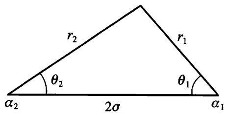

# 分离变量

在一些重要的情况下，哈密顿一雅可比方程的全积分可以通过分离变量的方法求得，该方法的实质如下.

假设某一个坐标，例如用 $q _ { 1 }$ 表示，与相应的导数 $\partial S / \partial { { q } _ { 1 } }$ ,在哈密顿－雅可比方程中仅以某种组合 $\varphi ( q _ { 1 } , \partial S / \partial q _ { 1 } )$ 的方式出现，该组合中不包含其它坐标，时间及其导数，即方程的形式为

$$
\Phi \left\{ q _ { i } , t , \frac { \partial S } { \partial q _ { i } } , \frac { \partial S } { \partial t } , \phi \left( q _ { 1 } , \frac { \partial S } { \partial q _ { 1 } } \right) \right\} = 0 ,
$$

其中 $q _ { \imath }$ 表示除了 $q _ { 1 }$ 之外的所有坐标.

我们寻找以下和形式的解：

$$
S = S ^ { ' } ( q _ { \imath } , t ) + S _ { 1 } ( q _ { 1 } ) .
$$

将这个表达式代入 (48.1)，可得

$$
\Phi \left\{ q _ { i } , t , \frac { \partial S ^ { \prime } } { \partial q _ { \iota } } , \frac { \partial S ^ { \prime } } { \partial t } , \varphi \left( q _ { 1 } , \frac { \partial S _ { 1 } } { \partial q _ { 1 } } \right) \right\} = 0 .
$$

假设解 (48.2) 已经得到，那么代入 (48.3) 后应该使该方程成为恒等式，而这个恒等式 (特别是) 对于坐标 $q _ { 1 }$ 的任意值都成立.在 $q _ { 1 }$ 改变时只有函数 $\varphi$ 发生变化，所以 (48.3) 是恒等式要求 $\varphi$ 是常数.于是，方程 (48.3) 分成两个方程：

$$
\varphi \left( q _ { 1 } , { \frac { \partial S _ { 1 } } { \partial q _ { 1 } } } \right) = \alpha _ { 1 } ,
$$

$$
\Phi \left\{ q_ { l } , t , \frac { \partial S ^ { \prime } } { \partial q _ { l } } , \frac { \partial S ^ { \prime } } { \partial t } , \alpha _ { 1 } \right\} = 0 .
$$

其中 $\alpha _ { 1 }$ 是任意常数.上面第一个是常微分方程，由此方程通过简单的积分可以求出函数 $S _ { 1 } ( q _ { 1 } )$ .还剩下偏微分方程 (48.5)，但是它的独立变量数目减少了.

如果用这样的方法可以相继地分离所有 $s$ 个坐标和时间，则求哈密顿－雅可比方程的全积分就约化为求积分了.对于保守系统实际上只需要分离方程 (47.6) 中的 $s$ 个变量（坐标），在完全分离的情况下，方程的全积分写成

$$
S = \sum _ { k } S _ { k } ( q _ { k } ; \alpha _ { 1 } , \cdots , \alpha _ { s } ) - E ( \alpha _ { 1 } , \cdots , \alpha _ { s } ) t ,
$$

其中每个 $S _ { k }$ 都只是一个坐标的函数，而能量 $E$ 是任意常数 $\alpha _ { 1 } , \cdots , \alpha _ { s }$ 的函数，可以通过将 $S _ { 0 } = \Sigma S _ { k }$ 代入方程 (47.6) 求得.

一个特殊情况是循环变量的分离.循环坐标 $q _ { 1 }$ 不显含于哈密顿函数，所以也不显含于哈密顿一雅可比方程中.此时函数 $\varphi \big ( q _ { 1 } , \partial S / \partial q _ { 1 } \big )$ 约化为 $\partial S / \partial _ { q _ { 1 } }$ ,由方程 (48.4) 可求得 $S _ { 1 } = \alpha _ { 1 } q _ { 1 }$ ,因此

$$
S = S ^ { ' } ( q _ { \iota } , t ) + \alpha _ { 1 } q _ { 1 } .
$$

常数 $\alpha _ { 1 }$ 正是相应于循环坐标的常值动量 $\rho _ { 1 } = \partial S / \partial { q } _ { 1 }$ .对于一个保守系统而言，$- \ E t$ 这一项中出现时间 $t$ 相应于对“循环变量” $t$ 的分离.

由此可见，在哈密顿－雅可比方程中分离变量的方法，包括了所有以前研究过的基于循环坐标简化运动方程积分的情况.现在还可以补充一些坐标为非循环坐标，但仍可能分离变量的情况.这一切都表明，哈密顿－雅可比方法是求运动方程通积分的最有力的方法.

为了在哈密顿－雅可比方程中分离变量，适当选择坐标非常关键.我们来看几个在不同坐标下分离变量的例子，它们与质点在各种外场中运动的问题相关，可能具有物理意义.

1．球坐标.用坐标 $( r , \theta , \varphi )$ 写出的哈密顿函数

$$
H = \frac { 1 } { 2 m } \left( \ p _ { r } ^ { 2 } + \frac { \phi _ { \theta } ^ { 2 } } { r ^ { 2 } } + \frac { p _ { \varphi } ^ { 2 } } { r ^ { 2 } \sin ^ { 2 } \theta } \right) + U ( r , \theta , \varphi ) ,
$$

如果

$$
U = a \left( r \right) + \frac { b \left( \theta \right) } { r ^ { 2 } } + \frac { c \left( \varphi \right) } { r ^ { 2 } \sin ^ { 2 } \theta } ,
$$

其中 $a \left( r \right) , b \left( \theta \right) , c \left( \varphi \right)$ 是任意函数，则分离变量是可能的.此式最后一项未必有物理意义，因此，我们取下列形式的场

$$
U = \alpha \left( r \right) + \frac { b \left( \theta \right) } { r ^ { 2 } } .
$$

在这种情况下对于函数 $S _ { 0 }$ 的哈密顿－雅可比方程为

$$
\frac { 1 } { 2 m } \bigg ( \frac { \partial S _ { 0 } } { \partial r } \bigg ) ^ { 2 } + \alpha \left( r \right) + \frac { 1 } { 2 m r ^ { 2 } } \bigg [ \bigg ( \frac { \partial S _ { 0 } } { \partial \theta } \bigg ) ^ { 2 } + 2 m b \left( \theta \right) \bigg ] + \frac { 1 } { 2 m r ^ { 2 } \mathrm { s i n } ^ { 2 } \theta } \bigg ( \frac { \partial S _ { 0 } } { \partial \varphi } \bigg ) ^ { 2 } = E .
$$

考虑到 $\varphi$ 是循环坐标，求以下形式的解

$$
S _ { 0 } = { p _ { \varphi } } \varphi + { S _ { 1 } } ( \boldsymbol { r } ) + { S _ { 2 } } ( \theta ) ,
$$

对于函数 $S _ { 1 } ( r )$ 和 $S _ { 2 } ( \theta )$ 有方程

$$
\left( \frac { \mathrm { d } S _ { 2 } } { \mathrm { d } \theta } \right) ^ { 2 } + 2 m b \left( \theta \right) + \frac { p _ { \varphi } ^ { 2 } } { \mathrm { s i n } ^ { 2 } \theta } = \beta ,
$$

$$
\frac { 1 } { 2 m } \bigg ( \frac { \mathrm { d } S _ { 1 } } { \mathrm { d } r } \bigg ) ^ { 2 } + \alpha \left( r \right) + \frac { \beta } { 2 m r ^ { 2 } } = E .
$$

积分可得

$$
S = - \ E t + \ p _ { \varphi } \varphi + \int \sqrt { \beta - 2 m b \left( \theta \right) - \frac { \ p _ { \varphi } ^ { 2 } } { \ \sin ^ { 2 } \theta } } \mathrm { d } \theta + \int \sqrt { 2 m \left[ { E - a \left( r \right) } \right] - \frac { \beta } { r ^ { 2 } } } \mathrm { d } \theta
$$

$p _ { \varphi } , \mathbf { \beta } , E$ 是任意积分常数，将上式对这 3 个任意常数求导并使之等于新常数，即可给出运动方程的通解.

# 2．抛物线坐标

从柱坐标 (用 $\rho , \varphi , z$ 表示）到抛物线坐标 $\xi , \eta , \varphi$ 的变换公式为

$$
z = \frac { 1 } { 2 } ( \xi - \eta ) , \quad \rho = \sqrt { \xi \eta } .
$$

坐标 $\xi$ 和 $\eta$ 取值范围是从零到 $\infty$ ，容易证实， $\xi$ 和 $\eta$ 为常数的曲面是两族旋转抛物面 (以 $\mathfrak { z }$ 轴为对称轴）.引入球坐标中的半径

$$
r = \sqrt { \ z ^ { 2 } + \rho ^ { 2 } } = \frac { 1 } { 2 } ( \ \xi + \eta ) ,
$$

关系式 (48.10) 也可以写成另外一种形式

$$
\xi = r + z , \eta = r - z .
$$

下面我们用坐标 $\xi , \eta , \varphi$ 写出质点的拉格朗日函数.将 (48.10) 对时间求导并代入用柱坐标表示的拉格朗日函数

$$
L = \frac { m } { 2 } ( \dot { \rho } ^ { 2 } + \rho ^ { 2 } \dot { \varphi } ^ { 2 } + \dot { z } ^ { 2 } ) - U ( \rho , \varphi , z )
$$

得

$$
L = \frac { m } { 8 } \big ( \xi + \eta \big ) \left( \frac { \dot { \xi } ^ { 2 } } { \xi } + \frac { \dot { \eta } ^ { 2 } } { \eta } \right) + \frac { m } { 2 } \xi \eta \dot { \varphi } ^ { 2 } - U \big ( \xi , \eta , \varphi \big ) .
$$

广义动量为

$$
p _ { \xi } = \frac { m } { 4 \xi } \left( \xi + \eta \right) \dot { \xi} , \quad p _ { \eta } = \frac { m } { 4 \eta } \left(\xi + \eta \right) \dot { \eta } , \quad p _ { \varphi } = m \xi \eta \dot { \varphi } .
$$

哈密顿函数为

$$
H = \frac { 2 } { m } \frac { \xi { p } _ { \xi } ^ { 2 } + \eta { p } _ { \eta } ^ { 2 } } { \xi + \eta } + \frac { { p } _ { \varphi } ^ { 2 } } { 2 m \xi \eta } + U ( \xi , \eta , \varphi ) .
$$

在这种坐标下，物理上有意义的分离变量情况相应于下列形式的势能

$$
U = \frac { \alpha \left( \xi \right) + b \left( \eta \right) } { \xi + \eta } = \frac { \alpha \left( r + z \right) + b \left( r - z \right) } { 2 r } .
$$

我们有关于 $S _ { 0 }$ 的方程

$$
\frac { 2 } { m \left( \xi + \eta \right) } \bigg [ \xi \left( \frac { \partial S _ { 0 } } { \partial \xi } \right) ^ { 2 } + \eta \left( \frac { \partial S _ { 0 } } { \partial \eta } \right) ^ { 2 } \bigg ] + \frac { 1 } { 2 m \xi \eta } \left( \frac { \partial S _ { 0 } } { \partial \varphi } \right) ^ { 2 } + \frac { \alpha \left( \xi \right) + b \left( \eta \right) } { \xi + \eta } = E .
$$

循环坐标 $\varphi$ 以 $\hbar _ { \varphi } \varphi$ 的形式分离出来.然后将方程乘以 $m \left( \xi + \eta \right)$ 并重新组合各项，得

$$
2 \xi \left( \frac { \partial S _ { 0 } } { \partial \xi } \right) ^ { 2 } + m a \left( \xi \right) - m E \xi + \frac { \not p _ { \varphi } ^ { 2 } } { 2 \xi } + 2 \eta \left( \frac { \partial S _ { 0 } } { \partial \eta } \right) ^ { 2 } + m b \left( \eta \right) - m E \eta + \frac { p _ { \varphi } ^ { 2 } } { 2 \eta } = 0 .
$$

$$
S _ { 0 } = p _ { \varphi } \varphi + S _ { 1 } ( \xi ) + S _ { 2 } ( \eta ) ,
$$

可得两个方程

$$
2 \xi \left( \frac { \mathrm { d } S _ { 1 } } { \mathrm { d } \xi } \right) ^ { 2 } + m a \left( \xi \right) - m E \xi + \frac { { p } _ { \varphi } ^ { 2 } } { 2 \xi } = \beta ,
$$

$$
2 \eta \bigg ( \frac { \mathrm { d } S _ { 2 } } { \mathrm { d } \eta } \bigg ) ^ { 2 } + m b ( \eta ) - m E \eta + \frac { { p } _ { \varphi } ^ { 2 } } { 2 \eta } = - \beta .
$$

积分可得

$$
\begin{align*}
S = - \ E t + \ p _ { \varphi } \varphi + \int \sqrt { \frac { m E } { 2 } + \frac { \beta } { 2 \xi } - \frac { m a \left( \xi \right) } { 2 \xi } - \frac { p _ { \varphi } ^ { 2 } } { 4 \xi ^ { 2 } } } \mathrm { d } \xi + \int \sqrt { \frac { m E } { 2 } - \frac { \beta } { 2 \eta } - \frac { m b ( \eta ) } { 2 \eta }  - \frac { \dot { p } _ { \varphi } ^ { 2 } } { 4 \eta ^ { 2 } } } \mathrm { d } \eta .
\end{align*}
$$

$p_ { \varphi } , \beta , E$ 是任意积分常数.

3．椭圆坐标.坐标 $\xi , \eta , \varphi$ 由公式

$$
\rho = \sigma \sqrt { ( \xi ^ { 2 } - 1 ) ( 1 - \eta ^ { 2 } ) } , \quad z = \sigma \xi \eta .
$$

定义，常数 $\sigma$ 是变换参数.坐标 $\xi$ 取值范围是从 1 到 $\infty$ ,而坐标 $\eta$ 取值范围是从 -1 到 $+ \nobreakspace 1 \nobreakspace$ .设 $\mathfrak { z }$ 轴上两个点 $A _ { 1 }$ 和 $A _ { 2 }$ 的坐标为 $z = \sigma$ 和 $z = - \sigma$ ,如果 $r _ { 1 }$ 和 $r _ { 2 }$ 是任意点到这两个点的距离：

$$
r _ { 1 } = \sqrt { ( z - \sigma ) ^ { 2 } + \rho ^ { 2 } } , ~ r _ { 2 } = \sqrt { ( z + \sigma ) ^ { 2 } + \rho ^ { 2 } } ,
$$

则可以得到几何意义明显的关系式①.将 (48.17) 代入上式，可得

$$
r _ { 1 } = \sigma \left( \hat { \varsigma } - \eta \right) , \quad r _ { 2 } = \sigma \left( \hat { \varsigma } + \eta \right) , \quad \hat { \varsigma } = \frac { r _ { 2 } + r _ { 1 } } { 2 \sigma } , \quad \eta = \frac { r _ { 2 } - r _ { 1 } } { 2 \sigma } .
$$

将拉格朗日函数从柱坐标表示的形式变換到椭圆坐标表示的形式，可得

$$
L = \frac { m \sigma ^ { 2 } } { 2 } \big ( \hat { \xi } ^ { 2 } - \eta ^ { 2 } \big ) \bigg ( \frac { \dot { \hat { \xi } } ^ { 2 } } { \hat { \xi } ^ { 2 } - 1 } + \frac { \dot { \eta } ^ { 2 } } { 1 - \eta ^ { 2 } } \bigg ) + \frac { m \sigma ^ { 2 } } { 2 } \big ( \hat { \xi } ^ { 2 } - 1 \big ) \big ( 1 - \eta ^ { 2 } \big ) \dot { \varphi } ^ { 2 } - U \big ( \hat { \xi } , \eta , \varphi \big ) .
$$

由此可得哈密顿函数

$$
H = \frac { 1 } { 2 m \sigma ^ { 2 } ( \ \xi ^ { 2 } - \ \eta ^ { 2 } ) } \bigg [ \left( \frac { \ d } { \ d } \xi ^ { 2 } - 1 \right) \frac { \ d } { \ d t } + \left( 1 - \eta ^ { 2 } \right) \frac { 1 } { \ d t } \frac { \ d } { \eta } +
$$

$$
( \frac { 1 } { \xi ^ { 2 } - 1 } + \frac { 1 } { 1 - \eta ^ { 2 } } ) \phi _ { \varphi } ^ { 2 } ] + U ( \xi , \eta , \varphi ) .
$$

物理上有意义的分离变量情况相应于势能为

$$
U = \frac { \alpha \left( \xi \right) + b \left( \eta \right) } { \xi ^ { 2 } - \eta ^ { 2 } } = \frac { \sigma ^ { 2 } } { r _ { 1 } r _ { 2 } } \bigg [ \alpha \left( \frac { r _ { 1 } + , r _ { 2 } } { 2 \sigma } \right) + b \left( \frac { r _ { 2 } - r _ { 1 } } { 2 \sigma } \right) \bigg ] ,
$$

其中 $a \left( \xi \right) , b \left( \eta \right)$ 是任意函数.在哈密顿－雅可比方程中分离变量的结果给出

$$
\begin{array} { l } { { \displaystyle { \sf S } = - E t + \phi _ { \varphi } \varphi + \int \sqrt { 2 m \sigma ^ { 2 } E + \frac { \beta - 2 m \sigma ^ { 2 } a ( \hat { \varepsilon } ) } { \hat { \varepsilon } ^ { 2 } - 1 } - \frac { \hat { p } _ { \varphi } ^ { 2 } } { ( \hat { \varepsilon } ^ { 2 } - 1 ) ^ { 2 } } } { \sf d } \hat { \varepsilon } + } } \\ { { \displaystyle { \int \sqrt { 2 m \sigma ^ { 2 } E - \frac { \beta + 2 m \sigma ^ { 2 } b ( \eta ) } { 1 - \eta ^ { 2 } } - \frac { \dot { \hat { p } } _ { \varphi } ^ { 2 } } { ( 1 - \eta ^ { 2 } ) ^ { 2 } } } } { \sf d } \eta . } } \end{array}
$$

# 习 题

# 习题 1 设质点在场

$$
U = \frac { \alpha } { r } - F z
$$

(库仑场和均匀场的复合) 中运动，试求哈密顿一雅可比方程的全积分，并求这个运动特有的作为坐标和动量函数的守恒量.

解：这个场属于类型 (48.15)，并且

$$
a \left( \xi \right) = \alpha - \frac F 2 \xi ^ { 2 } , \quad b \left( \eta \right) = \alpha + \frac F 2 \eta ^ { 2 } .
$$

用这些函数 $\alpha ( \xi )$ 和 $b ( \eta )$ ,哈密顿－雅可比方程的全积分由 (48.16) 给出.

为了解释常数 $\beta$ 的含义，我们写出方程

$$
2 \xi { p } _ { \xi } ^ { 2 } + m \alpha \left( \xi \right) - m E \xi + \frac { { p } _ { \varphi } ^ { 2 } } { 2 \xi } = \beta ,
$$

$$
2 \eta \phi _ { \eta } ^ { 2 } + m b \left( \eta \right) - m E \eta + \frac { \not p _ { \varphi } ^ { 2 } } { 2 \eta } = - \beta .
$$

将两个方程相减 $\textcircled{1}$ ,用柱坐标下的动量 $\hbar _ { \rho } = \partial S / \partial \rho$ 和 $\ p _ { z } = \partial S / \partial z$ 表示动量 $\hbar _ { \pm } =$ $\partial S / \partial \xi$ 和 $\phi _ { \eta } = \partial S / \partial \eta$ ，简单计算后得

$$
\beta = { } - { } m \left[ { \frac { \alpha z } { r } } + { \frac { \hbar _ { \rho } } { m } } ( z \gamma _ { \rho } - \rho \phi _ { z } ) + { \frac { \gamma _ { \varphi } ^ { 2 } } { m \rho ^ { 2 } } } z \right] - { \frac { m } { 2 } } F \rho ^ { 2 } .
$$

方括号中的表达式是纯库仑场特有的运动积分 (矢量 (15.17) 的 $\mathfrak { z }$ 分量）.

习题 2 同上题，但外场为

$$
U = \frac { \alpha _ { 1 } } { r _ { 1 } } + \frac { \alpha _ { 2 } } { r _ { 2 } }
$$

（两个相距 $2 \sigma$ 的固定点的库仑场).

解：这个场属于类型 (48.21)，并且

$$
\alpha \left( \xi \right) = \frac { \alpha _ { 1 } + \alpha _ { 2 } } { \sigma } \xi , \quad b \left( \eta \right) = \frac { \alpha _ { 1 } - \alpha _ { 2 } } { \sigma } \eta .
$$

将这些表达式代入 (48.22) 可得作用量 $S ( \xi , \eta ; \varphi , t )$ .常数 $\beta$ 的含义可以类似于习题 1 的方式得出，在这种情况下它表示如下量的守恆：

$$
\beta = \sigma ^ { 2 } \bigg ( \ p _ { \rho } ^ { 2 } + { \frac { \gamma _ { \varphi } ^ { 2 } } { \rho ^ { 2 } } } \bigg ) - M ^ { 2 } + 2 m \sigma ( \alpha _ { 1 } \mathrm { c o s } \ \theta _ { 1 } + \alpha _ { 2 } \mathrm { c o s } \ \theta _ { 2 } ) ,
$$

其中

图 55
$$
M ^ { 2 } = ( \boldsymbol { r } \times \boldsymbol { p } ) ^ { 2 } = p _ { \rho } ^ { 2 } z ^ { 2 } + p _ { z } ^ { 2 } \rho ^ { 2 } + \frac { r ^ { 2 } { p _ { \varphi } ^ { 2 } } } { \rho ^ { 2 } } - 2 z \rho p _ { z } \phi _ { \rho } ,$ 而 $\theta _ { 1 }$ 和 $\theta _ { 2 }
$$

是图 55 所示的角度.
