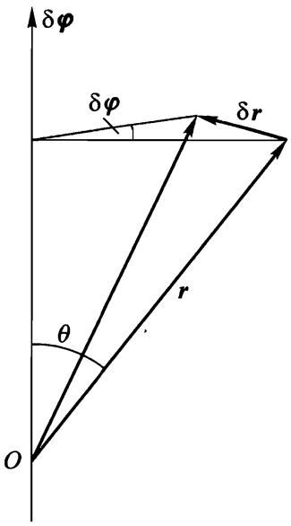

# $\ S \ 9$ 角动量

下面研究由空间各向同性得到的守恒定律.

各向同性意味着封闭系统整体在空间中任意转动时，力学性质保持不变.因此，我们研究系统整体的无穷小转动并求出拉格朗日函数保持不变的条件.

我们引入无穷小转动矢量 $\delta \varphi$ ,其大小等于转角 $\delta \varphi$ ,方向沿着转动轴（转动方向与 $\delta \varphi$ 的方向之间符合右手螺旋法则）.

我们首先研究，在系统转动时，从坐标原点(位于转动轴上)指向系统中任意质点的径矢的位移.径矢端点的线位移与转角的关系为(如图5所示)

$$
| \delta \boldsymbol r | = r \sin \theta \cdot \delta \varphi .
$$

位移矢量的方向垂直过 $r$ 和 $\delta \boldsymbol { \varphi }$ 的平面.显然有

$$
\delta { \boldsymbol{r}} = \delta { \boldsymbol \varphi } \times { \boldsymbol {r} } \tag{9.1}
$$

在系统转动时不仅径矢的方向改变，而且所有质点的速度也改变，并且所有矢量的变化规律相同.所以速度相对固定坐标系的增量为

$$
\delta { \boldsymbol v } = \delta { \boldsymbol \varphi } \times { \boldsymbol v } \tag{9.2}
$$

将这些表达式代入转动时拉格朗日函数不变的条件

$$
\delta L = \ \sum _ { a } \left( { \frac { \partial L } { \partial \boldsymbol{r} _ { a } } } \cdot \delta \boldsymbol{r} _ { a } + { \frac { \partial L } { \partial \boldsymbol{v} _ { a } } } \cdot \delta \boldsymbol{v} _ { a } \right) = \ 0
$$

  
图5

并做代换 $\partial { L } / \partial { \boldsymbol v } _ { a } = { \boldsymbol p } _ { a } , \quad \partial {  L } / \partial { \boldsymbol r } _ { a} = \boldsymbol { \dot { p } } _ { a }$ ,得

$$
\sum _ { a } \left[ { \boldsymbol { \dot { p } } } _ { a } \cdot ( \delta { \boldsymbol \varphi } \times { \boldsymbol r } _ { a } ) + { \boldsymbol p } _ { a } \cdot ( \delta { \boldsymbol \varphi } \times { \boldsymbol v } _ { a } ) \right] = 0 
$$

置换因子的次序并将 $\delta \boldsymbol { \varphi }$ 移到求和号之外，
$$
\delta \boldsymbol{\varphi} \cdot \sum_{a} \left( \boldsymbol{r}_a \times \boldsymbol{\dot{p}}_a + \boldsymbol{v}_a\times \boldsymbol{p}_a \right) = \delta \boldsymbol{\varphi}\cdot\frac{\mathrm{d}}{\mathrm{dt}}\sum_a \boldsymbol{r}_a \times \boldsymbol{p}_a = 0
$$

由 $\delta \boldsymbol { \varphi }$ 的任意性可得

$$
\frac { \mathrm { d } } { \mathrm { d } t } \sum _ { a } \boldsymbol { r } _ { a } \times \boldsymbol { p } _ { a } = 0 ,
$$

即在封闭力学系统运动过程中矢量

$$
{ \boldsymbol M } = \sum _ { a } { \boldsymbol r } _ { a } \times { \boldsymbol p } _ { a } \tag{9.3}
$$

保持不变，这个物理量称为系统的角动量(也叫做动量矩).类似于线动量，这个物理量不依赖于质点之间是否有相互作用，它的可加性是显然的.

可加的运动积分就这些.就是说，任何封闭系统总共有7个这样的运动积分:能量、动量的三个分量和角动量的三个分量.

既然在角动量的定义中出现了质点的径矢，它的取值通常就与坐标原点的选取有关.假定两个坐标原点相差矢量 $\boldsymbol { a }$ ,同一个点对这两个坐标原点的径矢分别为 $r _ { a }$ 和 $\boldsymbol { r } _ { a } ^ { \prime }$ ,则有关系式 $\boldsymbol { r } _ { a } = \boldsymbol { r } _ { a } ^ { \prime } + \boldsymbol { a }$ .因此有

$$
{ \boldsymbol {  M } } = \sum _ { a } { r _ { a } \times { p _ { a } } } = \sum _ { a } { r _ { a } ^ { \prime } \times { p _ { a } } } + { \boldsymbol { a } }  \times \sum _ { a } { p _ { a } } 
$$

即

$$
\boldsymbol { M } = \boldsymbol { M } ^ { \prime } + \boldsymbol { a } \times \boldsymbol { P } \tag{9.4}
$$

由此可知，只有在系统整体静止(即 $\boldsymbol { P } = 0$ )时，其角动量不依赖于坐标原点的选择.角动量值的这种不确定性不会影响到角动量守恒定律，因为封闭系统的动量也守恒.

我们来推导相对不同惯性参考系K和 $\mathrm { K } ^ { \prime }$ 的角动量之间的关系.设参考系$\mathrm { K } ^ { \prime }$ 相对K的速度为 $\mathbf { V }$ ,假定它们的坐标原点在某给定时刻重合.那么质点相对两个参考系的径矢相同，速度满足关系式： ${ \boldsymbol v } _ { a } = { \boldsymbol v } _ { a } ^ { \prime } + { \boldsymbol V }$ .于是有

$$
{ \boldsymbol M } = \sum _ { a } m _ { a } { \boldsymbol r } _ { a } \times { \boldsymbol v } _ { a } = \sum _ { a } m _ { a } { \boldsymbol r } _ { a } \times { \boldsymbol v } _ { a } ^ { \prime } + \sum _ { a } m _ { a } { \boldsymbol r } _ { a } \times { \boldsymbol V } .
$$

右端第一项是相对参考系 $\mathrm { K } ^ { \prime }$ 的角动量 $\boldsymbol{M} ^ { \prime }$ ，在第二项中[利用质心径矢公式(8.3)](8质心.md##Landua_dynamics_8_3),可得

$$
\boldsymbol { M } = \boldsymbol { M } ^ { \prime } + \mu \boldsymbol { R } \times \boldsymbol { V } \tag{9.5}
$$

这个公式给出了相对不同参考系的角动量之间的变换关系，与[能量关系式(8.1)](8质心.md##Landua_dynamics_8_1)和[动量关系式(8.5)](8质心.md##Landua_dynamics_8_5)类似.

如果系统整体相对参考系 $\mathrm { K } ^ { \prime }$ 静止,则 $\mathbf { V }$ 是系统质心的速度，而 $\mu { V }$ 是系统相对于参考系K的总动量 $\boldsymbol { P }$ ,进而有

$$
\boldsymbol { M } = \boldsymbol { M } ^ { \prime } + \boldsymbol { R } \times \boldsymbol { P } \tag{9.6}
$$

就是说，力学系统的角动量由其相对静止的参考系中的“内禀角动量”和整体运动的角动量 $\boldsymbol { R } \times \boldsymbol { P }$ 构成.

虽然只有封闭系统的角动量(对任意坐标原点)三个分量都守恒，但是在一定限制下，这个守恒定律对于在外场中运动的系统也成立.从上面推导可以看出，角动量在外场的对称轴上投影总是守恒的，因为绕该轴转动时系统力学性质不变:当然,这时角动量计算是相对于位于该轴上的任意点(坐标原点)的.

最重要的情况是中心对称外场，即势能仅仅依赖于到空间中某个特定点(中心)的距离.显然，在这种场内运动时，系统角动量在任意过中心的轴上投影都守恒.就是说，系统相对场中心的角动量 $\boldsymbol{M}$ 守恒.

另一个例子是，在沿着 $\mathfrak { z }$ 轴的均匀场中角动量投影 $M _ { z }$ 守恒,并且坐标原点可以任意选取.

应该指出，角动量在任意轴（我们就取为 $_ z$ 轴）上的投影，都可以由对拉格朗日函数的微分求得：

$$
M _ {z} =  \sum _ { a }  \frac { \partial L } { \partial \dot { \varphi } _ { a } } \tag{9.7}
$$

其中坐标 $\varphi$ 是绕 $z$ 轴的转角.根据前面给出的角动量守恒定律的证明过程，这个结论是显然的，也可以直接计算来验证.利用柱坐标 $r , \varphi , z$ 代入 $x _ { a } =r_a cos\varphi_a$， $y_a = r_a sin\varphi_a$ ，有：

$$
M _ { \it z } = \sum _ { a } m _ { a } ( x _ { a } \dot { y } _ { a } - y _ { a } \dot { x } _ { a } ) = \sum _ { a } m _ { a } r _ { a } ^ { 2 } \dot { \varphi _ { a } } \tag{9.8}
$$

另一方面，用这些坐标表示时，拉格朗日函数可以写成

$$
{  L } = \frac { 1 } { 2 } \sum _ { a } m _ { a } ( \dot { r } _ { a } ^ { 2 } + r _ { a } ^ { 2 } \dot { \varphi } _ { a } + \dot { z } _ { a } ^ { 2 } ) - U .
$$

将它代入(9.7)即可得(9.8).
