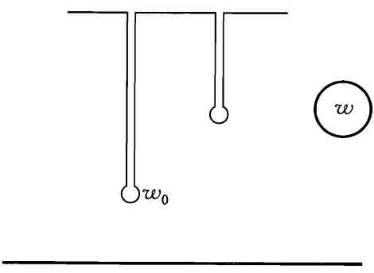

# 第七章

# 正则方程

# $\$ 40$ 哈密顿方程①

利用拉格朗日函数和由它导出的拉格朗日方程来表述力学规律，其先决条件是可以用广义坐标和广义速度来描述系统的力学状态.然而，这种描述不是唯一可能的方式.利用广义坐标和广义动量来描述系统状态，具有一系列优点，特别是在研究某些力学普遍问题的时候.于是，这就产生了建立与此相应的运动方程的问题.

通过数学上著名的勒让德变换，可以从一组独立变量变换到另一组.在现在这种情况下，这个变换可概括如下.

作为坐标和速度的函数的拉格朗日函数，其全微分等於

$$
\mathrm { d } L = \sum _ { \iota } \frac { \partial L } { \partial q _ { \iota } } \mathrm { d } q _ { \iota } + \sum _ { \iota } \frac { \partial L } { \partial \dot { q } _ { \iota } } \mathrm { d } \dot { q } _ { \iota } .
$$

$\textcircled{1}$ 读者可能会发现下表是非常有用的，该表列出了本书中所用术语与其它英语文献中常用术语之间的某些差别.

<html><body><table><tr><td>本书</td><td>其它文献</td></tr><tr><td>最小作用量原理</td><td>哈密顿原理</td></tr><tr><td>莫培督原理</td><td>最小作用量原理 莫培督原理</td></tr><tr><td>作用量</td><td>哈密顿主函数</td></tr><tr><td>简约作用量</td><td>作用量</td></tr></table></body></html>

因为按定义导数 $\partial L / \partial { \dot { q } } _ { \ i }$ 是广义动量，又根据拉格朗日方程有 $\partial L / \partial _ { q _ { i } } = \dot { \boldsymbol { \dot { p } } } _ { \iota }$ ;所以上面这个表达式可以写成

$$
\begin{array} { r } { \mathrm { d } L = \sum \dot { \boldsymbol { p } } _ { \iota } \mathrm { d } \boldsymbol { q } _ { \iota } + \sum { \boldsymbol { p } } _ { \iota } \mathrm { d } \dot { \boldsymbol { q } } _ { \iota } . } \end{array}
$$

现在将(40.1)的第二项写成

$$
\begin{array} { r } { \sum _ { \mathcal { P } _ { \imath } } \mathrm { d } \dot { q } _ { \imath } = \mathrm { d } ( \sum _ { \mathcal { P } _ { i } } \dot { q } _ { \imath } ) - \sum \dot { q } _ { \imath } \mathrm { d } _ { \mathcal { P } \imath } , } \end{array}
$$

将全微分 $\mathrm { d } ( \sum _ { \boldsymbol { p } _ { \imath } } \dot { \boldsymbol { q } } _ { \imath } )$ 移到等式左端并改变符号，由(40.1)可得

$$
\begin{array} { r } { \mathrm { d } \big ( \sum \ p _ { i } \dot { q } _ { \iota } - L \big ) = - \sum \dot { p } _ { i } \mathrm { d } q _ { \iota } + \sum \dot { q } _ { \iota } \mathrm { d } \phi _ { i } . } \end{array}
$$

微分的变量是用广义坐标和广义动量表示的系统的能量(参见 $\ S 6 )$ ，称为系统的哈密顿函数

$$
H ( \ p , q , t ) = \sum _ { \ i } \phi _ { i } \dot { q } _ { \ i } - L .
$$

由其中独立变量为坐标和动量的微分等式

$$
\begin{array} { r } { \mathrm { d } H = - \sum \dot { \boldsymbol { p } } _ { \iota } \mathrm { d } \boldsymbol { q } _ { i } + \sum \dot { \boldsymbol { q } } _ { \iota } \mathrm { d } \boldsymbol { p } _ { i } } \end{array}
$$

可以得出方程

$$
\dot { q } _ { \iota } = \frac { \partial H } { \partial \boldsymbol { \phi } _ { \iota } } , ~ \dot { \boldsymbol { \phi } } _ { \iota } = - \frac { \partial H } { \partial q _ { i } } .
$$

这些就是用变量 $\boldsymbol { \mathscr { P } }$ 和 $q$ 表示的所要求的运动方程，称为哈密顿方程，它们是关于 $2 s$ 个未知函数 $\mathbf { \nabla } _ { \mathbf { \mathcal { P } } _ { \imath } } ( \mathbf { \sigma } _ { t } )$ 和 $q _ { \ i } \left( \ t \right)$ 的 $2 s$ 个一阶微分方程组，代替拉格朗日方法的 $s$ 个二阶方程.由于这些方程的形式简单并且对称，也称之为正则方程.

哈密顿函数对时间的全导数为

$$
\frac { \mathrm { d } H } { \mathrm { d } t } { = } \frac { \partial H } { \partial t } + \Sigma \frac { \partial H } { \partial q _ { \ i } } \dot { q } _ { \ i } + \Sigma \frac { \partial H } { \partial \dot { p _ { i } } } \dot { p } _ { i } .
$$

将方程(40.4)的 $\dot { \boldsymbol { q } } _ { \iota } , \dot { \boldsymbol { p } } _ { \iota }$ 代入，上式后两项相互抵消，因此

$$
\cdot \ { \frac { \mathrm { d } H } { \mathrm { d } t } } = { \frac { \partial H } { \partial t } } .
$$

特别地，如果哈密顿函数不显含时间，则 ${ \mathrm { d } } H / { \mathrm { d } } t = 0$ ,即得到能量守恒定律.

除了动力学变量 ${ \dot { q } } , { \dot { q } }$ 或者 $q , \boldsymbol { \mathscr { p } }$ ,拉格朗日函数和哈密顿函数还包含各种参数，这些参数与力学系统自身的性质或者作用于其上的外场有关.设 $\dot { \lambda }$ 是这样的参数，我们将它看作变量，则代替表达式(40.1),有

$$
\mathrm { d } L { = \sum \dot { \boldsymbol { p } } _ { i } \mathrm { d } \boldsymbol { q } _ { \iota } + \sum \boldsymbol { p } _ { i } \mathrm { d } , \dot { \boldsymbol { q } } _ { i } . + \frac { \partial L } { \partial \lambda } \mathrm { d } \lambda , }
$$

而(40.3)变为

$$
\mathrm { d } H { \stackrel { . } { = } } - \sum { \dot { \sp { p } } } { } _ { i } \mathrm { d } q _ { i } + \sum { \dot { q } } _ { \imath } \mathrm { d } { \dot { p _ { i } } } - { \frac { \partial { \dot { L } } } { \partial \lambda } } \mathrm { d } \lambda .
$$

由此可得拉格朗日函数和哈密顿函数对参数 $\lambda$ 的偏导数之间的关系

$$
\left( \frac { \partial H } { \partial \lambda } \right) _ { \substack { \displaystyle \dot { p } , q } } = - \left( \frac { \partial L } { \partial \lambda } \right) _ { \dot { q } , q } ,
$$

导数的下标表示，在对 $H$ 求 $\lambda$ 的偏导时 $\phi , q$ 是不变的,对 $L$ 求 $\lambda$ 的偏导时 $q , \dot { q }$ 是不变的.

这个结果可以表示为另一种形式.设拉格朗日函数的形式为 $L = L _ { 0 } + L ^ { ' }$ 其中 $L$ 是对函数 $L _ { 0 }$ 很小的修正.哈密顿函数 $H = H _ { 0 } + H ^ { \prime }$ 的相应附加项与 $L ^ { ' }$ 的关系为

$$
\left( H ^ { \prime } \right) _ { \phi , q } = - \left( L ^ { \prime } \right) _ { { \dot { q } } , q } .
$$

应该注意到，在从(40.1)到(40.3)的变换中，我们没有写出带 $\mathrm { d } t$ 的项,即没有考虑拉格朗日函数可能显含时间的情况.这是因为在那里时间仅仅是一个参数，不参与所做的变换.类似于公式(40.6)，拉格朗日函数和哈密顿函数对时间的偏导数之间的关系为

$$
\left( \frac { \partial H } { \partial t } \right) _ { \substack { \boldsymbol { \phi } , \boldsymbol { q } } } = - \left( \frac { \partial L } { \partial t } \right) _ { \dot { \boldsymbol { q } } , \boldsymbol { q } } .
$$

# 习 题

习题1 试求在笛卡儿坐标、柱坐标和球坐标下一个质点的哈密顿函数.答案:在笛卡儿坐标 $x , y , z$ 下

$$
H = \frac { 1 } { 2 m } ( \ p _ { x } ^ { 2 } + \ p _ { y } ^ { 2 } + \ p _ { z } ^ { 2 } ) + U ( x , y , z ) .
$$

在柱坐标 $r , \varphi , z$ 下

$$
H = \frac { 1 } { 2 m } \left( \ p _ { r } ^ { 2 } + \frac { \not p _ { \varphi } ^ { 2 } } { r ^ { 2 } } + \ p _ { z } ^ { 2 } \right) + U ( r , \varphi , z ) .
$$

在球坐标 $r , \theta , \varphi$ 下

$$
H = \frac { 1 } { 2 m } \bigg ( \ p _ { r } ^ { 2 } + \frac { \ p _ { \theta } ^ { 2 } } { r ^ { 2 } } + \frac { \ p _ { \varphi } ^ { 2 } } { r ^ { 2 } \sin ^ { 2 } \theta } \bigg ) + U ( r , \theta , \varphi ) .
$$

习题2试求质点在匀速转动参考系中的哈密顿函数.解:用(39.10)的动量 $\pmb { p }$ 表示能量(39.11)中的速度 $\pmb { v }$ ,有

$$
H = \frac { { \boldsymbol { \phi } } ^ { 2 } } { 2 m } - \pmb { \Omega } \cdot ( \pmb { r } \times \pmb { p } ) + U .
$$

习题3 设有一个由质量为 $M$ 的质点和 $_ n$ 个质量为 $_ m$ 的质点组成的系统，不考虑系统质 $\therefore \Delta$ 的运动，试求这个系统的哈密顿函数(参见 $\ S 1 3$ 习题）.

解:在 $\ S 1 3$ 习题中得到的拉格朗日函数中，改变 $U$ 前面的符号，可得能量$E$ .广义动量为

$$
{ \pmb p } _ { a } = \frac { \partial { \cal L } } { \partial \mathrm { \pmb ~ { v } } _ { a } } \overset { . } { = } m \mathrm { \pmb ~ { v } } _ { a } - \frac { m ^ { 2 } } { \mu } \sum _ { a } \dot { \bf { v } } _ { a } .
$$

由此得

$$
\begin{array} { c } { { \displaystyle \sum { \pmb { p } } _ { a } = m \sum { \pmb { v } } _ { a } - \frac { n m ^ { 2 } } { \mu } \displaystyle \sum _ { a } { \pmb { v } } _ { a } = \frac { m M } { \mu } \displaystyle \sum _ { a } { \pmb { v } } _ { a } , } } \\ { { \displaystyle { \pmb { v } } _ { a } = \frac { { \pmb { p } } _ { a } } { m } + \frac { 1 } { M } \sum { \pmb { p } } _ { a } . } } \end{array}
$$

代入 $E$ ,可得

$$
H = \frac { 1 } { 2 m } \sum _ { { \alpha } } ^ { } p _ { { \alpha } } ^ { 2 } + \frac { 1 } { 2 M } \Big ( \sum _ { { \alpha } } ^ { }  { p _ { \alpha } } \Big ) ^ { 2 } + U .
$$

# $\ S \ 4 1$ 罗斯函数

在某些情况下，变换到新变量时，仅对部分而不是全部的广义速度用动量来代替是很方便的.相应的变換完全类似於 $\$ 40$ 给出的变换.

为了简化公式，首先假设仅有两个广义坐标，用 $q$ 和 $\boldsymbol { \xi }$ 表示，我们进行从 $q$ ,$\xi , \dot { q } , \dot { \xi }$ 到 $q , \xi , \boldsymbol { \phi } , \dot { \xi }$ 的变换，其中 $\boldsymbol { \mathscr { P } }$ 为相应于广义坐标 $q$ 的广义动量.

拉格朗日函数 $L \left( q , \xi , \dot { q } , \dot { \xi } \right)$ 的微分为

$$
\mathrm { d } L = \frac { \partial L } { \partial q } \mathrm { d } q + \frac { \partial L } { \partial \dot { q } } \mathrm { d } \dot { q } + \frac { \partial L } { \partial \xi } \mathrm { d } \dot { \xi } + \frac { \partial L } { \partial \dot { \xi } } \mathrm { d } \dot { \xi } = \dot { p } \mathrm { d } q + p \mathrm { d } \dot { q } + \frac { \partial L } { \partial \xi } \mathrm { d } \dot { \xi } + \frac { \partial L } { \partial \dot { \xi } } \mathrm { d } \dot { \xi } ,
$$

由此可得

$$
\mathsf { d } \big ( L - \pounds \dot { q } \big ) = \dot { \ p } \mathsf { d } q - \dot { q } \mathsf { d } \phi + \ \frac { \partial L } { \partial \xi } \mathsf { d } \xi + \frac { \partial L } { \partial \dot { \xi } } \mathsf { d } \dot { \xi } .
$$

如果定义罗斯函数为

$$
R \left( q , \phi , \xi , \dot { \xi } \right) = \phi \dot { q } - L ,
$$

式中的速度 $\dot { \boldsymbol { q } }$ 借助方程 $\pmb { \mathscr { p } } = \partial L / \partial \dot { q }$ 用广义动量 $\boldsymbol { \mathscr { p } }$ 表示,则罗斯函数的微分为

$$
\mathrm { d } R = - \dot { \boldsymbol { p } } \mathrm { d } \boldsymbol { q } + \dot { \boldsymbol { q } } \mathrm { d } \boldsymbol { \phi } - \frac { \partial L } { \partial \boldsymbol { \xi } } \mathrm { d } \boldsymbol { \xi } - \frac { \partial L } { \partial \dot { \boldsymbol { \xi } } } \mathrm { d } \dot { \boldsymbol { \xi } } .
$$

由此可得

$$
\dot { q } = { \frac { \partial R } { \partial \_ p } } , ~ \dot { \ p } = - { \frac { \partial R } { \partial q } } ,
$$

$$
\frac { \partial { \cal L } } { \partial \xi } = - \frac { \partial { \cal R } } { \partial \xi } , \frac { \partial { \cal L } } { \partial \dot { \xi } } = - \frac { \partial { \cal R } } { \partial \dot { \xi } } \ .
$$

将后两个等式代入变量 $\xi$ 的拉格朗日方程，得

$$
{ \frac { \mathrm { d } } { \mathrm { d } t } } { \frac { \partial R } { \partial { \dot { \xi } } } } = { \frac { \partial R } { \partial \xi } } \ .
$$

可见，罗斯函数对于坐标 $q$ 是哈密顿函数（方程（41.3）），对于坐标 $\xi$ 是拉格朗日函数(方程(41.5)).

根据一般定义，系统的能量为

$$
E = \dot { q } \frac { \partial L } { \partial \dot { q } } + \dot { \xi } \frac { \partial L } { \partial \dot { \xi } } - L = \dot { p } \dot { q } + \dot { \xi } \frac { \partial L } { \partial \dot { \xi } } - L .
$$

将(41.1)和(41.4)代入，能量可以用罗斯函数表示为

$$
E = R - \dot { \xi } \frac { \partial R } { \partial \dot { \xi } } .
$$

显然，我们得到的这些公式可以推广到有多个坐标 $q$ 和 $\xi$ 的情况.

应用罗斯函数可能是非常方便的，特别是存在循环坐标的时候.如果 $q$ 是循环坐标，则它不显含在拉格朗日函数中，因而不显含于罗斯函数，所以罗斯函数仅是变量 $\boldsymbol { \phi } , \boldsymbol { \xi } , \dot { \boldsymbol { \xi } }$ 的函数.而相应于循环坐标的广义动量 $\boldsymbol { \phi }$ 为常数(也可以从(41.3)的第二个方程得出，从这个意义上讲，方程(41.3)不能给出任何新的结果）.将 $\boldsymbol { \phi }$ 替换为给定常值后，方程（41.5)

$$
\frac { \mathrm { d } } { \mathrm { d } t } \frac { \partial R ( \boldsymbol { \mathit { p } } , \boldsymbol { \xi } , \dot { \boldsymbol { \xi } } ) } { \partial \dot { \boldsymbol { \xi } } } = \frac { \partial R ( \boldsymbol { \mathit { p } } , \boldsymbol { \xi } , \dot { \boldsymbol { \xi } } ) } { \partial \boldsymbol { \xi } }
$$

成为仅包含坐标 $\xi$ 的方程，循环坐标完全被消去.如果这些方程可以求解并得到函数 $\xi ( \mathbf { \xi } _ { t } )$ ，则将其代入方程

$$
\dot { q } = \frac { \partial R \left( \ p , \xi , \dot { \xi } \right) } { \partial \ p }
$$

的右端，可以直接积分求出函数 $q \left( \mathbf { \Lambda } _ { t } \right)$ .

# 习 题

习题试消去循环坐标 $\psi$ ，求在外力场 $U ( \varphi , \theta )$ 中对称陀螺的罗斯函数，其中 $\psi , \varphi , \theta$ 是欧拉角.

解:拉格朗日函数

$$
{ \cal L } = \frac { I _ { 1 } ^ { \prime } } { 2 } ( \dot { \theta } ^ { 2 } + \dot { \varphi } ^ { 2 } \mathrm { s i n } ^ { 2 } \theta ) + \frac { I _ { 3 } } { 2 } ( \dot { \phi } + \dot { \varphi } \mathrm { c o s } \theta ) ^ { 2 } - U ( \varphi , \theta )
$$

（参见 $\ S 3 5$ 的习题1).罗斯函数为

$$
R = \phi _ { \phi } \dot { \phi } - L = \frac { \phi _ { \phi } ^ { 2 } } { 2 I _ { 3 } } - \hbar _ { \phi } \dot { \varphi } \mathrm { c o s } \theta - \frac { I _ { 1 } ^ { \prime } } { 2 } ( \dot { \theta } ^ { 2 } + \dot { \varphi } ^ { 2 } \mathrm { s i n } ^ { 2 } \theta ) + U ( \varphi , \theta ) ,
$$

第一项是常数，可以略去.

# $\$ 42$ 泊松括号

设 $f ( \boldsymbol { \phi } , \boldsymbol { q } , t )$ 是坐标、动量和时间的某个函数.它对时间的全导数为

$$
{ \frac { \mathrm { d } f } { \mathrm { d } t } } = { \frac { \partial f } { \partial t } } + \sum _ { k } \left( { \frac { \partial f } { \partial q _ { k } } } { \dot { q } } _ { k } + { \frac { \partial f } { \partial \phi _ { k } } } { \ddot { p } } _ { k } \right) . 
$$

代入由哈密顿方程（40.4）给出的 $\dot { q } _ { k } , \dot { p } _ { k }$ 的表达式,得

$$
\frac { \mathrm { d } f } { \mathrm { d } t } = \frac { \partial f } { \partial t } + \left\{ H , f \right\} ,
$$

其中引入了记号

$$
\{ { \cal H } , f \} = \sum _ { k } \left( { \frac { \partial { \cal H } } { \partial \phi _ { k } } } { \frac { \partial f } { \partial q _ { k } } } - { \frac { \partial { \cal H } } { \partial q _ { k } } } { \frac { \partial f } { \partial \phi _ { k } } } \right) .
$$

表达式(42.2)称为量 $H$ 和 $f$ 的泊松括号.

我们知道，如果动力学变量的某个函数当系统运动时保持不变，则称之为运动积分.由（42.1）可知， $f$ 是运动积分 $\langle \mathrm { d } f / \mathrm { d } t = 0 \rangle$ 的条件可以写为

$$
\frac { \partial f } { \partial t } + \{ H , f \} = 0 .
$$

如果运动积分不显含时间，则

$$
\{ H , f \} = 0 ,
$$

即运动积分 $f$ 和哈密顿函数的泊松括号必等于零.

对于任意一对变量 $f , g$ ，泊松括号可以类似于（42.2）定义为

$$
\{ f , g \} = \sum _ { k } \left( { \frac { \partial f } { \partial _ { \hat { \cal P } _ { k } } } } { \frac { \partial g } { \partial q _ { k } } } - { \frac { \partial f } { \partial q _ { k } } } { \frac { \partial g } { \partial _ { \hat { \cal P } _ { k } } } } \right) .
$$

由定义容易推出泊松括号的如下性质.

如果两个函数对调，则泊松括号改变符号；如果一个函数是常数 $( \boldsymbol { c } )$ ，则泊松括号等于零：

$$
\begin{array} { c } { { \left\{ f , g \right\} \ : = - \left\{ g , f \right\} , } } \\ { { \left\{ f , c \right\} \ : = 0 . } } \end{array}
$$

其次，还有

$$
\begin{array} { r } { { \{ f _ { 1 } + f _ { 2 } , g \} = \{ f _ { 1 } , g \} + \{ f _ { 2 } , g \} , } } \\ { { \{ f _ { 1 } f _ { 2 } , g \} = f _ { 1 } \{ f _ { 2 } , g \} + f _ { 2 } \{ f _ { 1 } , g \} . } } \end{array}
$$

将（42.5）对时间求偏导数有

$$
\frac { \partial } { \partial \mathrm {  ~ \sf ~ \{ ~ } } t  \{ \mathrm {  ~ \sf ~ { ~ } } f , g \} = \left\{ \frac { \partial f } { \partial \mathrm {  ~ \sf ~ { ~ } } } , g \right\} + \left\{ f , \frac { \partial g } { \partial \mathrm {  ~ \sf ~ { ~ } } } \right\} .
$$

如果函数 $f$ 或 $^ { g }$ 之一是广义坐标或者广义动量，则泊松括号简化为偏导数：

$$
\begin{array} { l } { { \{ f , q _ { k } \} = \displaystyle \frac { \partial f } { \partial f _ { k } } , } } \\ { { { } } } \\ { { \{ f , \phi _ { k } \} = - \displaystyle \frac { \partial f } { \partial q _ { k } } . } } \end{array}
$$

例如，在(42.5）中令 $ { g } =  { } q _ { k }$ ,就可以得到公式(42.11)，由于

$$
\frac { \partial q _ { k } } { \partial q _ { l } } = \delta _ { k l } , \quad \frac { \partial q _ { k } } { \partial \phi _ { l } } = 0 ,
$$

这时求和只剩下一项.特别地，在(42.11）和(42.12）中令函数 $f$ 等于 $q _ { \imath }$ 和 $\textstyle { \boldsymbol { \phi } } _ { i }$ ,可得

$$
\{ q _ { i } , q _ { k } \} \ = 0 , \{ \quad \} \phi _ { \imath } , \phi _ { k } \} \ = 0 , \{ \quad \} \phi _ { \imath } , q _ { k } \} \ = \ \delta _ { i k } .
$$

在3个函数组成的泊松括号之间，存在下面关系式

$$
\{ f , \{ g , h \} \} + \{ g , \{ h , f \} \} + \{ h , \{ f , g \} \} = 0 ,
$$

我们称之为雅可比恒等式.

为了证明这个恒等式，我们首先注意到下面的结果.根据定义(42.5)，泊松括号 $\left\{ \begin{array} { l } { f , g } \end{array} \right\}$ 是 $f$ 和 $_ { g }$ 的一阶导数的双线性齐次函数.所以，例如，括号 $\{ h \ , \ \} \ f$ ,$g \left\{ \begin{array} { l } { \begin{array} { r l r } \end{array} } \end{array} \right\}$ 是 $f$ 和 $_ { g }$ 的二阶导数的线性齐次函数.因此等式(42.14）的整个左端是所有3个函数 $f , g , h$ 的二阶导数的线性齐次函数.我们将含有 $f$ 的二阶导数的项放在一起.第一个括号不含这样的项，因为它只涉及 $f$ 的一阶导数.对第2和第3个括号之和，利用由

$$
D _ { 1 } ( \varphi ) = \{ g , \varphi \} , \quad D _ { 2 } ( \varphi ) = \{ h , \varphi \} ,
$$

定义的线性微分算符 $D _ { 1 }$ 和 $D _ { 2 }$ 可以将其以符号形式写为

$$
\begin{array} { r l }  \smash {  { \{ g , \{ h , f \} \} } +  { \{ h , \{ f , g \} \} } =  { \{ g , \{ h , f \} } -  { \{ h , \{ g , f \} \} } }  { \{ \vphantom { [  { D _ { 1 } } ( f ) \} \} } } & { } \\ { = } & { D _ { 1 } ( D _ { 2 } ( f ) ) - D _ { 2 } ( D _ { 1 } ( f ) ) } \\ { } & { = \smash { \bigl ( D _ { 1 } D _ { 2 } - D _ { 2 } D _ { 1 } \bigr ) f } . } \end{array}
$$

容易看出，这个线性微分算符的组合不可能包含 $f$ 的二阶导数.事实上，线性微分算符的一般形式为

$$
D _ { 1 } = \ \sum _ { k } \pounds _ { k } \frac { \partial } { \partial x _ { k } } , \quad D _ { 2 } = \ \sum _ { k } \eta _ { k } \frac { \partial } { \partial x _ { k } } ,
$$

其中 $\xi _ { k } \mathrm { ~ , ~ } \eta _ { k }$ 是变量 $x _ { 1 } , x _ { 2 } , \cdots$ 的任意函数.于是

$$
\begin{array} { r l } & { D _ { 1 } D _ { 2 } = \ \displaystyle \sum _ { k , l } \xi _ { k } \eta _ { l } \frac { \partial ^ { 2 } } { \partial x _ { k } x _ { l } } + \ \sum _ { k , l } \xi _ { k } \frac { \partial \eta _ { l } } { \partial x _ { k } } \frac { \partial } { \partial \ { x } _ { l } } , } \\ & { D _ { 2 } D _ { 1 } = \ \displaystyle \sum _ { k , l } \eta _ { k } \xi _ { l } \frac { \partial ^ { 2 } } { \partial x _ { k } x _ { l } } + \ \sum _ { k , l } \eta _ { k } \frac { \partial \xi _ { l } } { \partial { x } _ { k } } \frac { \partial } { \partial \ { x } _ { l } } , } \end{array}
$$

它们之差

$$
D _ { 1 } D _ { 2 } - D _ { 2 } D _ { 1 } = \mathrm { ~ \sum ~ } _ { k , l } \bigg ( \xi _ { k } \frac { \partial \eta _ { l } } { \partial x _ { k } } - \eta _ { k } \frac { \partial \xi _ { l } } { \partial x _ { k } } \bigg ) \frac { \partial } { \partial x _ { l } }
$$

是仅包含一阶导数的算符.于是，在(42.14)的左端，所有包含 $f$ 的二阶导数的项相互抵消，对于 $^ g$ 和 $h$ 当然有相同的结论，于是整个表达式恒等于零.

泊松括号的一个重要性质在于，如果 $f$ 和 $_ { g }$ 是两个运动积分，则它们构成的

泊松括号也是运动积分

$$
\{ f , g \} \ = \ \mathrm { c o n s t }
$$

这就是泊松定理.

如果 $f$ 和 $_ g$ 不显含时间，这个定理的证明非常简单.在雅可比恒等式中令$h \ = \ H$ ，得

$$
\{ f , \{ g , H \} \} + \{ g , \{ H , f \} \} + \{ H , \{ f , g \} \} = 0 .
$$

由此可见，如果有 $\left\{ H , g \right\} = 0$ 和 $\{ H , f \} = 0$ ，则 $\{ H , \{ f , g \} \} = 0$ ，于是结论得证.

如果运动积分 $f$ 和 $^ { g }$ 显含时间，则依据（42.1）可以写出

$$
\frac { \mathrm { d } } { \mathrm { d } t } \{ f , g \} = \frac { \partial } { \partial t } \{ f , g \} + \{ H , \{ f , g \} \} .
$$

利用公式(42.10)，借助雅可比恒等式将括号 $\{ H , \{ f , g \} \}$ 用另外两个括号代替，可得

$$
\begin{array} { l }  { \displaystyle { \frac { \mathrm { d } } { \mathrm { d } t } \{ f , g \} ~ = ~ \left\{ \frac { \partial f } { \partial t } , g \right\} + ~ \left\{ f , \frac { \partial g } { \partial t } \right\} - ~ \left\{ f , \left\{ g , H \right\} ~ \right\} ~ - ~ \left\{ g , \left\{ H , f \right\} \right\} } } \\ { { \displaystyle ~ = ~ \left\{ \frac { \partial f } { \partial t } + ~ \left\{ H , f \right\} , g \right\} + ~ \left\{ f , \frac { \partial g } { \partial t } + ~ \left\{ H , g \right\} ~ \right\} } } \end{array}
$$

或者

$$
{ \frac { \mathrm { d } } { \mathrm { d } t } } \{ f , g \} = \left\{ { \frac { \mathrm { d } f } { \mathrm { d } t } } , g \right\} + \left\{ f , { \frac { \mathrm { d } g } { \mathrm { d } t } } \right\} ,
$$

由此显然可以证明一般情况下的泊松定理.

当然，应用泊松定理，我们不是总能得到新的运动积分，因为仅有2s－1个运动积分(其中 $s$ 是自由度）.在某些情况下，我们可能得到平凡的结果，泊松括号为常数.在另外一些情况下，新得到的运动积分只不过是原来的运动积分 $f$ 和$g$ 的函数.然而，如果不是上述两种情况，则泊松括号给出新的运动积分.

# 习 题

习题1•试求质点的动量 $\pmb { p }$ 和角动量 $\boldsymbol { M } = \boldsymbol { r } \times \boldsymbol { p }$ 的笛卡儿坐标分量组成的 泊松括号.

解：根据公式(42.12）得

$$
\{ M _ { x } , \ / p _ { y } \} = - \ \frac { \partial M _ { x } } { \partial y } = - \ \frac { \partial } { \partial \ / y } ( y \ / p _ { z } \ - \ z \ / p _ { y } ) = - \ p _ { z }
$$

和类似的两个公式

$$
\{ M _ { x } , \phi _ { x } \} \ = 0 , \{ \mathrm { ~ }  \quad \{ M _ { \dot { x } } , \phi _ { z } \} \ = \ \phi _ { y } .
$$

其它的泊松括号可以通过下标 $x , y , z$ 的循环置换得到.

习题2试求角动量 $M$ 的分量组成的泊松括号.解：直接由公式(42.5)计算得

$$
\{ M _ { x } , M _ { y } \} \ = - \ M _ { z } , \quad \{ M _ { y } , M _ { z } \} \ = - \ M _ { x } , \quad \{ M _ { z } , M _ { x } \} \ = - \ M _ { y } .
$$

因为不同质点的坐标和动量是相互独立的变量，所以在习题1和2中所得的公式对于任意质点系的总动量和总角动量也成立.

习题3试证

$$
\left\{ \varphi , M _ { z } \right\} = 0 ,
$$

其中 $\varphi$ 是质点坐标和动量的任意标量函数.

证：标量函数 $\varphi$ 只能以 $r ^ { 2 } , \boldsymbol { \phi } ^ { 2 } , r \cdot \boldsymbol { p }$ 的组合形式依赖于矢量 $\boldsymbol { r }$ 和 $\pmb { p }$ 的分量.所以

$$
{ \frac { \partial \varphi } { \partial \boldsymbol { r } } } = 2 { \frac { \partial \varphi } { \partial { \big ( } { \boldsymbol { r } } ^ { 2 } { \big ) } } } \boldsymbol { r } + { \frac { \partial \varphi } { \partial { \big ( } { \boldsymbol { p } } \cdot \boldsymbol { r } { \big ) } } } \boldsymbol { p }
$$

对 $\partial \varphi / \partial \pmb { p }$ 也类似.利用这些偏微分公式，按公式(42.5)直接计算即可得要证的结论.

习题4试证

$$
\left\{ f , M _ { z } \right\} \ = \ f \times \ n ,
$$

其中 $f$ 是质点坐标和动量的矢量函数，而 $\pmb { n }$ 是沿着 $\pmb { z }$ 方向的单位矢量.

证：任意矢量 $\pmb { f } ( \pmb { r } , \pmb { p } )$ 可以写成

$$
f = r \varphi _ { 1 } + { p \varphi _ { 2 } } + \left( r \times p \right) \varphi _ { 3 } ,
$$

其中 $\varphi _ { 1 } , \varphi _ { 2 } , \varphi _ { 3 }$ 是标量函数.利用公式(42.9)、(42.11)、(42.12)和习题3给出的公式，直接计算即可得要证的结论.

# $\ S \textbf { 4 3 }$ 作为坐标函数的作用量

在表述最小作用量原理时，我们研究过沿着两个给定位置 $q ^ { ( 1 ) }$ 和 $q ^ { ( 2 ) }$ 之间轨道的积分

$$
S = \int _ { t _ { 1 } } ^ { t _ { 2 } } L \mathrm { d } t ,
$$

其中 $q ^ { ( 1 ) }$ 和 $q ^ { ( 2 ) }$ 是在给定时刻 $t _ { 1 }$ 和 $t _ { 2 }$ 系统占据的位置.在对作用量变分时，我们比较有相同值 $q \left( \mathbf { \Phi } _ { t _ { 1 } } \right)$ 和 $q \left( t _ { 2 } \right)$ 的临近轨道的这个积分值.这些轨迹中只有一条对应真实运动，这就是积分 $S$ 取极小值的轨道.

下面我们从另一个角度考虑作用量这个概念.我们将 $S$ 看作表征沿着真实轨迹运动的量，并比较有相同初始位置 $q ( t _ { 1 } ) = q ^ { ( 1 ) }$ 但 $t _ { 2 }$ 时刻通过不同位置的那些轨迹的 $S$ 值.换句话说，我们将真实轨道的作用量积分看作积分上限中那些坐标的函数.

从一条轨迹变到相邻的其它轨迹时，作用量产生的改变量由下面表达式给出(当有一个自由度时）：

$$
\delta S = \frac { \partial L } { \partial \dot { q } } \dot { \delta } q \bigg | _ { t _ { 1 } } ^ { t _ { 2 } } + \int _ { t _ { 1 } } ^ { t _ { 2 } } \bigg ( \frac { \partial L } { \partial q } - \frac { \mathrm { d } } { \mathrm { d } t } \frac { \partial L } { \partial \dot { q } } \bigg ) \delta q \mathrm { d } t .
$$

因为实际运动轨道满足拉格朗日方程，故这个式子中积分等于零.在第一项假设在积分下限 $\delta q ( t _ { 1 } ) = 0$ ，而将 $\delta q \left( t _ { 2 } \right)$ 简记为 $\delta \boldsymbol { q }$ .将 $\partial L / \partial { \dot { q } }$ 替换为 $\boldsymbol { \mathscr { P } }$ ,最后可得：$\delta S \mathrm { ~ = ~ } \ p \delta q$ 或者在任意自由度的一般情况下写成

$$
\delta S = \sum _ { \imath } \phi _ { i } \delta q _ { i } .
$$

由此式可知，作用量对坐标的偏导数等于相应的动量

$$
{ \frac { \partial S } { \partial q _ { i } } } = \mathbf { \nabla } _ { { \boldsymbol { P } } _ { i } } .
$$

类似地，当我们考虑在给定时刻 $t _ { 1 }$ 从给定位置 $q ^ { ( 1 ) }$ 出发，在不同时刻 $t _ { 2 } = t$ 终结于给定位置 $q ^ { ( 2 ) }$ 的轨迹时，可以将作用量看作时间的显函数.在这个意义下偏导数 ${ \partial S } / { \partial t }$ 可以通过相应积分的适当变分求得.但是，借助公式(43.3)，用下面的方法会更简单.

根据作用量的定义，它沿着轨道对时间的全导数等于

$$
{ \frac { \mathrm { d } S } { \mathrm { d } t } } = L .
$$

从另一方面，在上述意义下将 $S$ 看作坐标和时间的函数，利用公式(43.3)，有

$$
{ \frac { \mathrm { d } S } { \mathrm { d } t } } = { \frac { \partial S } { \partial t } } + \sum _ { \ i } { \frac { \partial S } { \partial q _ { i } } } { \dot { q } } _ { i } = { \frac { \partial S } { \partial t } } + \sum _ { \ i } ^ { } \rlap / p _ { \ i } { \dot { q } } _ { i } .
$$

比较两个表达式，可得

$$
\frac { \partial S } { \partial t } = \boldsymbol { L } - \sum _ { \iota } _ { } \dot { \boldsymbol { \jmath } } _ { \iota } \dot { \boldsymbol { q } } _ { \iota }
$$

或者

$$
\frac { \partial S } { \partial t } = - \ H .
$$

公式(43.3）和（43.5）可以一起写成作用量的全微分的表达式

$$
\mathrm { d } S = \sum _ { \iota } p _ { i } \mathrm { d } q _ { \iota } - H \mathrm { d } t ,
$$

其中作用量看作（43.1）积分上限中坐标和时间的函数.下面假设不仅运动的终点而且初始点的坐标和时间都变化.显然， $S$ 相应的变化将由表达式(43.6）在轨道两端点的差值给出，即

$$
\mathrm { d } S = \sum _ { \iota } ^ { } \phi _ { i } ^ { ( 2 ) } \mathrm { d } q _ { i } ^ { ( 2 ) } - H ^ { ( 2 ) } \mathrm { d } t ^ { ( 2 ) } - \sum _ { \iota } ^ { } \phi _ { i } ^ { ( 1 ) } \mathrm { d } q _ { \iota } ^ { ( 1 ) } + H ^ { ( 1 ) } \mathrm { d } t ^ { ( 1 ) } .
$$

这个关系式表明，在运动过程中无论外部对系统的作用如何，运动的末态都不可能是初态的任意函数，只有(43.7)右端表达式是全微分的那些运动才是可能的.于是，存在与拉格朗日函数任何具体形式无关的最小作用量原理，给可能运动

的范围附加了一定的限制.特别是，对于从空间给定点发出的粒子束，可以导出许多不依赖于外场的一般性质.对于这些性质的研究是几何光学学科中的一个组成部分.①

应该指出，如果将坐标和动量看作独立变分的变量，并依据（43.6）将作用量写成积分形式

$$
S = \int \Bigl ( \sum _ { \iota } \phi _ { \iota } \mathrm { d } q _ { \iota } - H \mathrm { d } t \Bigr ) ,
$$

则可以由最小作用量原理从形式上推导出哈密顿方程.为简单起见，我们还是假设只有一个坐标（和一个动量），写出作用量的变分

$$
\delta { \cal S } = \int \left( \delta { p } { \mathrm { d } } q + \mathbf { \nabla } { p } { \mathrm { d } } \delta q - \frac { \mathbf { \nabla } } { \partial q } \delta { \dot { q } } { \mathrm { d } } t - \frac { \partial H } { \partial { \dot { p } } } { \hat { \delta } } { \hat { p } } { \mathrm { d } } t \right) .
$$

对第二项分部积分给出

$$
\delta { \cal { S } } = \int \delta \phi \left( \mathrm { d } q - \frac { \partial H } { \partial \phi } \mathrm { d } t \right) + \left. \ p \delta q \right| - \int \delta q \left( \mathrm { d } \phi + \frac { \partial H } { \partial q } \mathrm { d } t \right) .
$$

在积分限上应该令 $\delta q = 0$ ,这样被积分出来的项就消去了.只有在被积函数分别等于零的条件下，剩下的表达式才能对任意独立的 $\delta q$ 和 $\delta \boldsymbol { p }$ 都等于零.于是有

$$
\mathrm { d } q = \frac { \partial H } { \partial \boldsymbol { \phi } } \mathrm { d } t , \quad \mathrm { d } \boldsymbol { \phi } = - \frac { \partial H } { \partial \boldsymbol { q } } \mathrm { d } t ,
$$

除以 $\mathrm { d } t$ 后可得哈密顿方程.

# $\ S \ 4 4$ [] 莫培督原理

力学系统的运动完全由最小作用量原理确定：通过求解由该原理导出的运动方程，可以得到轨迹的形式以及在轨道上位置与时间的函数关系.

如果我们限定仅确定运动轨迹而不涉及时间的问题，则可以为此建立最小作用量原理的更简单形式.

假设拉格朗日函数不显含时间，因而哈密顿函数不显含时间，由此系统的能量守恒：

$$
H ( \phi , q ) = E = \mathrm { c o n s t } .
$$

根据最小作用量原理，对于给定的初态和末态的坐标和时间(记为 $t _ { 0 } , t \big )$ ,作用量变分等于零.然而，如果坐标的初值和终值保持不变，允许末状时间 $t$ 变分,则有(参见(43.7))

$$
\delta S = - \ H \delta t .
$$

我们不比较系统所有的虚运动，而只是比较满足能量守恒定律的那些运动.对于这样的轨道，我们可以在（44.1）中将 $H$ 代替为常数 $E$ ,这给出

$$
\delta S + E \delta t = 0 .
$$

写出(43.8)形式的作用量并将 $H$ 代替为常数 $E$ ,有

$$
S = \int \sum _ { \ i } ^ { } { p _ { i } \mathrm { d } q _ { i } } - E ( \it { \mathrm { \Omega } } t - \it { \mathrm { \Omega } } t _ { 0 } ) .
$$

这个表示式中的第一项

$$
S _ { 0 } = \int \sum _ { \ i } \phi _ { \ i } \mathrm { d } q _ { i }
$$

有时也称为简约作用量.

将(44.3）代入(44.2)，得

$$
\delta S _ { 0 } = 0 .
$$

可见，相对于所有满足能量守恒定律且在任意时刻通过终点的轨道，简约作用量有极小值.为了利用这个变分原理，必须预先用坐标 $q$ 及其微分 ${ \mathrm { d } } q$ 表示出动量和（44.4）所有被积函数.为此需要利用动量的定义式

$$
{ \dot { p } } _ { \iota } = { \frac { \partial } { \partial { \dot { q } } _ { \iota } } } L \left( q , { \frac { \mathrm { d } q } { \mathrm { d } t } } \right)
$$

以及能量守恆方程

$$
E \left( q , { \frac { \mathrm { d } q } { \mathrm { d } t } } \right) = E .
$$

利用公式(44.7),用坐标 $q$ 及其微分 ${ \mathrm { d } } q$ 表示 $\mathrm { d } t$ 并代入公式(44.6),那么我们就得用坐标 $q$ 及其微分 ${ \mathrm { d } } q$ 表示的动量，并且以能量 $E$ 作为参数.这样得到的变分原理可以确定系统的轨道，这个原理通常称为莫培督原理，尽管它的精确表述由欧拉和拉格朗日给出.

当拉格朗日函数为常用形式(5.5),即动能与势能之差

$$
L = \frac { 1 } { 2 } \sum _ { \iota , k } a _ { \iota k } ( q ) \dot { q } _ { \iota } \dot { q } _ { k } - U ( q ) ,
$$

时，我们可以显式地进行上述各量的计算.这时动量为

$$
{ \bf \nabla } { p } _ { i } = \frac { \partial L } { \partial \textbf { \dot { q } } _ { i } } = \sum _ { k } \alpha _ { i k } ( \textbf { \em q } ) \textbf { \dot { q } } _ { k } ,
$$

而能量为

$$
E = \frac { 1 } { 2 } \sum _ { \iota , k } a _ { i k } ( q ) \dot { q } _ { \iota } \dot { q } _ { k } + U ( q ) .
$$

由上式可得

$$
\mathrm { d } t = \sqrt { \frac { \sum \alpha _ { i k } \mathrm { d } q _ { i } \mathrm { d } q _ { k } } { 2 ( E - U ) } } ,
$$

将这个表达式代人

$$
\sum _ { \ i } { p _ { i } \mathrm { d } q _ { i } } = \sum _ { \ i , k } { a _ { i k } \ { \frac { \mathrm { d } q _ { k } } { \mathrm { d } t } } \mathrm { d } q _ { i } } ,
$$

可得简约作用量为

$$
S _ { 0 } = \int \sqrt { 2 ( E - U ) \sum _ { \iota , k } a _ { i k } \mathrm { d } q _ { \iota } \mathrm { d } q _ { k } } .
$$

特别地，对于一个质点，动能为

$$
T = { \frac { m } { 2 } } \biggl ( { \frac { \mathrm { d } l } { \mathrm { d } t } } \biggr ) ^ { 2 } ,
$$

其中 $_ m$ 为质点的质量，而 $\mathrm { d } { \boldsymbol { l } }$ 是轨道的微元，确定轨道的变分原理为

$$
\begin{array} { r } { \hat { \partial } \displaystyle \int \sqrt { 2 m \left( E - U \right) } \mathrm { d } l = 0 , } \end{array}
$$

其中的积分是空间中两个给定点之间的积分.这个形式由雅可比提出.

对于质点的自由运动， $U = 0$ ,（44.10）给出平凡结果

$$
\begin{array} { r } { \hat { \delta } \displaystyle \int \mathrm { d } l = 0 , } \end{array}
$$

即质点沿着两给定点之间的最短路径，即直线运动.

我们再回到作用量表达式(44.3),这次对参数 $E$ 变分：

$$
\delta S = \frac { \partial S _ { 0 } } { \partial E } \delta E - ( t - t _ { 0 } ) \delta E - E \delta t .
$$

将此式代入(44.2),得

$$
\frac { \partial S _ { 0 } } { \partial E } = \textit { t } - \textit { t } _ { 0 } .
$$

对于形式为(44.9）的简约作用量，这个等式变为

$$
\int \sqrt { \frac { \sum a _ { \iota k } \mathrm { d } q _ { \iota } \mathrm { d } q _ { k } } { 2 ( E - U ) } } = t - { t _ { 0 } } .
$$

这正是方程（44.8）的积分.它与轨道方程一起完全确定系统的运动.

# 习 题

习题试由变分原理(44.10)推导出轨道的微分方程.

解:进行变分有

$$
\hat { \mathsf { s } } \int \sqrt { E - U } \mathrm { d } l = - \int \left( \frac { \partial U } { \partial r } \cdot \frac { \delta r } { 2 \sqrt { E - U } } \mathrm { d } l - \sqrt { E - U } \frac { \mathrm { d } r } { \mathrm { d } l } \cdot \mathrm { d } \hat { \mathsf { s } } r \right) .
$$

在第二项中考虑到 $\mathrm { d } l ^ { 2 } = \mathrm { d } r ^ { 2 }$ ,因此 $\mathrm { d } \boldsymbol { l } \mathrm { d } \hat { \boldsymbol { \nu } } \boldsymbol { l } = \mathrm { d } \boldsymbol { r } \boldsymbol { \cdot } \mathrm { d } \hat { \boldsymbol { \nu } } $ .将这一项分部积分然后令被积函数中 $\delta r$ 的系数等于零，得轨道的微分方程

$$
2 { \sqrt { E - U } } { \frac { \mathrm { d } } { \mathrm { d } l } } \left( { \sqrt { E - U } } { \frac { \mathrm { d } r } { \mathrm { d } l } } \right) = - { \frac { \partial U } { \partial r } } .
$$

计算方程左端的导数並引入力 $\pmb { F } = - \partial \pmb { U } / \partial \pmb { r }$ ，可将方程写成

$$
{ \frac { \mathrm { d } ^ { 2 } { \boldsymbol { r } } } { \mathrm { d } t ^ { 2 } } } = { \frac { \mathbf { F } - \left( { \boldsymbol { F } } \cdot { \boldsymbol { t } } \right) { \boldsymbol { t } } } { 2 ( E - \mathrm { ~ } U ) } } ,
$$

其中 $\pmb { t } = \mathrm { d } \pmb { r } / \mathrm { d } l$ 是轨道切向单位矢量，而差 $\pmb { F } - \left( \pmb { F } \pmb { \cdot } \pmb { t } \right) \pmb { t }$ 是力在轨道法线方向的分量 $\boldsymbol { F } _ { n }$ .由微分几何可知，导数 $\mathrm { d } ^ { 2 } r / \mathrm { d } l ^ { 2 } = \mathrm { d } t / \mathrm { d } l$ 等于 ${ \pmb n } / R$ ，其中 $R$ 为轨道的曲率半径，而 $\pmb { n }$ 是轨道主法线方向单位矢量.将 $E - U$ 替换为 $m v ^ { 2 } / 2$ ,得

$$
n \ { \frac { m v ^ { 2 } } { R } } = F _ { n } ,
$$

这与所熟悉的曲线运动中的法向加速度公式相符.

# $\ S \notin 5$ 正则变换

广义坐标 $q$ 的选择不受任何条件的限制，它们可以是任意单值确定系统在空间中位置的 $s$ 个量.拉格朗日方程(2.6)的形式不依赖于这种选择，在这个意义下，可以说拉格朗日方程对于从广义坐标 $q _ { 1 } , q _ { 2 }$ ，…到任何另外的独立变量$Q _ { 1 } , Q _ { 2 }$ ，…的变换具有不变性.新坐标 $Q$ 是老坐标 $q$ 的函数，并且可以假定它们显含时间，即有形式为

$$
Q _ { \ i } = Q _ { \ i } ( \ b { q } , t )
$$

的变换(有时称为点变换）.

由于拉格朗日方程在变换(45.1)下不变，所以哈密顿方程(40.4)也保持不变.然而，哈密顿方程实际上允许更广范围的变换.自然这是因为在哈密顿方法中动量 $\boldsymbol { \phi }$ 与坐标 $q$ 都是平等的独立变量.所以，变换可以推广到包括从 $2 s$ 个独立变量 $\boldsymbol { \mathscr { p } }$ 和 $q$ 到新变量 $P$ 和 $Q$ 的变换，即

$$
Q _ { \imath } = Q _ { i } ( \ p , q , t ) , \quad P _ { i } = P _ { \imath } ( \ p , q , t ) .
$$

对这种可能变换的类型的扩大是力学的哈密顿方法的重要优点之一.

然而，并不是在形如(45.2)的所有变换下，运动方程均保持它们的正则形式.下面我们研究变换满足什么条件，才可以使用变量 $P , Q$ 表示的运动方程具有如下形式：

$$
\dot { Q } _ { \iota } = \frac { \partial H ^ { \prime } } { \partial P _ { i } } , \quad \dot { P } _ { \iota } = - \frac { \partial H ^ { \prime } } { \partial Q _ { i } } ,
$$

其中 $H ^ { \prime } ( P , Q )$ 是某个哈密顿函数.在这些变换中有一类特别重要的变换，称之为正则变换.

可用如下步骤得到正则变换的公式.在 $\ S 4 3$ 结尾处已经证明，哈密顿方程可以由下面形式的最小作用量原理推得：

$$
\delta \int \Big ( \sum _ { \ i } \ d p _ { \ i } \mathrm { d } q _ { i } - H \mathrm { d } t \Big ) = 0
$$

其中对所有坐标和动量独立地进行变分.如果新变量 $P$ 和 $Q$ 也满足哈密顿方程，则下面的最小作用量原理也必须成立：

$$
\delta \int \Bigl ( \sum _ { \ i } P _ { \ i } { \mathrm d } Q _ { i } - H ^ { \prime } { \mathrm d } t \Bigr ) = 0 .
$$

如果(45.4)和(45.5)的被积函数仅相差关于坐标、动量和时间的某个函数 $F$ 的全微分，则两种形式当然是等价的，这时两个积分之差为在变分时不起作用的常数(即 $F$ 在两个积分限的值之差）.因此，我们将取关系

$$
{ \sum _ { \iota } } p _ { \iota } \mathrm { d } q _ { \iota } - H \mathrm { d } t = { \sum _ { \iota } } P _ { \iota } \mathrm { d } Q _ { \iota } - H ^ { \prime } \mathrm { d } t + \mathrm { d } F .
$$

满足这个条件的变换称为正则变换 $\textcircled{1}$ .每一个正则变换均由称之为变换的母函数这个特定函数 $F$ 来表征.

将所得关系式写成

$$
\mathrm { d } F = \sum _ { \iota } \phi _ { \iota } \mathrm { d } q _ { i } - \sum _ { \iota } P _ { \iota } \mathrm { d } Q _ { \iota } + ( H ^ { \prime } - H ) \mathrm { d } t ,
$$

可以看出，

$$
\boldsymbol { \phi } _ { \iota } = \frac { \partial \boldsymbol { F } } { \partial q _ { \iota } } , \quad \boldsymbol { P } _ { i } = - \frac { \partial \boldsymbol { F } } { \partial Q _ { i } } , \quad \boldsymbol { H } ^ { \prime } = \boldsymbol { H } + \frac { \partial \boldsymbol { F } } { \partial t } ,
$$

这里假设母函数是新、老坐标（和时间)的给定函数： $F = F ( q , Q , t )$ .当函数 $F$ 已知时，公式(45.7)给出了老变量 $\left( \phi , q \right)$ 和新变量 $( P , Q )$ 的关系，同时还给出新的哈密顿函数.

不用变量 $q , Q$ 表示母函数，而是用老坐标 $q$ 和新动量 $P$ 表示母函数，可能会更方便.为了推导这种情况下的正则变换公式，需要在关系式(45.6)中进行合适的勒让德变换，将关系式重写为

$$
\mathrm { d } \big ( F + \sum _ { \iota } P _ { \iota } Q _ { \iota } \big ) = \ \sum _ { \iota } { \scriptstyle \mathscr { P } _ { \iota } \mathrm { d } q _ { \iota } } + \ \sum _ { \iota } \boldsymbol { Q } _ { \iota } \mathrm { d } P _ { \iota } + ( H ^ { \prime } - H ) \mathrm { d } t .
$$

等式左端微分号后面的表达式是用变量 $q , P$ 表示的，是新的母函数.用$\Phi ( q , P , t )$ 表示这个母函数，于是有②

$$
\boldsymbol { \phi } _ { i } = \frac { \partial \boldsymbol { \Phi } } { \partial q _ { \ i } } , \quad \boldsymbol { Q } _ { i } = \frac { \partial \boldsymbol { \Phi } } { \partial P _ { \ i } } , \quad \boldsymbol { H } ^ { \prime } = \boldsymbol { H } + \frac { \partial \boldsymbol { \Phi } } { \partial t } .
$$

类似地，可以得到由依赖于变量 $\phi , Q$ 或者 $\phi , P$ 的母函数生成的正则变换公式.

应该指出，新老哈密顿函数之间的关系总具有相同的形式，即母函数对时间的偏导数给出它们的差 $H ^ { \prime } - H$ .特别地，如果母函数不显含时间，则 $H ^ { \prime } = H$ ,即为得到新的哈密顿函数，只需要将用新变量 $P , Q$ 表示的 $\phi , q$ 替换 $H$ 中的 $\phi , q$ .

正则变换的广泛性，在很大程度上使哈密顿方法中广义坐标和广义动量的概念丧失其原始含义.由于变换(45.2)将变量 $P , Q$ 中每一个都同坐标 $q$ 和动量 $\boldsymbol { \mathscr { P } }$ 联系在一起，所以变量 $Q$ 不再是纯粹的空间坐标. $Q$ 和 $P$ 两者之间的区别本质上仅在于名称的不同.这是很明显的，例如，变换 $Q _ { i } = \phi _ { \imath } , P _ { \imath } = - \mathrm {  ~ \nabla ~ } q _ { i } \mathrm {  ~ \textcircled ~ }$ 很明显并不影响方程的正则形式，只是简单地将坐标和动量互换.

考虑到命名的任意性，变量 $\boldsymbol { \mathscr { P } }$ 和 $q$ 在哈密顿方法中经常被简称为正则共轭变量.

联系这些正则共轭变量的条件可以用泊松括号表示.为此我们先证明一个关于泊松括号相对正则变换不变的普遍定理.

设 $\{ f , g \} _ { \rho , q }$ 是 $f$ 和 $g$ 的泊松括号，其中微分运算是相对变量 $\phi , q$ 的,而$\left\{ f , g \right\} _ { P , Q }$ 是相对于变量 $P , Q$ 微分的泊松括号.于是有

$$
\left\{ f , g \right\} _ { \rho , q } = \left\{ f , g \right\} _ { P , Q } .
$$

这个关系式的正确性可以利用正则变换公式直接计算得到.但是，也可以通过下面的论证而不必计算来证实.

首先可以看出，在正则变换(45.7)或者(45.8)中，时间以参数形式出现.因此，如果我们证明定理(45.9)对于不显含时间的量成立，则对一般情况也成立.现在我们纯粹在形式上将 $g$ 看作是某个假想系统的哈密顿函数.那么根据(42.1), $\{ f , g \} _ { \cdot p , q } = - \mathrm { d } f / \mathrm { d } t$ .但是导数 $\mathrm { d } f / \mathrm { d } t$ 只可能依赖于假想系统的运动性质，而与变量的特定选择无关.因此，在从一组正则变量变换到另一组正则变量时，泊松括号 $\{ f , g \}$ 不会改变.

由公式(42.13)和定理(45.9)可得

$$
\{ Q _ { \iota } , Q _ { k } \} _ { \boldsymbol { \rho } , \boldsymbol { q } } = 0 , \quad \{ P _ { \iota } , P _ { k } \} _ { \boldsymbol { \rho } , \boldsymbol { q } } = 0 , \quad \{ P _ { i } , Q _ { k } \} _ { \boldsymbol { \rho } , \boldsymbol { q } } = \widehat \delta _ { a k } .
$$

这些是用泊松括号写出的变换 $\phi , q {  } P , Q$ 为正则变换时新变量必须满足的条件：

值得指出的是，在运动中变量 $\phi , q$ 的变化本身也可以看作一系列的正则变换.这个结论的含义如下.设 $q _ { t } , p _ { t }$ 是正则变量在 $t$ 时刻的值，而 $\begin{array}{c} q _ { t } + \tau  \end{array} , \ p _ { t } + \tau$ 是正则变量在另一个时刻 $t + \tau$ 的值.后者是前者（以及作为参量的时间间隔 $\tau$ )的某种函数：

$$
q _ { t + \tau } = q \left( q _ { t } , \boldsymbol { \mathbf { \mathit { p } } } _ { t } , t , \tau \right) , \quad \boldsymbol { \mathbf { \mathit { p } } } _ { t + \tau } = \boldsymbol { \mathbf { \mathit { p } } } \left( q _ { t } , \boldsymbol { \mathbf { \mathit { p } } } _ { t } , t , \tau \right) .
$$

如果将这些公式看作从变量 $q _ { t } , \boldsymbol { \phi } _ { t }$ 到变量 $q _ { t } + \tau  \cdot \mathbf { \nabla } \phi _ { t } + \tau$ 的变换，则这是正则变换.从作用量 $S ( { \boldsymbol { q } } _ { t + \tau } , { \boldsymbol { q } } _ { t } , t , \tau )$ 的微分表示式

$$
\begin{array} { r } { \mathrm { d } S = \sum \big ( \ p _ { t + \tau } \mathrm { d } q _ { t + \tau } - \ p _ { t } \mathrm { d } q _ { t } \big ) - \big ( H _ { t + \tau } - H _ { t } \big ) \mathrm { d } t } \end{array}
$$

(见(43.7))可以看出这是显然的，其中作用量 $S ( { \boldsymbol { q } } _ { t + \tau } , { \boldsymbol { q } } _ { t } , t , \tau )$ 是沿着对给定的

$\tau$ 在时间 $t$ 和 $\textit { t } + \textit { \tau }$ 过点 $q _ { t }$ 和 $q _ { t } + \tau$ 的真实轨道所取的泛函.比较这个公式和(45.6)可知，-S是变换的母函数.

# $\$ 46$ 刘维尔定理

为了给出力学现象的几何解释，经常用到相空间的概念，相空间是以所涉及的力学系统的 $s$ 个广义坐标和 $s$ 个广义动量为坐标轴的 $2 s$ 维空间.相空间的每个点对应于系统的一个确定状态.当系统运动时，表示系统状态的相点在相空间中画出的曲线称为相轨道.微分的乘积

$$
\mathrm { d } T = \mathrm { d } q _ { 1 } \cdots \mathrm { d } q _ { s } \mathrm { d } \phi _ { 1 } \cdots \mathrm { d } \phi _ { s }
$$

可以看作相空间的“体积元”.下面我们研究对相空间某个区域的积分 $\int \mathrm { d } T$ ，它表示这个区域的体积.我们来证明，这个积分值对正则变换具有不变性：如果从变量 $\phi , q$ 到变量 $P , Q$ 进行正则变换，则 $\phi , q$ 空间和 $P , Q$ 空间相应区域的体积相等，即

$$
\int \cdots \int \mathrm { d } q _ { 1 } \cdots \mathrm { d } q _ { s } \mathrm { d } \phi _ { 1 } \cdots \mathrm { d } \phi _ { s } = \int \cdots \int \mathrm { d } Q _ { 1 } \cdots \mathrm { d } Q _ { s } \mathrm { d } P _ { 1 } \cdots \mathrm { d } P _ { s } .
$$

众所周知，多重积分的变量变换的公式为

$$
\int \cdots \int \mathrm { d } Q _ { 1 } \cdots \mathrm { d } Q _ { s } \mathrm { d } P _ { 1 } \cdots \mathrm { d } P _ { s } = \int \cdots \int { \cal D } \mathrm { d } q _ { 1 } \cdots \mathrm { d } q _ { s } \mathrm { d } \phi _ { 1 } \cdots \mathrm { d } \phi _ { s } ,
$$

其中

$$
D = \frac { \partial ( { { Q } _ { 1 } } , \cdots , { { Q } _ { s } } , { { P } _ { 1 } } , \cdots , { { P } _ { s } } ) } { \partial ( { { q } _ { 1 } } , \cdots , { { q } _ { s } } , { { \phi } _ { 1 } } , \cdots , { { p } _ { s } } ) }
$$

是变换的雅可比行列式.所以证明定理(46.1)归结为证明任何正则变换的雅可比行列式都等于1，即

$$
D = 1 .
$$

利用雅可比行列式的一个熟知的性质，即在某种意义下可以将雅可比行列式看作分数.“分子和分母除以 $" \partial ( q _ { 1 } , \cdots , q _ { s } , P _ { 1 } , \cdots , P _ { s } )$ ,得

$$
D = { \frac { \partial { \big ( } Q _ { 1 } , \cdots , Q _ { s } , P _ { 1 } , \cdots , P _ { s } { \big ) } } { \partial { \big ( } q _ { 1 } , \cdots , q _ { s } , P _ { 1 } , \cdots , P _ { s } { \big ) } } } { \bigg / } { \frac { \partial { \big ( } q _ { 1 } , \cdots , q _ { s } , \phi _ { 1 } , \cdots , \phi _ { s } { \big ) } } { \partial { \big ( } q _ { 1 } , \cdots , q _ { s } , P _ { 1 } , \cdots , P _ { s } { \big ) } } } .
$$

根据雅可比行列式的另一个性质，如果“分子”和“分母”出现相同的量，则可以化为变量较少的雅可比行列式，并且在计算微分时这些相同量被视为常数.所以

$$
D = \left\{ { \frac { \partial ( Q _ { 1 } , \cdots , Q _ { s } ) } { \partial ( q _ { 1 } , \cdots , q _ { s } ) } } \right\} _ { P = \mathrm { c o n s t } } \Bigg / \left\{ { \frac { \partial \big ( \phi _ { 1 } , \cdots , \phi _ { s } \big ) } { \partial ( P _ { 1 } , \cdots , P _ { s } ) } } \right\} _ { q = \mathrm { c o n s t } } .
$$

我们研究此式分子中的雅可比行列式.根据定义，这是 $s$ 阶行列式，其第 $i$ 行和第 $k$ 列的元素为 $\partial Q _ { i } / \partial q _ { k }$ .利用公式(45.8)中的母函数 $\Phi ( q , P )$ 进行正则变换,得

$$
\frac { \partial Q _ { i } } { \partial q _ { k } } = \frac { \partial ^ { 2 } \Phi } { \partial q _ { k } \partial P _ { i } } .
$$

同样可以求出表达式(46.5)的分母中行列式的第 $i$ 行和第 $k$ 列的元素为

$$
\frac { \partial ^ { 2 } \Phi } { \partial q _ { \ i } \partial P _ { k } } .
$$

这就是说，这两个行列式的差别仅仅是将行和列互换.所以它们相等，(46.5)等于1，定理得证.

现在我们想象在相空间中有一个小区域，其中的每个点按照力学系统的运动方程随时间运动.因此这个区域也整体地运动.但是，这个区域的体积保持不变,即

$$
\int \mathrm { d } \Gamma = \mathrm { c o n s t . }
$$

这个结论称为刘维尔定理，可直接由正则变换下相体积的不变性，以及在运动中$\boldsymbol { \phi }$ 和 $q$ 的变化可以看作正则变换（在 $\ S 4 5$ 末尾已经指出)得到.

完全类似地可以证明下面积分的不变性：

$$
\begin{array} { c } { { \displaystyle { \iint \sum _ { \imath } \mathrm { d } q _ { \imath } \mathrm { d } \phi _ { \imath } , } } } \\ { { \displaystyle { \iint \int \int \int \sum _ { \imath \neq k } \mathrm { d } q _ { i } \mathrm { d } \phi _ { \imath } \mathrm { d } q _ { k } \mathrm { d } \phi _ { k } , } } } \end{array}
$$

其中积分是对相空间的二维流形、四维流形等等进行的.

# $\ S \gg 7$ 哈密顿－雅可比方程

在 $\ S 4 3$ 中已经引入了作为坐标和时间的函数的作用量.已经证明，这个函数 $S ( \boldsymbol { q } , t )$ 对时间的偏导数与哈密顿函数的关系为

$$
\frac { \partial S } { \partial t } + H ( \textit { q } , \textit { p } , t ) = 0 ,
$$

而它对坐标的偏导数就是广义动量.在哈密顿函数中将广义动量 $\boldsymbol { \mathscr { P } }$ 用导数$\partial S / \partial { q }$ 代替，可得函数 $S ( \boldsymbol { q } , t )$ 应该满足的方程

$$
{ \frac { \partial S } { \partial t } } + H { \Bigl ( } q _ { 1 } , \cdots , q _ { s } ; { \frac { \partial S } { \partial q _ { 1 } } } , \cdots , { \frac { \partial S } { \partial q _ { s } } } ; t { \Bigr ) } = 0 .
$$

这是一阶偏微分方程，称为哈密顿一雅可比方程.

像拉格朗日方程和正则方程一样，哈密顿－雅可比方程也是积分求解运动方程的一般方法的基础.

在介绍这个方法之前，我们先说明一下，任何一阶偏微分方程都有依赖于任·意函数的解，这个解称为方程的通积分.然而，在力学应用中更重要的不是哈密顿一雅可比方程的通积分，而是全积分，它是偏微分方程的解，包含的独立任意

常数的数目与独立变量的数目相等.

在哈密顿－雅可比方程中独立变量是坐标和时间.所以对于自由度为 $s$ 的系统，哈密顿-雅可比方程的全积分应该包括 $s + 1$ 个任意常数.又因为函数 $S$ 仅以其导数的形式出现在哈密顿－雅可比方程中，所以任意常数中有一个是以相加方式出现的，即哈密顿－雅可比方程的全积分形式为

$$
S = f ( t , q _ { 1 } , \cdots , q _ { s } ; \alpha _ { 1 } , \cdots , \alpha _ { s } ) + A ,
$$

其中 $\alpha _ { 1 } , \cdots , \alpha _ { s }$ 和 $A$ 是任意常数 $\textcircled{1}$ .

下面我们研究哈密顿－雅可比方程的全积分与我们感兴趣的运动方程的解之间的关系.为此我们进行从变量 $q , \boldsymbol { \mathscr { p } }$ 到新变量的正则变换，并且以 $f ( t , q , \alpha )$ 为母函数，而 $\alpha _ { 1 } , \alpha _ { 2 } , \cdots , \alpha _ { s }$ 作为新的动量.新的坐标用 $\beta _ { 1 } , \beta _ { 2 } , \cdots , \beta _ { s }$ 表示.因为母函数依赖于老坐标和新动量，我们利用公式(45.8):

$$
\boldsymbol { \phi } _ { i } = \frac { \partial f } { \partial \boldsymbol { q } _ { \iota } } , \quad \boldsymbol { \beta } _ { \iota } = \frac { \partial f } { \partial \alpha _ { i } } , \quad \boldsymbol { H } ^ { \prime } = \boldsymbol { H } + \frac { \partial f } { \partial t } .
$$

由于函数 $f$ 满足哈密顿－雅可比方程，我们可以看出，新哈密顿函数应该等于零：

$$
H ^ { \prime } = H + \frac { \partial f } { \partial t } = H + \frac { \partial S } { \partial t } = 0 .
$$

所以对新变量的正则方程为 $\dot { \alpha } _ { \iota } = 0 , \dot { \beta } _ { \iota } = 0$ ,由此可得

$$
\alpha _ { \ i } = \mathrm { c o n s t } , \quad \beta _ { i } = \mathrm { c o n s t . }
$$

另一方面，利用 $s$ 个方程

$$
\frac { \partial f } { \partial \alpha _ { \iota } } = \beta _ { \iota }
$$

可以将 $s$ 个坐标 $q$ 用时间和 $2 s$ 个常数 $\alpha , \beta$ 表示出来，这就给出了运动方程的通积分.

于是用哈密顿－雅可比方法求解力学系统的运动问题按如下步骤进行.

根据哈密顿函数写出哈密顿－雅可比方程，并求该方程的全积分(47.2).将它对常数 $\alpha$ 求偏导数并使之等於新的常数 $\beta$ ,可得 $s$ 个代数方程

$$
\frac { \partial S } { \partial \alpha _ { \iota } } = \beta _ { i } .
$$

求解这些代数方程得到 $q$ 作为时间和 $2 s$ 个任意常数的函数.然后由方程 $\mathbf { \nabla } _ { \mathbf { \textstyle } } \phi _ { i } = $ $\partial S / \partial { { q } _ { \imath } }$ 可以求得动量对时间的依赖关系.

如果哈密顿－雅可比方程有非全积分，它依赖于少于 $s$ 个任意常数，则尽管不能由它求出运动方程的通积分，但是可以用来简化求通积分的过程.例如，如果已知包含一个任意常数 $\alpha$ 的函数 $S$ ,则关系

$$
{ \frac { \partial S } { \partial \alpha } } = \mathrm { c o n s t }
$$

给出一个关于 $q _ { 1 } , \cdots , q _ { s }$ 和 $t$ 的方程.

如果函数 $H$ 不显含时间，即如果系统是保守的，哈密顿一雅可比方程有更简单的形式.这时作用量对时间的依赖关系归结为加上 $- \ E t$

$$
S = S _ { 0 } ( q ) - E t
$$

（参见 $\ S 4 4 )$ ，代入(47.1)可得简约作用量 $S _ { 0 } ( q )$ 的如下形式的哈密顿－雅可比方程

$$
H { \bigg ( } q _ { 1 } , \cdots , q _ { s } ; { \frac { \partial S _ { 0 } } { \partial q _ { 1 } } } , \cdots , { \frac { \partial S _ { 0 } } { \partial q _ { s } } } { \bigg ) } = E .
$$

# $\$ 48$ 分离变量

在一些重要的情况下，哈密顿一雅可比方程的全积分可以通过分离变量的方法求得，该方法的实质如下.

假设某一个坐标，例如用 $q _ { 1 }$ 表示，与相应的导数 $\partial S / \partial { { q } _ { 1 } }$ ,在哈密顿－雅可比方程中仅以某种组合 $\varphi ( q _ { 1 } , \partial S / \partial q _ { 1 } )$ 的方式出现，该组合中不包含其它坐标，时间及其导数，即方程的形式为

$$
\phi \left\{ q _ { i } , t , \frac { \partial S } { \partial q _ { i } } , \frac { \partial S } { \partial t } , \phi \left( q _ { 1 } , \frac { \partial S } { \partial q _ { 1 } } \right) \right\} = 0 ,
$$

其中 $q _ { \imath }$ 表示除了 $q _ { 1 }$ 之外的所有坐标.

我们寻找以下和形式的解：

$$
S = S ^ { ' } ( q _ { \imath } , t ) + S _ { 1 } ( q _ { 1 } ) .
$$

将这个表达式代入(48.1)，可得

$$
\boldsymbol { \phi } \left\{ q _ { i } , t , \frac { \partial S ^ { \prime } } { \partial q _ { \iota } } , \frac { \partial S ^ { \prime } } { \partial t } , \varphi \left( q _ { 1 } , \frac { \partial S _ { 1 } } { \partial q _ { 1 } } \right) \right\} = 0 .
$$

假设解(48.2)已经得到，那么代入(48.3)后应该使该方程成为恒等式，而这个恒等式(特别是)对于坐标 $q _ { 1 }$ 的任意值都成立.在 $q _ { 1 }$ 改变时只有函数 $\varphi$ 发生变化，所以(48.3)是恒等式要求 $\varphi$ 是常数.于是，方程(48.3)分成两个方程：

$$
\varphi \left( q _ { 1 } , { \frac { \partial S _ { 1 } } { \partial q _ { 1 } } } \right) = \alpha _ { 1 } ,
$$

$$
\boldsymbol { \phi } \left\{ \boldsymbol { q } _ { \iota } , t , \frac { \partial S ^ { \prime } } { \partial \boldsymbol { q } _ { \iota } } , \frac { \partial S ^ { \prime } } { \partial t } , \alpha _ { 1 } \right\} = 0 .
$$

其中 $\alpha _ { 1 }$ 是任意常数.上面第一个是常微分方程，由此方程通过简单的积分可以求出函数 $S _ { 1 } ( q _ { 1 } )$ .还剩下偏微分方程(48.5)，但是它的独立变量数目减少了.

如果用这样的方法可以相继地分离所有 $s$ 个坐标和时间，则求哈密顿－雅可比方程的全积分就约化为求积分了.对于保守系统实际上只需要分离方程(47.6)中的 $s$ 个变量（坐标），在完全分离的情况下，方程的全积分写成

$$
{ \cal S } = \sum _ { k } S _ { k } ( q _ { k } ; \alpha _ { 1 } , \cdots , \alpha _ { s } ) - E ( \alpha _ { 1 } , \cdots , \alpha _ { s } ) t ,
$$

其中每个 $S _ { k }$ 都只是一个坐标的函数，而能量 $E$ 是任意常数 $\alpha _ { 1 } , \cdots , \alpha _ { s }$ 的函数，可以通过将 $S _ { 0 } = \Sigma S _ { k }$ 代入方程(47.6)求得.

一个特殊情况是循环变量的分离.循环坐标 $q _ { 1 }$ 不显含于哈密顿函数，所以也不显含于哈密顿一雅可比方程中.此时函数 $\varphi \big ( q _ { 1 } , \partial S / \partial q _ { 1 } \big )$ 约化为 $\partial S / \partial _ { q _ { 1 } }$ ,由方程(48.4)可求得 $S _ { 1 } = \alpha _ { 1 } q _ { 1 }$ ,因此

$$
S = S ^ { ' } ( q _ { \iota } , t ) + \alpha _ { 1 } q _ { 1 } .
$$

常数 $\alpha _ { 1 }$ 正是相应于循环坐标的常值动量 $\rho _ { 1 } = \partial S / \partial { q } _ { 1 }$ .对于一个保守系统而言，$- \ E t$ 这一项中出现时间 $t$ 相应于对“循环变量” $t$ 的分离.

由此可见，在哈密顿－雅可比方程中分离变量的方法，包括了所有以前研究过的基于循环坐标简化运动方程积分的情况.现在还可以补充一些坐标为非循环坐标，但仍可能分离变量的情况.这一切都表明，哈密顿－雅可比方法是求运动方程通积分的最有力的方法.

为了在哈密顿－雅可比方程中分离变量，适当选择坐标非常关键.我们来看几个在不同坐标下分离变量的例子，它们与质点在各种外场中运动的问题相关，可能具有物理意义.

1．球坐标.用坐标 $( r , \theta , \varphi )$ 写出的哈密顿函数

$$
H = \frac { 1 } { 2 m } \left( \ p _ { r } ^ { 2 } + \frac { \phi _ { \theta } ^ { 2 } } { r ^ { 2 } } + \frac { \not p _ { \varphi } ^ { 2 } } { r ^ { 2 } \sin ^ { 2 } \theta } \right) + U ( r , \theta , \varphi ) ,
$$

如果

$$
U = a \left( r \right) + \frac { b \left( \theta \right) } { r ^ { 2 } } + \frac { c \left( \varphi \right) } { r ^ { 2 } \sin ^ { 2 } \theta } ,
$$

其中 $\boldsymbol { a } \left( \boldsymbol { r } \right) , \boldsymbol { b } \left( \theta \right) , \boldsymbol { c } \left( \varphi \right)$ 是任意函数，则分离变量是可能的.此式最后一项未必有

物理意义，因此，我们取下列形式的场

$$
U = \alpha \left( r \right) + \frac { b \left( \theta \right) } { r ^ { 2 } } .
$$

在这种情况下对于函数 $S _ { 0 }$ 的哈密顿－雅可比方程为

$$
\frac { 1 } { 2 m } \bigg ( \frac { \partial S _ { 0 } } { \partial r } \bigg ) ^ { 2 } + \alpha \left( r \right) + \frac { 1 } { 2 m r ^ { 2 } } \bigg [ \bigg ( \frac { \partial S _ { 0 } } { \partial \theta } \bigg ) ^ { 2 } + 2 m b \left( \theta \right) \bigg ] + \frac { 1 } { 2 m r ^ { 2 } \mathrm { s i n } ^ { 2 } \theta } \bigg ( \frac { \partial S _ { 0 } } { \partial \varphi } \bigg ) ^ { 2 } = E .
$$

考虑到 $\varphi$ 是循环坐标，求以下形式的解

$$
S _ { 0 } = { p _ { \varphi } } \varphi + { S _ { 1 } } ( \boldsymbol { r } ) + { S _ { 2 } } ( \theta ) ,
$$

对于函数 $S _ { 1 } ( r )$ 和 $S _ { 2 } ( \theta )$ 有方程

$$
\left( \frac { \mathrm { d } S _ { 2 } } { \mathrm { d } \theta } \right) ^ { 2 } + 2 m b \left( \theta \right) + \frac { \mathcal { P } _ { \varphi } ^ { 2 } } { \mathrm { s i n } ^ { 2 } \theta } = \beta ,
$$

$$
\frac { 1 } { 2 m } \bigg ( \frac { \mathrm { d } S _ { 1 } } { \mathrm { d } r } \bigg ) ^ { 2 } + \alpha \left( r \right) + \frac { \beta } { 2 m r ^ { 2 } } = E .
$$

积分可得

$$
S = - \ E t + \ p _ { \varphi } \varphi + \int \sqrt { \beta - 2 m b \left( \theta \right) - \frac { \ p _ { \varphi } ^ { 2 } } { \ \sin ^ { 2 } \theta } } \mathrm { d } \theta + \int \sqrt { 2 m \left[ { E - a \left( r \right) } \right] - \frac { \beta } { r ^ { 2 } } } \mathrm { d } \theta
$$

$\mathbf { \boldsymbol { { \mathit { p } } } } _ { \varphi } , \mathbf { \boldsymbol { \beta } } , E$ 是任意积分常数，将上式对这3个任意常数求导并使之等于新常数，即可给出运动方程的通解.

# 2．抛物线坐标

从柱坐标(用 $\rho , \varphi , z$ 表示）到抛物线坐标 $\xi , \eta , \varphi$ 的变换公式为

$$
z = \frac { 1 } { 2 } ( \xi - \eta ) , \quad \rho = \sqrt { \xi \eta } .
$$

坐标 $\xi$ 和 $\eta$ 取值范围是从零到 $\infty$ ，容易证实， $\xi$ 和 $\eta$ 为常数的曲面是两族旋转抛物面(以 $\mathfrak { z }$ 轴为对称轴）.引入球坐标中的半径

$$
r = \sqrt { \ z ^ { 2 } + \rho ^ { 2 } } = \frac { 1 } { 2 } ( \ \xi + \eta ) ,
$$

关系式(48.10)也可以写成另外一种形式

$$
\xi = r + z , \eta = r - z .
$$

下面我们用坐标 $\xi , \eta , \varphi$ 写出质点的拉格朗日函数.将(48.10)对时间求导并代入用柱坐标表示的拉格朗日函数

$$
L = \frac { m } { 2 } ( \stackrel { . } { \rho } ^ { 2 } + \rho ^ { 2 } \stackrel { . } { \varphi } ^ { 2 } + \dot { z } ^ { 2 } ) - U ( \rho , \varphi , z )
$$

得

$$
L = \frac { m } { 8 } \big ( \xi + \eta \big ) \left( \frac { \dot { \xi } ^ { 2 } } { \xi } + \frac { \dot { \eta } ^ { 2 } } { \eta } \right) + \frac { m } { 2 } \xi \eta \dot { \varphi } ^ { 2 } - U \big ( \xi , \eta , \varphi \big ) .
$$

广义动量为

$$
\phi _ { \hat { \varepsilon } } = \frac { m } { 4 \hat { \varepsilon } } \left( \hat { \varepsilon } + \eta \right) \dot { \hat { \varepsilon } } , \quad \mathbf { \nabla } \phi _ { \eta } = \frac { m } { 4 \eta } \left( \hat { \varepsilon } + \eta \right) \dot { \eta } , \quad \mathbf { \nabla } \phi _ { \varphi } = m \hat { \varepsilon } \eta \dot { \varphi } .
$$

哈密顿函数为

$$
H = \frac { 2 } { m } \frac { \xi { p / } _ { \xi } ^ { 2 } + \eta { p / } _ { \eta } ^ { 2 } } { \xi + \eta } + \frac { { p / } _ { \varphi } ^ { 2 } } { 2 m \xi \eta } + U ( \xi , \eta , \varphi ) .
$$

在这种坐标下，物理上有意义的分离变量情况相应于下列形式的势能

$$
U = \frac { \alpha \left( \xi \right) + b \left( \eta \right) } { \xi + \eta } = \frac { \alpha \left( r + z \right) + b \left( r - z \right) } { 2 r } .
$$

我们有关于 $S _ { 0 }$ 的方程

$$
\frac { 2 } { m \left( \xi + \eta \right) } \bigg [ \xi \left( \frac { \partial S _ { 0 } } { \partial \xi } \right) ^ { 2 } + \eta \left( \frac { \partial S _ { 0 } } { \partial \eta } \right) ^ { 2 } \bigg ] + \frac { 1 } { 2 m \xi \eta } \left( \frac { \partial S _ { 0 } } { \partial \varphi } \right) ^ { 2 } + \frac { \alpha \left( \xi \right) + b \left( \eta \right) } { \xi + \eta } = E .
$$

循环坐标 $\varphi$ 以 $\hbar _ { \varphi } \varphi$ 的形式分离出来.然后将方程乘以 $m \left( \xi + \eta \right)$ 并重新组合各项，得

$$
2 \xi \left( \frac { \partial S _ { 0 } } { \partial \xi } \right) ^ { 2 } + m a \left( \xi \right) - m E \xi + \frac { \not p _ { \varphi } ^ { 2 } } { 2 \xi } + 2 \eta \left( \frac { \partial S _ { 0 } } { \partial \eta } \right) ^ { 2 } + m b \left( \eta \right) - m E \eta + \frac { \not p _ { \varphi } ^ { 2 } } { 2 \eta } = 0 .
$$

$$
S _ { 0 } = \phi _ { \varphi } \varphi + S _ { 1 } ( \xi ) + S _ { 2 } ( \eta ) ,
$$

可得两个方程

$$
2 \xi \left( \frac { \mathrm { d } S _ { 1 } } { \mathrm { d } \xi } \right) ^ { 2 } + m a \left( \xi \right) - m E \xi + \frac { { \mathcal P } _ { \varphi } ^ { 2 } } { 2 \xi } = \beta ,
$$

$$
2 \eta \bigg ( \frac { \mathrm { d } S _ { 2 } } { \mathrm { d } \eta } \bigg ) ^ { 2 } + m b ( \eta ) - m E \eta + \frac { { \not p } _ { \varphi } ^ { 2 } } { 2 \eta } = - \beta .
$$

积分可得

$$
S = - \ E t + \ p _ { \varphi } \varphi + \int \sqrt { \frac { m E } { 2 } + \frac { \beta } { 2 \xi } - \frac { m a \left( \xi \right) } { 2 \xi } - \frac { \not p _ { \varphi } ^ { 2 } } { 4 \xi ^ { 2 } } } \mathrm { d } \xi +
$$

$$
\int \sqrt { \frac { m E } { 2 } - \frac { \beta } { 2 \eta } - \frac { m b ( \eta ) } { 2 \eta } \cdot - \frac { \dot { p } _ { \varphi } ^ { 2 } } { 4 \eta ^ { 2 } } } \mathrm { d } \eta .
$$

$\phi _ { \varphi } , \beta , E$ 是任意积分常数.

3．椭圆坐标.坐标 $\xi , \eta , \varphi$ 由公式

$$
\rho = \sigma \sqrt { ( \xi ^ { 2 } - 1 ) ( 1 - \eta ^ { 2 } ) } , \quad z = \sigma \xi \eta .
$$

定义，常数 $\sigma$ 是变换参数.坐标 $\xi$ 取值范围是从1到 $\infty$ ,而坐标 $\eta$ 取值范围是从-1到 $+ \nobreakspace 1 \nobreakspace$ .设 $\mathfrak { z }$ 轴上两个点 $A _ { 1 }$ 和 $A _ { 2 }$ 的坐标为 $z = \sigma$ 和 $z = - \sigma$ ,如果 $r _ { 1 }$ 和 $r _ { 2 }$ 是任意点到这两个点的距离：

$$
r _ { 1 } = \sqrt { ( z - \sigma ) ^ { 2 } + \rho ^ { 2 } } , ~ r _ { 2 } = \sqrt { ( z + \sigma ) ^ { 2 } + \rho ^ { 2 } } ,
$$

则可以得到几何意义明显的关系式①.将(48.17)代入上式，可得

$$
r _ { 1 } = \sigma \left( \hat { \varsigma } - \eta \right) , \quad r _ { 2 } = \sigma \left( \hat { \varsigma } + \eta \right) , \quad \hat { \varsigma } = \frac { r _ { 2 } + r _ { 1 } } { 2 \sigma } , \quad \eta = \frac { r _ { 2 } - r _ { 1 } } { 2 \sigma } .
$$

将拉格朗日函数从柱坐标表示的形式变換到椭圆坐标表示的形式，可得

$$
L = \frac { m \sigma ^ { 2 } } { 2 } \big ( \hat { \xi } ^ { 2 } - \eta ^ { 2 } \big ) \bigg ( \frac { \dot { \hat { \xi } } ^ { 2 } } { \hat { \xi } ^ { 2 } - 1 } + \frac { \dot { \eta } ^ { 2 } } { 1 - \eta ^ { 2 } } \bigg ) + \frac { m \sigma ^ { 2 } } { 2 } \big ( \hat { \xi } ^ { 2 } - 1 \big ) \big ( 1 - \eta ^ { 2 } \big ) \dot { \varphi } ^ { 2 } - U \big ( \hat { \xi } , \eta , \varphi \big ) .
$$

由此可得哈密顿函数

$$
H = \frac { 1 } { 2 m \sigma ^ { 2 } ( \ \xi ^ { 2 } - \ \eta ^ { 2 } ) } \bigg [ \left( \frac { \ d } { \ d } \xi ^ { 2 } - 1 \right) \frac { \ d } { \ d t } + \left( 1 - \eta ^ { 2 } \right) \frac { 1 } { \ d t } \frac { \ d } { \eta } +
$$

$$
( \frac { 1 } { \xi ^ { 2 } - 1 } + \frac { 1 } { 1 - \eta ^ { 2 } } ) \phi _ { \varphi } ^ { 2 } ] + U ( \xi , \eta , \varphi ) .
$$

物理上有意义的分离变量情况相应于势能为

$$
U = \frac { \alpha \left( \xi \right) + b \left( \eta \right) } { \xi ^ { 2 } - \eta ^ { 2 } } = \frac { \sigma ^ { 2 } } { r _ { 1 } r _ { 2 } } \bigg [ \alpha \left( \frac { r _ { 1 } + , r _ { 2 } } { 2 \sigma } \right) + b \left( \frac { r _ { 2 } - r _ { 1 } } { 2 \sigma } \right) \bigg ] ,
$$

其中 $a \left( \xi \right) , b \left( \eta \right)$ 是任意函数.在哈密顿－雅可比方程中分离变量的结果给出

$$
\begin{array} { l } { { \displaystyle { \sf S } = - E t + \phi _ { \varphi } \varphi + \int \sqrt { 2 m \sigma ^ { 2 } E + \frac { \beta - 2 m \sigma ^ { 2 } a ( \hat { \varepsilon } ) } { \hat { \varepsilon } ^ { 2 } - 1 } - \frac { \hat { p } _ { \varphi } ^ { 2 } } { ( \hat { \varepsilon } ^ { 2 } - 1 ) ^ { 2 } } } { \sf d } \hat { \varepsilon } + } } \\ { { \displaystyle { \int \sqrt { 2 m \sigma ^ { 2 } E - \frac { \beta + 2 m \sigma ^ { 2 } b ( \eta ) } { 1 - \eta ^ { 2 } } - \frac { \dot { \hat { p } } _ { \varphi } ^ { 2 } } { ( 1 - \eta ^ { 2 } ) ^ { 2 } } } } { \sf d } \eta . } } \end{array}
$$

# 习 题

# 习题1设质点在场

$$
U = \frac { \alpha } { r } - F z
$$

(库仑场和均匀场的复合)中运动，试求哈密顿一雅可比方程的全积分，并求这个运动特有的作为坐标和动量函数的守恒量.

解：这个场属于类型(48.15)，并且

$$
a \left( \xi \right) = \alpha - \frac F 2 \xi ^ { 2 } , \quad b \left( \eta \right) = \alpha + \frac F 2 \eta ^ { 2 } .
$$

用这些函数 $\alpha ( \xi )$ 和 $b ( \eta )$ ,哈密顿－雅可比方程的全积分由(48.16)给出.

为了解释常数 $\beta$ 的含义，我们写出方程

$$
2 \xi { p } _ { \xi } ^ { 2 } + m \alpha \left( \xi \right) - m E \xi + \frac { { p } _ { \varphi } ^ { 2 } } { 2 \xi } = \beta ,
$$

$$
2 \eta \phi _ { \eta } ^ { 2 } + m b \left( \eta \right) - m E \eta + \frac { \not p _ { \varphi } ^ { 2 } } { 2 \eta } = - \beta .
$$

将两个方程相减 $\textcircled{1}$ ,用柱坐标下的动量 $\hbar _ { \rho } = \partial S / \partial \rho$ 和 $\ p _ { z } = \partial S / \partial z$ 表示动量 $\hbar _ { \pm } =$ $\partial S / \partial \xi$ 和 $\phi _ { \eta } = \partial S / \partial \eta$ ，简单计算后得

$$
\beta = { } - { } m \left[ { \frac { \alpha z } { r } } + { \frac { \hbar _ { \rho } } { m } } ( z \gamma _ { \rho } - \rho \phi _ { z } ) + { \frac { \gamma _ { \varphi } ^ { 2 } } { m \rho ^ { 2 } } } z \right] - { \frac { m } { 2 } } F \rho ^ { 2 } .
$$

方括号中的表达式是纯库仑场特有的运动积分(矢量(15.17)的 $\mathfrak { z }$ 分量）.

习题2 同上题，但外场为

$$
U = \frac { \alpha _ { 1 } } { r _ { 1 } } + \frac { \alpha _ { 2 } } { r _ { 2 } }
$$

（两个相距 $2 \sigma$ 的固定点的库仑场).

解：这个场属于类型(48.21)，并且

$$
\alpha \left( \xi \right) = \frac { \alpha _ { 1 } + \alpha _ { 2 } } { \sigma } \xi , \quad b \left( \eta \right) = \frac { \alpha _ { 1 } - \alpha _ { 2 } } { \sigma } \eta .
$$

将这些表达式代入(48.22)可得作用量 $S ( \xi , \eta ; \varphi , t )$ .常数 $\beta$ 的含义可以类似于习题1的方式得出，在这种情况下它表示如下量的守恆：

$\beta = \sigma ^ { 2 } \bigg ( \ p _ { \rho } ^ { 2 } + { \frac { \gamma _ { \varphi } ^ { 2 } } { \rho ^ { 2 } } } \bigg ) - M ^ { 2 } + 2 m \sigma ( \alpha _ { 1 } \mathrm { c o s } \ \theta _ { 1 } + \alpha _ { 2 } \mathrm { c o s } \ \theta _ { 2 } ) ,$ 其中

  
图55

$M ^ { 2 } = ( r \times p ) ^ { 2 } = p _ { \rho } ^ { 2 } z ^ { 2 } + p _ { z } ^ { 2 } \rho ^ { 2 } + \frac { r ^ { 2 } { p _ { \varphi } ^ { 2 } } } { \rho ^ { 2 } } - 2 z \rho p _ { z } \phi _ { \rho } , \qquad \widehat { \alpha _ { 2 } } \qquad \stackrel { \mathrm { 2 0 } } { \ = } \qquad \begin{array} { l } { { \mathrm { 2 0 } } } \\ { { \mathrm { 2 0 } } } \end{array}$ 而 $\theta _ { 1 }$ 和 $\theta _ { 2 }$ 是图55所示的角度.

# $\ S \_ { 4 9 }$ 浸渐不变量

我们研究一个由某个参数 $\lambda$ 表征并作一维有限运动的力学系统，参数 $\lambda$ 可以确定系统本身或者系统所处外场的性质 $\textcircled{2}$ .

假设参数 $\lambda$ 在某个外因影响下随时间缓慢(浸渐地)变化.缓慢的意思是在一个运动周期 $T$ 时间内 $\lambda$ 的变化很小，即

$$
T \frac { \mathrm { d } \lambda } { \mathrm { d } t } \ll \lambda .
$$

如果 $\lambda$ 为常数，系统是封闭的且具有常能量 $E$ 并以确定的周期 $T ( E )$ 作严格周期运动.当 $\lambda$ 变化时，系统不再是封闭的，能量不守恒.但是因为假设 $\lambda$ 仅缓慢变化，所以能量 $E$ 的变化率 $\dot { E }$ 也很小.如果按周期 $T$ 平均这个变化率，因而消除其中的“快”振动,则所得的值 $\dot { E }$ 确定了系统能量的平缓变化率，它正比于参数的变化率 $\dot { \lambda }$ .换句话说，在这种意义上所取的缓慢变化量 $E$ 将是 $\lambda$ 的某个函数. $E$ 对 $\lambda$ 的依赖关系可以写成 $E$ 和 $\lambda$ 的某种组合等于常数的形式.在含有缓变参数的系统运动过程中保持不变的这个量称为浸渐不变量.

设 $H ( q , p , \lambda )$ 是依赖於参数 $\lambda$ 的系统的哈密顿函数.根据公式(40.5),系统能量的变化率为

$$
\frac { \mathrm { d } E } { \mathrm { d } t } = \frac { \partial H } { \partial t } = \frac { \partial H } { \partial \lambda } \ \frac { \mathrm { d } \lambda } { \mathrm { d } t } .
$$

这个公式右端表达式不仅仅依赖于缓变量 $\lambda$ ,而且依赖于快变量 $q , \boldsymbol \cdot$ .为了确定能量的平缓变化，按照上面的讨论，应该按运动周期平均等式(49.2).考虑到 $\lambda$ 变化缓慢(i变化也缓慢)，可以将 $\dot { \lambda }$ 移到平均化符号之外：

$$
\overline { { { \frac { \mathrm { d } E } { \mathrm { d } t } } } } = { \frac { \mathrm { d } \lambda } { \mathrm { d } t } } \ { \overline { { \frac { \partial H } { \partial \lambda } } } } ,
$$

在被平均的函数 $\partial H / \partial \lambda$ 中只将 $q , \boldsymbol { \mathscr { p } }$ 看作变量，而 $\lambda$ 不看作变量.换句话说，对如果 $\lambda$ 保持不变时系统将发生的运动取平均.

我们将平均化写成显式为

$$
\overline { { { \frac { \partial H } { \partial \lambda } } } } = \frac { 1 } { T } \int _ { 0 } ^ { T } \frac { \partial H } { \partial \lambda } \mathrm { d } t .
$$

根据哈密顿方程 $\dot { q } = \partial H / \partial _ { \boldsymbol { P } }$ 或者

$$
\mathrm { d } t = { \frac { \mathrm { d } q } { \partial H / \partial _ { \mathscr { P } } } } \quad .
$$

对时间的积分因而可以换为对坐标的积分，并且周期 $T$ 写成

$$
T = \int _ { 0 } ^ { T } \mathrm { d } t = \oint \frac { \mathrm { d } q } { \partial H / \partial p } ,
$$

这里符号 $\oint$ 表示对坐标在一个周期时间内完整变化(“向前”和“向后”)范围的积分 $\textcircled{1}$ .于是，公式(49.3)变为

$$
\frac { \overline { { \mathrm { d } E } } } { \mathrm { d } t } = \frac { \mathrm { d } \lambda } { \mathrm { d } t } \frac { \oint \frac { \partial H / \partial \lambda } { \partial H / \partial \phi } \mathrm { d } q } { \oint \frac { \mathrm { d } q } { \partial H / \partial \phi } } .
$$

前面已经指出过，这个公式中的积分应该沿着 $\lambda$ 为给定常数的运动轨道进行.沿着这个轨道哈密顿函数保持常值 $E$ ,而动量是变化的坐标 $q$ 和两个独立常参数 $E , \lambda$ 的确定函数.因此,将动量当作函数 ${ \mathfrak { p } } { \left( { q } ; E , \lambda \right) }$ 并将方程 $H ( \boldsymbol { \phi } , \boldsymbol { q } ;$ $\lambda ) = E$ 对参数 $\lambda$ 求导,得

$$
\frac { \partial H } { \partial \lambda } + \frac { \partial H } { \partial \phi } \ : \frac { \partial \phi } { \partial \lambda } = 0
$$

或者

$$
\frac { \partial H / \partial \lambda } { \partial H / \partial \phi } = - \frac { \partial \phi } { \partial \lambda } .
$$

将此式代入(49.5)的分子中并将分母中的被积函数写成 $\partial \mathbf { \boldsymbol { \phi } } / \partial E$ ,有

$$
{ \overline { { \frac { \mathrm { d } E } { \mathrm { d } t } } } } = - { \frac { \mathrm { d } \lambda } { \mathrm { d } t } } { \frac { \oint { \frac { \partial \phi } { \partial \lambda } } \mathrm { d } q } { \oint { \frac { \partial \phi } { \partial E } } \mathrm { d } q } }
$$

或者

$$
\oint \left( \frac { \partial \phi } { \partial E } \frac { \overline { { { \mathrm { d } } } } E } { \mathrm { d } t } + \frac { \partial \phi } { \partial \lambda } \frac { \mathrm { d } \lambda } { \mathrm { d } t } \right) \mathrm { d } q = 0 .
$$

这个等式最后可以写成

$$
\frac { \overline { { \mathrm { d } \ I } } } { \mathrm { d } t } { = } 0 ,
$$

其中 $I$ 表示沿着 $E , \lambda$ 给定的运动轨道积分

$$
I = \frac { 1 } { 2 \pi } \oint _ { } ^ { } p \mathrm { d } q .
$$

这个结果表明，当参数 $\lambda$ 变化时，在这里所考虑的近似下 $I$ 保持常数,即 $I$ 是浸渐不变量.

量 $I$ 是系统能量(和参数 $\lambda$ )的函数，它对能量的偏导数确定运动周期：根据(49.4),有

$$
2 \pi { \frac { \partial I } { \partial E } } = \oint { \frac { \partial \phi } { \partial E } } \mathrm { d } q = T ,
$$

或者

$$
\frac { \partial E } { \partial I } = \omega ,
$$

其中 ${ \omega } = 2 \pi / T$ 是系统的振动频率.

如果利用系统相轨道的概念，积分(49.7)有明显的几何意义.在所考虑的一

个自由度的情况下，相空间退化为有坐标 $\phi , q$ 的二维空间（即平面）,而周期运动系统的相轨道是这个平面上的封闭曲线.沿着这条曲线的积分(49.7)是该曲线所包围的面积，它也可以写成为面积分的形式

$$
I = \frac { 1 } { 2 \pi } \int \mathrm { d } \phi \mathrm { d } q .
$$

作为例子，我们来确定一维振子的浸渐不变量.它的哈密顿函数为

$$
H = \frac { \boldsymbol { \phi } ^ { 2 } } { 2 m } + \frac { m \omega ^ { 2 } \boldsymbol { q } ^ { 2 } } { 2 } ,
$$

其中 $\omega$ 是振子的固有频率.相轨道方程由能量守恒定律给出：

$$
H ( \phi , q ) = E .
$$

这是半轴为 $\sqrt { 2 m E }$ 和 $\sqrt { 2 E / m \omega ^ { 2 } }$ 的椭圆，它的面积(除以 $2 \pi$ 为

$$
I = E / \omega .
$$

$I$ 的浸渐不变性意味着，当振子的参数缓慢变化时，能量和频率成正比.

# $\$ 50$ 正则变量

下面设参数 $\lambda$ 为常数，因此所讨论的系统是封闭的.

我们做变量 $q , \boldsymbol { \mathscr { p } }$ 的正则变换，选取 $I$ 作为新的“动量”.这时表示为 $q , I$ 的函数的“简约作用量” $S _ { 0 }$ 就是母函数.事实上， $S _ { 0 }$ 定义为给定能量 $E$ 和参数 $\lambda$ 时的积分

$$
S _ { 0 } ( q , E ; \lambda ) = \int _ { { \displaystyle \int \int ( q , E ; \lambda ) \mathrm { d } q } . }
$$

但是，对于封闭系统， $I$ 只是能量的函数，所以 $S _ { 0 }$ 可以完全同等地表示成函数$S _ { 0 } ( \textit { q } , \textit { I } ; \lambda )$ 的形式，偏导数 $( \partial \ S _ { 0 } / \partial \ q \ ) _ { E } \ = \ p$ 等于 $I$ 为常数时的偏导数$\left( { \partial S _ { 0 } } / { \partial q } \right) _ { I }$ .因此

$$
\small { p = \frac { \partial S _ { 0 } ( \boldsymbol { q } , I ; \lambda ) } { \partial \boldsymbol { q } } , }
$$

这相应于正则变换(45.8)中第一个公式.第二个公式确定新“坐标”，我们用 $\boldsymbol { \varpi }$ 表示：

$$
w = \frac { \partial S _ { 0 } ( q , I ; \lambda ) } { \partial I } .
$$

变量 $I$ 和 $\boldsymbol { \omega }$ 称为正则变量， $I$ 称为作用变量， $\boldsymbol { \varpi }$ 称为角变量.

由於母函数 $S _ { 0 } { \left( { q , I ; \lambda } \right) }$ 不显含时间，所以新的哈密顿函数 $H ^ { \prime }$ 就是用新变量表示的老的 $H$ .换句话说， $H ^ { \prime }$ 是表示为作用变量的函数的能量 $E ( I )$ .相应地，正则变量的哈密顿方程为

$$
\dot { I } = 0 , \quad \dot { \boldsymbol { w } } = \frac { \mathrm { d } E ( I ) } { \mathrm { d } I } .
$$

正如本该如此的那样，第一个方程表明 $I$ 是常数.能量是常数， $I$ 也是常数.由第二个方程可知，角变量是时间的线性函数：

$$
{ \boldsymbol { w } } = { \frac { \mathrm { d } { \boldsymbol { E } } } { \mathrm { d } I } } { \boldsymbol { t } } + \mathrm { c o n s t } = \omega \left( { \boldsymbol { I } } \right) { \boldsymbol { t } } + \mathrm { c o n s t } ,
$$

这是振动相位.

作用量 $S _ { 0 } ( q , I )$ 是坐标的多值函数.每经过一个周期，这个函数不回到原来的值，而是有一个增量

$$
\Delta S _ { 0 } = 2 \pi I .
$$

从(50.1）和 $I$ 的定义(49.7)来看这是很显然的.在同样的时间内，角变量的增 量为

$$
\Delta w = \Delta \frac { \partial S _ { 0 } } { \partial \dot { I } } = \frac { \partial } { \partial I } \Delta S _ { 0 } = 2 \pi .
$$

相反地，如果我们用正则变量 $I , \boldsymbol { w }$ 表示 $q , p$ ,或者它们的任何单值函数$F ( q , \phi )$ ,则 $_ { \infty }$ 增加 $2 \pi ( I$ 不变)时，这些函数的值保持不变.换言之，用正则变量 $I , \ w$ 表示的任何单值函数 $F ( q , p )$ 是 $_ { w }$ 的周期为 $2 \pi$ 的周期函数.

对于参数 $\lambda$ 随时间变化的非封闭系统，运动方程也可以用正则变量 $I , \boldsymbol { w }$ 表示.由积分(50.1)定义并用积分(49.7)给定的变量 $I$ 表示的 $S _ { 0 }$ 为母函数，按公式(50.2)和(50.3)仍然可以实现到这些变量的变换.这时就如同参数 $\lambda \left( \mathbf { \sigma } _ { t } \right)$ 有已知的固定值时那样计算不定积分(50.1)和定积分(49.7)，就是说， $S _ { 0 } ( q , I ;$ $\lambda \left( \mathit { t } \right) )$ 是先前参数 $\lambda$ 为常数时的母函数，但最后用给定函数 $\lambda \left( \mathbf { \sigma } _ { t } \right)$ 代替了常参数$\lambda ^ { \textcircled { 1 } }$ .

因为现在母函数像参数 $\lambda$ 一样显含时间，新哈密顿函数 $H ^ { \prime }$ 与老哈密顿函数(即能量 $E ( I ) )$ 不同.根据正则变换一般公式(45.8)有

$$
\mathrm { ~ . ~ } \ H ^ { \prime } = E \left( I ; \lambda \right) + \frac { \partial S _ { 0 } } { \partial t } = E \left( I ; \lambda \right) + \Lambda \dot { \lambda } ,
$$

其中引入了记号

$$
\varLambda = \left( \frac { \partial S _ { 0 } } { \partial \lambda } \right) _ { q , I } ,
$$

这里在对 $\lambda$ 微分后， $\varLambda$ 应该根据公式(50.3）用 $I , \boldsymbol { w }$ 表示.

现在哈密顿方程为

$$
\dot { I } = - \frac { \partial H ^ { \prime } } { \partial w } = - \left( \frac { \partial \Lambda } { \partial w } \right) _ { I , \lambda } \dot { \lambda } ,
$$

$$
\dot { \boldsymbol { w } } = \frac { \partial H ^ { \prime } } { \partial \boldsymbol { I } } = \omega \left( \boldsymbol { I } ; \lambda \right) + \left( \frac { \partial \Lambda } { \partial \boldsymbol { I } } \right) _ { w , \lambda } \dot { \lambda } ,
$$

其中 $\omega = \left( \partial E / \partial I \right) _ { \lambda }$ 是振动频率，也是如同 $\lambda$ 是常数时那样计算的.

# 习 题

习题对频率依赖于时间的简谐振子(哈密顿函数为(49.11))写出用正则变量 $I , \ w$ 表示的运动方程.

解：因为在(50.1)—(50.3)中的所有运算都是对常数 $\lambda$ (在现在的情况下 $\lambda$ 为频率 $\omega$ 自身)进行的，因此 $q , \phi$ 与 $\boldsymbol { \varpi }$ 的关系与频率不变( $\mathbf { \omega } _ { \ w \ w } = \mathbf { \omega } _ { \omega t } \mathbf { \Psi } \cdot \mathbf { \vec { w } } _ { } \mathbf { \Psi } _ { \mathbf { \mathcal { W } } } \mathbf { \Psi } _ { \mathbf { \omega } _ { \mathbf { \mathcal { W } } } } \mathbf { \Psi } _ { \mathbf { \ w } } \left( \mathbf { \vec { w } } _ { \mathbf { \mathcal { t } } } \right)$ )时有相同的形式：

$$
q = \sqrt { \frac { 2 E } { m \omega ^ { 2 } } } \sin \ w = \sqrt { \frac { 2 I } { m \omega } } \sin \ w \ , \quad \ p = \sqrt { 2 I \omega m } \cos \ w \ .
$$

由此得

$$
S _ { 0 } = \int \ p \mathrm { d } q = \int \ p \left( { \frac { \partial q } { \partial w } } \right) _ { I , \omega } \mathrm { d } w = 2 I \int \cos ^ { 2 } w \mathrm { d } w .
$$

然后有

$$
\varLambda = \left( \frac { \partial S _ { 0 } } { \partial \omega } \right) _ { q , I } = \left( \frac { \partial S _ { 0 } } { \partial w } \right) _ { I } \left( \frac { \partial w } { \partial \omega } \right) _ { q } = \frac { I } { 2 \omega } \sin 2 w .
$$

于是，方程(50.10)和(50.11)变为

$$
\dot { I } = - \ I \frac { \dot { \omega } } { \omega } \mathrm { c o s } \ 2 w , \quad \dot { w } = \omega + \frac { \dot { \omega } } { 2 \omega } \mathrm { s i n } \ 2 w .
$$

# $\ S 5 1$ 浸渐不变量守恆的准确度

利用(50.10)形式的运动方程可以进一步证明作用变量是浸渐不变量.

函数 $S _ { 0 } { \left( { q , I ; \lambda } \right) }$ 不是 $q$ 的单值函数，当坐标变化回到初始值时， $S _ { 0 }$ 增加$2 \pi I$ 的整数倍.然而，导数(50.9)是单值函数，因为求导是在 $I$ 为常值时进行的，$S _ { 0 }$ 的增量不出现于求导结果中.像任何单值函数一样，当 $\varLambda$ 用角变量 $\infty$ 表示时是一个周期函数.周期函数的导数 $\partial \varLambda / \partial \omega$ 对周期的平均值等于零.所以对方程(50.10)取平均并将 $\dot { \lambda }$ 移出平均值之外（当 $\lambda$ 仅缓慢变化时）,可得

$$
\overline { { \dot { I } } } = - \overline { { \left( \frac { \partial \Lambda } { \partial \ w } \right) } } _ { I } \sp \dot { \lambda } = 0 ,
$$

于是结论得证①.

利用运动方程(50.10)和(50.11)可以研究浸渐不变量守恒的准确度.我们可以将这个问题表述如下:设当 $t ^ {  - \infty }$ 和 $t \to + \infty$ 时，参数 $\lambda \left( \mathbf { \sigma } _ { t } \right)$ 趋向于定常极限值 $\lambda _ { - }$ 和 $\lambda _ { + }$ ,浸渐不变量 $t = - \infty$ 时)的初值 $I _ { - }$ 给定，我们求 $t = + \infty$ 时的增量 $\Delta I = I _ { \mathrm { ~ + ~ } } - I _ { \mathrm { ~ - ~ } }$

由方程(50.10)有

$$
\Delta I = - \int _ { - \infty } ^ { + \infty } \frac { \partial \varLambda } { \partial \ w } \dot { \lambda } \ \mathrm { d } t .
$$

前面已经证明过 $\varLambda$ 是变量 $_ { w }$ 的周期函数（周期为 $2 \pi$ ),我们将它展开为傅里叶级数：

$$
\Lambda = \sum _ { l = - \infty } ^ { \infty } \mathrm { e } ^ { \imath l w } \varLambda _ { l }
$$

由于 $\varLambda$ 为实数，展开式的系数满足关系 $\boldsymbol { \Lambda } _ { - l } = \boldsymbol { \Lambda } _ { l } ^ { * }$ .由此得

$$
\frac { \partial \varLambda } { \partial \ v } = \ \sum _ { l = - \infty } ^ { \infty } \mathrm { i } \ l \mathrm { e } ^ { \mathrm { i } l \ w } \varLambda _ { l } \ = \ 2 \mathrm { R e } \sum _ { l = 1 } ^ { \infty } \mathrm { i } l \mathrm { e } ^ { \mathrm { i } l \ w } \varLambda _ { l } .
$$

当 $\dot { \lambda }$ 足够小时，导数 $\dot { \varpi }$ 是正的(它的符号与 $\omega$ 的符号相同，参见(50.11))，即$_ { \infty }$ 是时间 $t$ 的单调函数.因此在将(51.2)从对 $t$ 积分变换为对 $\boldsymbol { \varpi }$ 积分时,积分限不变,即

$$
\Delta I = - \int _ { - \infty } ^ { + \infty } \frac { \partial \Lambda } { \partial w } \frac { \mathrm { d } \lambda } { \mathrm { d } t } \frac { \mathrm { d } t } { \mathrm { d } w } \mathrm { d } w .
$$

将(51.4)代入此式并将 $_ { w }$ 在形式上看作复变量来进行积分变换.假设被积函数对于实的 $\boldsymbol { \varpi }$ 没有奇点，将积分路径从实轴移到该复变量 $_ { \mathfrak { W } }$ 的上半平面.这时回路绕过被积函数的奇点“连接”，形成围绕奇点的环路，如图 56 所示.

设 $\ w _ { 0 }$ 是最接近实轴的奇点，即有最小(正的)虚部的奇点.在积分(51.5)中这个点的邻域的贡献是主要的，并且级数(51.4)的每一项给出包含因子 $\exp ( { \mathrm { ~ - ~ } l \operatorname { I m } { \mathrm { w } _ { 0 } } } )$ 的贡献.又仅保留负指数有最小量值的项(即 $l = 1$ 的项）,可得 $\textcircled{1}$

$$
\Delta I \sim \exp ( { - \operatorname { I m } { \boldsymbol { w } _ { 0 } } } ) .
$$

设 $t _ { 0 }$ 是相应於奇点 $\ w _ { 0 }$ 的时刻(复数！)： 图56${ \boldsymbol { \varpi } } \left( { \boldsymbol { t } } _ { 0 } \right) = { \boldsymbol { \ w } } _ { 0 }$ 一般来说， $\mid t _ { 0 } \mid$ 的量级与系统参数变化的特征时间相同，我们用 $\tau$

表示这个时间 $\textcircled{1}$ .在(51.6)中指数的量级为

$$
\mathrm { I m } \mathrm { { z } } \mathrm { { 0 } } \mathrm { { - } } \omega \tau \mathrm { { - } } \tau / T .
$$

按照假设， $\tau \gg T$ ,因此这个指数很大.于是差值 $I _ { \mathrm { ~ + ~ } } - I _ { \mathrm { ~ - ~ } }$ 随着系统参数的变化率减小而指数衰减②.

为了确定关于 $T / \tau$ 的一阶近似下的 ${ \boldsymbol { \varpi } } _ { 0 }$ （即在指数中只保留 $( T / \tau ) ^ { - 1 }$ 量级的项），可以在方程(50.11)中略去含 $\dot { \lambda }$ 的小量项，即写成

$$
\frac { \mathrm { d } \boldsymbol { \mathrm { w } } } { \mathrm { d } t } = \boldsymbol { \omega } \big ( \boldsymbol { I } , \lambda \big ( \boldsymbol { t } \big ) \big ) ,
$$

并且将函数 $\omega \big ( I , \lambda \big ( \textit { t } \big ) \big )$ 的自变量 $I$ 取为一个常数值，比如 $I _ { - }$ .那么

$$
\boldsymbol { w } _ { 0 } = \int ^ { t _ { 0 } } \boldsymbol { \omega } ( I , \lambda ( t ) ) \mathrm { d } t
$$

（积分下限可以取任意实数值 $t$ ,因为它对所要求的 $\boldsymbol { \varpi } _ { 0 }$ 的虚部没有影响)③.

由(51.8)得到的 $\dot { \ w }$ (并取级数(51.4)中的一项作为 $\partial \varLambda / \partial \ w )$ ,积分(51.5)变为

$$
\Delta I \sim \mathrm { R e } \int \mathrm { i e } ^ { \mathrm { i } w } \frac { \dot { \lambda } \mathrm { ~ d } w } { \omega ( I , \lambda ) } .
$$

由此可见，关于最接近实轴而需要考虑的奇点是函数 $\dot { \lambda }$ 和 $1 / \omega \left( t \right)$ 的奇点（极点、支点）.这里需要记住的是， $\Delta I$ 为指数小量的结论是与上述函数没有实奇点的假设相关的.

# 习 题

习题1设简谐振子的频率按规律

$$
\omega ^ { 2 } = \omega _ { 0 } ^ { 2 } \frac { 1 + \alpha \mathrm { e } ^ { \alpha t } } { 1 + \mathrm { e } ^ { \alpha t } }
$$

从 $t = - \infty$ 时的值 $\omega _ { - } = \omega _ { 0 }$ 到 $t = \infty$ 时的值 $\omega _ { + } = \sqrt { \alpha } \omega _ { 0 } ( a > 0 , \alpha \ll \omega _ { 0 } )$ 缓慢变化,试估算 $\Delta I$ 的量级 $\textcircled{4}$

解：将频率 $\omega$ 自身取为参数 $\lambda$ ,有

$$
\frac { \dot { \lambda } } { \omega } = \frac { \alpha } { 2 } \left( \frac { \alpha } { \mathrm { e } ^ { - \alpha t } + \alpha } - \frac { 1 } { \mathrm { e } ^ { - \alpha t } + 1 } \right) .
$$

当 $\mathrm { e } ^ { - \alpha t } = - 1$ 和 $\mathrm { e } ^ { - \alpha t } = - \alpha$ 时，这个函数有极点.计算积分 $\int \omega \mathrm { d } t$ ，我们发现$\operatorname { I m } \boldsymbol { \varpi } _ { 0 }$ 的最小值来自於极点之一 $\alpha t _ { 0 } = - \ln ( { } - \alpha )$ ,且为

$$
\begin{array} { r } { \mathrm { I m } w _ { 0 } = \left\{ \begin{array} { l l } { \omega _ { 0 } \pi / \alpha \quad \left( a > 1 \right) , } \\ { } \\ { \omega _ { 0 } \pi \sqrt { \alpha } / \alpha \quad \left( a < 1 \right) . } \end{array} \right. } \end{array}
$$

对于简谐振子， $\Lambda \sim \sin 2 \tau \mu$ （参见 $\ S 5 0$ 的习题)，所以级数(51.3)约化为两项( $\lfloor l =$ $\pm 2 )$ .因此，对简谐振子

$$
\Delta I \sim \exp ( { - 2 \mathrm { I m } \omega _ { 0 } } ) .
$$

习题2 质点在势阱中振动.试求在摩擦力 $f _ { \mathrm { f r } } = - \alpha \ : \dot { x }$ 作用下能量变化规律，其中系数 $\alpha$ 很小， $_ { x }$ 为笛卡儿坐标.

解:按振动周期平均方程(25.13),在一阶近似中忽略阻尼.有

$$
\frac { \overline { { \mathrm { d } E } } } { \mathrm { d } t } = - \overline { { \alpha \dot { x } ^ { 2 } } } = - \frac { \alpha } { T } \int _ { 0 } ^ { T } \dot { x } ^ { 2 } \mathrm { d } t = - \frac { \alpha } { T } \oint \dot { \bar { x } } ^ { 2 } \mathrm { d } t = - \frac { 2 \pi \alpha } { m T } I ( \overline { { E } } ) ,
$$

其中 $I ( E )$ 是浸渐不变量， $_ m$ 是质点的质量.根据(49.8),用 $I$ 表示振动周期 $T$ ,求得

$$
\frac { \mathrm { d } I } { \mathrm { d } \stackrel { \mathrm { \scriptsize ~ E } } { E } } \frac { \mathrm { d } \stackrel { \_ E } { E } } { \mathrm { d } t } = - \frac { \alpha } { m } I .
$$

积分得

$$
I ( \overline { { E } } ) = I \big ( E _ { 0 } \big ) \mathrm { e x p } \Bigg ( - \frac { \alpha } { m } t \Bigg ) .
$$

这个公式隐含地确定了 $\overline { { E } } \left( \mathbf { \Lambda } _ { t } \right)$ .对于简谐振子，这个公式变为(25.5).这个解在$\alpha T / m \ll 1$ 的条件下成立.

# $\ S 5 2$ 条件周期运动

我们研究多自由度封闭系统的有限运动(所有坐标都是有限的).并假设用哈密顿一雅可比方法变量可以完全分离.这就是说，适当选择坐标可以使简约作用量写为如下函数之和的形式

$$
S _ { 0 } = \sum _ { \imath } S _ { i } ( q _ { \imath } ) ,
$$

其中每个函数都仅依赖于一个坐标.

因为广义动量为

$$
/ _ { i } = \frac { \partial S _ { 0 } } { \partial { q } _ { i } } = \frac { \mathrm { d } S _ { i } } { \mathrm { d } q _ { \iota } } ,
$$

所以每个函数 $S _ { \imath }$ 都可以写成

$$
S _ { i } = \int _ { \ O } { \phi _ { \ i } } { \mathrm d q _ { \ i } } .
$$

这些函数是多值函数.根据运动有限性，每个坐标都只能在有限范围内取值.当$q _ { i }$ 在此范围内“向前”和“向后”变化时，作用量获得增量为

$$
\Delta S _ { 0 } = \Delta S _ { i } = 2 \pi I _ { \ i } ,
$$

其中 $I _ { \imath }$ 是沿着刚提到的 $q _ { i }$ 变化计算的积分 $\textcircled{1}$

$$
I _ { i } = \frac { 1 } { 2 \pi } \oint \rho _ { i } { \mathrm d } q _ { i } .
$$

现在进行类似于 $\ S 5 0$ 对于一个自由度系统所做的正则变换.新变量是“作用变量” $I _ { i }$ 和“角变量”

$$
w _ { i } = \frac { \partial S _ { 0 } ( q , I ) } { \partial I _ { i } } = \sum _ { k } \frac { \partial S _ { k } ( q _ { k } , I ) } { \partial I _ { i } } ,
$$

其中母函数还是表示为坐标和 $I _ { i }$ 的函数形式的作用量.这些变量的运动方程是

$$
\dot { I _ { i } } = 0 , \quad \dot { w } _ { \iota } = \frac { \partial E ( I ) } { \partial I _ { i } }
$$

它们给出

$$
I _ { i } = \mathrm { c o n s t } ,
$$

$$
{ \boldsymbol { w } } _ { i } = { \frac { \partial E ( I ) } { \partial I _ { i } } } t + { \mathrm { c o n s t . } }
$$

类似(50.7)也可得，坐标 $q _ { \imath }$ 的完整变化(“向前”和“向后”)对应于 ${ \boldsymbol { \varpi } } _ { i }$ 变化 $2 \pi$ …

$$
\Delta \ w _ { i } = 2 \pi .
$$

也就是说， ${ \ w _ { i } } ( \boldsymbol { q } , I )$ 是坐标的多值函数，当坐标变化并回到初值时， $\boldsymbol { \omega } _ { i }$ 可能改变了 $2 \pi$ 的整数倍.这个性质也可以表达为用坐标和动量表示的函数 ${ \ w _ { i } } ( \ p , q )$ 在系统的相空间中的性质.既然用 $q , \boldsymbol { \mathscr { p } }$ 表示的 $I _ { i }$ 是这些变量的单值函数，则将$I _ { i } ( p , q )$ 代人 $\smash { \ w _ { 2 } ( 2 ) } , \left( \begin{array} { r l } \end{array} \right)$ 可得函数 ${ \mathfrak { w } } _ { i } ( \phi , q )$ ，在相空间中沿着任意封闭曲线绕行一周，它可能改变 $2 \pi$ 的整数(或者零)倍.

由此可见，系统状态的任何单值函数 $F ( \phi , q ) ^ { \textcircled { 2 } }$ ,如果用正则变量 $I , \boldsymbol { \omega }$ 表示，是角变量的周期函数，并且对每个变量的周期均为 $2 \pi$ .这个函数可以展开成多重傅里叶级数

$$
F = \sum _ { \iota _ { 1 } = - \infty } ^ { \infty } \cdots \sum _ { \iota _ { s } = - \infty } ^ { \infty } A _ { \iota _ { 1 } \iota _ { 2 } \cdots \iota _ { s } } \mathrm { e x p } [ \mathrm { i } ( \iota _ { 1 } { w } _ { 1 } + \cdots + \iota _ { s } { w } _ { s } ) ]
$$

$( l _ { 1 } , l _ { 2 } , \cdots , l _ { s }$ 是整数）.将作为时间函数的角变量代入，可得 $F$ 对时间的依赖关系，由下面形式的和给出

$$
F = \sum _ { \iota _ { 1 } = - \infty } ^ { \infty } \cdots \sum _ { \iota _ { s } = - \infty } ^ { \infty } A _ { \iota _ { 1 } \iota _ { 2 } \cdots \iota _ { s } } \exp \left\{ \mathrm { i } t \left( \iota _ { 1 } \frac { \partial E } { \partial I _ { 1 } } + \iota _ { 2 } \frac { \partial E } { \partial I _ { 2 } } + \cdots + \iota _ { s } \frac { \partial E } { \partial I _ { s } } \right) \right\} .
$$

这个和中的每一项都是时间的周期函数，其频率

$$
l _ { 1 } \omega _ { 1 } + \cdots + l _ { s } \omega _ { s } ,
$$

是基频

$$
\omega _ { \iota } = \frac { \partial E } { \partial I _ { \iota } }
$$

的整数倍之和.既然所有频率(52.10)一般不是某一个频率的整数(或有理数)倍，则整个和(52.9)不是严格的周期函数.特别地，系统的坐标 $q$ 和 $\boldsymbol { \mathscr { P } }$ 本身也不是周期函数.

因此，系统的运动，无论作为整体还是对任一坐标，一般不是严格周期的.这就是说，如果系统经过某个状态，那么系统在有限时间内都不会重新经过这个状态.但是可以肯定，在足够长的时间内，系统会任意接近这个状态.由于这个性质，这种运动称为条件周期运动.

在很多特殊情况下，基频 $\omega _ { i }$ 中有两个（或更多个）在 $I _ { i }$ 取任意值时是可公度的，这称之为简并.如果所有 $s$ 个频率是可公度的，则系统的运动称为完全简并.显然，在后一种情况下，运动是严格周期的，所有质点的轨道都是封闭的.

首先，存在简并导致系统能量所依赖的独立变量 $\left( \boldsymbol { I } _ { \iota } \right)$ 的数量减少.设两个频率 $\omega _ { 1 }$ 和 $\omega _ { 2 }$ 满足关系式

$$
n _ { 1 } \frac { \partial E } { \partial I _ { 1 } } = n _ { 2 } \frac { \partial E } { \partial I _ { 2 } } ,
$$

其中 $n _ { 1 }$ 和 $n _ { 2 }$ 是整数，则由此可见， $I _ { 1 }$ 和 $I _ { 2 }$ 仅以和 $n _ { 2 } I _ { 1 } + n _ { 1 } I _ { 2 }$ 的形式出现在能量中.

简并运动最重要的特性是，单值的运动积分数目与有相同自由度的一般非简并系统的运动积分数目相比增加了.在非简并情况下，在 $\left( 2 s - 1 \right)$ 个运动积分中仅有 $s$ 个系统状态函数是单值的，例如 $s$ 个 $I _ { \imath }$ 可以是这样的单值运动积分，其余的 $s - 1$ 个积分可以写成差的形式

$$
\approx _ { \ast } \frac { \partial E } { \partial I _ { k } } - \approx _ { k } \frac { \partial E } { \partial I _ { \iota } } .
$$

由公式(52.7)直接可以得出这些差是常数，但是由于角变量的非单值性，这些差不是系统状态的单值函数.

存在简并时情况就不同了.例如，根据关系式(52.12)，积分

$$
{ \warrow } _ { 1 } n _ { 1 } - { \warrow } _ { 2 } n _ { 2 }
$$

尽管不是单值的，但是多值性仅归结为增加 $2 \pi$ 的任意整数倍.所以只要取这些量的三角函数就可以得到新的单值运动积分.

在场 $U = - \ : \alpha \ : / { r }$ 中的运动（见本节习题)就是简并运动的例子.正是存在简并导致系统出现新的为此场所特有的单值运动积分(15.17)，而系统的两个（因为运动是二维平面运动)通常的单值运动积分，即角动量 $M$ 和能量 $E$ ，是任何有心力场中的运动都有的.

我们也应该注意到，出现附加单值积分反过来使简并运动具有一个特性：简并运动允许不只是在一种确定的坐标选择下，而是在多种不同的坐标选择下可以完全分离变量 $\textcircled{1}$ .事实上，用可以分离变量的坐标表示的 $\dot { I _ { \iota } }$ 是单值运动积分.但是存在运动简并时，单值运动积分数大于 $s$ ,所以所需 $I _ { \imath }$ 的选择不是唯一的.

仍以开普勒运动为例，它在球坐标和抛物线坐标下都可以分离变量.

在 $\ S 4 9$ 已经证明，在一维有限运动中作用变量是浸渐不变量.对于多自由度系统这个结论也正确.直接推广 $\ S 5 1$ 开始介绍的方法就可以在一般情况下给予证明.

对于含可变参数 $\lambda \left( \mathbf { \sigma } _ { t } \right)$ 的多维系统，用正则变量 $I , \boldsymbol { w }$ 写出的运动方程，给出类似于(50.10)的每个作用变量 $I _ { i }$ 的变化率表达式

$$
\dot { I } _ { \ \ i } = \ - \frac { \partial \Lambda } { \partial \mathrm { w } _ { \ i } } \dot { \lambda } ,
$$

其中，与前面一样， $\Lambda = \left( \partial S _ { 0 } / \partial \lambda \right) _ { I }$ 对这个方程的平均化应该在这样的时间间隔内进行，它比系统的基本周期长，但比参数 $\lambda \left( \mathbf { \sigma } _ { t } \right)$ 变化的时间短.这时 $\dot { \lambda }$ 可以移到平均符号之外，因而变为对导数 $\partial \varLambda / \partial \ w _ { \iota }$ 求平均,这如同 $\lambda$ 是常数时发生的运动，是条件周期运动.这样 $\varLambda$ 就是角变量 $\ w _ { i }$ 的单值周期函数， $\partial \varLambda / \partial \ w _ { i }$ 的平均值等于零.

最后我们对多自由度 $( \mathit { s } )$ 封闭系统有限运动在一般情况下的性质作几点简短的讨论，这时不假设哈密顿－雅可比方程可以分离变量.

数目等於自由度的运动积分 $I _ { i }$ 的单值性是可分离变量系统的基本性质.然而，在系统不能分离变量的一般情况下，单值运动积分只包括那些反映空间、时间的均匀性和各向同性的不变的量，即单值运动积分就是能量守恆、动量守恒和角动量守恒.

系统的相轨道通过相空间中由单值运动积分的给定常数值所确定的区域.对于可分离变量的系统， $s$ 个单值运动积分确定了相空间中的 $s$ 维流形（超曲面）.在足够长的时间内，系统的相轨道无限稠密地覆盖这个超曲面.

然而，对于不能分离变量的系统，单值运动积分数少于 $s$ ，在相空间中相轨道（完全或者部分地)充满维数比 $s$ 高的区域(流形）.另一方面，在简并系统中，有多于 $s$ 个运动积分，相轨道占据维数小于 $s$ 的流形.

最后需要指出，如果系统的哈密顿函数与可以分离变量的函数仅相差很小的项，则运动性质接近条件周期运动的性质，并且两者之差是比哈密顿函数中附加小量项更高阶的小量.

# 习 题

习题试求在场 $U = - \ : \alpha / r$ 中椭圆运动的作用变量.

解:在运动平面中，采用极坐标 $r , \varphi$ 有

$$
I _ { \varphi } = \frac { 1 } { 2 \pi } { \int _ { 0 } ^ { 2 \pi } \ d \rho \phi } _ { \varphi } \mathrm { d } \varphi = M ,
$$

$$
I _ { r } = \frac { 2 } { 2 \pi } \int _ { r _ { \mathrm { m n } } } ^ { r _ { \mathrm { m a x } } } \sqrt { 2 m \left( E + \frac { \alpha } { r } \right) - \frac { M ^ { 2 } } { r ^ { 2 } } } \mathrm { d } r = - \ M + \alpha \sqrt { \frac { m } { 2 \mid E \mid } } .
$$

由此得作用变量表示的能量

$$
E = - \frac { m \alpha ^ { 2 } } { 2 ( I _ { r } + I _ { \varphi } ) ^ { 2 } } .
$$

能量仅依赖於变量之和 $I _ { r } + I _ { \varphi }$ 表明运动简并，(在 $\varphi$ 和 $r$ 方向的)两个基频相等.

轨道参数 $\boldsymbol { \phi }$ 和 $e$ (参见(15.4))用 $I _ { r } , I _ { \varphi }$ 表示为

$$
\phi = \frac { I _ { \varphi } ^ { 2 } } { m \alpha } , \quad e ^ { 2 } = 1 - \left( \frac { I _ { \varphi } } { I _ { \varphi } + I _ { r } } \right) ^ { 2 } .
$$

由于 $I _ { r }$ 和 $I _ { \varphi }$ 是浸渐不变量，在系数 $\alpha$ 或者质量 $_ m$ 缓慢变化时，轨道偏心率保持不变,而轨道的尺度变化反比于 $\alpha$ 和 $_ m$