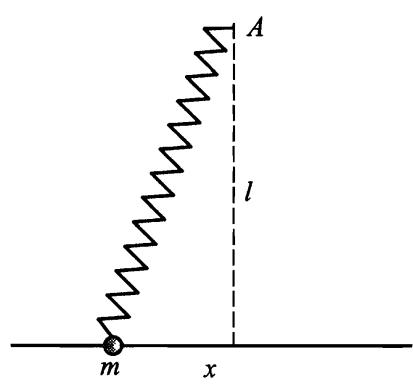
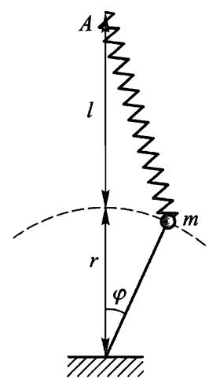

# §21 一维自由振动

在稳定平衡位置附近的运动是力学系统的一种非常普遍的运动类型，称为微振动.我们从最简单的情况即只有一个自由度的系统，开始研究这种运动.

稳定平衡位置是指势能 $U ( q )$ 取极小值的位置，偏离该位置会导致产生力 $- \mathrm{d}U / \mathrm{d}q$ ，它力图使系统返回平衡位置.我们用 $q _ { 0 }$ 表示广义坐标 $q$ 在平衡位置的值.在偏离平衡位置很小的情况下，在 $U ( q ) - U ( q _ { 0 } )$ 按 $q - q _ { 0 }$ 的幂次展开的表达式中保留到第一个非零项就足够了.一般情况下这是二阶项

$$
U ( q ) - U ( q _ { 0 } ) { \approx } \frac { k } { 2 } ( q - q _ { 0 } ) ^ { 2 } ,
$$

其中 $k$ 是二阶导数 $U ^ { \prime \prime } ( q )$ 在 $q = q _ { 0 }$ 处的值，是正数.今后我们从势能的最小值开始计算势能(即假设 $U ( q _ { 0 } ) = 0 { \dot { } }$ ），并引入记号

$$
x = q - q _ { 0 } \tag{21.1}
$$

表示坐标对平衡位置的偏离.于是有

$$
U ( x ) = { \frac { k x ^ { 2 } } { 2 } } \tag{21.2}
$$

一个自由度系统的动能一般可以写成

$$
\frac { 1 } { 2 } a \left( q \right) \dot { q } ^ { 2 } = \frac { 1 } { 2 } a \left( q \right) \dot { x } ^ { 2 } .
$$

在同样的近似下函数 $\alpha ( q )$ 可以用它在 $q = q _ { 0 }$ 处的值代替.引入记号:

$$
\alpha ( q _ { 0 } ) = m ,
$$

最后可得一维微振动系统的拉格朗日函数表达式如下：

$$
L = { \frac { m { \dot { x } } ^ { 2 } } { 2 } } - { \frac { k x ^ { 2 } } { 2 } } \tag{21.3}
$$

相应的运动方程为

$$
m \ddot { x } + k x = 0 \tag{21.4}
$$

或者

$$
\ddot { x } + \omega ^ { 2 } x = 0 \tag{21.5}
$$

这里引入了记号

$$
\omega = \sqrt { k / m } \tag{21.6}
$$

线性微分方程(21.5)的两个线性无关的解为: $\cos \omega t$ 和 $\sin \omega t$ ,因此方程的通解为

$$
x = c _ { 1 } \cos \omega t + c _ { 2 } \sin \omega t . \tag{21.7}
$$

这个表达式也可以写成

$$
x = a \cos ( \omega t + \alpha ) . \tag{21.8}
$$

因为 $\cos ( \omega t + \alpha ) = \cos \omega t \cos \alpha - \sin \omega t \sin \alpha$ ,与(21.7)比较可得任意常数 $_ { a }$ 和 $\alpha$ 与常数 $c _ { 1 }$ 和 $c _ { 2 }$ 的关系：

$$
\alpha = \sqrt { c _ { 1 } ^ { 2 } + c _ { 2 } ^ { 2 } } , \quad \tan \alpha = - \ c _ { 2 } / c _ { 1 } .\tag{21.9}
$$

于是，系统在稳定平衡位置附近的运动是简谐振动.(21.8)中周期因子前面的系数 $_ { a }$ 称为振动的振幅，而余弦的宗量称为振动的相位， $\alpha$ 是相位的初始值，显然依赖于初始时间的选择.物理量 $\omega$ 称为振动的圆频率.然而，在理论物理学中，通常简称为频率，今后我们就用这个简称.

频率是振动的基本特征量，不依赖于运动初始条件.根据公式(21.6），它完全由力学系统本身的性质决定.但是应该指出，频率的这个性质与小振幅振动假设有关，在更高阶近似时就没有这个性质了.从数学角度看，它与势能是坐标的二次函数有关.②

微振动系统的能量为

$$
E = { \frac { m { \dot { x } } ^ { 2 } } { 2 } } + { \frac { k x ^ { 2 } } { 2 } } = { \frac { m } { 2 } } \big ( \dot { x } ^ { 2 } + \omega ^ { 2 } x ^ { 2 } \big ) ,
$$

或者,将(21.8)代入此式得

$$
E = \frac { 1 } { 2 } m \omega ^ { 2 } \alpha ^ { 2 } . \tag{21.10}
$$

能量与振幅平方成正比.

振动系统坐标对时间的依赖关系经常方便地写成复数表达式的实部：

$$
x = \mathrm { R e } { A \mathrm { e } ^ { \mathrm { i } \omega t } } , \tag{21.11}
$$

其中 $A$ 是复常数，写成下面形式：

$$
A = a \mathrm { e } ^ { 1 \alpha } , \tag{21.12}
$$

则又回到(21.8)式了.常数 $A$ 称为复振幅，它的模就是通常的振幅，而辐角就是 初相位.

在数学上，指数函数运算比三角函数运算简单，因为指数函数的微分并不改变形式.只要我们进行的是线性运算（加法、数乘、微分和积分），一般可以不写出取实部的符号Re，只需对最后的计算结果取实部.

# 习 题

## 习题1

试用坐标和速度的初始值 $x _ { 0 }$ 和 $\boldsymbol { v } _ { 0 }$ 表示振动的振幅和初始相位.答：

$$
a = \sqrt { x _ { 0 } ^ { 2 } + \frac { v _ { 0 } ^ { 2 } } { \omega ^ { 2 } } } , ~ \tan \alpha = - \frac { v _ { 0 } } { \omega x _ { 0 } } .
$$

## 习题2

试求由不同同位素原子组成的两个双原子分子的振动频率 $\omega$ 和 $\omega ^ { \mathrm { i } }$ 的比值，设原子的质量分别等于 $m _ { 1 } , m _ { 2 }$ 和 $m _ { 1 } ^ { ' } , m _ { 2 } ^ { ' }$ .

解：因为同位素原子以相同的方式相互作用，则有 $k = k ^ { \prime }$ .在分子动能中起系数 $_ { m }$ 作用的是约化质量.根据(21.6)有

$$
\frac { \omega ^ { ' } } { \omega } { = } \sqrt { \frac { m _ { 1 } m _ { 2 } ( m _ { 1 } ^ { ' } + m _ { 2 } ^ { ' } ) } { m _ { 1 } ^ { ' } m _ { 2 } ^ { ' } ( m _ { 1 } + m _ { 2 } ) } } .
$$

## 习题3

设质量为 $m$ 的质点沿着直线运动，弹簧一端连在质点上，另一端固定于 $A$ 点（图22）. $A$ 点到直线的距离为 $l$ ，弹簧长度为 $l$ 时受力为 $F$ ，试求质点的振动频率.

解：弹簧势能等於力 $F$ 乘以弹簧伸长量δl(精确到更高阶项).当 $x \ll l$ 时，有

$$
\begin{array} { r } { \delta \ l = \sqrt { \ l ^ { 2 } + x ^ { 2 } } - l \approx \ x ^ { 2 } / ( 2 l ) , } \end{array}
$$

因此， $U = F x ^ { 2 } / ( 2 l )$ .因为动能为 $m { \dot { x } } ^ { 2 } / 2$ ,故

$$
\omega = { \sqrt { \frac { F } { m l } } } .
$$

  
图22

## 习题4 

同上题，质量为 $m$ 的质点沿着半径为 $r$ 的圆运动(图23).

解:在这种情况下，弹簧伸长量为（在 $\varphi \ll 1$ 时）

[] $\delta \ l = \sqrt { \ r ^ { 2 } + ( \ l + \ r ) ^ { 2 } - 2 r ( \ l + \ r ) { \cos \varphi } } - l { \approx } \frac { r ( \ l + \ r ) } { 2 l } \varphi ^ { 2 } .$ 动能为 $T = \left( 1 / 2 \right) m r ^ { 2 } \stackrel { . } { \varphi } ^ { 2 }$ .由此得频率：

$$
\omega = \sqrt { \frac { F ( \boldsymbol { r } + \boldsymbol { l } ) } { r l m } } .
$$

## 习题5

试求 $\ S 5$ 图2所示摆的振动频率，悬挂点（质量为 $m _ { 1 }$ )可沿着水平方向自由运动.

解：当 $\varphi \ll 1$ 时，由 $\ S 1 4$ 习题3所得公式有

$$
T = { \frac { m _ { 1 } m _ { 2 } l ^ { 2 } } { 2 ( m _ { 1 } + m _ { 2 } ) } } { \dot { \varphi } } ^ { 2 } , U = { \frac { m _ { 2 } g l } { 2 } } \varphi ^ { 2 } .
$$

由此得

$$
\omega = \sqrt { \frac { g ( m _ { 1 } + m _ { 2 } ) } { m _ { 1 } l } } .
$$

  
图23

## 习题6 

设质点沿着某曲线(在重力场中)振动的频率不依赖于振幅，试求该曲线的形状.

解：如果质点沿着曲线运动的势能为 $U = k s ^ { 2 } / 2$ ，其中 $s$ 为从平衡位置算起的弧长，则该曲线能满足要求.这时动能为 $T = m \ i ^ { 2 } / 2 ( \ m$ 为质点的质量）,振动频率为 $\omega = \sqrt { k / m }$ ,不依赖于 $s$ 的初始值.

但在重力场中 $U = m g y$ ，其中 $_ y$ 是纵坐标.所以有 $k s ^ { 2 } / 2 = m g y$ 或者

$$
y = \frac { \omega ^ { 2 } } { 2 g } s ^ { 2 } .
$$

另一方面， $\mathrm { d } s ^ { 2 } = \mathrm { d } x ^ { 2 } + \mathrm { d } y ^ { 2 }$ ,由此得

$$
x = \int \sqrt { \left( \frac { \mathrm { d } s } { \mathrm { d } y } \right) ^ { 2 } - 1 } \mathrm { d } y = \int \sqrt { \frac { g } { 2 { \omega } ^ { 2 } y } - 1 } \mathrm { d } y .
$$

作代换

$$
y = \frac { g } { 4 \omega ^ { 2 } } ( 1 - \cos \xi )
$$

后，很容易积分得

$$
x = \frac { g } { 4 \omega ^ { 2 } } (\xi + \sin \xi ) .
$$

这两个等式给出了所求曲线的参数方程，这是一条摆线.
