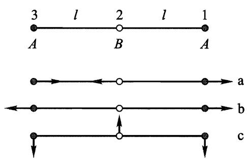
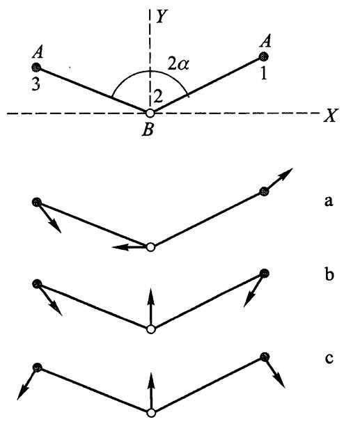
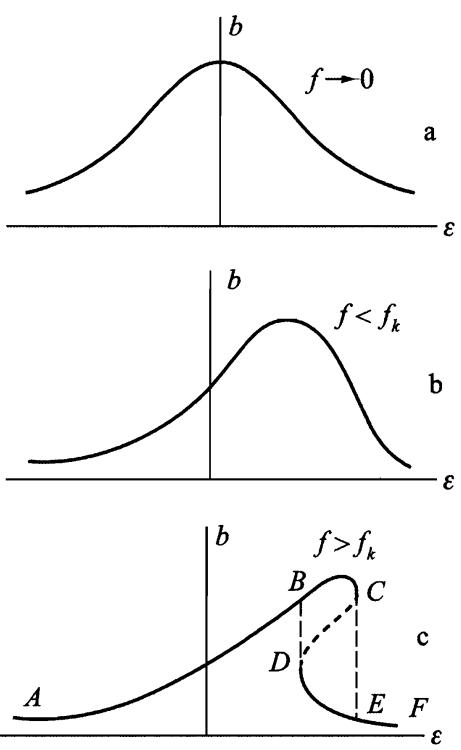
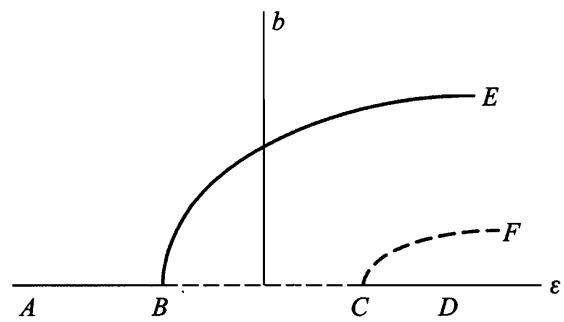
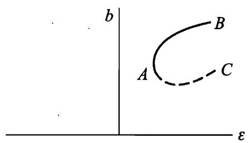

# 第五章

# 微振动

# $\ S 2 1$ 一维自由振动

在稳定平衡位置附近的运动是力学系统的一种非常普遍的运动类型，称为微振动.我们从最简单的情况即只有一个自由度的系统，开始研究这种运动.

稳定平衡位置是指势能 $U ( q )$ 取极小值的位置，偏离该位置会导致产生力$- \mathrm { d } U / \mathrm { d } q$ ，它力图使系统返回平衡位置.我们用 $q _ { 0 }$ 表示广义坐标 $q$ 在平衡位置的值.在偏离平衡位置很小的情况下，在 $U ( q ) - U ( q _ { 0 } )$ 按 $q - q _ { 0 }$ 的幂次展开的表达式中保留到第一个非零项就足够了.一般情况下这是二阶项

$$
U ( q ) - U ( q _ { 0 } ) { \approx } \frac { k } { 2 } ( q - q _ { 0 } ) ^ { 2 } ,
$$

其中 $k$ 是二阶导数 $U ^ { \prime \prime } ( q )$ 在 $q = q _ { 0 }$ 处的值，是正数.今后我们从势能的最小值开始计算势能(即假设 $U ( q _ { 0 } ) = 0 { \dot { } }$ ），并引入记号

$$
x = q - q _ { 0 }
$$

表示坐标对平衡位置的偏离.于是有

$$
U ( x ) = { \frac { k x ^ { 2 } } { 2 } } .
$$

一个自由度系统的动能一般可以写成

$$
\frac { 1 } { 2 } a \left( q \right) \dot { q } ^ { 2 } = \frac { 1 } { 2 } a \left( q \right) \dot { x } ^ { 2 } .
$$

在同样的近似下函数 $\alpha ( q )$ 可以用它在 $q = q _ { 0 }$ 处的值代替.引入记号 $\textcircled{1}$

$$
\alpha ( q _ { 0 } ) = m ,
$$

最后可得一维微振动系统 $\textcircled{1}$ 的拉格朗日函数表达式如下：

$$
L = { \frac { m { \dot { x } } ^ { 2 } } { 2 } } - { \frac { k x ^ { 2 } } { 2 } } .
$$

相应的运动方程为

$$
m \ : \ddot { x } + k x = 0 ,
$$

或者

$$
\ddot { x } + \omega ^ { 2 } x = 0 ,
$$

这里引入了记号

$$
\omega = \sqrt { k / m } .
$$

线性微分方程(21.5)的两个线性无关的解为:cosωt和 $\sin \omega t$ ,因此方程的通解为

$$
x = c _ { 1 } \cos \omega t + c _ { 2 } \sin \omega t .
$$

这个表达式也可以写成

$$
x = a \cos ( \omega t + \alpha ) .
$$

因为 $\cos ( \omega t + \alpha ) = \cos \omega t \cos \alpha - \sin \omega t \sin \alpha$ ,与(21.7)比较可得任意常数 $_ { a }$ 和 $\alpha$ 与常数 $c _ { 1 }$ 和 $c _ { 2 }$ 的关系：

$$
\alpha = \sqrt { c _ { 1 } ^ { 2 } + c _ { 2 } ^ { 2 } } , \quad \tan \alpha = - \ c _ { 2 } / c _ { 1 } .
$$

于是，系统在稳定平衡位置附近的运动是简谐振动.(21.8)中周期因子前面的系数 $_ { a }$ 称为振动的振幅，而余弦的宗量称为振动的相位， $\alpha$ 是相位的初始值，显然依赖于初始时间的选择.物理量 $\omega$ 称为振动的圆频率.然而，在理论物理学中，通常简称为频率，今后我们就用这个简称.

频率是振动的基本特征量，不依赖于运动初始条件.根据公式(21.6），它完全由力学系统本身的性质决定.但是应该指出，频率的这个性质与小振幅振动假设有关，在更高阶近似时就没有这个性质了.从数学角度看，它与势能是坐标的二次函数有关.②

微振动系统的能量为

$$
E = { \frac { m { \dot { x } } ^ { 2 } } { 2 } } + { \frac { k x ^ { 2 } } { 2 } } = { \frac { m } { 2 } } \big ( \dot { x } ^ { 2 } + \omega ^ { 2 } x ^ { 2 } \big ) ,
$$

或者,将(21.8)代入此式得

$$
E = \frac { 1 } { 2 } m \omega ^ { 2 } \alpha ^ { 2 } .
$$

能量与振幅平方成正比.

振动系统坐标对时间的依赖关系经常方便地写成复数表达式的实部：

$$
x = \mathrm { R e } \left\{ A \mathrm { e } ^ { \mathrm { i } \omega t } \right\} ,
$$

其中 $A$ 是复常数，写成下面形式：

$$
A = a \mathrm { e } ^ { 1 \alpha } ,
$$

则又回到(21.8)式了.常数 $A$ 称为复振幅，它的模就是通常的振幅，而辐角就是 初相位.

在数学上，指数函数运算比三角函数运算简单，因为指数函数的微分并不改变形式.只要我们进行的是线性运算（加法、数乘、微分和积分），一般可以不写出取实部的符号Re，只需对最后的计算结果取实部.

# 习 题

习题1试用坐标和速度的初始值 $x _ { 0 }$ 和 $\boldsymbol { v } _ { 0 }$ 表示振动的振幅和初始相位.答：

$$
a = \sqrt { x _ { 0 } ^ { 2 } + \frac { v _ { 0 } ^ { 2 } } { \omega ^ { 2 } } } , ~ \tan \alpha = - \frac { v _ { 0 } } { \omega x _ { 0 } } .
$$

习题2试求由不同同位素原子组成的两个双原子分子的振动频率 $\omega$ 和 $\omega ^ { \mathrm { i } }$ 的比值，设原子的质量分别等于 $m _ { 1 } , m _ { 2 }$ 和 $m _ { 1 } ^ { ' } , m _ { 2 } ^ { ' }$ .

解：因为同位素原子以相同的方式相互作用，则有 $k = k ^ { \prime }$ .在分子动能中起系数 $_ { m }$ 作用的是约化质量.根据(21.6)有

$$
\frac { \omega ^ { ' } } { \omega } { = } \sqrt { \frac { m _ { 1 } m _ { 2 } ( m _ { 1 } ^ { ' } + m _ { 2 } ^ { ' } ) } { m _ { 1 } ^ { ' } m _ { 2 } ^ { ' } ( m _ { 1 } + m _ { 2 } ) } } .
$$

习题3设质量为 $_ m$ 的质点沿着直线运动，弹簧一端连在质点上，另一端固定于 $A$ 点（图22）. $A$ 点到直线的距离为 $l$ ，弹簧长度为 $l$ 时受力为 $F$ ，试求质点的振动频率.

解：弹簧势能等於力 $F$ 乘以弹簧伸长量δl(精确到更高阶项).当 $x \ll l$ 时，有

$$
\begin{array} { r } { \delta \ l = \sqrt { \ l ^ { 2 } + x ^ { 2 } } - l \approx \ x ^ { 2 } / ( 2 l ) , } \end{array}
$$

因此， $U = F x ^ { 2 } / ( 2 l )$ .因为动能为 $m { \dot { x } } ^ { 2 } / 2$ ,故

$$
\omega = { \sqrt { \frac { F } { m l } } } .
$$

  
图22

习题4 同上题，质量为 $_ m$ 的质点沿着半径为 $r$ 的圆运动(图23).

解:在这种情况下，弹簧伸长量为（在 $\varphi \ll 1$ 时）

[] $\delta \ l = \sqrt { \ r ^ { 2 } + ( \ l + \ r ) ^ { 2 } - 2 r ( \ l + \ r ) { \cos \varphi } } - l { \approx } \frac { r ( \ l + \ r ) } { 2 l } \varphi ^ { 2 } .$ 动能为 $T = \left( 1 / 2 \right) m r ^ { 2 } \stackrel { . } { \varphi } ^ { 2 }$ .由此得频率：

$$
\omega = \sqrt { \frac { F ( \boldsymbol { r } + \boldsymbol { l } ) } { r l m } } .
$$

习题5试求 $\ S 5$ 图2所示摆的振动频率，悬挂点（质量为 $m _ { 1 }$ )可沿着水平方向自由运动.

解：当 $\varphi \ll 1$ 时，由 $\ S 1 4$ 习题3所得公式有

$$
T = { \frac { m _ { 1 } m _ { 2 } l ^ { 2 } } { 2 ( m _ { 1 } + m _ { 2 } ) } } { \dot { \varphi } } ^ { 2 } , U = { \frac { m _ { 2 } g l } { 2 } } \varphi ^ { 2 } .
$$

  
图23

由此得

$$
\omega = \sqrt { \frac { g ( m _ { 1 } + m _ { 2 } ) } { m _ { 1 } l } } .
$$

习题6 设质点沿着某曲线(在重力场中)振动的频率不依赖于振幅，试求 该曲线的形状.

解：如果质点沿着曲线运动的势能为 $U = k s ^ { 2 } / 2$ ，其中 $s$ 为从平衡位置算起的弧长，则该曲线能满足要求.这时动能为 $T = m \ i ^ { 2 } / 2 ( \ m$ 为质点的质量）,振动频率为 $\omega = \sqrt { k / m }$ ,不依赖于 $s$ 的初始值.

但在重力场中 $U = m g y$ ，其中 $_ y$ 是纵坐标.所以有 $k s ^ { 2 } / 2 = m g y$ 或者

$$
y = \frac { \omega ^ { 2 } } { 2 g } s ^ { 2 } .
$$

另一方面， $\mathrm { d } s ^ { 2 } = \mathrm { d } x ^ { 2 } + \mathrm { d } y ^ { 2 }$ ,由此得

$$
x = \int \sqrt { \left( \frac { \mathrm { d } s } { \mathrm { d } y } \right) ^ { 2 } - 1 } \mathrm { d } y = \int \sqrt { \frac { g } { 2 { \omega } ^ { 2 } y } - 1 } \mathrm { d } y .
$$

作代换

$$
y = \frac { g } { 4 \omega ^ { 2 } } ( 1 - \cos \xi )
$$

后，很容易积分得

$$
x = \frac { g } { 4 \omega ^ { 2 } } ( \pmb { \xi } + \sin \pmb { \xi } ) .
$$

这两个等式给出了所求曲线的参数方程，这是一条摆线.

# $\ S \ 2 2$ 强迫振动

现在我们研究可变外力场作用下系统的振动，这种振动称为强迫振动，以区别于 $\ S 2 1$ 研究的自由振动.因为前面也假定是微振动，则意味着外力场很弱，否则它会引起过大的位移 $_ { x }$

这种情况下，系统除了固有势能 $( 1 / 2 ) k x ^ { 2 }$ 以外，还有与外力场作用相关的势能 $U _ { \mathrm { e } } ( x , t )$ .将这个附加势能展开为小量 $_ { x }$ 的幂级数,得

$$
U _ { \mathrm { e } } ( x , t ) \approx \left. U _ { \mathrm { e } } ( 0 , t ) + x \frac { \partial U _ { \mathrm { e } } } { \partial x } \right| _ { x = 0 } .
$$

第一项只是时间的函数，可以从拉格朗日函数中略去(作为另一个时间的函数对时间的全导数).第二项中 $- \partial U _ { \mathrm { e } } / \partial x$ 是外力，作用于处在平衡位置的系统上，是时间的给定函数，用 $F ( t )$ 表示.于是势能中出现了 $- \ x F ( t )$ 项，所以系统的拉格朗日函数为

$$
L = \frac { m \dot { x } ^ { 2 } } { 2 } - \frac { k x ^ { 2 } } { 2 } + x F ( t ) .
$$

相应的运动方程为

$$
m \ : \ddot { x } + k x = F ( t ) ,
$$

或者

$$
\ddot { x } + \omega ^ { 2 } x = \frac { 1 } { m } F ( t ) ,
$$

这里我们再次引入了自由振动频檬 $\omega$ .

众所周知，非齐次常系数线性微分方程的通解为两项之和： $x = x _ { 0 } + x _ { 1 }$ ，其中 $x _ { 0 }$ 是齐次方程的通解， $x _ { 1 }$ 是非齐次方程的特解.在现在的情况下， $x _ { 0 }$ 就是$\ S 2 1$ 研究的自由振动.

我们来看一种特别有意义的情况，强迫力是频率为 $\gamma$ 的简单时间周期函数，即

$$
F ( t ) = f { \cos ( \gamma t + \beta ) } .
$$

我们寻找方程(22.2)形式为 $x _ { 1 } = b \cos ( \gamma t + \beta )$ 的特解，它具有与强迫力同样的周期因子.代入方程可得： $b = f / [ \ m ( \omega ^ { 2 } - \gamma ^ { 2 } ) ]$ ,加上齐次方程的解，有下列形式的通解

$$
x = a \cos ( \omega t + \alpha ) + \frac { f } { m \left( \omega ^ { 2 } - \gamma ^ { 2 } \right) } \mathrm { c o s } ( \gamma t + \beta ) .
$$

任意积分常数 $\alpha$ 和 $\alpha$ 由初始条件确定.

于是，在周期性强迫力作用下，系统的运动是两个振动的合成，两个振动的频率分别为系统的固有频率 $\omega$ 和强迫力的频率 $\gamma$ .

解(22.4)不适用于所谓的共振情况，即强迫力的频率 $\gamma$ 与固有频率 $\omega$ 相等的情况.为了求这种情况下方程的通解，将(22.4)改写成如下形式，

$$
x = \alpha \cos ( \omega t + \alpha ) + \frac { f } { m \left( \omega ^ { 2 } - \gamma ^ { 2 } \right) } \big [ \cos ( \gamma \ t + \beta ) - \cos ( \omega t + \beta ) \big ] .
$$

其中常数 $\alpha$ 现在有不同的值.当 $\gamma \to \omega$ 时，第二项变为 $0 \%$ 的不确定形式.按照洛必达法则消除不确定性可得

$$
x = \alpha \cos ( \omega t + \alpha ) + \frac { f } { 2 m \omega } t \sin ( \omega t + \beta ) .
$$

于是，在共振情况下，振动的振幅随时间线性增大(直到不再是微振动，上述所有理论都不适用为止）.

我们再来研究共振附近的微振动的性质，即 $\gamma = \omega + \varepsilon$ ,其中 $\varepsilon$ 是小量.我们将通解写成复数形式

$$
x = A \mathrm { e } ^ { \mathrm { i } \omega t } + B \mathrm { e } ^ { \mathrm { i } \left( \omega + \varepsilon \right) t } = \left( A + B \mathrm { e } ^ { \mathrm { i } \varepsilon t } \right) \mathrm { e } ^ { \mathrm { i } \omega t } .
$$

因为 $A + B \mathrm { e } ^ { \mathrm { i } \varepsilon t }$ 在因子 $\mathrm { e } ^ { \mathrm { i } \omega t }$ 的周期 $2 \pi / \omega$ 内变化很小，所以共振附近的运动可以看作是微振动，但振幅是变化的.①

用 $C$ 表示振幅，有

$$
C = \vert A + B \mathrm { e } ^ { \mathrm { i } \epsilon t } \vert .
$$

将 $A$ 和 $B$ 分别表示为 $a \mathrm { e } ^ { \mathrm { i } \alpha }$ 和 $b \mathrm { e } ^ { \mathrm { i } \beta }$ ,可得

$$
C ^ { 2 } = a ^ { 2 } + b ^ { 2 } + 2 a b \cos ( \operatorname { \varepsilon } t + \beta - \alpha ) .
$$

于是，振幅以频率 $\varepsilon$ 周期变化，其变化范围是

$$
\mid a - b \mid \leqslant C \leqslant a + b .
$$

这种现象称为拍.

对任意强迫力 $F ( t )$ ,可以在一般形式下对方程(22.2)积分求解.这很容易做到，只要将方程重写为

$$
\frac { \mathrm { d } } { \mathrm { d } t } ( \dot { x } + \mathrm { i } \omega \ x ) - \mathrm { i } \omega ( \dot { x } + \mathrm { i } \omega x ) = \frac { 1 } { m } F ( \ t )
$$

或者

$$
\frac { \mathrm { d } \xi } { \mathrm { d } t } - \mathrm { i } \omega \xi = \frac { 1 } { m } F ( t ) ,
$$

这里引入了复变量

$$
\pmb { \xi } = \pmb { \dot { x } } + \mathrm { i } \omega \ \mathscr { x } .
$$

方程(22.8)不是二阶，而是一阶微分方程.如果没有右边部分，它的解是 $\xi =$ $A \mathrm { e } ^ { \mathrm { i } \omega t }$ ,其中 $A$ 是常数.如同前面一样，我们寻找非齐次方程形式为 $\xi = A \left( \begin{array} { l } { t } \end{array} \right) \mathrm { e } ^ { \mathrm { i } \omega t }$ 的解，对于函数 $A \left( \mathbf { \Phi } _ { t } \right)$ 可得方程

$$
\dot { \boldsymbol { A } } \left( \iota \right) = \frac { 1 } { m } \boldsymbol { F } \left( \iota \right) \mathrm { e } ^ { - \mathrm { i } \omega t } .
$$

积分后，可得方程(22.8)的解

$$
\xi = \mathrm { e } ^ { \mathrm { i } \omega t } \Bigl [ \int _ { 0 } ^ { t } \frac { 1 } { m } F ( t ) \mathrm { e } ^ { - \mathrm { i } \omega t } \mathrm { d } t + \pounds _ { 0 } \Bigr ] ,
$$

其中积分常数 $\xi _ { 0 }$ 是 $\scriptstyle { t = 0 }$ 时 $\xi$ 的值.这就是需要寻找的通解，函数 $x ( t )$ 由(22.10)的虚部除以 $\omega$ 给出.②

系统做强迫振动时能量显然是不守恒的，因为系统靠外场源获得能量.假设初始能量为零，我们来求在外力作用时间内（从 $- \infty$ 到 $+ \infty .$ )传递到系统的总能量.根据公式(22.10)(积分下限用 $- \infty$ 代替零，并且 $\xi ( - \infty ) = 0 ,$ ，在 $t ^ {  \infty }$ 时有

$$
\mid \xi ( \infty ) \mid ^ { 2 } = \frac { 1 } { m ^ { 2 } } \left| \int _ { - \infty } ^ { \infty } F ( t ) \mathrm { e } ^ { - \mathrm { i } \omega t } \mathrm { d } t \right| ^ { 2 } .
$$

另一方面，系统的能量表达式为

$$
E = { \frac { m } { 2 } } { \big ( } { \dot { x } } ^ { 2 } + \omega ^ { 2 } x ^ { 2 } { \big ) } = { \frac { m } { 2 } } { \mid } \xi { \mid } ^ { 2 } .
$$

将 $| \xi ( \infty ) | ^ { 2 }$ 代入此式，可得所要求的转移能量

$$
E = \frac { 1 } { 2 m } \left| \int _ { - \infty } ^ { \infty } F ( t ) \mathrm { e } ^ { - \mathrm { \imath } \omega t } \mathrm { d } t \right| ^ { 2 } .
$$

其值由力 $F ( t )$ 的傅里叶分量模的平方所决定，该力的频率等于系统的固有频率：

特别地，如果外力作用的时间与 $1 / \omega$ 相比很短，则可以令 $\mathrm { e } ^ { - \mathrm { i } \omega t } { \approx } 1$ .于是有

$$
E = \frac { 1 } { 2 m } \left( \int _ { - \infty } ^ { \infty } F ( t ) \mathrm { d } t \right) ^ { 2 } .
$$

这个结果是显然的，它表明短时间的力给系统提供冲量 $\int F { \mathrm { d } } t$ ,但来不及使系统产生显著的位移.

# 习 题

习题1如果初始时刻 $t = 0$ 系统静止在平衡位置( $x = { \dot { x } } = 0$ )，试求系统在下列几种形式的外力 $F ( t )$ 作用下的强迫振动.

a) $F = \mathrm { c o n s t } = F _ { 0 } .$

答： $x = \frac { F _ { 0 } } { m { \omega } ^ { 2 } } ( 1 - \cos { \omega t } )$ ，常力作用的结果是使振动所围绕的平衡位置产生位移.

b) $F = \alpha t$

答： $x = { \frac { \alpha } { m { \omega } ^ { 3 } } } ( \omega t - \sin \omega t )$ .   
c) $F = F _ { 0 } { \mathrm { e } } ^ { - \alpha t }$ .

答： $x = { \frac { F _ { 0 } } { m \left( \omega ^ { 2 } + \alpha ^ { 2 } \right) } } { \big ( } \mathrm { e } ^ { - \alpha t } - \cos \omega t + { \frac { \alpha } { \omega } } \mathrm { s i n } \omega t { \big ) } .$ d) $F = F _ { 0 } \mathrm { e } ^ { - \alpha t } \mathrm { c o s } \beta t$ .

答：

$$
x = { \frac { F _ { 0 } } { m \left[ { \bigl ( } \omega ^ { 2 } + \alpha ^ { 2 } - \beta ^ { 2 } ) ^ { 2 } + 4 \alpha ^ { 2 } \beta ^ { 2 } { \bigr ) } \right. } } \left\{ \right. - { \bigl ( } \omega ^ { 2 } + \alpha ^ { 2 } - \beta ^ { 2 } { \bigr ) } \cos \ \omega t + { \cal O } ( \beta ^ { 2 } ) \cos \ \omega t \ + \quad 
$$

$$
\begin{array} { r } { \frac { \alpha } { \omega } ( \omega ^ { 2 } + \alpha ^ { 2 } + \beta ^ { 2 } ) \mathrm { s i n } \omega t + \mathrm { e } ^ { - \alpha t } \big [ \big ( \omega ^ { 2 } + \alpha ^ { 2 } - \beta ^ { 2 } \big ) \mathrm { c o s } \beta t - 2 \alpha \beta \mathrm { s i n } \beta t \big ] \big \} } \end{array}
$$

（在求解过程中将力写成复数形式 $F = F _ { 0 } \mathrm { e } ^ { ( - \alpha + \mathrm { i } \beta ) t }$ 比较方便).

习题2设直到 $t = 0$ 时系統静止在平衡位置，力 $F$ 的变化规律为：当 $t < 0$ 时 $F = 0$ ,当 $0 < t < T$ 时 $F = F _ { 0 } t { \big / } T$ ,当 $t > T$ 时 $F = F _ { 0 }$ （图24）.试求在该力作用后系统振动的最后振幅.

解:在时间间隔 $0 < \tau < T$ 內满足初始条件的振动为

$$
x = { \frac { F _ { 0 } } { m { T _ { \omega } } ^ { 3 } } } ( \omega t - \sin \omega t ) .
$$

  
图24

当 $t > T$ 时我们求下面形式的解：

$$
x = c _ { 1 } \mathrm { c o s } \big [ \omega \big ( t - T \big ) \big ] + c _ { 2 } \mathrm { s i n } \big [ \omega \big ( t - T \big ) \big ] + \frac { F _ { 0 } } { m \omega ^ { 2 } } .
$$

由 $_ { x }$ 和 $\dot { x }$ 在 $t = T$ 处连续的条件，可求出

$$
c _ { 1 } = \mathrm { - } \frac { F _ { 0 } } { \mathrm { } m T \omega ^ { 3 } } { \sin } \omega T , \quad c _ { 2 } = \frac { F _ { 0 } } { \mathrm { } m T \omega ^ { 3 } } \big ( 1 - { \cos } \omega T \big ) .
$$

这样得振幅

$$
\alpha = \sqrt { \ c _ { 1 } ^ { 2 } + \ c _ { 2 } ^ { 2 } } = \frac { 2 F _ { 0 } } { m T \omega ^ { 3 } } \mathrm { s i n } \frac { \omega T } { 2 } .
$$

可见，施加力 $F _ { 0 }$ 越缓慢(即 $T$ 越大）,这个振幅越小.

习题3 同习题2，力 $F _ { 0 }$ 是常数，只在有限时间间隔 $T$ 内作用(图25).

解：可以像习题 2 那样求解，但利用公式(22.10)更简单.当 $t > T$ 时系统在平衡位置 $x = 0$ 处自由振动，有

$$
\xi = \frac { F _ { 0 } } { m } \mathrm { e } ^ { \mathrm { i } \omega t } \int _ { 0 } ^ { T } \mathrm { e } ^ { - \mathrm { i } \omega t } \mathrm { ~ d ~ } t = \frac { F _ { 0 } } { \mathrm { i } \omega m } ( 1 - \mathrm { e } ^ { - \mathrm { i } \omega T } ) \mathrm { e } ^ { \mathrm { i } \omega t } .
$$

根据关系 $\mid \xi \mid ^ { 2 } = a ^ { 2 } \omega ^ { 2 } ,$ $\xi$ 的模的平方给出振幅.于是求得

$$
\alpha = \frac { 2 F _ { 0 } } { m \omega ^ { 2 } } \mathrm { s i n } \frac { \omega T } { 2 } .
$$

  
图25

  
图26

习题4同习题2，但力在从零到 $T$ 时间间隔内按规律 $F = F _ { 0 } t { \mathrm { / } } T$ 作用（图26).

解：用同样方法可求得

$$
\alpha = \frac { F _ { 0 } } { T m \omega ^ { 3 } } \sqrt { \omega ^ { 2 } T ^ { 2 } - 2 \omega T \mathrm { s i n } \omega T + 2 ( 1 - \mathrm { c o s } \omega T ) } .
$$

习题5同习题2，但力在从零到 $T = 2 \pi / \omega$ 时间间隔內按规律 $F = F _ { 0 } \sin \omega t$ 作用（图27）.

解：将

$$
F ( t ) = F _ { 0 } \mathrm { s i n } \omega t = { \frac { F _ { 0 } } { 2 \mathrm { i } } } ( \mathrm { e } ^ { \mathrm { i } \omega t } - \mathrm { e } ^ { - \mathrm { i } \omega t } )
$$

代入公式(22.10)并从零到 $T$ 积分，可得

$$
a = \frac { F _ { 0 } \pi } { m \omega ^ { 2 } } \mathrm { . }
$$

  
图27

# $\ S \ O 2 3$ 多自由度系统振动

多自由度 ${ \bf \Xi } ( { \bf \Lambda } _ { S } )$ 系统的自由振动理论类似于 $\ S 2 1$ 的一维振动.

设系统的势能 $U$ 是广义坐标 $\boldsymbol { q } _ { \iota } ( \iota = 1 , 2 , \cdots , s )$ 的函数，在 $q _ { \ i } = q _ { i 0 }$ 处取极小值.引入偏离平衡位置的小位移

$$
. \qquad x _ { i } = q _ { \iota } - q _ { \iota 0 } ,
$$

把 $U$ 展开为 $x _ { \imath }$ 的级数，并保留到二阶项，可得二次正定形式的势能：

$$
U = \frac { 1 } { 2 } \sum _ { \imath , k } k _ { \imath k } x _ { \imath } . x _ { k } ,
$$

这里我们又取势能的极小值为零.因为(23.2)中 $k _ { \iota k } , k _ { k \iota }$ 都是相同量 $x _ { \imath } \dot { x } _ { k }$ 的系数，那么它们总是可以被认为相等的：

$$
k _ { i k } = k _ { k i } .
$$

动能的一般形式为(参见(5.5))

$$
\frac { 1 } { 2 } \sum _ { \iota , \boldsymbol { k } } a _ { i \boldsymbol { k } } \left( \boldsymbol { q } \right) \dot { \boldsymbol { q } } _ { \iota } \dot { \boldsymbol { q } } _ { \boldsymbol { k } } ,
$$

在系数 $\boldsymbol { a } _ { i k }$ 中令 $q _ { i } = q _ { i 0 }$ ,并用 $m _ { i k }$ 表示 $a _ { \imath k } \left( \phantom { } q _ { 0 } \right)$ ，可得二次正定形式的动能：

$$
\frac 1 2 \sum _ { \iota , k } m _ { \iota k } \dot { x } _ { \iota } \dot { x } _ { k } .
$$

也总可以认为系数 $m _ { \iota k }$ 对下标是对称的：

$$
m _ { i k } = m _ { k \imath } .
$$

于是，自由微振动系统的拉格朗日函数为

$$
L = \frac { 1 } { 2 } \sum _ { \iota , k } \big ( m _ { \iota k } \dot { x } _ { i } \dot { x } _ { k } - k _ { \iota k } x _ { \iota } x _ { k } \big ) .
$$

现在我们导出运动方程.为了确定方程中包含的导数，我们写出拉格朗日函数的全微分：

$$
\mathrm { d } L = \frac { 1 } { 2 } \sum _ { i , k } \bigl ( m _ { \iota k } \dot { x } _ { , i } \mathrm { d } \dot { x } _ { k } + m _ { i k } \dot { x } _ { k } \mathrm { d } \dot { x } _ { , \mathrm { ~ } } - k _ { i k } x _ { \iota } \mathrm { d } x _ { k } - k _ { i k } x _ { k } \mathrm { d } x _ { i } \bigr ) .
$$

既然上面和之值不依赖于求和指标的名称，我们可以将括号中第一和第三项的$i$ 和 $k$ 相互交换，考虑到系数 $m _ { \iota k }$ 和 $k _ { \scriptscriptstyle { \imath } k }$ 的对称性，得

$$
\mathrm { d } L \ = \ \sum _ { \iota , \boldsymbol { k } } \big ( m _ { \iota k } \dot { x } _ { k } \mathrm { d } \dot { x } _ { i } - k _ { \iota k } x _ { k } \mathrm { d } x _ { i } \big ) .
$$

由此可见，

$$
{ \frac { \partial L } { \partial \ { \dot { x } } _ { i } } } = \ \sum _ { k } m _ { i k } { \dot { x } } _ { k } , \frac { \partial L } { \partial x _ { i } } = - \ \sum _ { k } k _ { \iota k } x _ { k } .
$$

所以拉格朗日方程为.

$$
\sum _ { k } m _ { \iota k } \ddot { x _ { k } } + \sum _ { k } k _ { \iota k } x _ { k } = 0 .
$$

这是 $s ( i = 1 , 2 , \cdots , s )$ 个线性齐次常系数微分方程组.

通常，我们寻找下面形式的 $s$ 个未知函数 $x _ { k } \left( \ t \right)$

$$
\begin{array} { r } { \boldsymbol { x } _ { k } = \boldsymbol { A } _ { k } \mathrm { e } ^ { \mathrm { i } \omega t } , } \end{array}
$$

其中 $A _ { k }$ 是一些待定常数.将(23.6)代入方程组(23.5),约去 $\mathrm { e } ^ { \mathrm { i } \omega t }$ ,可得常数 $A _ { k }$ 满足的齐次线性代数方程组

$$
\sum _ { k } \bigl ( - \ \omega ^ { 2 } m _ { \ i k } \ + \ k _ { i k } \bigr ) A _ { k } \ = \ 0 .
$$

如果该方程组有非零解，则其系数行列式必须等于零：

$$
\mid k _ { i k } - \omega ^ { 2 } m _ { \iota k } \mid = 0 .
$$

方程(23.8)称为特征方程，是 $\omega ^ { 2 }$ 的 $s$ 阶方程.在一般情况下，该方程有 $s$ 个不同的正实根 $\omega _ { \alpha } ^ { 2 } , \alpha = 1 , 2 , \cdots , s$ (在特殊情况下，这些根中有重根）.这样求出的 $\omega _ { \alpha }$ 称为系统的特征频率或本征频率.

从物理的观点来看，显然方程(23.8)的根为正实数.事实上， $\omega$ 有虛部就意味着，坐标 $x _ { k }$ 对时间的依赖关系(23.6）（以及速度 ${ \dot { x } } _ { k }$ )中包含指数减小或指数增长的因子.但这样的因子是不允许的，否则会导致系统总能量 $E = U + T$ 随时间变化，违背能量守恒定律.

也可以用数学方法证明上述结论.将(23.7)乘以 $\boldsymbol { A } _ { \iota } ^ { * }$ 并对下标 $i$ 求和,得

$$
\sum _ { \ i , k } \big ( - \omega ^ { 2 } m _ { i k } + k _ { \ i k } \big ) A _ { \ i } ^ { \ast } A _ { k } = 0 ,
$$

由此得

$$
\omega ^ { 2 } = \frac { \sum k _ { \imath k } A _ { i } ^ { * } A _ { k } } { \sum m _ { \imath k } A _ { \imath } ^ { * } A _ { k } } .
$$

由于系数 $m _ { i k }$ 和 $k _ { \scriptscriptstyle { \mathit { \imath k } } }$ 都是对称的实数，上式分子和分母中的二次型都是实数.事实上，

$$
\Big ( \sum _ { \iota , k } k _ { \iota k } A _ { i } ^ { \ast } A _ { k } \Big ) ^ { \ast } \ = \ \sum _ { \iota , k } k _ { \iota k } A _ { i } A _ { k } ^ { \ast } \ = \ \sum _ { \iota , k } k _ { \iota k } A _ { i } A _ { k } ^ { \ast } \ = \ \sum _ { \iota , k } k _ { \iota k } A _ { k } A _ { \iota } ^ { \ast } \ .
$$

它们也是正的 $\textcircled{1}$ ,因而 $\omega ^ { 2 }$ 也是正的.求得频率 $\omega _ { \alpha }$ 并将它们之中的每一个代入方程组(23.7)，就可以求出相应的系数Ak.如果特征方程所有的根ωa各不相同，则系数 $A _ { k }$ 正比于行列式(23.8)的代数余子式，其中 $\omega$ 用 $\omega _ { \alpha }$ 代替.用 $\Delta _ { k a }$ 表示这些余子式.微分方程(23.5)的特解因此有下面形式：

$$
\begin{array} { r } { \boldsymbol { x } _ { k } = \Delta _ { k \alpha } C _ { \alpha } \mathrm { e } ^ { \mathrm { i } \omega _ { a } t } , } \end{array}
$$

其中 $C _ { \alpha }$ 是任意常数（复数）.

所有这 $s$ 个特解求和，可给出通解.取其实部，写成

$$
x _ { k } = \mathrm { R e } \Big \{ \sum _ { \alpha = 1 } ^ { s } \Delta _ { k \alpha } C _ { \alpha } \mathrm { e } ^ { \mathrm { i } \omega _ { \alpha } t } \Big \} \equiv \sum _ { \alpha } \Delta _ { k \alpha } \Theta _ { \alpha } ,
$$

这里我们引入了记号

$$
\Theta _ { \alpha } = \mathrm { R e } \left\{ C _ { \alpha } \mathrm { e } ^ { \mathrm { i } \omega _ { \alpha } t } \right\} .
$$

于是，系统每个坐标随时间的变化都是 $s$ 个简单周期振动 $\Theta _ { 1 } , \Theta _ { 2 } , \cdots , \Theta _ { s }$ 的叠加，这些简单振动的振幅和相位都是任意的，但频率完全确定.

这自然会产生一个问题，可否选择广义坐标使得每个坐标都仅进行简单振动？通解(23.9)的形式给出了解决这个问题的途径.

事实上,将(23.9)的 $s$ 个关系式看作是 $s$ 个未知量 $\Theta _ { 1 } , \Theta _ { 2 } , \cdots , \Theta _ { s }$ 的方程组，求解后可以用 $x _ { 1 } , x _ { 2 } , \cdots , x _ { s }$ 表示 $\Theta _ { 1 } , \Theta _ { 2 } , \cdots , \Theta _ { s }$ .因此 $\Theta _ { 1 } , \Theta _ { 2 } , \cdots , \Theta _ { s }$ 可以看作新的广义坐标，这些坐标称为简正坐标（或者主坐标），它们进行简单的周期振动，称为系统的简正振动.

从简正坐标的定义可以看出，它们满足方程

$$
\ddot { \Theta } _ { \alpha } + \omega _ { \alpha } ^ { 2 } \Theta _ { \alpha } = 0 .
$$

这就是说，采用简正坐标，动力学方程组变为 $s$ 个相互独立的方程.每个简正坐标的加速度仅依赖于该坐标，只需已知坐标和相应速度的初值，就可以完全确定坐标对时间的依赖关系.换句话说，系统的简正振动是完全独立的.

由上述可知，用简正坐标表示的拉格朗日函数可以分解为一些表示式之和，每一个表示式都对应于某一频率 $\omega _ { \alpha }$ 的一维振动，即有如下形式

$$
L = \sum _ { \alpha } \frac { m _ { \alpha } } { 2 } ( \dot { \Theta } _ { \alpha } ^ { 2 } - \omega _ { \alpha } ^ { 2 } \Theta _ { \alpha } ^ { 2 } ) ,
$$

其中 $m _ { \alpha }$ 是正常数.从数学观点看，这意味着变换(23.9)将两个二次型(动能(23.3)和势能(23.2))同时变为对角的形式.

通常可以选择简正坐标，使得在拉格朗日函数中速度平方的系数等于1/2.为此，用下式定义新的简正坐标 $Q _ { \alpha }$

$$
Q _ { \alpha } = \sqrt { m _ { \alpha } } \Theta _ { \alpha } .
$$

那么

$$
L = \frac { 1 } { 2 } \sum _ { \alpha } ( \dot { Q } _ { \alpha } ^ { 2 } - \omega _ { \alpha } ^ { 2 } Q _ { \alpha } ^ { 2 } ) { . }
$$

当特征方程有重根时，上面的讨论几乎不需要改变.运动方程的积分的一般形式(23.9)和(23.10)也是一样的(也同为 $s$ 项），差别仅仅在于相应于重根的系数 $\Delta _ { k \alpha }$ 已不再是行列式的代数余子式，这种情况下这些余子式等于零. $\textcircled{1}$

一个多重(或称简并)频率相应的简正坐标的个数等于这个频率的重数，但是这些简正坐标的选择不是唯一的.对于相同 $\omega _ { \alpha }$ 的简正坐标，它们以和形式$\textstyle \sum { \dot { Q } } _ { \alpha } ^ { 2 }$ 和 $\textstyle \sum Q _ { \alpha } ^ { 2 }$ 包含在动能和势能中，这些和按相同的方式变换，因此可以对这些简正坐标进行任何方式的线性变换，只要不改变这些平方和.

对于在常外场中一个质点的三维振动，求简正坐标非常容易.取笛卡儿坐标系的原点位于势能 $U ( x , y , z )$ 的极小值处，可得变量 $x , y , z$ 的二次形式的势能，而动能

$$
T = { \frac { m } { 2 } } ( { \dot { x } } ^ { 2 } + { \dot { y } } ^ { 2 } + { \dot { z } } ^ { 2 } )
$$

( $^ m$ 为质点的质量)不依赖于坐标轴的取向.因此，仅需适当旋转坐标系即可将势能化为对角的形式.于是

$$
L = \frac { m } { 2 } ( \dot { x } ^ { 2 } + \dot { y } ^ { 2 } + \dot { z } ^ { 2 } ) - \frac { 1 } { 2 } ( k _ { 1 } x ^ { 2 } + k _ { 1 } y ^ { 2 } + k _ { 1 } z ^ { 2 } ) ,
$$

且沿着 $x , y , z$ 方向的振动是简正振动，其频率分别为

$$
\omega _ { 1 } = \sqrt { k _ { 1 } / m } \ , \quad \omega _ { 2 } = \sqrt { k _ { 2 } / m } \ , \quad \omega _ { 3 } = \sqrt { k _ { 3 } / m } \ .
$$

在有心对称力场 $(  k _ { 1 }  = k _ { 2 } = k _ { 3 } \equiv k$ , $U = \dot { k } r ^ { 2 } / 2 )$ 的特殊情况下，这三个频率相等(见习题3).

利用简正坐标可以将多自由度强迫振动问题转化为一系列单自由度强迫振动的问题.考虑到作用在系统上的可变外力，拉格朗日函数为

$$
L = L _ { 0 } + \sum _ { k } F _ { k } ( t ) x _ { k } ,
$$

其中 $L _ { 0 }$ 是自由振动的拉格朗日函数.用简正坐标代替 $x _ { k }$ 可得

$$
L = \frac { 1 } { 2 } \sum _ { \alpha } ( \dot { Q } _ { \alpha } ^ { 2 } - \omega _ { \alpha } ^ { 2 } Q _ { \alpha } ^ { 2 } ) + \sum _ { \alpha } f _ { \alpha } ( t ) Q _ { \alpha } ,
$$

其中引人了记号：

$$
f _ { \alpha } ( t ) = \sum _ { k } F _ { k } ( t ) \frac { \Delta _ { k \alpha } } { \sqrt { m _ { \alpha } } } .
$$

相应的运动方程

$$
\ddot { Q } _ { \alpha } + \omega _ { \alpha } ^ { 2 } Q _ { \alpha } = f _ { \alpha } ( \omega t )
$$

只包含一个未知函数 $Q _ { \alpha } ( \mathfrak { t } )$ .

# 习 题

习题1设两个自由度系统的拉格朗日函数为

$$
L = \frac { 1 } { 2 } ( \dot { x } ^ { 2 } + \dot { y } ^ { 2 } ) - \frac { \omega _ { 0 } ^ { 2 } } { 2 } ( x ^ { 2 } + y ^ { 2 } ) + \alpha x y
$$

(两个全同的本征频率为 $\omega _ { 0 }$ 的一维系统以相互作用 $- \alpha x y$ 耦合起来），试求系统的振动.

解：运动方程为

$$
\dddot { x } + \omega _ { 0 } ^ { 2 } x = \alpha ~ y , \quad \ddot { y } + \omega _ { 0 } ^ { 2 } y = \alpha ~ x .
$$

将(23.6)代入可得

$$
A _ { x } ( \omega _ { 0 } ^ { 2 } - \omega ^ { 2 } ) = \alpha A _ { y } , A _ { y } ( \omega _ { 0 } ^ { 2 } - \omega ^ { 2 } ) = \alpha A _ { x } .
$$

特征方程为

$$
( { \omega } _ { 0 } ^ { 2 } - { \omega } ^ { 2 } ) ^ { 2 } = { \alpha } ^ { 2 } ,
$$

由此得

$$
\omega _ { 1 } ^ { 2 } = \omega _ { 0 } ^ { 2 } - \alpha , \quad \omega _ { 2 } ^ { 2 } = \omega _ { 0 } ^ { 2 } + \alpha .
$$

当 $\omega = \omega _ { 1 }$ 时方程(1)给出 $A _ { x } = A _ { y }$ ,当 $\omega = \omega _ { 2 }$ 时方程(1)给出 $A _ { x } = - A _ { y }$ ，所以

$$
x = \frac { 1 } { \sqrt { 2 } } ( Q _ { 1 } + Q _ { 2 } ) , ~ y = \frac { 1 } { \sqrt { 2 } } ( Q _ { 1 } - Q _ { 2 } )
$$

（系数 $1 / \sqrt { 2 }$ 来自于方程(23.13)对简正坐标的归一化).

当 $\alpha \ll \omega _ { 0 } ^ { 2 }$ 时（弱耦合)，有

$$
\omega _ { 1 } \approx \omega _ { 0 } - \alpha / ( 2 \omega _ { 0 } ) , \quad \omega _ { 2 } \approx \omega _ { 0 } + \alpha / ( 2 \omega _ { 0 } ) .
$$

在这种情况下 $_ { x }$ 和 $y$ 的变化是两个频率几乎相等的振动的叠加，即具有频率为$\omega _ { 2 } - \omega _ { 1 } = \alpha / \omega _ { 0 }$ 的拍(参见 $\ S 2 2$ ).当坐标 $_ { x }$ 的振幅达到最大值时，坐标 $y$ 的振幅达到最小值，反之亦然.

习题2 试求平面双摆的微振动（见 $\ S 5$ 图1).

解：对于微振动 $( \varphi _ { 1 } { \ll } 1 , \varphi _ { 2 } { \ll } 1 )$ ,在 $\ S 5$ 的习题1中得到的拉格朗日函数写

成

$$
{ \mathsf { L } } = { \frac { m _ { 1 } + m _ { 2 } } { 2 } } { \mathit { l } } _ { 1 } ^ { 2 } { \dot { \varphi } } _ { 1 } ^ { 2 } + { \frac { m _ { 2 } } { 2 } } { \mathit { l } } _ { 2 } ^ { 2 } { \dot { \varphi } } _ { 2 } ^ { 2 } + m _ { 2 } { \mathit { l } } _ { 1 } { \mathit { l } } _ { 2 } { \dot { \varphi } } _ { 1 } { \dot { \varphi } } _ { 2 } - { \frac { m _ { 1 } + m _ { 2 } } { 2 } } g { \mathit { l } } _ { 1 } \varphi _ { 1 } ^ { 2 } - { \frac { m _ { 2 } } { 2 } } g { \mathit { l } } _ { 2 } \varphi _ { 2 } ^ { 2 } .
$$

运动方程为

$$
\begin{array} { r } { ( m _ { 1 } + m _ { 2 } ) \mathcal { l } _ { 1 } \stackrel {  } { \varphi } _ { 1 } + m _ { 2 } \mathcal { l } _ { 2 } \stackrel {  } { \varphi } _ { 2 } + ( m _ { 1 } + m _ { 2 } ) g \varphi _ { 1 } = 0 , } \\ { \mathcal { l } _ { 1 } \stackrel {  } { \varphi } _ { 1 } + \mathcal { l } _ { 2 } \stackrel {  } { \varphi } _ { 2 } + g \varphi _ { 2 } = 0 . } \end{array}
$$

将(23.6)代入后可得

$$
\begin{array} { r } { A _ { 1 } ( \ : m _ { 1 } + m _ { 2 } ) ( \ : g - l _ { 1 } \omega ^ { 2 } ) - A _ { 2 } \omega ^ { 2 } m _ { 2 } l _ { 2 } = 0 , } \\ { - A _ { 1 } l _ { 1 } \omega ^ { 2 } + A _ { 2 } ( \ : g - l _ { 2 } \omega ^ { 2 } ) = 0 . } \end{array}
$$

特征方程的根为

$$
\begin{array} { c } { { \omega _ { 1 , 2 } ^ { 2 } = \displaystyle \frac { g } { 2 m _ { 1 } l _ { 1 } l _ { 2 } } \{ ( m _ { 1 } + m _ { 2 } ) ( l _ { 1 } + l _ { 2 } ) \pm } } \\ { { { } } } \\ { { \sqrt { ( m _ { 1 } + m _ { 2 } ) [ ( m _ { 1 } + m _ { 2 } ) ( l _ { 1 } + l _ { 2 } ) ^ { 2 } - 4 m _ { 1 } l _ { 1 } l _ { 2 } ] } \} . } } \end{array}
$$

当 $m _ { 1 } \to \infty$ 时，频率趋于极限值 $\sqrt { { g } / { l _ { 1 } } } \nearrow \sqrt { { g } / { l _ { 2 } } }$ ，相应于两个单摆独立振动.

习题3 试求质点在有 $\aleph _ { }$ 力场 $U = k r ^ { 2 } / 2$ 中的运动轨道(称为空间振子).

解：像所有有心力场一样，轨道位于一个平面内，我们取这个平面为 $x y$ 平面.每个坐标 $x , y$ 的变化是频率均为 $\omega = \sqrt { k / m }$ 的简单振动：

$$
x = a \cos ( \omega t + \alpha ) , \quad y = b \cos ( \omega t + \beta )
$$

或者

$$
x = a \cos \varphi , \quad \quad y = b \cos ( \varphi + \hat { \delta } ) = b \cos \hat { \sigma } \mathrm { c o s } \varphi - b \sin \hat { \sigma } \mathrm { s i n } \varphi ,
$$

其中引入了记号 $\varphi = \omega t + \alpha , \quad \delta = \beta - \alpha$ 由此求出 $\sin \varphi$ 和 $\mathrm { c o s } \varphi$ 并由它们的平方和等于1，可得轨道方程

$$
{ \frac { x ^ { 2 } } { a ^ { 2 } } } + { \frac { y ^ { 2 } } { b ^ { 2 } } } - { \frac { 2 x y } { a b } } \mathrm { c o s } \delta = \sin ^ { 2 } \delta .
$$

这是中心在坐标原点的椭圆 $\textcircled{1}$ .当 $\delta = 0$ 或者 $\delta = \pi$ 时轨道退化为直线段.

# $\ S 2 4$ 分子振动

如果我们讨论相互作用质点组成的系统，不是处于外场中，则不是所有的自由度都具有振动特性.分子就是一个典型的例子.除了原子在分子内它们的平衡位置附近振动以外，分子整体还作平动和转动.

平动有3个自由度，一般情况下，转动也有同样的自由度，所以由 $_ n$ 个原子组成的分子的 $3 n$ 个自由度中，有 $3 n - 6$ 个相应于振动.所有原子沿着直线排列

属于特殊情况.既然绕这个直线的转动没有意义，这种情况下转动仅有2个自由度，因此振动有 $3 n - 5$ 个自由度.

在求解分子振动的力学问题时，最好先不考虑平动和转动自由度.

为了消除平动，可以认为分子的总动量等于零.由于这个条件意味着分子的质心不运动，这可以表述为质心的 3 个坐标为常数.设 $\pmb { r } _ { a } = \pmb { r } _ { a 0 } + \pmb { u } _ { a }$ （其中 ${ r } _ { \alpha 0 }$ 是第 $^ a$ 个原子平衡位置的径矢，而 ${ \pmb u } _ { \alpha }$ 是其偏离平衡位置的矢量），我们可将条件

$$
\scriptstyle \sum m _ { a } \pmb { r } _ { a } = \mathrm { c o n s t } \equiv \sum m _ { a } \pmb { r } _ { a 0 }
$$

表示为

$$
\begin{array} { r } { \sum m _ { \alpha } \pmb { u } _ { \alpha } = 0 . } \end{array}
$$

为了消除转动，应该令分子的总角动量等于零.因为角动量不是坐标的任何函数对时间的全导数，所以，一般来讲，消除转动的条件不可能表述为是哪个函数等于零的形式.然而，微振动恰好属于特例.事实上，再设 $\pmb { r } _ { a } = \pmb { r } _ { a 0 } + \pmb { u } _ { a }$ ,略去位移 ${ \pmb u } _ { \alpha }$ 的二阶小量，分子的角动量可以写为

$$
\begin{array} { r } { \pmb { M } = \sum m _ { a } \pmb { r } _ { a } \times \pmb { v } _ { a } \approx \sum m _ { a } \pmb { r } _ { a 0 } \times \pmb { \dot { u } } _ { a } = \frac { \mathrm { d } } { \mathrm { d } t } \sum m _ { a } \pmb { r } _ { a 0 } \times \pmb { u } _ { a } . } \end{array}
$$

在这样的近似下，消除分子转动的条件因此可以写成

$$
\textstyle \sum m _ { a } \pmb { r } _ { a 0 } \times \pmb { u } _ { a } = 0
$$

（这时坐标原点可以任意选择）.

分子简正振动可以根据原子运动特征分类，分类是基于在分子中原子的平衡位置的对称性.为了实现这个目的，有基于群论的一般方法，这将在本教程的另一卷中讲述 $\textcircled{1}$ .这里我们仅考虑几个初等的例子.

如果分子的所有 $_ n$ 个原子位于一个平面内，则可以区分原子的面内简正振动和面外简正振动.很容易确定这两种振动的自由度.因为在平面内的运动总共有 $2 n$ 个自由度，从中去掉两个平动和一个转动，原子面内简正振动自由度为$2 n - 3$ .其余的 $\left( 3 n - 6 \right) - \left( 2 n - 3 \right) = n - 3$ 个振动自由度对应于原子的面外振动．

在线性分子情况下，可以区分纵向振动和横向振动.因为 $_ n$ 个质点沿着直线运动有 $_ n$ 个自由度，从中去掉一个平动，则纵向振动自由度为 $n - 1$ .既然线性分子总共有 $3 n - 5$ 个振动自由度，则有 $2 n - 4$ 个横向振动自由度.然而，这些$2 n - 4$ 个振动仅有 $n - 2$ 个不同的频率，这是因为每个振动都可以独立发生在(通过分子轴的)相互垂直的两个平面内，由对称性可知每一对简正振动都有相同的频率.

# 习 题①

习题1求线性3原子对称分子ABA（图28)的振动频率.假设分子势能仅依赖于距离 $A - B , B - A$ 以及角ABA.

解:根据(24.1),原子纵向位移 $x _ { 1 } , x _ { 2 } , x _ { 3 }$ 满足关系

$$
m _ { A } { \left( x _ { 1 } + x _ { 3 } \right) } + m _ { B } x _ { 2 } = 0 .
$$

利用此式，从分子纵向运动的拉格朗日函数

$$
L = { \frac { m _ { A } } { 2 } } { \bigl ( } { \dot { x } } _ { 1 } ^ { 2 } + { \dot { x } } _ { 3 } ^ { 2 } { \bigr ) } + { \frac { m _ { B } } { 2 } } { \dot { x } } _ { 2 } ^ { 2 } - { \frac { k _ { 1 } } { 2 } } { \bigl [ } ( x _ { 1 } - x _ { 2 } ) ^ { 2 } + ( x _ { 3 } - x _ { 2 } ) ^ { 2 } { \bigr ] }
$$

中消去 $x _ { 2 }$ ,然后引入新坐标

$$
Q _ { \alpha } = x _ { 1 } + x _ { 3 } , \quad Q _ { s } = x _ { 1 } - x _ { 3 } .
$$

於是可得

$$
L = { \frac { m _ { A } \mu } { 4 m _ { B } } } \dot { \bf Q } _ { \alpha } ^ { 2 } + { \frac { m _ { A } } { 4 } } \dot { \bf Q } _ { s } ^ { 2 } - { \frac { k _ { 1 } \mu ^ { 2 } } { 4 m _ { B } ^ { 2 } } } { \bf Q } _ { \alpha } ^ { 2 } - { \frac { k _ { 1 } } { 4 } } { \bf Q } _ { s } ^ { 2 }
$$

其中 $\mu = 2 { m _ { A } } + { m _ { B } }$ 是分子的质量.由此可见， $Q _ { a }$ 和 $Q _ { s }$ 是简正坐标(精确到相差归一化系数).坐标 $Q _ { \alpha }$ 对应着相对分子中心的反对称振动( ${ \boldsymbol { x } } _ { 1 } = { \boldsymbol { x } } _ { 3 }$ ，图28a)，其频率为

$$
\omega _ { a } = \sqrt { \frac { k _ { 1 } \mu } { m _ { A } m _ { B } } } .
$$

坐标 $Q _ { s }$ 对应着对称振动 $( x _ { 1 } = - x _ { 3 }$ ，图28b)，频率为

$$
\omega _ { s 1 } = \sqrt { \frac { k _ { 1 } } { m _ { A } } } .
$$

根据(24.1)和(24.2)，原子横向位移Y1,Y2,V3满足关系

$$
m _ { A } ( { \bf \Phi } _ { y _ { 1 } } + { \bf \Phi } _ { y _ { 3 } } ) + m _ { B } y _ { 2 } = 0 , \quad y _ { 1 } = y _ { 3 } ,
$$

(对称弯曲振动，图 $2 8 \mathrm { c }$ ).分子弯曲势能写成$k _ { 2 } l ^ { 2 } \delta ^ { 2 } / 2$ ，其中 $\delta$ 是角ABA偏离 $\pi$ 的大小，可以用位移表示为

  
图28

$$
\delta = \frac { 1 } { l } \big [ \big ( y _ { 1 } - y _ { 2 } \big ) + \big ( y _ { 3 } - y _ { 2 } \big ) \big ] .
$$

将所有的位移 $y _ { 1 } , y _ { 2 } , y _ { 3 }$ 用 $\delta$ 表示，可得分子横向振动的拉格朗日函数

$$
L = \frac { m _ { A } } { 2 } ( { \dot { y } _ { 1 } } ^ { 2 } + { \dot { y } _ { 3 } } ^ { 2 } ) + \frac { m _ { B } } { 2 } { \dot { y } _ { 2 } } ^ { 2 } - \frac { k _ { 2 } l ^ { 2 } } { 2 } \delta ^ { 2 } = \frac { m _ { A } m _ { B } } { 4 \mu } l ^ { 2 } \dot { \partial } ^ { 2 } - \frac { k _ { 2 } l ^ { 2 } } { 2 } \delta ^ { 2 } ,
$$

由此得频率

$$
\omega _ { s 2 } = \sqrt { \frac { 2 k _ { 2 } \mu } { m _ { A } m _ { B } } } .
$$

习题2同上题，但分子ABA的形状为三角形(图29).

  
图29

解:根据(24.1)和(24.2),原子位移 $\pmb { u }$ 在 $X$ 和 $Y$ 方向的分量满足关系

$$
m _ { A } ( x _ { 1 } + x _ { 3 } ) + m _ { B } x _ { 2 } = 0 ,
$$

$$
m _ { A } ( y _ { 1 } + y _ { 3 } ) + m _ { B } y _ { 2 } = 0 ,
$$

$$
( y _ { 1 } - y _ { 3 } ) \sin \alpha - ( x _ { 1 } + x _ { 3 } ) \cos \alpha = 0 .
$$

利用矢量 ${ \pmb u } _ { 1 } - { \pmb u } _ { 2 }$ 和 ${ \pmb u } _ { 3 } - { \pmb u } _ { 2 }$ 在直线 $A B$ 和 $B A$ 方向上投影，可得距离 $A - B$ 和$B - A$ 的变化量 $\delta { l } _ { 1 }$ 和 $\delta l _ { 2 }$ 如下

$$
\begin{array} { r l } & { \hat { \delta } l _ { 1 } = ( x _ { 1 } - x _ { 2 } ) \mathrm { s i n } \alpha + ( y _ { 1 } - y _ { 2 } ) \mathrm { c o s } \alpha , } \\ & { } \\ & { \hat { \delta } l _ { 2 } = - ( x _ { 3 } - x _ { 2 } ) \mathrm { s i n } \alpha + ( y _ { 3 } - y _ { 2 } ) \mathrm { c o s } \alpha . } \end{array}
$$

将这两个矢量向垂直于直线 $A B$ 和 $B A$ 方向上投影，可得角ABA的改变量$= \frac { 1 } { l } \big [ \big ( x _ { 1 } - x _ { 2 } \big ) \mathrm { c o s } \alpha - \big ( y _ { 1 } - y _ { 2 } \big ) \mathrm { s i n } \alpha \big ] + \frac { 1 } { l } \big [ - \big ( x _ { 3 } - x _ { 2 } \big ) \mathrm { c o s } \alpha - \big ( y _ { 3 } - y _ { 2 } \big ) \mathrm { s i n } \alpha \big ] .$ 分子的拉格朗日函数为

$$
L = \frac { m _ { A } } { 2 } ( \dot { u } _ { 1 } ^ { 2 } + \dot { u } _ { 3 } ^ { 2 } ) + \frac { m _ { B } } { 2 } \dot { u } _ { 2 } ^ { 2 } - \frac { k _ { 1 } } { 2 } ( \delta l _ { 1 } ^ { 2 } + \delta l _ { 2 } ^ { 2 } ) - \frac { k _ { 2 } l ^ { 2 } } { 2 } \delta ^ { 2 } .
$$

引入新坐标

$$
Q _ { \alpha } = x _ { 1 } + x _ { 3 } , ~ q _ { s 1 } = x _ { 1 } - x _ { 3 } , ~ q _ { s 2 } = y _ { 1 } + y _ { 3 } .
$$

将矢量 $\pmb { u }$ 的分量用这些新坐标表示

$$
x _ { 1 } = \frac { 1 } { 2 } \big ( Q _ { a } + q _ { s 1 } \big ) , x _ { 3 } = \frac { 1 } { 2 } \big ( Q _ { a } - q _ { s 1 } \big ) , x _ { 2 } = - \frac { m _ { A } } { m _ { B } } Q _ { a } ,
$$

$$
y _ { 1 } = { \frac { 1 } { 2 } } { \bigl ( } q _ { s 2 } + Q _ { a } \cot \alpha { \bigr ) } , \qquad y _ { 3 } = { \frac { 1 } { 2 } } { \bigl ( } q _ { s 2 } - Q _ { a } \cot \alpha { \bigr ) } , \qquad y _ { 2 } = - { \frac { m _ { A } } { m _ { B } } } q _ { s 2 } ,
$$

计算后可得拉格朗日函数

$$
\begin{array} { l } { { \displaystyle \frac { m _ { A } } { 4 } \left( \frac { 2 m _ { A } } { m _ { B } } + \frac { 1 } { \sin ^ { 2 } \alpha } \right) \dot { Q } _ { \alpha } ^ { 2 } + \frac { m _ { A } } { 4 } \dot { q } _ { s 1 } ^ { 2 } + \frac { m _ { A } \mu } { 4 m _ { B } } \dot { q } _ { s 2 } ^ { 2 } - } } \\ { { \displaystyle Q _ { \alpha } ^ { 2 } \frac { k _ { 1 } } { 4 } \left( \frac { 2 m _ { A } } { m _ { B } } + \frac { 1 } { \sin ^ { 2 } \alpha } \right) \left( 1 + \frac { 2 m _ { A } } { m _ { B } } \sin ^ { 2 } \alpha \right) - \frac { q _ { s 1 } ^ { 2 } } { 4 } ( k _ { 1 } \sin ^ { 2 } \alpha + 2 k _ { 2 } \cos ^ { 2 } \alpha ) - } } \\ { { \displaystyle q _ { s 2 } ^ { 2 } \frac { \mu ^ { 2 } } { 4 m _ { B } ^ { 2 } } ( k _ { 1 } \cos ^ { 2 } \alpha + 2 k _ { 2 } \sin ^ { 2 } \alpha ) + q _ { s 1 } q _ { s 2 } \frac { \mu } { 2 m _ { B } } ( 2 k _ { 2 } - k _ { 1 } ) \sin \alpha \cos \alpha . } } \end{array}
$$

由此可见，坐标 $Q _ { a }$ 对应于频率为

$$
\omega _ { a } ^ { 2 } = { \frac { k _ { 1 } } { m _ { A } } } \left( 1 + { \frac { 2 m _ { A } } { m _ { B } } } \mathrm { s i n } ^ { 2 } \alpha \right)
$$

的相对于 $Y$ 轴的反对称简正振动 $( x _ { 1 } = x _ { 3 } , y _ { 1 } = - y _ { 3 }$ ，图 $2 9 \mathsf { a } )$

坐标 $q _ { s 1 } , q _ { s 2 }$ 对应于两个振动(相对 $Y$ 轴对称： $x _ { 1 } = \ l - x _ { 3 } , y _ { 1 } = y _ { 3 }$ ,图 $2 9 \mathrm { b }$ 和$2 9 \mathrm { c } )$ ，其频率 $\omega _ { s 1 } , \omega _ { s 2 }$ 是二次 $( \omega ^ { 2 } )$ 特征方程

$$
\omega ^ { 4 } - \omega ^ { 2 } \biggl [ \frac { k _ { 1 } } { m _ { A } } \biggl ( 1 + \frac { 2 m _ { A } } { m _ { B } } \cos ^ { 2 } \alpha \biggr ) + \frac { 2 k _ { 2 } } { m _ { A } } \biggl ( 1 + \frac { 2 m _ { A } } { m _ { B } } \sin ^ { 2 } \alpha \biggr ) \biggr ] + \frac { 2 \mu ~ k _ { 1 } k _ { 2 } } { m _ { B } m _ { A } ^ { 2 } } = 0
$$

的根.当 $2 \alpha = \pi$ 时，所有这些频率与习题1中得到的相同.

习题3同习题1，但分子ABC是线性非对称的(图 30).

解:原子纵向位移 $\left( \boldsymbol { \mathbf { \rho } } _ { x } \right)$ 和橫向位移 $( \boldsymbol { y } )$ 之间的关系为

$$
\begin{array} { c c } { { m _ { A } x _ { 1 } + m _ { B } x _ { 2 } + m _ { C } x _ { 3 } = 0 , } } & { { \qquad \underbrace { { { 3 \atop c } \qquad l _ { 2 } \qquad l _ { 3 } \qquad l _ { 1 } \qquad \qquad \ o _ { 1 } } } } } \\ { { m _ { A } y _ { 1 } + m _ { B } y _ { 2 } + m _ { C } y _ { 3 } = 0 , } } & { { \qquad \underbrace { { { 3 \atop c } \qquad l _ { 2 } \qquad l _ { 3 } \qquad l _ { 4 } \qquad l _ { 4 } \qquad l _ { 5 } \qquad \qquad \partial _ { l } \qquad l _ { 7 } \qquad \partial _ { l } } } } } \\ { { m _ { A } l _ { 1 } y _ { 1 } = m _ { C } l _ { 2 } y _ { 3 } . } } \end{array}
$$

拉伸和弯曲势能为

图30

$$
\frac { k _ { 1 } } { 2 } ( \delta l _ { 1 } ) ^ { 2 } + \frac { k _ { 1 } ^ { ' } } { 2 } ( \delta l _ { 2 } ) ^ { 2 } + \frac { k _ { 2 } l ^ { 2 } } { 2 } \delta ^ { 2 }
$$

其中 $2 l = l _ { 1 } + l _ { 2 }$ .类似习题1，计算可得横向振动频率

$$
{ \omega _ { \mathrm { t } } ^ { 2 } = { \frac { k _ { 2 } { l ^ { 2 } } } { { l _ { 1 } } ^ { 2 } { l _ { 2 } } ^ { 2 } } } \left( { \frac { { l _ { 1 } } ^ { 2 } } { m _ { C } } } + { \frac { { l _ { 2 } } ^ { 2 } } { m _ { A } } } + { \frac { 4 { l } ^ { 2 } } { m _ { B } } } \right) , }
$$

两个纵向振动频率 $\omega _ { 1 1 } , \omega _ { 1 2 }$ 满足二次 $\scriptstyle ( \omega ^ { 2 } )$ 特征方程

$$
\omega ^ { 4 } - \omega ^ { 2 } \bigg [ k _ { 1 } \bigg ( \frac { 1 } { m _ { A } } + \frac { 1 } { m _ { B } } \bigg ) + k _ { 1 } ^ { ' } \bigg ( \frac { 1 } { m _ { B } } + \frac { 1 } { m _ { C } } \bigg ) \bigg ] + \frac { \mu \ k _ { 1 } k _ { 1 } ^ { ' } } { m _ { A } m _ { B } m _ { C } } = 0 .
$$

# $\ S \ 2 5$ 阻尼振动

到现在为止，我们都是假设物体的运动发生在真空中或者周围介质对运动的影响可以忽略.实际上，物体在介质中运动时，介质会产生阻力使运动有减慢的趋势.这时运动物体的能量不断转化为热能而最终耗散完.

在这种情况下运动过程已不再是纯力学过程，需要考虑介质自身的运动，以及物体和介质的内部热状态.特别是，一般情况下不能认为，运动物体的加速度仅仅是给定时刻的坐标和速度的函数，即不存在这种力学意义上的运动方程了.因此，在介质中物体的运动问题已经不是力学问题.

然而，存在一些情况，在介质中的运动可以近似地用力学运动方程描述，这需要在方程中引入某些附加项.如果振动频率小于在介质内耗散过程的频率，则属于这种情况.当满足这样的条件时，可以认为在物体上作用了仅依赖于速度的摩擦力(对于给定的均匀介质）.

此外，如果速度足够小，可以将摩擦力按速度的幂次展开.因为在静止物体上没有任何摩擦力作用，所以零次项为零.不为零的第一项与速度成正比.于是，作用在广义坐标为 $_ { x }$ 的一维微振动系统的广义摩擦力 $f _ { \mathrm { f r } }$ 可以写成

$$
f _ { \mathrm { f r } } = - \alpha \dot { x } ,
$$

其中 $\alpha$ 为正的系数，负号表示力的方向与速度方向相反.将这个力加到运动方程(见(21.4))的右端，可得(参见(21.4))

$$
\begin{array} { r } { m \stackrel {  } { x } = - k x - \alpha \stackrel { . } { x } . } \end{array}
$$

除以 $_ m$ 并引入记号

$$
\frac { k } { m } = \omega _ { 0 } ^ { 2 } , \frac { \alpha } { m } = 2 \lambda .
$$

$\omega _ { 0 }$ 是没有摩擦力时系统自由振动的频率. $\lambda$ 称为阻尼系数 $\textcircled{1}$ ,或阻尼衰减率.

于是，我们有方程

$$
\ddot { x } + 2 \lambda \dot { x } + \omega _ { 0 } ^ { 2 } x = 0 .
$$

根据求解常系数线性微分方程的一般方法，假设 $\boldsymbol { x } = \mathrm { e } ^ { r t }$ 可得关于 $r$ 的特征方程

$$
\begin{array} { r } { \kappa ^ { 2 } + 2 \lambda \ r + \omega _ { 0 } ^ { 2 } = 0 . } \end{array}
$$

方程(25.3)的通解为：

$$
x = c _ { 2 } \mathrm { e } ^ { r _ { 1 } t } + c _ { 2 } \mathrm { e } ^ { r _ { 2 } t } , ~ r _ { 1 , 2 } = - \lambda \pm \sqrt { \lambda ^ { 2 } - \omega _ { 0 } ^ { 2 } } .
$$

下面分两种情况讨论.

如果 $\lambda < \omega _ { 0 }$ ,则 $r$ 有两个共轭复值.运动方程的通解可以写成

$$
x = \mathrm { R e } \left\{ A \exp \Big ( - \lambda t + \mathrm { i } t \sqrt { \omega _ { 0 } ^ { 2 } - \lambda ^ { 2 } } \Big ) \right\} ,
$$

其中 $A$ 是任意复常数.也可以写成

$$
x = \alpha \mathrm { e } ^ { - \lambda t } \cos ( \omega t + \alpha ) , \quad \omega = \sqrt { \omega _ { 0 } ^ { 2 } - \lambda ^ { 2 } } ,
$$

其中 $_ { a }$ 和 $\alpha$ 是实常数.这些公式表示的运动称为阻尼振动.可以看作是振幅按指数规律衰减的简谐振动.振幅衰减率由指数 $\lambda$ 确定，振动“频率” $\omega$ 小於无摩擦力时自由振动的频率.当 $\lambda \ll \omega _ { 0 }$ 时， $\omega$ 和 $\omega _ { 0 }$ 之间的差别是二阶小量.由於摩擦总是阻碍运动，故有摩擦力时频率减小是所预期的.

如果 $\lambda { \ll } \omega _ { 0 }$ ,则在一个周期 $2 \pi / \omega$ 之内阻尼振动的振幅几乎不变.这时研究坐标平方与速度平方的(一个周期内)的平均值很有意义,取平均时忽略乘子 $\mathrm { e } ^ { - \lambda t }$ 的变化，这两个平均值显然与 $\mathrm { e } ^ { - 2 \lambda t }$ 成正比.所以系统的平均能量衰减规律为

$$
\overline { { E } } = E _ { 0 } \mathrm { e } ^ { - 2 \lambda t } ,
$$

其中 $E _ { 0 }$ 是能量的初值.

现在假设 $\lambda > \omega _ { 0 }$ .那么 $r$ 的两个值都是实数，并且两个都是负数.通解可写成

$$
x = c _ { 1 } \mathrm { e x p } \big [ - \big ( \lambda - \sqrt { \lambda ^ { 2 } - \omega _ { 0 } ^ { 2 } } \big ) t \big ] + c _ { 2 } \mathrm { e x p } \big [ - \big ( \lambda + \sqrt { \lambda ^ { 2 } - \omega _ { 0 } ^ { 2 } } \big ) t \big ] .
$$

可见，在这种摩擦力足够大的情况下，运动 $\mid x \mid$ 单调递减，即（当 $t ^ {  \infty }$ 时)渐近地趋近于平衡位置.这种类型的运动称为非周期阻尼.

最后，在 $\lambda = \omega _ { 0 }$ 的特殊情况下，特征方程有一个二重根为 $r = - \lambda$ .这时运动方程的通解为

$$
x = { \big ( } c _ { 1 } + c _ { 2 } t { \big ) } \mathrm { e } ^ { - \lambda t } .
$$

这是非周期阻尼的特殊情况.

对于多自由度系统，相应于广义坐标 $x _ { i }$ 的广义摩擦力是如下形式的速度的线性函数

$$
f _ { i \mathrm { f r } } = - \sum _ { k } \alpha _ { i k } { \dot { x } } _ { k } .
$$

从纯粹的力学角度考虑，无法得出系数 $\alpha _ { i k }$ 对下标 $i$ 和 $k$ 的对称性结论.但是，用统计物理的方法可以证明，在所有情况下 $\textcircled{1}$

$$
\alpha _ { i k } = \alpha _ { k \ i } .
$$

故公式(25.8)可以写成导数形式

$$
f _ { \imath \mathrm { f r } } = - \frac { \partial F } { \partial \dot { x } _ { i } } ,
$$

其中 $F$ 是二次型

$$
F = \frac { 1 } { 2 } \sum _ { \iota , k } \alpha _ { i k } \dot { x } _ { \iota } \dot { x } _ { k }
$$

称为耗散函数.

在拉格朗日方程的右端加入力(25.10)，得

$$
\frac { \mathrm { d } } { \mathrm { d } t } \frac { \partial L } { \partial \dot { x _ { i } } } = \frac { \partial L } { \partial x _ { \ i } } - \frac { \partial F } { \partial \dot { x _ { \ i } } } .
$$

耗散函数自身有重要的物理意义，它决定了系统中能量耗散的速率.这很容易证明，只要计算系统机械能对时间的导数即可.我们有

$$
{ \frac { \mathrm { d } E } { \mathrm { d } t } } = { \frac { \mathrm { d } } { \mathrm { d } t } } { \Bigg ( } \sum _ { \iota } { \dot { x } } _ { \iota } { \frac { \partial L } { \partial { \dot { x } } _ { i } } } - L { \Bigg ) } = \sum _ { \iota } { \dot { x } } _ { \iota } \left( { \frac { \mathrm { d } } { \mathrm { d } t } } { \frac { \partial L } { \partial { \dot { x } } _ { i } } } - { \frac { \partial L } { \partial x _ { i } } } \right) = - \sum _ { \iota } { \dot { x } } _ { \iota } { \frac { \partial F } { \partial { \dot { x } } _ { \iota } } } .
$$

由于 $F$ 是速度的二次函数，根据欧拉齐次函数定理，上式右端的和等于 $2 F$ .于是

$$
\mathrm { d } E / \mathrm { d } t = - 2 F ,
$$

即系统能量变化率等于2倍耗散函数.因为耗散过程会导致能量损失，总是有$F > 0$ ,即二次型(25.11)是正定的.

将力(25.8)加入方程(23.5)的右端，可得存在摩擦力时微振动的方程

$$
\sum _ { k } m _ { \iota k } \ddot { x } _ { k } + \sum _ { k } k _ { \iota k } x _ { k } = - \sum _ { k } \alpha _ { \iota k } \dot { x } _ { k } .
$$

在这些方程中令

$$
\begin{array} { r } { \boldsymbol { x } _ { k } = \boldsymbol { A } _ { k } \boldsymbol { \mathrm { e } } ^ { r t } , } \end{array}
$$

约去 $\mathrm { e } ^ { r t }$ 后可得常数 $A _ { k }$ 满足的线性代数方程组

$$
\sum _ { k } \bigl ( m _ { \iota k } r ^ { 2 } + \alpha _ { i k } r + k _ { \iota k } \bigr ) A _ { k } = 0 .
$$

令行列式等於零可得特征方程

$$
\mid m _ { i k } r ^ { 2 } + \alpha _ { \iota k } r + k _ { \iota k } \mid = 0 ,
$$

可求得可能的 $r$ 值.

这是 $r$ 的 $2 s$ 阶方程.因为所有系数都是实数，方程的根或者是实数，或者是复共轭对.实根一定是负数，复根的实部一定是负的.否则坐标和速度以及系统的能量都会随着时间指数增加，但耗散力应该使能量減小.

# $\ S \ O 2 6$ 有摩擦的強迫振动

研究有摩擦时的強迫振动类似於 $\ S 2 2$ 研究无摩擦振动.这里我们将详细研究非常有意义的周期强迫力情况.

在方程(25.1)的右端加入外力 $f \mathrm { c o s } \gamma t$ 并除以 $_ m$ ，可得运动方程

$$
\ddot { x } + 2 \lambda \dot { x } + \omega _ { 0 } ^ { 2 } x = \frac { f } { m } { \cos \gamma t } .
$$

求解这个方程用复数形式更方便，为此在右端用 $\mathrm { e } ^ { \mathrm { i } \gamma t }$ 代替 $\cos \gamma t$ …

$$
\ddot { x } + 2 \lambda \dot { x } + \omega _ { 0 } ^ { 2 } x = \frac { f } { m } \mathrm { e } ^ { \mathrm { i } \gamma t } .
$$

我们求 $\boldsymbol { x } = B \mathrm { e } ^ { \mathrm { i } \gamma t }$ 形式的特解,对于 $B$ 有

$$
B = \frac { f } { m \left( \omega _ { 0 } ^ { 2 } - \gamma ^ { 2 } + 2 \mathrm { i } \lambda \gamma \right) } .
$$

将 $B$ 写成 $b \mathrm { e } ^ { \mathrm { i } \delta }$ 的形式，对于 $^ { b }$ 和 $\delta$ 有

$$
b = { \frac { f } { m \ { \sqrt { \ ( \omega _ { 0 } ^ { 2 } - \gamma ^ { 2 } ) ^ { 2 } + 4 \lambda ^ { 2 } \gamma ^ { 2 } } } } } , \quad \tan \delta = { \frac { 2 \lambda \gamma } { \gamma ^ { 2 } - \ \omega _ { 0 } ^ { 2 } } } .
$$

最后，将表达式 $B  { \mathrm { e } } ^ { \mathrm { i } \gamma t } = b  { \mathrm { e } } ^ { \mathrm { i } ( \gamma t + \delta ) }$ 的实部取出来，可得方程(26.1)的特解，再加上其相应的齐次方程的通解（为确定起见，我们给出 $\omega _ { 0 } > \lambda$ 的情况）,最终得

$$
x = a \mathrm { e } ^ { - \lambda t } \mathrm { c o s } ( \omega t + \alpha ) + b \mathrm { c o s } ( \gamma t + \delta ) .
$$

第一项随时间指数衰减，因而经过足够长时间后只剩下第二项：

$$
x = b \cos ( \gamma t + \delta ) .
$$

强迫振动的振幅 $^ { b }$ 的表达式(26.3)在 $\gamma$ 趋近 $\omega _ { 0 }$ 时也增大，但是不会像无摩擦力共振那样趋向无穷.对于给定的力幅值 $f$ ,在 $\gamma = \sqrt { \omega _ { 0 } ^ { 2 } - 2 \lambda ^ { 2 } }$ 时振动的振幅最大.当 $\lambda \ll \omega _ { 0 }$ 时,这个值与 $\omega _ { 0 }$ 之差是二阶小量.

我们研究接近共振的区域.设 $\gamma = \omega _ { 0 } + \varepsilon$ ,其中 $\varepsilon$ 是小量，我们又假设 $\lambda \ll$ $\omega _ { 0 }$ .那么在(26.2)中可以做近似替换

$$
\gamma ^ { 2 } - \omega _ { 0 } ^ { 2 } = ( \gamma + \omega _ { 0 } ) ( \gamma - \omega _ { 0 } ) \approx 2 \omega _ { 0 } \varepsilon , 2 \mathrm { i } \lambda \gamma \approx 2 \mathrm { i } \lambda \omega _ { 0 } ,
$$

因此

$$
B = - \frac { f } { 2 m \left( \varepsilon - \mathrm { i } \lambda \right) \omega _ { 0 } }
$$

或者

$$
b = \frac { f } { 2 m \omega _ { 0 } \sqrt { \varepsilon ^ { 2 } + \lambda ^ { 2 } } } , \tan \delta = \frac { \lambda } { \varepsilon } .
$$

我们研究当强迫力频率改变时，振动与强迫力之间的相位差 $\delta$ 的变化特点.这个差总是负的，即振动“落后”于外力.当从 $\gamma < \omega _ { 0 }$ 一侧远离共振时，则 $\delta$ 趋于零，如果从 $\gamma > \omega _ { 0 }$ 一侧远离时，则 $\delta$ 趋于 $- \pi$ 在接近 $\omega _ { 0 }$ 的狭窄区域(宽度为 $\lambda$ 的量级)内， $\delta$ 从零变化为 $- \pi$ ,当 $\gamma = \omega _ { 0 }$ 时相位差 $\delta$ 经过 $- \pi / 2$ .我们发现，无摩擦力时强迫振动相位在 $\gamma = \omega _ { 0 }$ 时产生量值 $\pi$ 的突变（(22.4)的第二项改变符号），考虑摩擦力时就“消除”了这个突变.

当系统的强迫振动处于稳定运动(26.5)时，系统的能量保持不变.这时系统不断(从外力源)吸收能量，又因摩擦而耗散掉.我们用外力频率的函数 $I ( \gamma )$ 表示单位时间内平均吸收的能量.根据(25.13)有

$$
I ( \gamma ) = 2 \overline { { { F } } } ,
$$

其中 $\bar { F }$ 是耗散函数(对振动周期)的平均值.对于一维运动，耗散函数的表达式(25.11)写成 $F = \alpha \dot { x } ^ { 2 } / 2 = \lambda m \dot { x } ^ { 2 }$ .将(26.5)代入得

$$
F = \lambda \ m b ^ { 2 } \gamma ^ { 2 } \mathrm { s i n } ^ { 2 } ( \gamma t + \delta ) .
$$

正弦的平方对时间的平均值为1/2，所以

$$
I ( \gamma ) = \lambda \ m b ^ { 2 } \gamma ^ { 2 } .
$$

在共振附近,代入振幅(26.7)得

$$
I \left( \varepsilon \right) = \frac { f ^ { 2 } } { 4 m } \frac { \lambda } { \varepsilon ^ { 2 } + \lambda ^ { 2 } } .
$$

能量吸收对频率的这种依赖关系称为色散.在某个 $\varepsilon$ 值时 $I \left( \varepsilon \right)$ 等于 $\varepsilon = 0$ 时的最大值的一半，则 $| \varepsilon |$ 称为共振曲线(图31)的半宽度.由公式(26.9)可知，在现在的情况下，这个半宽度等于阻尼系数 $\lambda$ .曲线最大值的高度

  
图31

$$
I \left( 0 \right) = \frac { f ^ { 2 } } { 4 m \lambda }
$$

与 $\lambda$ 成反比.因此，随着阻尼系数减小，共振曲线变得更窄更高，即峰值更大.但这时共振曲线下面的面积不变.这个面积由积分

$$
\int _ { 0 } ^ { \infty } I ( \gamma ) \mathrm { d } \gamma = \int _ { - \infty _ { 0 } } ^ { \infty } I ( \varepsilon ) \mathrm { d } \varepsilon
$$

给出.因为 $I ( \varepsilon )$ 在 $| \bar { \star } |$ 增大时迅速减小， $| \varepsilon |$ 很大的区域无关紧要，可以在积分时将 $I ( \varepsilon )$ 取为(26.9)的形式，积分下限换为 $- \infty$ .那么

$$
\int _ { - \infty } ^ { \infty } I ( \varepsilon ) \mathrm { d } \varepsilon = \frac { f ^ { 2 } \lambda } { 4 m } \int _ { - \infty } ^ { \infty } \frac { \mathrm { d } \varepsilon } { \varepsilon ^ { 2 } + \lambda ^ { 2 } } = \frac { \pi \ f ^ { 2 } } { 4 m } .
$$

# 习 题

习题试求外力 $f = f _ { 0 } \mathrm { e } ^ { \alpha t } \cos \gamma t$ 作用下有摩擦的強迫振动.

解：我们求解复数形式的运动方程

$$
\ddot { x } + 2 \lambda \dot { x } + \omega _ { 0 } ^ { 2 } x = \frac { f _ { 0 } } { m } \mathrm { e } ^ { \alpha t + \mathrm { i } \gamma t } ,
$$

然后取解的实部.结果可得如下形式的强迫振动

$$
x = b \mathrm { e } ^ { \alpha t } \cos ( \gamma t + \delta ) ,
$$

其中

$$
b = \frac { f _ { 0 } } { \displaystyle m \sqrt { ( \omega _ { 0 } ^ { 2 } + \alpha ^ { 2 } - \gamma ^ { 2 } + 2 \alpha \lambda ) ^ { 2 } + ~ 4 \gamma ^ { 2 } ( \alpha + \lambda ) ^ { 2 } } } , ~ \tan \delta = - \frac { 2 \gamma ( \alpha + \lambda ) } { \omega _ { 0 } ^ { 2 } + \alpha ^ { 2 } - \gamma ^ { 2 } + 2 \alpha \lambda } ,
$$

# $\ S 2 7$ 参变共振

存在一种非封闭振动系统，外力的作用可以归结为其参数随时间的变化①.

一维系统的拉格朗日函数(21.3)中的参数是 $_ { m }$ 和 $k$ ，如果它们依赖于时间，则运动方程为

$$
\frac { \mathrm { d } } { \mathrm { d } t } ( m \dot { x } ) + k x = 0 .
$$

用新的独立变量 $\tau$ 代替 $t$ ,使得 $\mathsf { d } \tau = \mathsf { d } t / m \left( \tau \right)$ ，则方程变为

$$
{ \frac { \mathrm { d } ^ { 2 } x } { \mathrm { d } \tau ^ { 2 } } } + m k x = 0 .
$$

因此，不失一般性，研究下面形式的方程就足够了

$$
\frac { \mathrm { d } ^ { 2 } x } { \mathrm { d } t ^ { 2 } } + \omega ^ { 2 } ( \mathbf { \Gamma } t ) x = 0 .
$$

这个方程可以由(27.1)中令 $m = \mathrm { c o n s t }$ 得到.

函数 $\omega ( t )$ 的形式由问题的条件决定.假设这个函数是频率为 $\gamma$ ,周期为 $T$ $= 2 \pi / \gamma$ 的周期函数，这就是说，

$$
\omega \left( { \mathit { \Omega } } _ { t } + T \right) = \omega \left( { \mathit { \Omega } } _ { t } \right) ,
$$

因而方程(27.2)在变换 $t ^ {  } t ^ { + } T$ 下保持不变.由此可知，如果 $x ( t )$ 是方程的解，则函数 $x ( t + T )$ 也是解.换句话说，如果 $x _ { 1 } ( t )$ 和 $x _ { 2 } ( t )$ 是方程(27.2)的两个独立的解，则变量替换 $t ^ {  } t ^ { + } T$ 后这两个函数必定变换为它们自身的线性叠加.这种情况下可以选择 $x _ { 1 }$ 和 $x _ { 2 }$ 使得变量替换 $t ^ {  } t ^ { + } T$ 的结果仅是原函数乘以常数 $\textcircled{2}$

$$
x _ { 1 } ( t + T ) = \mu _ { 1 } x _ { 1 } ( t ) , \quad x _ { 2 } ( t + T ) = \mu _ { 2 } x _ { 2 } ( t ) .
$$

具有这种性质的函数的一般形式为

$$
x _ { 1 } ( \mathbf { \Psi } _ { t } ) = \mu _ { 1 } ^ { t / T } I I _ { 1 } ( \mathbf { \Psi } _ { t } ) , \mathbf { \Psi } _ { x _ { 2 } } ( \mathbf { \Psi } _ { t } ) = { \mu _ { 2 } } ^ { t / T } I I _ { 2 } ( \mathbf { \Psi } _ { t } ) .
$$

其中 $\pi _ { 1 } ( \iota )$ 和 $\textstyle \boldsymbol { \pi } _ { 2 } ( \boldsymbol { \varepsilon } )$ 仅仅是时间的周期函数(周期为 $T$ )

这些函数中的常数 $\mu _ { 1 }$ 和 $\mu _ { 2 }$ 应该满足确定的关系.事实上，将方程

$$
\begin{array} { r } { \ddot { x } _ { 1 } + \omega ^ { 2 } ( \mathit { t } ) x _ { 1 } { = } 0 , \quad \ddot { x } _ { 2 } + \omega ^ { 2 } ( \mathit { t } ) x _ { 2 } { = } 0 } \end{array}
$$

分别乘以 $x _ { 2 }$ 和 $x _ { 1 }$ ,相减后可得

$$
{ \ddot { x } } _ { 1 } x _ { 2 } - { \ddot { x } } _ { 2 } x _ { 1 } = { \frac { \mathrm { d } } { \mathrm { d } t } } { \big ( } { \dot { x } } _ { 1 } x _ { 2 } - { \dot { x } } _ { 2 } x _ { 1 } { \big ) } = 0
$$

或者

$$
{ \dot { x } } _ { 1 } x _ { 2 } - { \dot { x } } _ { 2 } x _ { 1 } = \mathrm { c o n s t . }
$$

然而，对任何形如(27.3)的函数 $x _ { 1 } ( \iota )$ 和 $x _ { 2 } ( t )$ ,在 $t$ 变为 $t + T$ 时，(27.4)左边的表达式乘以 $\pmb { \mu } _ { 1 } \pmb { \mu } _ { 2 }$ .所以很清楚，为了使等式(27.4)在任何条件下成立，必须有

$$
\mu _ { 1 } \mu _ { 2 } = 1 .
$$

从方程(27.2)的系数为实数的事实出发，可以得到关于常数 $\mu _ { 1 } , \mu _ { 2 }$ 的其它结论.如果 $x ( t )$ 是方程(27.2)的某个解，则其复共轭函数 $x ^ { \ast } \left( t \right)$ 也满足该方程.由此可知，常数 $\mu _ { 1 } , \mu _ { 2 }$ 应该与另一对常数 $\mu _ { 1 } ^ { \ast } \ , \mu _ { 2 } ^ { \ast }$ 相同,即 $\mu _ { 1 } = { \mu _ { 2 } } ^ { * }$ 或者 $\mu _ { 1 } , \mu _ { 2 }$ 都是实数.在第一种情况下，考虑到(27.5)，有 $\mu _ { 1 } = 1 / { \mu _ { 1 } } ^ { * }$ ，即 $\mid \mu _ { 1 } \mid ^ { 2 } = \mid \mu _ { 2 } \mid ^ { 2 } = 1$ .常数 $\mu _ { 1 }$ 和 $\mu _ { 2 }$ 的模都等于1.

在第二种情况下，方程(27.2)的两个独立解的形式为

$$
\begin{array} { r } { x _ { 1 } ( { \bf \Pi } _ { t } ) = \mu ^ { t ^ { \prime } T } \pi _ { 1 } ( { \bf \Pi } _ { t } ) , \ x _ { 2 } ( { \bf \Pi } _ { t } ) = \mu ^ { - { t ^ { \prime } T } } \pi _ { 2 } ( { \bf \Pi } _ { t } ) , } \end{array}
$$

并且 $\mu$ 是模 $\mid \mu \mid$ 不为1的正实数或者负实数.这些函数之一（视 $| \mathbf { \nabla } \mu _ { \mathbf { \nabla } } | > 1$ 或 $| \mathbf { \nabla } \mu | <$ 1而为函数 $x _ { 1 } ( \mathbf { \varepsilon } _ { t } )$ 或 $x _ { 2 } ( \iota ) )$ 随时间指数增长.这就是说，系统在平衡位置 $x = 0$ 的静止状态不稳定:偏离这个状态任意小量，都会使出现的位移 $_ { x }$ 随时间快速增长.这种现象称为参变共振.

应该注意的是，当 $_ { x }$ 和 $\dot { x }$ 的初值严格等于零时，它们以后也等于零，这不同於通常的共振( $\ S 2 2 )$ .在通常共振情况下，即使从零初始值出发位移也会随时间增长(正比于 $t$ ) .

下面我们确定一种重要的情况中发生参变共振的条件，函数 $\omega \left( \mathbf { \boldsymbol { \mathbf { \mathit { t } } } } \right)$ 与常数$\omega _ { 0 }$ 相差很小，并且是简单周期函数

$$
\omega ^ { 2 } \left( \mathit { \omega } _ { t } \right) = \omega _ { 0 } ^ { 2 } \left( 1 + h \cos \gamma _ { t } \right) ,
$$

其中常数 $h \ll 1$ （可以假定 $h$ 是正数，这是因为总可以通过适当地选择时间起点来实现）.下面将会看到，如果函数 $\omega \left( { \mathbf { \Omega } } _ { t } \right)$ 的频率γ接近两倍的 $\omega _ { 0 }$ ,则参变共振最强烈.所以假设

$$
\gamma = 2 \omega _ { 0 } + \varepsilon ,
$$

其中 ${ \varepsilon } \ll \omega _ { 0 }$

求解运动方程 $\textcircled{1}$

$$
\begin{array} { r } { \dddot { x } + \omega _ { 0 } ^ { 2 } \big [ 1 + h \cos \big ( 2 \omega _ { 0 } + \varepsilon \big ) t \big ] x = 0 } \end{array}
$$

时，我们假设解的形式为

$$
x = a \left( t \right) \cos \left( \omega _ { 0 } + \frac { \varepsilon } { 2 } \right) t + b \left( t \right) \sin \left( \omega _ { 0 } + \frac { \varepsilon } { 2 } \right) t ,
$$

其中 $\boldsymbol { a } \left( \boldsymbol { t } \right)$ 和 $b ( t )$ 是随时间变化很慢(与 $\textstyle \mathtt { c o s }$ 和 $\sin$ 相比)的函数.解的这个形式自然不是精确的.事实上，函数 $x ( t )$ 也包括与 $\omega _ { 0 } + \varepsilon / 2$ 相差为 $2 \omega _ { 0 } + \varepsilon$ 的整数倍这样的频率项.然而，这些项是 $h$ 的高阶小量，在一阶近似中可以忽略(参见习题1).

将(27.9)代入(27.8),仅保留 $\varepsilon$ 的一阶项，这时假设 $\dot { a } \sim \varepsilon \alpha , \dot { b } \sim \varepsilon b$ ,这个假设在共振条件下的正确性由结果得到确证.将三角函数的乘积展开为三角函数之和，如

$$
\cos { \left( \omega _ { 0 } + \frac { \varepsilon } { 2 } \right) t } \cdot \cos ( 2 \omega _ { 0 } + \varepsilon ) t = \frac { 1 } { 2 } \cos { \left( 3 \omega _ { 0 } + \frac { 3 \varepsilon } { 2 } \right) t } + \frac { 1 } { 2 } \cos { \left( \omega _ { 0 } + \frac { \varepsilon } { 2 } \right) t }
$$

等等,按照上面所述,我们略去频率为 $3 \left( \omega _ { 0 } + \frac { \varepsilon } { 2 } \right)$ 的项，结果可得

$\left( 2 \dot { a } + b \varepsilon + \frac { h \omega _ { 0 } } { 2 } b \right) \omega _ { 0 } \mathrm { s i n } \Bigg ( \omega _ { 0 } + \frac { \varepsilon } { 2 } \Bigg ) t + \left( 2 \dot { b } - a \varepsilon + \frac { h \omega _ { 0 } } { 2 } a \right) \omega _ { 0 } \mathrm { c o s } \Bigg ( \omega _ { 0 } + \frac { \varepsilon } { 2 } \Bigg ) t = 0 ,$ 0这个等式成立要求 sin 和 cos 的系数都等于零.由此可得函数 $\boldsymbol { a } \left( \boldsymbol { t } \right)$ 和 $b \left( \mathbf { \Lambda } _ { t } \right)$ 的两个线性微分方程.通常，我们来求这两个方程的正比于 $\mathrm { e } ^ { s t }$ 的解.于是有

$$
s a + \frac { 1 } { 2 } \left( \varepsilon + \frac { h \omega _ { 0 } } { 2 } \right) b = 0 ,
$$

$$
\frac { 1 } { 2 } \bigg ( \varepsilon - \frac { h \omega _ { 0 } } { 2 } \bigg ) a - s b = 0 ,
$$

这两个代数方程的相容条件给出

$$
s ^ { 2 } = \frac { 1 } { 4 } \left[ \left( \frac { h \omega _ { \mathrm { 0 } } } { 2 } \right) ^ { 2 } - \varepsilon ^ { 2 } \right] .
$$

发生参变共振的条件是 $s$ 为实数,即 $s ^ { 2 } > 0 ^ { \textcircled { 2 } }$ .可见，参变共振发生在频率$2 \omega _ { 0 }$ 两侧的区间③

$$
- \frac { h \omega _ { 0 } } { 2 } < \varepsilon < \frac { h \omega _ { 0 } } { 2 } .
$$

这个区间的宽度与 $h$ 成正比，振动放大系数 $s$ 在该区间的值也是 $h$ 量级的.

在系统参量变化，频率 $\gamma$ 接近 $2 \omega _ { 0 } / n$ （ $_ n$ 为任意整数）情况下，也会发生参变共振.但共振区间(不稳定区间)的宽度随 $_ n$ 的增加像 $h ^ { n }$ 那样迅速减小（见习题2的脚注）.振动的放大系数也同样减小.

在系统存在微弱摩擦时，也存在参变共振现象，但不稳定区间变得有点更窄.在 $\ S 2 5$ 中我们已经看到，摩擦使振幅按 $\mathrm { e } ^ { - \lambda t }$ 的规律减小.所以参变共振时振动像 $\mathrm { e } ^ { ( s - \lambda ) t }$ 一样放大(正数 $s$ 由无摩擦情况的解给定），不稳定区间的边界由等式 $s - \lambda = 0$ 确定.于是，利用(27.10)中的 $s$ ,代替(27.11)我们可得共振区间

$$
- \sqrt { ( h \omega _ { 0 } / 2 ) ^ { 2 } - 4 \lambda ^ { 2 } } < \varepsilon < \sqrt { ( h \omega _ { 0 } / 2 ) ^ { 2 } - 4 \lambda ^ { 2 } } .
$$

注意到，这时不是对于任意小的振幅 $h$ 都能发生共振，而是必须大于一个确定的“阈值” $h _ { k }$ ，当(27.12)成立时，

$$
h _ { k } = \frac { 4 \lambda } { \omega _ { 0 } } .
$$

可以证明，对于接近频率 $2 \omega _ { 0 } / n$ 的共振，阈值 $h _ { k }$ 正比于 $\lambda ^ { 1 / n }$ ,即随着 $_ n$ 增加.

# 习 题

习题1试求在 $\gamma = 2 \omega _ { 0 }$ 附近共振的不稳定区间边界，精确到 $h ^ { 2 }$ 量级.

解：设方程(27.8)的解形式为

$$
x = \alpha _ { 0 } \mathrm { c o s } ( \omega _ { 0 } + \varepsilon / 2 ) t + b _ { 0 } \mathrm { s i n } ( \omega _ { 0 } + \varepsilon / 2 ) t +
$$

$$
\alpha _ { 1 } \mathrm { c o s } 3 \left( \omega _ { 0 } + \varepsilon / 2 \right) t + b _ { 1 } \mathrm { s i n } 3 \left( \omega _ { 0 } + \varepsilon / 2 \right) t ,
$$

这里考虑了 $h$ 的更高阶项（与(27.9)比较).我们只对不稳定区间的边界感兴趣，假设系数 $a _ { 0 } , b _ { 0 } , a _ { 1 } , b _ { 1 }$ 是常数(相应于在上一个脚注里提到的)，在代入方程(27.8)时，将三角函数之积化为三角函数之和，略去频率为 $5 ( \omega _ { 0 } + \varepsilon / 2 )$ 的项，这些项在更高阶近似中才需要.于是我们有

$$
\begin{array} { c } { { \displaystyle [ -  a _ { 0 } ( \omega _ { 0 } \varepsilon + \frac { \varepsilon ^ { 2 } } { 4 } ) + \frac { h \omega _ { 0 } ^ { 2 } } { 2 } a _ { 0 } + \frac { h \omega _ { 0 } ^ { 2 } } { 2 } a _ { 1 } ] \cos ( \omega _ { 0 } + \frac { \varepsilon } { 2 } ) t + } } \\ { { \displaystyle [ - b _ { 0 } ( \omega _ { 0 } \varepsilon + \frac { \varepsilon ^ { 2 } } { 4 } ) - \frac { h \omega _ { 0 } ^ { 2 } } { 2 } b _ { 0 } + \frac { h \omega _ { 0 } ^ { 2 } } { 2 } b _ { 1 } ] \sin ( \omega _ { 0 } + \frac { \varepsilon } { 2 } ) t + } } \end{array}
$$

$$
\left[ \frac { h \omega _ { 0 } ^ { 2 } } { 2 } \alpha _ { 0 } - 8 \omega _ { 0 } ^ { 2 } \alpha _ { 1 } \right] \cos 3 \left( \omega _ { 0 } + \frac { \varepsilon } { 2 } \right) t + \left[ \frac { h \omega _ { 0 } ^ { 2 } } { 2 } b _ { 0 } - 8 \omega _ { 0 } ^ { 2 } b _ { 1 } \right] \sin 3 \left( \omega _ { 0 } + \frac { \varepsilon } { 2 } \right) t = 0 .
$$

在频率为 $\omega _ { 0 } + \varepsilon / 2$ 的项中保留一阶和二阶小量，但在频率为 $3 ( \omega _ { 0 } + \varepsilon / 2 )$ 的那些项中仅保留一阶小量.每个方括号内的表达式都应该分别等于零.由后面两个方括号可得

$$
a _ { 1 } = \frac { h } { 1 6 } a _ { 0 } , \quad b _ { 1 } = \frac { h } { 1 6 } b _ { 0 } ,
$$

然后再由前两个方括号可得

$$
\omega _ { 0 } \varepsilon \pm \frac { h \omega _ { 0 } ^ { 2 } } { 2 } + \frac { \varepsilon ^ { 2 } } { 4 } - \frac { h ^ { 2 } \omega _ { 0 } ^ { 2 } } { 3 2 } = 0 .
$$

求解这个方程，精确到 $h ^ { 2 }$ 量级，我们可得不稳定区间边界的 $\varepsilon$ 值：

$$
\mathsf { \Omega } _ { \mathsf { \Omega } } = \pm \frac { h \omega _ { 0 } } { 2 } - \frac { h ^ { 2 } \omega _ { 0 } } { 3 2 } .
$$

习题2试求在 $\gamma = \omega _ { 0 }$ 附近共振的不稳定区间边界.

解：令 $\gamma = \omega _ { 0 } + \varepsilon$ ，可得运动方程

$$
\dddot { x } + \omega _ { 0 } ^ { 2 } \big [ 1 + h \cos ( \omega _ { 0 } + \varepsilon ) t \big ] x = 0 .
$$

注意到所求边界值 $\varepsilon \sim h ^ { 2 }$ ,我们求如下形式的解：

「」 $\begin{array} { r } { x = \alpha _ { 0 } \cos ( \omega _ { 0 } + \varepsilon ) t + b _ { 0 } \sin ( \omega _ { 0 } + \varepsilon ) t + \alpha _ { 1 } \cos 2 ( \omega _ { 0 } + \varepsilon ) t + b _ { 1 } \sin 2 ( \omega _ { 0 } + \varepsilon ) t + c _ { 2 } ( \omega _ { 0 } + \varepsilon ) t + b _ { 2 } \sin 2 ( \omega _ { 0 } + \varepsilon ) t + c _ { 3 } t } \end{array}$ 1,在此式中同时考虑了前两阶项.为了求不稳定区间边界，我们再次假定系数都是常数，得

$$
\begin{array} { l } { { \displaystyle \bigg [ - 2 \omega _ { 0 } \varepsilon \alpha _ { 0 } + \frac { h \omega _ { 0 } ^ { 2 } } { 2 } \alpha _ { 1 } + h \omega _ { 0 } ^ { 2 } c _ { 1 } \bigg ] \cos ( \omega _ { 0 } + \varepsilon ) t + \bigg [ - 2 \omega _ { 0 } \varepsilon b _ { 0 } + \frac { h \omega _ { 0 } ^ { 2 } } { 2 } b _ { 1 } \bigg ] \sin ( \omega _ { 0 } + \varepsilon ) t + \bigg [ - 2 \omega _ { 0 } \varepsilon b _ { 0 } + \frac { h \omega _ { 0 } ^ { 2 } } { 2 } b _ { 1 } \bigg ] \sin ( \omega _ { 0 } + \varepsilon ) t + \bigg [ - 2 \omega _ { 0 } \varepsilon b _ { 0 } + \frac { h \omega _ { 0 } ^ { 2 } } { 2 } b _ { 1 } \bigg ] \sin ( \omega _ { 0 } + \varepsilon ) t } } \cdot  \\ { { \displaystyle \bigg [ - 3 \omega _ { 0 } ^ { 2 } \alpha _ { 1 } + \frac { h \omega _ { 0 } ^ { 2 } } { 2 } \alpha _ { 0 } \bigg ] \cos 2 ( \omega _ { 0 } + \varepsilon ) t + \bigg [ - 3 \omega _ { 0 } ^ { 2 } b _ { 1 } + \frac { h \omega _ { 0 } ^ { 2 } } { 2 } b _ { 0 } \bigg ] \sin 2 ( \omega _ { 0 } + \varepsilon ) t + \bigg [ - 2 \omega _ { 0 } \varepsilon b _ { 1 } + \frac { h \omega _ { 0 } ^ { 2 } } { 2 } b _ { 1 } \bigg ] \sin 2 ( \omega _ { 0 } + \varepsilon ) t } } \cdot  \\ { { \displaystyle \bigg [ \omega _ { 0 } ^ { 2 } c _ { 1 } + \frac { h \omega _ { 0 } ^ { 2 } } { 2 } \alpha _ { 0 } \bigg ] = 0 } . } \end{array}
$$

由此可得

$$
\alpha _ { 1 } = \frac { h } { 6 } a _ { 0 } , \quad b _ { 1 } = \frac { h } { 6 } b _ { 0 } , \quad c _ { 1 } = - \frac { h } { 2 } a _ { 0 } ,
$$

於是可得不稳定边界 $\textcircled{1}$

$$
\varepsilon = - \frac { 5 } { 2 4 } h ^ { 2 } \omega _ { 0 } , ~ \varepsilon = \frac { 1 } { 2 4 } h ^ { 2 } \omega _ { 0 } .
$$

习题3 设平面摆的悬挂点在竖直方向上振动，试求此平面摆微振动的参 变共振条件.

解：根据 $\ S 5$ 的习题3求得的拉格朗日函数，微振动( $\cdot \varphi { \ll } 1 )$ 的运动方程为

$$
\ddot { \varphi } + \omega _ { 0 } ^ { 2 } \left[ 1 + 4 \ \frac { \alpha } { l } \mathrm { c o s } \big ( 2 \omega _ { 0 } + \varepsilon \big ) t \ \right] \varphi = 0 ,
$$

其中 $\omega _ { 0 } ^ { 2 } = g / l$ .由此可见， $4 a / l$ 起着正文中小参数 $h$ 的作用.条件(27.11)例如，取如下形式：

$$
| \varepsilon | < \frac { 2 \alpha \sqrt { g } } { l ^ { 3 / 2 } } .
$$

# $\ S 2 8$ 非简谐振动

此前讨论的整个微振动理论建立在系统的势能和动能分别用坐标和速度展开并仅保留到它们的二阶项的基础上，这时运动方程是线性的，在这种近似下研究线性振动.尽管在振幅足够小的条件下这种近似是合理的，然而，考虑更高阶的近似(称为非简谐振动或者非线性振动)会出现运动的某些次要的，但定性来看完全不同的性质.

我们将拉格朗日函数展开至3阶项.这时势能中出现坐标 $x _ { i }$ 的3阶项，在动能中出现速度和坐标的形如 $\dot { x } _ { i } \dot { x } _ { k } x _ { l }$ 的乘积项.与表达式(23.3)的这种差别是由于在函数 $a _ { i k } \left( q \right)$ 的展开式中保留了 $_ { x }$ 的一阶项.于是，拉格朗日函数的形式为

$$
L = \frac { 1 } { 2 } \sum _ { i , k } ( { \it m } _ { i k } \dot { x } _ { i } \dot { x } _ { k } - k _ { i k } x _ { r } x _ { k } ) + \frac { 1 } { 2 } \sum _ { \iota , k , \iota } { \dot { x } } _ { i k l } \dot { x } _ { i } \dot { x } _ { k } x _ { l } - \frac { 1 } { 3 } \sum _ { \iota , k , \iota } { \cal l } _ { \iota k l } x _ { i } x _ { k } x _ { l } ,
$$

其中 $n _ { i k l } , l _ { i k l }$ 是新的常系数.

如果从任意坐标 $x _ { i }$ 变换到线性近似下的简正坐标 $Q _ { \alpha }$ ,则由于变换是线性的，(28.1)的第3和第4个和变为类似的和，其中坐标. $x _ { i }$ 和速度 ${ \dot { x } } _ { i }$ 将被 $Q _ { \alpha }$ 和$\dot { Q } _ { \alpha }$ 代替.我们将这些新的和的系数用 $\lambda _ { \alpha \beta \gamma }$ 和 $\mu _ { \alpha \beta \gamma }$ 表示，拉格朗日函数可写成

$$
{ \cal L } = \frac { 1 } { 2 } \sum _ { a } ( \dot { Q } _ { a } ^ { 2 } - \omega _ { a } ^ { 2 } Q _ { a } ^ { 2 } ) + \frac { 1 } { 2 } \sum _ { a , \beta , \gamma } \lambda _ { a \beta \gamma } \dot { Q } _ { a } \dot { Q } _ { \beta } Q _ { \gamma } - \frac { 1 } { 3 } \sum _ { a , \beta , \gamma } \mu _ { a \beta \gamma } Q _ { a } Q _ { \beta } Q _ { \gamma } .
$$

我们不想完整地写出由这个拉格朗日函数导出的运动方程.这些方程的重要特点是它们具有形式

$$
\ddot { Q } _ { \alpha } + \omega _ { \alpha } ^ { 2 } Q _ { \alpha } = f _ { \alpha } ( Q , \dot { Q } , \ddot { Q } ) ,
$$

其中 $f _ { \alpha }$ 是坐标 $Q$ 及其对时间导数的二次齐次函数.

利用逐阶近似的方法，我们求这些方程的如下形式的解：

$$
Q _ { \alpha } = Q _ { \alpha } ^ { ( 1 ) } + Q _ { \alpha } ^ { ( 2 ) } ,
$$

其中 $Q _ { \alpha } ^ { ( 2 ) } \ll Q _ { \alpha } ^ { ( 1 ) }$ ,函数 ${ Q } _ { \alpha } ^ { ( 1 ) }$ 满足“无扰”方程

$$
\ddot { Q } _ { \alpha } ^ { ( 1 ) } + \omega _ { \alpha } ^ { 2 } Q _ { \alpha } ^ { ( 1 ) } = 0 ,
$$

即为通常的简谐振动

$$
Q _ { \alpha } ^ { ( 1 ) } = \alpha _ { \alpha } \cos \left( \omega _ { \alpha } t + \alpha _ { \alpha } \right) .
$$

在高一阶近似中，在(28.3)右端只保留到二阶项，可得 ${ Q } _ { \alpha } ^ { ( 2 ) }$ 的方程

$$
\ddot { Q } _ { \alpha } ^ { ( 2 ) } + \omega _ { \alpha } ^ { 2 } Q _ { \alpha } ^ { ( 2 ) } = f _ { \alpha } \big ( Q ^ { ( 1 ) } , \dot { Q } ^ { ( 1 ) } , \ddot { Q } ^ { ( 1 ) } \big ) ,
$$

其中右端应该代入(28.5).结果我们得到线性非齐次微分方程，其右端可以变换

为简单周期函数之和.例如

$$
Q _ { \alpha } ^ { ( 1 ) } { \cal Q } _ { \beta } ^ { ( 1 ) } = \alpha _ { \alpha } \alpha _ { \beta } \mathrm { c o s } ( \omega _ { \alpha } t + \alpha _ { \alpha } ) \mathrm { c o s } ( \omega _ { \beta } t + \alpha _ { \beta } )
$$

$$
= { \frac { 1 } { 2 } } a _ { \alpha } a _ { \beta } \left\{ \cos \left[ \left( \omega _ { \alpha } + \omega _ { \beta } \right) t + \alpha _ { \alpha } + \alpha _ { \beta } \right] + \cos \left[ \left( \omega _ { \alpha } - \omega _ { \beta } \right) t + \alpha _ { \alpha } - \alpha _ { \beta } \right] \right\} .
$$

于是方程(28.6)右端包含相应于频率为系统固有频率之和、之差的振动的项.我们所寻找的这些方程的解应该是包含同样周期性因子的形式.因此，我们断定，在二阶近似中，在频率为 $\omega _ { \alpha }$ 的简正振动上叠加了频率为

$$
\omega _ { \alpha } \pm \omega _ { \beta }
$$

（也包括倍频 $2 \omega _ { \alpha }$ 和零频，零频相应于常数位移)的另外一些振动.这些频率称为组合频率.组合振动的振幅正比于相应的简正振动的振幅之积 $a _ { \alpha } a _ { \beta }$ （或者平方 $a _ { \alpha } ^ { 2 }$ )

在更高阶近似中，当拉格朗日函数的展开式中包含更多的项时，出现的组合频率是更多频率 $\omega _ { \alpha }$ 的和与差，此外还会出现一个新现象.

在3 阶近似的组合频率中出现与原频率 $\omega _ { \alpha }$ 相同的频率 $\omega _ { \alpha } ( = \omega _ { \alpha } + \omega _ { \beta } -$ $\omega _ { \beta } )$ .在应用上述方法时，运动方程右端将有共振项，导致方程的解中出现振幅随时间增长的项.但是，从物理角度显然可知，没有外部能量来源的封闭系统不可能自己增大振动强度.

事实上，在高阶近似中基频 $\omega _ { \alpha }$ 与出现在势能二次表达式中的“无扰”值${ \omega } _ { \alpha } ^ { ( 0 ) }$ 相比发生了变化.在解中出现随时间增长项，是因为下面类型的展开式

$$
\cos ( \omega _ { \alpha } ^ { ( 0 ) } + \Delta \omega _ { \alpha } ) t \approx \cos ( \omega _ { \alpha } ^ { ( 0 ) } t ) - t \Delta \omega _ { \alpha } \sin ( \omega _ { \alpha } ^ { ( 0 ) } t )
$$

在 $t$ 足够大时，显然不合理.

因此，在研究下一阶近似时，逐阶近似方法必须需改，要使出现在解中的周期性因子，从开始就包含准确的而不是近似的频率.求解运动方程并要求事实上不出现共振项可以确定频率必要的改变.

我们以一个自由度的非简谐振动为例介绍这种方法，将拉格朗日函数写成

$$
L = { \frac { m { \dot { x } } ^ { 2 } } { 2 } } - { \frac { m \omega _ { 0 } ^ { 2 } } { 2 } } x ^ { 2 } - { \frac { m \alpha } { 3 } } x ^ { 3 } - { \frac { m \beta } { 4 } } x ^ { 4 } .
$$

相应的运动方程为

$$
\ddot { x } + \omega _ { 0 } ^ { 2 } x = - \alpha x ^ { 2 } - \beta x ^ { 3 } .
$$

我们将寻求级数形式的逐阶近似解

$$
x = x ^ { ( 1 ) } + x ^ { ( 2 ) } + x ^ { ( 3 ) } ,
$$

并且

$$
x ^ { ( 1 ) } = a \cos \omega t
$$

中精确的 $\omega$ 将在后面以级数形式 $\boldsymbol { \omega } = \boldsymbol { \omega } _ { 0 } + \boldsymbol { \omega } ^ { ( 1 ) } + \boldsymbol { \omega } ^ { ( 2 ) } + \cdots$ 求解出来(适当选择初始时刻，总可以使 $x ^ { ( 1 ) }$ 中的初相等于零）.但是这时方程(28.9)不是很方便，这是因为代入(28.10)后，方程的左端不是严格等于零.所以我们预先将该方程写

成等价形式

$$
\frac { \omega _ { 0 } ^ { 2 } } { \omega ^ { 2 } } \ddot { x } + \omega _ { 0 } ^ { 2 } x = - \alpha x ^ { 2 } - \beta x ^ { 3 } - \left( 1 - \frac { \omega _ { 0 } ^ { 2 } } { \omega ^ { 2 } } \right) \ddot { x } .
$$

此处假设 $x = x ^ { ( 1 ) } + x ^ { ( 2 ) }$ $\omega = \omega _ { 0 } + \omega ^ { ( 1 ) }$ ,略去二阶以上的小量项，可得 $x ^ { ( 2 ) }$ 的方程

$$
\begin{array} { r c l } { { } } & { { } } & { { \ddot { x } ^ { ( 2 ) } + \omega _ { 0 } ^ { 2 } x ^ { ( 2 ) } = - \alpha \alpha ^ { 2 } \mathrm { c o s } ^ { 2 } \omega t + 2 \omega _ { 0 } \omega ^ { ( 1 ) } \alpha \ \mathrm { c o s } \omega t } } \\ { { } } & { { } } & { { } } \\ { { } } & { { } } & { { = - \displaystyle \frac { \alpha a ^ { 2 } } { 2 } - \frac { \alpha a ^ { 2 } } { 2 } \mathrm { c o s } ( 2 \omega t ) + 2 \omega _ { 0 } \omega ^ { ( 1 ) } \alpha \ \mathrm { c o s } \omega t . } } \end{array}
$$

等式右端无共振项的条件容易给出 $\omega ^ { ( 1 ) } = 0$ ,这与本节开始所讲的二阶近似方法一致.然后，用通常的方法求解非齐次线性方程可得

$$
x ^ { ( 2 ) } = { } - \frac { \alpha a ^ { 2 } } { 2 \omega _ { 0 } ^ { 2 } } + \frac { \alpha a ^ { 2 } } { 6 \omega _ { 0 } ^ { 2 } } \mathrm { c o s } \mathopen { } \mathclose \bgroup \left( 2 \omega t \aftergroup \egroup \right) .
$$

进一步，在(28.11)中假设 $x = x ^ { ( 1 ) } + x ^ { ( 2 ) } + x ^ { ( 3 ) }$ , $\omega = \omega _ { 0 } + \omega ^ { ( 2 ) }$ ,可得 $x ^ { ( 3 ) }$ 的方程

$$
\ddot { x } ^ { ( 3 ) } + \omega _ { 0 } ^ { 2 } x ^ { ( 3 ) } = - 2 \alpha x ^ { ( 1 ) } x ^ { ( 2 ) } - \beta x ^ { ( 1 ) 3 } + 2 \omega _ { 0 } \omega ^ { ( 2 ) } x ^ { ( 1 ) }
$$

或者将该方程右端代入(28.10)和(28.12),经过简单的变换得

$\dot { \varepsilon } ^ { ( 3 ) } + \omega _ { 0 } ^ { 2 } x ^ { ( 3 ) } = - \alpha ^ { 3 } \bigg [ \frac { \beta } { 4 } + \frac { \alpha ^ { 2 } } { 6 \omega _ { 0 } ^ { 2 } } \bigg ] \cos ( 3 \omega t ) + \alpha \bigg [ 2 \omega _ { 0 } \omega ^ { ( 2 ) } + \frac { 5 \alpha ^ { 2 } \alpha ^ { 2 } } { 6 \omega _ { 0 } ^ { 2 } } - \frac { 3 } { 4 } \alpha ^ { 2 } \beta \bigg ] \cos \omega t ,$ t令共振因子 $\scriptstyle \cos \omega t$ 的系数等于零，可得对基频的修正量

$$
{ \omega } ^ { ( 2 ) } = \left( \frac { 3 \beta } { 8 \omega _ { 0 } } - \frac { 5 \alpha ^ { 2 } } { 1 2 \omega _ { 0 } ^ { 3 } } \right) { a } ^ { 2 } ,
$$

它正比于振动振幅的平方.于是，3 阶组合振动为

$$
x ^ { ( 3 ) } = \frac { \alpha ^ { 3 } } { 1 6 \omega _ { 0 } ^ { 2 } } \left( \frac { \alpha ^ { 2 } } { 3 \omega _ { 0 } ^ { 2 } } + \frac { \beta } { 2 } \right) \cos \left( 3 \omega t \right) .
$$

# $\ S \ O 2 9$ 非线性振动中的共振

当在系统的强迫振动中计入非简谐项时，在共振现象中会出现本质的新特性.在方程(28.9)右端加入周期(频率为γ)外力，得

$$
\ddot { x } + 2 \lambda \dot { x } + \omega _ { 0 } ^ { 2 } x = \frac { f } { m } \mathrm { c o s } \ \gamma t - \alpha x ^ { 2 } - \beta x ^ { 3 } ,
$$

其中也考虑了阻尼系数为 $\lambda$ (下面假设为小量)的摩擦力.严格地讲，在自由振动方程中考虑非线性项的同时，也应该考虑强迫力幅值中的高阶项(比如当外力的幅值依赖於位移 $_ { x }$ 时会产生高阶项）.我们不计入这些项仅仅是为了简化公式，它们不影响定性的结果.

设

$$
\gamma = \omega _ { 0 } + \varepsilon
$$

( $\varepsilon$ 是小量)，即 $\gamma$ 接近于通常的共振值.利用下面的方法，我们不研究方程(29.1)就可以探讨所产生运动的特性.

在线性近似中，在共振附近，强迫振动的振幅 $^ { b }$ 对外力幅值 $f$ 和频率 $\gamma$ 的依赖关系由(26.7)给出，该公式可以写成

$$
b ^ { 2 } \bigl ( \varepsilon ^ { 2 } + \lambda ^ { 2 } \bigr ) = \frac { f ^ { 2 } } { 4 m ^ { 2 } \omega _ { 0 } ^ { 2 } } .
$$

振动的非线性导致固有频率对振幅的依赖，将固有频率写成

$$
\omega _ { 0 } + \kappa b ^ { 2 } ,
$$

其中常数 $\pmb { \kappa }$ 是非简谐系数的确定的函数(参见(28.13)）.相应地，在公式(29.2)中(更确切地说是在很小的差 $\gamma - \omega _ { 0 }$ 中）用 $\omega _ { 0 } + \kappa b ^ { 2 }$ 代替 $\omega _ { 0 }$ .

仍采用记号 $\varepsilon = \gamma - \omega _ { 0 }$ ，结果可得方程

$$
b ^ { 2 } [ ( \varepsilon - \kappa b ^ { 2 } ) ^ { 2 } + \lambda ^ { 2 } ] = \frac { f ^ { 2 } } { 4 m ^ { 2 } \omega _ { 0 } ^ { 2 } }
$$

或者

$$
\mathsf { \Omega } _ { \mathsf { E } } = \kappa b ^ { 2 } \pm \sqrt { \left( \frac { f } { 2 m \omega _ { 0 } b } \right) ^ { 2 } - \lambda ^ { 2 } } .
$$

方程(29.4)是 $b ^ { 2 }$ 的三次方程，它的实根确定强迫振动的振幅.在给定外力幅值 $f$ 时，我们研究这个振幅对外力频率的依赖关系.

当 $f$ 足够小时,振幅 $^ { b }$ 也很小，可以在(29.4)中忽略 $^ { b }$ 的二阶以上项，我们就回到(29.2)给出的函数关系 $b ( \varepsilon )$ ,可用在 $\varepsilon = 0$ 点有极大值的对称曲线表示(图 $3 2 \mathsf { a } ,$ ).随着 $f$ 的增大，曲线发生变形，开始还保持有一个极大值的特性（图32b)，但极大值移动到正 $\varepsilon$ 一边（当 $\kappa > 0$ 时）.这时方程(29.4)的3个根中只有一个是实数.

然而，从某个特定值 $f = f _ { k }$ （我们下面再确定)开始，曲线的性质发生改变.对于每个 $f > f _ { k }$ 都存在方程(29.4)有3个实根的频率区间，相应于图 $3 2 \mathrm { c }$ 中的BCDE部分.

在 $D$ 点和 $C$ 点的条件 $\mathrm { d } b / \mathrm { d } \varepsilon = \infty$ 确定这个区间的边界.将方程(29.4)对 $\varepsilon$ 求导得

$$
\frac { \mathrm { d } b } { \mathrm { d } \varepsilon } = \frac { - \varepsilon b + \kappa b ^ { 3 } } { \varepsilon ^ { 2 } + \lambda ^ { 2 } - 4 \kappa \varepsilon b ^ { 2 } + 3 \kappa ^ { 2 } b ^ { 4 } } .
$$

  
图32

所以 $D$ 点和 $C$ 点的位置由方程

$$
\begin{array} { r } { \varepsilon ^ { 2 } - 4 \kappa \varepsilon b ^ { 2 } + 3 \kappa ^ { 2 } b ^ { 4 } + \lambda ^ { 2 } = 0 , } \end{array}
$$

和(29.4)的联立解确定，相应的 $\varepsilon$ 的两个值都是正的.在 $\mathrm { d } b / \mathrm { d } \varepsilon = 0$ 的点,振幅达到最大值，这时 $\varepsilon = \kappa b ^ { 2 }$ ,由(29.4)得

$$
b _ { \operatorname* { m a x } } = { \frac { f } { 2 m \omega _ { 0 } \lambda } }
$$

这个值与(29.2)给出的最大值相同.

可以证明(我们不在这里给出） $\textcircled{1}$ ,方程(29.4)的3个实根中的中间根(即图 $3 2 \mathrm { c }$ 上的虚线段 CD 表示的根）,相应于系统的不稳定振动:无论多么小的任何作用都会使处于这种态的系统转到相应于较大根或者较小根的振动(即BC 或者 DE 段）.

因此，只有ABC和 $D E F$ 两个分支对应着系统的实际振动.这时非常重要的特性是，存在允许两个不同振幅的频率区间.例如，在外力频率逐渐增大时，强迫振动的振幅沿着曲线ABC 增大.在 $C$ 点振幅发生不连续的跃变，突然减小到 $E$ 点对应的值，然后(在继续增大频率情况下)沿着曲线 $E F$ 变化.如果现在减小频率，强迫振动振幅将沿着 $F D$ 变化，在 $D$ 点突跳到 $B$ 点，然后沿着BA减小.

为了计算 $f _ { k }$ ,我们注意到，这是( $b ^ { 2 }$ 的)二次方程(29.5)有重根时对应的 $f$ 值.当$f = f _ { k }$ 时整个曲线段 $\boldsymbol { C D }$ 变为一个拐点.令二次方程(29.5)的判别式等于零，得 $\varepsilon ^ { 2 } =$ $3 \lambda ^ { 2 }$ ,相应的二重根为 $\kappa b ^ { 2 } = 2 \varepsilon / 3$ 将 $^ { b }$ 和 $\varepsilon$ 的这些值代入方程(29.4)可得

$$
f _ { k } ^ { 2 } = \frac { 3 2 m ^ { 2 } \omega _ { 0 } ^ { 2 } \lambda ^ { 3 } } { 3 \sqrt { 3 } \mid \kappa \mid } .
$$

振动的非线性除了使在频率 $\gamma \approx _ { \omega _ { 0 } }$ 处的共振现象的性质改变外，还导致出现新的共振，即频率显著不同于 $\omega _ { 0 }$ 的外力可以激发频率接近 $\omega _ { 0 }$ 的振动.

设外力频率为 $\gamma \approx \omega _ { 0 } / 2$ ,即

$$
\gamma = \omega _ { 0 } / 2 + \varepsilon .
$$

在一阶线性近似中，外力激发系统同频率的振动，振幅与外力幅值成正比，即

$$
x ^ { ( 1 ) } = \frac { 4 f } { 3 m \omega _ { 0 } ^ { 2 } } \cos { \left( \frac { \omega _ { 0 } } { 2 } + \varepsilon \right) t }
$$

（见公式(22.4)).当在二阶近似中考虑非线性项后，这些振动导致在方程(29.1)右端出现频率为 $2 \gamma \approx _ { \omega _ { 0 } }$ 的项.就是说，将 $x ^ { ( 1 ) }$ 代入方程

$$
\ddot { x } ^ { ( 2 ) } + 2 \lambda \dot { x } ^ { ( 2 ) } + \omega _ { 0 } ^ { 2 } x ^ { ( 2 ) } + \alpha x ^ { ( 2 ) 2 } + \beta x ^ { ( 2 ) 3 } = - \alpha x ^ { ( 1 ) 2 } ,
$$

运用倍角的余弦并在方程右端仅保留共振项，得

$$
\ddot { x } ^ { ( 2 ) } + 2 \lambda \dot { x } ^ { ( 2 ) } + \omega _ { 0 } ^ { 2 } x ^ { ( 2 ) } + \alpha x ^ { ( 2 ) 2 } + \beta x ^ { ( 2 ) 3 } = - \frac { 8 \alpha f ^ { 2 } } { 9 m ^ { 2 } \omega _ { 0 } ^ { 4 } } \mathrm { c o s } \big ( \omega _ { 0 } + 2 \varepsilon \big ) t .
$$

这个方程与(29.1)的不同之处仅在于，力的幅值 $f$ 换成正比于 $f ^ { 2 }$ 的表达式.这就是说，这种共振与前述频率 $\gamma \approx _ { \omega _ { 0 } }$ 共振性质相同，但强度较小.在方程(29.4)中用 $- 8 \alpha f ^ { 2 } / ( 9 m \omega _ { 0 } ^ { 4 } )$ 代替 $f$ 以及用 $2 \varepsilon$ 代替 $\varepsilon$ ,可得函数关系 $b \left( \varepsilon \right)$ …

$$
b ^ { 2 } \big [ ( 2 \varepsilon - \kappa b ^ { 2 } ) ^ { 2 } + \lambda ^ { 2 } \big ] = \frac { 1 6 \alpha ^ { 2 } f ^ { 4 } } { 8 1 m ^ { 4 } \omega _ { 0 } ^ { 1 0 } }
$$

下面设外力频率为

$$
\gamma = 2 \omega _ { 0 } + \varepsilon .
$$

在一阶近似中有

$$
x ^ { ( 1 ) } = - \frac { f } { 3 m \omega _ { 0 } ^ { 2 } } \mathrm { c o s } ( 2 \omega _ { 0 } + \varepsilon ) t .
$$

将 $x = x ^ { ( 1 ) } + x ^ { ( 2 ) }$ 代入方程(29.1),我们得不到像前一种情况中出现的表示共振外力的项.然而，由于正比于乘积 $x ^ { ( 1 ) } x ^ { ( 2 ) }$ 的 3 阶项而产生参变共振.如果在所有非线性项中仅保留这一项，则得 $x ^ { ( 2 ) }$ 的方程：

$$
\ddot { x } ^ { ( 2 ) } + 2 \lambda \dot { x } ^ { ( 2 ) } + \omega _ { 0 } ^ { 2 } x ^ { ( 2 ) } = - 2 \alpha x ^ { ( 1 ) } x ^ { ( 2 ) }
$$

或者

$$
\ddot { x } ^ { ( 2 ) } + 2 \lambda \dot { x } ^ { ( 2 ) } + \omega _ { 0 } ^ { 2 } \bigg [ 1 - \frac { 2 \alpha f } { 3 m \omega _ { 0 } ^ { 4 } } \mathrm { c o s } \big ( 2 \omega _ { 0 } + \varepsilon \big ) t \bigg ] x ^ { ( 2 ) } = 0 ,
$$

这是(27.8)类型的方程(考虑摩擦）,如我们已看到的，它在一定的频率范围内会导致振动不稳定.

但是，这个方程还不足以确定振动的合成振幅.有限振幅的建立与非线性效应相关，为此在运动方程中也应该保留 $x ^ { ( 2 ) }$ 的非线性项：

$$
\ddot { x } ^ { ( 2 ) } + 2 \lambda \dot { x } ^ { ( 2 ) } + \omega _ { 0 } ^ { 2 } x ^ { ( 2 ) } + \alpha x ^ { ( 2 ) 2 } + \beta x ^ { ( 2 ) 3 } = \frac { 2 \alpha f } { 3 m \omega _ { 0 } ^ { 2 } } { \cos } \big [ \left( 2 \omega _ { 0 } + \varepsilon \right) t \big ] x ^ { ( 2 ) }
$$

注意到下面的事实，这个问题可以大大简化.在方程(29.11)右端，令

$$
x ^ { ( 2 ) } = b \cos \left[ \left( \omega _ { 0 } + \frac { \epsilon } { 2 } \right) t + \delta \right]
$$

（其中 $^ { b }$ 是待求的共振振动的振幅，常数 $\delta$ 是相位差，它对后面研究不重要），同时将两个余弦函数之积写成和的形式，可得(相对于系统的固有频率 $\omega _ { 0 }$ 而言的)通常类型的共振项为

$$
\frac { \alpha f b } { 3 m \omega _ { 0 } ^ { 2 } } \mathrm { c o s } \bigg [ \left( \omega _ { 0 } + \frac { \varepsilon } { 2 } \right) t - \delta \bigg ] .
$$

由此，问题约化为本节开始所研究的通常的非线性系统共振，区别仅在于这里外力幅值为 $\alpha f b / ( 3 m \omega _ { 0 } ^ { 2 } ) , \varepsilon / 2$ 代替 $\varepsilon$ .在方程(29.4)中做这样的替换，得

$$
b ^ { 2 } \bigg [ \bigg ( \frac { \epsilon } { 2 } - \kappa b ^ { 2 } \bigg ) ^ { 2 } + \lambda ^ { 2 } \bigg ] = \frac { \alpha ^ { 2 } f ^ { 2 } b ^ { 2 } } { 3 6 m ^ { 2 } \omega _ { 0 } ^ { 6 } } .
$$

由该方程求解 $^ { b }$ 得可能的振幅值：

$$
b = 0 ,
$$

$$
b ^ { 2 } = \frac { 1 } { \kappa } { \left[ \frac { \tt \varepsilon } { 2 } + \sqrt { \left( \frac { \alpha f } { 6 m { \omega _ { 0 } ^ { 3 } } } \right) ^ { 2 } - \lambda ^ { 2 } } \right] }
$$

$$
b ^ { 2 } = \frac { 1 } { \kappa } { \left[ \frac { \varepsilon } { 2 } - \sqrt { \left( \frac { \alpha f } { 6 m { \omega _ { 0 } ^ { 3 } } } \right) ^ { 2 } - \lambda ^ { 2 } } \right] }
$$

  
图33

图33画出了 $\kappa > 0$ 时所得的 $^ { b }$ 对 $\varepsilon$ 的依赖关系.当 $\kappa < 0$ 时曲线由图示曲线对 $^ { b }$ 轴的反射得到. $B$ 点和 $C$ 点相应于

$$
\varepsilon = \pm \sqrt { \left( \frac { \alpha f } { 3 m \omega _ { 0 } ^ { 3 } } \right) ^ { 2 } - 4 \lambda ^ { 2 } } .
$$

在 $B$ 点左边只可能有 $b = 0$ ,即没有共振，也不可能激发频率接近 $\omega _ { 0 }$ 的振动.在$B$ 和 $C$ 之间有两个根： $b = 0$ （图33上线段 $B C$ )和表达式（29.13)（分支 $B E$ ).最后，在 $C$ 点右边存在3个根(29.12)—(29.14）.但是，不是所有这些值都对应稳定振动.在 $B C$ 段 $\textcircled{1}$ 上 $b = 0$ 不稳定，并且也可以证明，相应于根(29.14）(位于另外两个根之间)的振动总是不稳定的.在图33上不稳定的 $^ { b }$ 值用虚线表示.

例如，我们研究外力频率逐渐减小的情况下，初始“静止”②系统的行为.在到达 $C$ 点之前 $b = 0$ ,在 $C$ 点，系统的状态跳跃到分支 $E B$ 上.继续减小 $\varepsilon$ ,振动的振幅在 $B$ 点减小到零.当频率又增大时，振幅沿着BE增大③.

我们上面所研究的共振是在非线性振动系统中可能出现的主要情况.在更高阶近似中也会在其它频率处出现共振.严格地讲，共振应该发生在满足关系式$n \gamma + m \omega _ { 0 } = \omega _ { 0 } ( m , n$ 是整数)的每一个频率γ，也就是说，对每一个 $\gamma = \hbar \omega _ { 0 } / q$ $( \phi , q$ 是整数），都应该发生共振.但是，随着近似阶数的增加，共振的强度（以及发生共振的频率区间大小)迅速减小，以至实际上可以观察到的共振只能是频率$\gamma \approx \phi \omega _ { 0 } / q$ 并且 $\phi , q$ 的值都不大的情况.

# 习 题

习题试求在频率 $\gamma \approx 3 \omega _ { 0 }$ 上共振的函数关系 $b ( \varepsilon )$ .

解:在一阶近似中

$$
x ^ { ( 1 ) } = \displaystyle - \frac { f } { 8 m \omega _ { 0 } ^ { 2 } } \mathrm { c o s } \big [ \left( 3 \omega _ { 0 } + \varepsilon \right) t \big ] .
$$

对二阶近似 $x ^ { ( 2 ) }$ ,由(29.1)可得方程

$$
\ddot { x } ^ { ( 2 ) } + 2 \lambda \dot { x } ^ { ( 2 ) } + \omega _ { 0 } ^ { 2 } x ^ { ( 2 ) } + \alpha x ^ { ( 2 ) 2 } + \beta x ^ { ( 2 ) 3 } = - 3 \beta x ^ { ( 1 ) } x ^ { ( 2 ) 2 } ,
$$

其中等式右端只写出了导致所要研究的共振的项.在该方程中假设

$x ^ { ( 2 ) } = b \cos \left[ \left( \omega _ { 0 } + \frac { \varepsilon } { 3 } \right) t + \delta \right]$ 并从3个余弦的乘积中分出共振项，可得方程右端表达式为

$$
\frac { 3 \beta b ^ { 2 } f } { 3 2 m \omega _ { 0 } ^ { 2 } } \mathrm { c o s } \Big [ \left( \omega _ { 0 } + \frac { \varepsilon } { 3 } \right) t - 2 \delta \Big ]
$$

由此可见， $^ { b }$ 对 $\varepsilon$ 的依赖关系，可以在方程(29.4)中用 $3 \beta b ^ { 2 } f / ( 3 2 m \omega _ { 0 } ^ { 2 } )$ 代替 $f$ ,用 $\varepsilon / 3$ 代替 $\varepsilon$ 求得：

$$
b ^ { 2 } \bigg [ \left( \frac { \mathfrak { E } } { 3 } - \kappa b ^ { 2 } \right) ^ { 2 } + \lambda ^ { 2 } \bigg ] = \frac { 9 \beta ^ { 2 } f ^ { 2 } } { 2 ^ { 1 2 } m ^ { 2 } \omega _ { 0 } ^ { 6 } } b ^ { 4 } \equiv A b ^ { 4 } .
$$

这个方程的根为

$$
b = 0 , \ b ^ { 2 } = \frac { \varepsilon } { 3 \kappa } + \frac { A } { 2 \kappa ^ { 2 } } \pm \frac { 1 } { \kappa } \sqrt { \frac { \varepsilon A } { 3 \kappa } + \frac { A ^ { 2 } } { 4 \kappa ^ { 2 } } - \ \lambda ^ { 2 } } .
$$

在图34上画出了 $^ { b }$ 对 $\varepsilon$ 的依赖关系的特征曲线 $( \kappa > 0 )$ .仅有值 $b = 0$ (横轴)和分支 $\dot { A } B$ 对应于稳定振动. $A$ 点相应的值为

$$
\varepsilon _ { k } = \frac { 3 ( 4 \kappa ^ { 2 } \lambda ^ { 2 } - A ^ { 2 } ) } { \cdot \mathrm {  ~ 4 \kappa ~ } A } , \ : \ : \ : \ : b _ { k } ^ { 2 } = \frac { 4 \kappa ^ { 2 } \lambda ^ { 2 } + A ^ { 2 } } { 4 \kappa ^ { 2 } A } .
$$

  
图34

只有在 $\varepsilon > \varepsilon _ { k }$ 因而 $b > b _ { k }$ 的情况下存在振动.由于状态 $b = 0$ 总是稳定的，因此为了激发振动，初始的“推动”是必须的.

上面所得的公式只有在 $\varepsilon$ 足够小时才成立.如果力的幅值满足条件 $\lambda ^ { 2 } / \omega _ { 0 } \ll$ $A / \kappa \ll \omega _ { 0 }$ ,则 $\lambda$ 是小量可以保证 $\varepsilon$ 为小量.

# $\ S 3 0$ 快速振动场中的运动

我们研究同时受定常势场 $U$ 和随时间变化的高频力

$$
f = f _ { 1 } \cos \omega t + f _ { 2 } \sin \omega t
$$

作用的质点的运动，其中 $f _ { 1 } , f _ { 2 }$ 仅是坐标的函数.高频是指频率满足条件$\omega \gg 1 / T$ ,其中 $T$ 与质点仅在定常场 $U$ 中运动的周期有相同的数量级.从大小上讲，并不假设 $f$ 比场 $U$ 相应的力弱.但是我们将假设这个力引起的质点振动位移（下文用 $\xi$ 表示)很小.

为了简化计算，我们首先研究在仅依赖于空间坐标 $_ { x }$ 的力场中的一维运动.那么质点运动方程为 $\textcircled{1}$

$$
m { \ddot { x } } = - { \frac { \mathrm { d } U } { \mathrm { d } x } } + f .
$$

由作用在质点上力场的性质可知，质点的运动是沿着某个平滑的轨道移动，同时围绕该轨道作频率为 $\omega$ 的微振动.因此我们将函数 $x \left( { { t } } \right)$ 表示为下列和的形式

$$
x \left( { t } \right) = X { \left( { t } \right) } + \xi { \left( { t } \right) } ,
$$

其中 $\pmb \xi ( t )$ 相应于这些微振动.

函数 $\pmb { \xi } ( \mathbf { \xi } _ { t } )$ 在其周期 $2 \pi / \omega$ 之内的平均值等于零，但函数 $X ( \mathbf { \Phi } _ { t } )$ 在这段时间内变化很小.若用字母上面加横线表示平均值，则有 $\overline { { x } } = X \left( \mathit { \Pi } _ { t } \right)$ ,即函数 $X ( \mathbf { \Omega } _ { t } )$ 描述按快速振动平均化以后得到的质点的“平稳”运动.我们来推导确定这个函数$X ( \mathit { \Pi } _ { t } )$ 的方程 $\textcircled{2}$ .

将(30.3)代入(30.2)并按 $\xi$ 的幂展开，精确到一阶项，得

$$
m \ : \ddot { X } + m \ : \ddot { \xi } = - \frac { \mathrm { d } U } { \mathrm { d } X } - \xi \frac { \mathrm { d } ^ { 2 } U } { \mathrm { d } X ^ { 2 } } + f ( X , t ) + \xi \frac { \partial f } { \partial X } .
$$

在这个方程中出现了不同性质的项，即振动项和平稳项.显然，方程两边它们应该分别对应相等.对于振动项，只需写出

$$
m \ { \ddot { \xi } } { = } \ f ( X , t ) ,
$$

其它项包含小量 $\boldsymbol { \xi }$ ,因此是高阶小量（但是导数 $\ddot { \xi }$ 正比於大的量 $\omega ^ { 2 }$ ,因而不是小

量).将(30.1)代入(30.5),积分(这时将 $X$ 看作常数)得

$$
\xi = - \frac { f } { m \omega ^ { 2 } } .
$$

现在，我们将方程(30.4)对时间平均(按上面所指的意思）.因为 $f$ 和 $\pmb { \xi }$ 的一次幂的平均值为零，可得方程

$$
m \ : \ddot { X } = \mathrm { - } \frac { \mathrm { d } U } { \mathrm { d } X } + \overline { { \xi \frac { \partial f } { \partial X } } } = \mathrm { - } \frac { \mathrm { d } U } { \mathrm { d } X } - \frac { 1 } { m \omega ^ { 2 } } \overline { { f \frac { \partial f } { \partial X } } } ,
$$

该方程只包含函数 $X ( \mathbf { \Phi } _ { t } )$ .方程可以重新写为

$$
m { \ddot { X } } = - { \frac { \mathrm { d } U _ { \mathrm { e f f } } } { \mathrm { d } X } } ,
$$

其中“有效势能”定义为 $\textcircled{1}$

$$
U _ { \mathrm { e f f } } = U + { \frac { 1 } { 2 \ m \omega ^ { 2 } } } \overline { { f ^ { 2 } } } = U + { \frac { 1 } { 4 m \omega ^ { 2 } } } ( \ f _ { 1 } ^ { 2 } + f _ { 2 } ^ { 2 } ) .
$$

比较此式和(30.6)可见，附加到场 $U$ 中的项不是别的，正是振动动能的平均值

$$
U _ { \mathrm { e f f } } = U + { \frac { m } { 2 } } { \overline { { \xi ^ { 2 } } } } .
$$

可见，对振动平均后的质点的运动，与在定常势场 $U$ 加上正比于变场幅值平方的定常场中的运动相同.

所得的结果很容易推广到用广义坐标 $q _ { \imath }$ 描述的任意自由度系统.有效势能表达式不是(30.8),而是

$$
U _ { \mathrm { e f f } } = U + \frac { 1 } { 2 { \omega } ^ { 2 } } { \sum _ { \iota , \boldsymbol { k } } } { a } _ { i \boldsymbol { k } } ^ { - 1 } \overline { { f _ { i } f _ { \boldsymbol { k } } } } = U + { \sum _ { \iota , \boldsymbol { k } } } \frac { { a } _ { i \boldsymbol { k } } } { 2 } \overline { { \dot { \xi } _ { i } \dot { \xi } _ { \boldsymbol { k } } } } ,
$$

其中量 $\boldsymbol { a } _ { \iota k } ^ { \mathrm { ~ - ~ } 1 }$ (一般来说为坐标的函数)是系统的动能(5.5)的系数 $\boldsymbol { a } _ { \iota k }$ 构成的矩阵之逆矩阵的元素.

# 习 题

习题1试求摆的稳定平衡位置，假设悬挂点以高频 $\gamma ( \gamma \gg \sqrt { g / l } )$ 在竖直方向振动.

解：由 $\ S 5$ 的习题3情况 $\mathrm { \bf c }$ 所得的拉格朗日函数可知，在这种情况下，变力为

$$
f = \mathrm { ~ - ~ } m l a \gamma ^ { 2 } \cos \gamma t \sin \varphi
$$

(这里变量 $_ { x }$ 用角 $\varphi$ 表示）.所以有效势能为

$$
U _ { \mathrm { e f f } } = m g l \left( - \cos \varphi + \frac { \alpha ^ { 2 } \gamma ^ { 2 } } { 4 g l } \mathrm { s i n } ^ { 2 } \varphi \right) .
$$

稳定平衡位置相应于这个函数取极小值.竖直向下的位置( $\varphi = 0$ )总是稳定的.

在满足条件

$$
\alpha ^ { 2 } \gamma ^ { 2 } > 2 g l
$$

的情况下，竖直向上的位置( $\varphi = \pi )$ 也是稳定的.

习题2同上题，但摆的悬挂点水平振动.

解：由5的习题3情况b所得的拉格朗日函数可知，f= mlay²cosγtcosφ，然后可得

$$
U _ { \mathrm { e f f } } = m g l \Big [ - \cos \varphi + \frac { a ^ { 2 } \gamma ^ { 2 } } { 4 g l } \mathrm { c o s } ^ { 2 } \varphi \Big ] .
$$

如果 $\alpha ^ { 2 } \gamma ^ { 2 } < 2 g l$ ,则平衡位置 $\varphi = 0$ 稳定.如果 $\alpha ^ { 2 } \gamma ^ { 2 } > 2 g l$ ，则稳定平衡位置相应于

$$
\cos \varphi = \frac { 2 g l } { a ^ { 2 } \gamma ^ { 2 } } .
$$