# 第六章

# 刚体的运动

# $\S 3 1$ 角速度

在力学中刚体可以定义为质点间距离保持不变的质点组成的系统.当然，自然界中实际存在的系统仅是近似地满足这个条件.然而，在通常条件下，大部分固体的形状和尺寸变化很小，在研究它作为一个整体的运动规律时，完全可以不考虑这些变化.

为了推导方便,我们下面将刚体当作离散质点的集合.然而，这与力学中将刚体通常当作连续体而不考虑内部结构的主张一点也不矛盾.将当作离散质点系得到的公式转换为当作连续体的公式，只需将质点的质量换成体积微元 dV 包含的质量 pd $V$ （其中 $\rho$ 是刚体的密度) 以及将求和换为对这个刚体的体积积分.

为了描述刚体的运动，我们引入两个坐标系：“固定”坐标系，即惯性坐标系

$X Y Z$ ,以及与刚体刚性固连并参与刚体全部运动的动坐标系 $x _ { 1 } = x , x _ { 2 } = y , x _ { 3 } = z$ .取刚体质心为动坐标系原点比较方便.

刚体相对固定坐标系的位置完全由动坐标系的位置确定.设径矢 $\pmb { R }$ 表示动坐标系原点的位置 (图 35）.动坐标系的坐标轴相对固定坐标系的指向由 3 个独立的角确定，连同径矢 $\pmb R$ 的三个分量共有 6 个坐标.因此，刚体是一个有 6 个自由度的力学系统.

图 35

我们研究刚体的无穷小位移，可以将其表示为两个位移之和.其中一个是刚体的无穷小平移，使质心从初位置运动到末位置，但不改变动坐标系各轴的指向.第二个是绕质心的无穷小转动，这样刚体的其余部分移动到末位置.

我们将刚体上任意点 $P$ 在动坐标系中的径矢用 $r$ 表示，而该点在固定坐标系中的径矢用 $\pmb { \tau }$ 表示.那么 $P$ 点的无穷小位移 $\mathrm { d } \tau$ 等于质心位移 $\mathrm { d } \pmb { R }$ 与绕质心转动无穷小角度 $\mathrm { d } \pmb { \varphi }$ 产生的位移 $\mathrm { d } \varphi \times r$ 之和 (参见 (9.1)):

$$
\mathrm { d } \pmb { \tau } = \mathrm { d } \pmb { R } + \mathrm { d } \pmb { \varphi } \times \pmb { r } .
$$

将等式除以位移发生的时间 $\mathrm { d } t$ ,令 $\textcircled{1}$

$$
\frac { \mathrm { d } \pmb { \tau } } { \mathrm { d } t } = \pmb { \ v } \ , \quad \frac { \mathrm { d } \pmb { R } } { \mathrm { d } t } = \pmb { V } , \quad \frac { \mathrm { d } \pmb { \varphi } } { \mathrm { d } t } = \pmb { \Omega } ,
$$

可得关系

$$
{ \pmb v } = { \pmb V } + { \pmb \Omega } \times { \pmb r } .
$$

矢量 $\mathbf { V }$ 是刚体质心的速度，也是刚体的平动速度.矢量 $\pmb { \Omega }$ 称为刚体转动角速度，其方向 (也是 $\mathrm { d } \pmb { \varphi }$ 的方向) 与转动轴方向一致.于是，刚体上任意点的速度（相对固定坐标系），可以用刚体平动速度和转动角速度表示.

需要着重指出，在推导公式 (31.2) 时并没有利用坐标原点位于质心这个事实.在后面计算运动刚体动能时，这样选坐标原点的好处就变得一目了然了.

下面设与刚体固连的坐标系的原点不在质心 $O$ ,而在距离 $O$ 点为 $\pmb { a }$ 的 $O ^ { \prime }$ 点.设坐标原点 $O ^ { \prime }$ 的平移速度为 $\mathbf { V } ^ { \prime }$ ,这个新坐标系的角速度为 $\pmb { \Omega } ^ { \prime }$

我们重新研究刚体上某点 $P$ ,用 $\boldsymbol { r ^ { \prime } }$ 表示其相对 $O ^ { \prime }$ 点的径矢.因此有 $\boldsymbol { r } = \boldsymbol { r } ^ { \prime }$ $\textbf { + a }$ ,代入 (31.2) 得

$$
{ \pmb v } = { \pmb V } + { \pmb \Omega } \times { \pmb a } + { \pmb \Omega } \times { \pmb r } ^ { \prime } .
$$

另一方面，根据 $\mathbf { V } ^ { \prime }$ 和 $\pmb { \Omega } ^ { \prime }$ 的定义，应该有 $\pmb { v } = \pmb { V } ^ { \prime } + \pmb { \Omega } ^ { \prime } \times \pmb { r } ^ { \prime }$ .所以我们可得如下结论：

$$
\pmb { V } ^ { \prime } = \pmb { V } + \pmb { \Omega } \times \pmb { a } , \pmb { \Omega } ^ { \prime } = \pmb { \Omega } .
$$

第二个等式非常重要.我们可以看出，与刚体固连的坐标系在任意时刻的转动角速度与这个所选取的特定坐标系无关.所有这样的坐标系均以角速度 $\pmb { \Omega }$ 旋转，它们大小相等，方向相互平行.这使我们有理由将 $\pmb { \Omega }$ 称为刚体的角速度.而平动速度没有这样“绝对的”性质.

由 (31.3) 的第一个公式可知，如果在坐标原点 $O$ 的某种选择下 $\mathbf { V }$ 与 $\pmb { \Omega }$ （在给定时刻) 相互垂直，则对于任意选择的原点 $\boldsymbol { O } ^ { \prime } , \boldsymbol { V } ^ { \prime }$ 和 $\pmb { \Omega } ^ { \prime }$ 也是相互垂直的.由 (31.2) 可知，这种情况下刚体中的所有点的速度 $\pmb { V }$ 都垂直于 $\pmb { \Omega }$ .这时总可以选择坐标原点 $O ^ { \prime \mathbb { O } }$ 使速度 $\mathbf { V } ^ { \prime } = 0$ ,刚体在那个特定瞬时的运动就是绕过 $O ^ { \prime }$ 的轴的纯转动.这个轴称为刚体瞬时转动轴 $\textcircled{2}$ .

今后我们总是假设动坐标系原点选在刚体质心，因此转动轴也通过质心.一般来说，当刚体运动时， $\pmb { \Omega }$ 的大小和方向也都会变化.

# $\S 3 2$ 惯量张量

为了计算刚体的动能，我们将刚体当作离散质点系，因此有

$$
T = \Sigma { \frac { m v ^ { 2 } } { 2 } } ,
$$

这里对刚体的所有质点求和.为了书写公式简便，此处和下文中我们省略了标记质点的下标.

将公式 (31.2) 代入得

$$
T = \sum { \frac { m } { 2 } } ( { \boldsymbol { \mathbf { \mathit { V } } } } + { \boldsymbol { \mathbf { \mathit { \Omega } } } } \bullet { \boldsymbol { \mathbf { \mathit { r } } } } ) ^ { 2 } = \sum { \frac { m } { 2 } } V ^ { 2 } + \sum m { \boldsymbol { \mathbf { \mathit { V } } } } \cdot ( { \boldsymbol { \mathbf { \mathit { \Omega } } } } \times { \boldsymbol { \mathbf { \mathit { r } } } } ) + \sum { \frac { m } { 2 } } ( { \boldsymbol { \mathbf { \mathit { \Omega } } } } \times { \boldsymbol { \mathbf { \mathit { r } } } } ) ^ { 2 } .
$$

对刚体的所有质点 $\mathbf { \nabla } \mathbf { V }$ 和 $\pmb { \Omega }$ 都相同.所以在第一项中 $V ^ { 2 } / 2$ 可以移到求和号之外， $\Sigma m$ 是刚体的质量，我们用 $\mu$ 表示.第二项写成

$$
\begin{array} { r } { \sum m V ^ { \bullet } ( \pmb { \Omega } \times \pmb { r } ) = \sum m \pmb { r } ^ { \bullet } \left( \pmb { V } \times \pmb { \Omega } \right) = \pmb { V } \times \pmb { \Omega } \cdot \sum m \pmb { r } . } \end{array}
$$

由此可见，如果坐标原点选在刚体质心，则由于 $\Sigma m r = 0$ ,故这一项等于零.最后，我们展开第 3 项中矢量积的平方，结果得

$$
T = \frac { \mu \ : \ : V ^ { 2 } } { 2 } + \frac { 1 } { 2 } \sum m \left[ \Omega ^ { 2 } \ : r ^ { 2 } - ( \ : \Omega \cdot r ) ^ { 2 } \right] .
$$

于是，刚体动能可以写成两个部分之和.(32.1) 的第一项是平动的动能，其形式如同整个刚体质量集中在质心.第二项是刚体以角速度 $\pmb { \Omega }$ 绕通过质心的轴转动的动能.需要强调指出，正是由于固定在刚体上的坐标系的坐标原点选在质心上，才有动能分解为两部分的可能性.

我们将转动动能改写成张量形式，用 $r , \pmb { \Omega }$ 的分量 $x _ { i } , \Omega _ { i }$ 表示为 $\textcircled{3}$

$$
\begin{array} { l } { { \displaystyle T _ { \mathrm { r o t } } = \frac { 1 } { 2 } \sum m \left[ \Omega _ { i } ^ { 2 } x _ { l } ^ { 2 } - \Omega _ { \nu } x _ { i } \Omega _ { k } x _ { k } \right] = \frac { 1 } { 2 } \sum m \left[ \Omega _ { i } \Omega _ { k } \delta _ { i k } x _ { l } ^ { 2 } - \Omega _ { i } \Omega _ { k } x _ { \nu } x _ { k } \right] } } \\ { { \displaystyle \quad \quad = \frac { 1 } { 2 } \Omega _ { i } \Omega _ { k } \sum m \left( x _ { l } ^ { 2 } \delta _ { i k } - x _ { i } x _ { k } \right) . } } \end{array}
$$

$\textcircled{1}$ 当然，它可以选在刚体之外.

$\textcircled{2}$ 在 $\mathbf { \Delta V }$ 与 $\pmb { \mathscr { L } }$ 不垂直的一般情况下，可以选择坐标原点使 $\mathbf { \Delta V }$ 与 $\pmb { \mathscr { a } }$ 平行，即运动（在给定时刻）是绕某个轴的转动与沿该轴的平动之和.

$\textcircled{3}$ 在本章字母 $i , j , k$ 表示张量的下标，可取值 1，2,3.总是采用求和规则，按此规则省略求和号，在任何表示式中两次重复出现的下标 (也称“哑”下标) 就意味着对值 1，2,3 求和，例如 $\begin{array} { r } { A _ { \iota } B _ { \iota } = \boldsymbol { A } \cdot \boldsymbol { B } , A _ { l } ^ { 2 } = } \end{array}$ $A _ { l } A _ { l } = A ^ { 2 }$ 等等.显然“哑”下标的表示可以任意改变 (只要它不与该式子中使用的其它下标相同）.

这里用到了恒等式 $\Omega _ { \iota } = \delta _ { \iota k } \Omega _ { k }$ ，其中 $\delta _ { \iota k }$ 是单位张量（其分量在 $i = k$ 时等于 1,在 $i \neq k$ 时等于零）.引入张量

$$
\begin{array} { r } { I _ { \iota k } = \sum m \big ( x _ { l } ^ { 2 } \delta _ { \iota k } - x _ { i } x _ { k } \big ) , } \end{array}
$$

最终可得刚体动能表达式为

$$
T = \frac { \mu \ V ^ { 2 } } { 2 } + \frac { 1 } { 2 } I _ { i k } \Omega _ { \iota } \Omega _ { k } .
$$

将 (32.3) 减去势能可得刚体的拉格朗日函数

$$
L = { \frac { \mu \ V ^ { 2 } } { 2 } } + { \frac { 1 } { 2 } } I _ { \iota k } \Omega _ { \iota } \Omega _ { k } - U .
$$

一般情况下势能是确定刚体位置的 6 个变量的函数，例如质心的 3 个坐标 $X$ ,$Y , Z$ 和确定动坐标轴相对固定坐标轴方向的 3 个角.

张量 $I _ { i k }$ 称为刚体惯量矩张量，或者简称刚体惯量张量.由定义 (32.2) 显见，它是对称的，即

$$
\dot { I _ { i k } } \dot { = } I _ { k \ i } .
$$

为了清楚起见，我们将惯量张量的分量写成显式

$$
I _ { \iota \boldsymbol { b } } = \left( \begin{array} { c c c } { \sum m \left( y ^ { 2 } + z ^ { 2 } \right) } & { - \sum m x y } & { \triangleq \sum m x z } \\ { - \sum m y x } & { \sum m \left( x ^ { 2 } + z ^ { 2 } \right) } & { - \sum m y z } \\ { - \sum m z x } & { - \sum m z y } & { \sum m \left( x ^ { 2 } + y ^ { 2 } \right) } \end{array} \right) .
$$

分量 $I _ { x x } , I _ { y y } , I _ { z z }$ 称为对相应坐标轴的转动惯量.

显然，惯量张量可以相加，即刚体转动惯量等于其各部分转动惯量之和.

如果将刚体当作连续体，则在定义 (32.2) 中的求和改为对刚体体积的积分：

$$
I _ { \iota k } = \int \rho \big ( \boldsymbol { x } _ { \iota } ^ { 2 } \delta _ { \iota k } - \boldsymbol { x } _ { \iota } \boldsymbol { x } _ { k } \big ) \mathrm { d } V .
$$

像任何二阶对称张量一样，惯量张量可以通过适当选择坐标轴 $x _ { 1 } , x _ { 2 } , x _ { 3 }$ 的方向约化为对角的形式.这些方向称为惯量主轴，而惯量张量相应的对角分量称为主转动惯量，用 $I _ { 1 } , I _ { 2 } , I _ { 3 }$ 表示.在这样选择坐标轴 $x _ { 1 } , x _ { 2 } , x _ { 3 }$ 时，转动动能表示为特别简单的形式：

$$
T _ { \mathrm { r o t } } = \frac { 1 } { 2 } ( I _ { 1 } \Omega _ { 1 } ^ { 2 } + I _ { 2 } \Omega _ { 2 } ^ { 2 } + I _ { 3 } \Omega _ { 3 } ^ { 2 } ) .
$$

我们发现，3 个主转动惯量中的每一个都不会大于另外两个之和.例如

$$
\begin{array} { r } { I _ { 1 } + I _ { 2 } = \sum m \big ( x _ { 1 } ^ { 2 } + x _ { 2 } ^ { 2 } + 2 x _ { 3 } ^ { 2 } \big ) \geqslant \sum m \big ( x _ { 1 } ^ { 2 } + x _ { 2 } ^ { 2 } \big ) = I _ { 3 } . } \end{array}
$$

3 个主转动惯量各不相等的刚体称为非对称陀螺.

如果两个主转动惯量相等， $I _ { 1 } = I _ { 2 } \ne I _ { 3 }$ ，则刚体称为对称陀螺.在这种情况下，在平面 $x _ { 1 } x _ { 2 }$ 内有一个主轴方向可任意选取.

如果所有 3 个主转动惯量都相等，则刚体称为球陀螺.在这种情况下 3 个主轴可以任意选为任何 3 个相互垂直的轴.

如果刚体具有某种对称性，确定惯量主轴就容易得多.显然，质心位置和惯量主轴的方向应该具有与刚体相同的对称性.

例如，如果刚体有对称面，则质心应该在该平面内.两个惯量主轴也应该位于该平面内，而第 3 个主轴垂直该平面.对于这种情况，最明显的例子是平面质点系.这种情况下 3 个主转动惯量之间存在简单的关系.如果以系统所在平面为 $x _ { 1 } x _ { 2 }$ 平面，则由于对所有质点 $x _ { 3 } = 0$ ,故

$$
\begin{array} { r } { I _ { 1 } = \sum m x _ { 2 } ^ { 2 } , \quad I _ { 2 } = \sum m x _ { 1 } ^ { 2 } , \quad I _ { 3 } = \sum m \left( x _ { 1 } ^ { 2 } + x _ { 2 } ^ { 2 } \right) , } \end{array}
$$

因此

$$
I _ { 3 } = I _ { 1 } + I _ { 2 } .
$$

如果刚体有某阶的对称轴，则质心应该位于该轴上.惯量主轴之一与此轴重合，另外两个则与之垂直.如果对称轴的阶数大于 2，则刚体为对称陀螺.事实上，垂直于对称轴的任一主轴可以绕该对称轴旋转一个不等于 $1 8 0 ^ { \circ }$ 的角度，即这组垂直轴的选取不是唯一的，而这只有当则体是对称陀螺时才能如此.

位于一条直线上的质点系是一个特殊情况.如果选择这个直线为 $x _ { 3 }$ 轴，则对于所有质点 $x _ { 1 } = x _ { 2 } = 0$ ，因此两个主转动惯量相等，第 3 个为零：

$$
\begin{array} { r } { I _ { 1 } = I _ { 2 } = \sum m x _ { 3 } ^ { 2 } , \quad I _ { 3 } = 0 . } \end{array}
$$

这种系统称为转子.区别于其它刚体的特性是，转子仅有两个（不是 3 个) 转动自由度，相应于绕 $x _ { 1 }$ 和 $x _ { 2 }$ 的转动，显然，论及直线绕自身的转动是没有意义的.

最后，再做一个关于惯量张量计算的说明.虽然我们是在原点为质心的坐标系中定义这个张量的（只有在这个定义下基本公式 (32.3) 才成立)，但是对于这个张量的计算，有时可能更为方便的是先计算相对另一个坐标原点 $\acute { O ^ { \prime } }$ 定义的类似张量

$$
\begin{array} { r } { I _ { i k } ^ { \prime } = \sum m \big ( x _ { l } ^ { \prime 2 } \delta _ { i k } - x _ { \iota } ^ { \prime } x _ { k } ^ { \prime } \big ) . } \end{array}
$$

如果距离 $O O ^ { \prime }$ 由矢量 $\pmb { a }$ 表示，则 $\pmb { r } = \pmb { r } ^ { \prime } + \pmb { a }$ $x _ { i } = x _ { i } ^ { ' } + a _ { \ i }$ ,考虑到按照 $O$ 点的定义， $\textstyle \sum m { } = 0$ ,我们得

$$
\begin{array} { r } { I _ { \iota k } ^ { \prime } = I _ { \iota k } + \mu \left( \boldsymbol { a } ^ { 2 } \delta _ { i k } - \alpha _ { i } \boldsymbol { a } _ { k } \right) . } \end{array}
$$

按这个公式，知道 $I _ { i k } ^ { \prime }$ 就很容易计算出 $I _ { i k }$ .

# 习 题

习题 1 将分子看作质点之间距离不变的系统，在下列情况下，试求分子的主转动惯量.

a) 分子由位于一条直线上的原子构成.

答案：

$$
I _ { 1 } = I _ { 2 } = \frac { 1 } { \mu } \sum _ { a \ne b } m _ { a } m _ { b } l _ { a b } ^ { 2 } , \qquad I _ { 3 } = 0 ,
$$

其中 $m _ { a }$ 是第 $\alpha$ 个原子的质量， $l _ { a b }$ 是原子 $\alpha$ 和 $^ { b }$ 之间的距离，求和是对分子中的所有原子对进行的，每个原子对 $^ a$ 和 $^ { b }$ 的值在求和中仅出现一次.

对于双原子分子，求和中只有一项，结果是显然的，即两个原子的约化质量乘以它们之间的距离的平方：

$$
I _ { 1 } = I _ { 2 } = \frac { m _ { 1 } m _ { 2 } } { m _ { 1 } + m _ { 2 } } l ^ { 2 } .
$$

b）形状为等腰三角形的 3 原子分子 (图 36).

答案：质 $\aleph _ { }$ 位于三角形的对称轴上，距底边为 $X _ { 2 } = m _ { 2 } h / \mu , h$ 是三角形的高转动惯量为

$$
I _ { 1 } = \frac { 2 m _ { 1 } m _ { 2 } } { \mu } h ^ { 2 } , \quad I _ { 2 } = \frac { m _ { 1 } } { 2 } \alpha ^ { 2 } , \quad I _ { 3 } = I _ { 1 } + I _ { 2 } .
$$

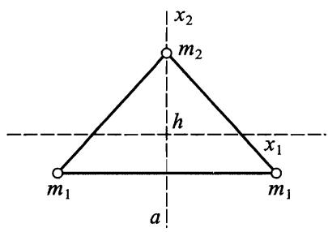
图 36

c)4 原子分子，原子位于正三棱锥的顶点 (图 37).

答案：质 $\therefore$ 位于三棱锥的对称轴上，距底面为 $X _ { 3 } =$ $m _ { 2 } h / \mu , h$ 是正三棱锥的高转动惯量为

$$
I _ { 1 } = I _ { 2 } = \frac { 3 m _ { 1 } m _ { 2 } } { \mu } h ^ { 2 } + \frac { m _ { 1 } } { 2 } a ^ { 2 } , \quad I _ { 3 } = m _ { 1 } a ^ { 2 } .
$$

当 $m _ { 1 } = m _ { 2 } , h = \alpha \ \sqrt { 2 / 3 }$ 时，这是正四面体分子，转动惯量为

$$
I _ { 1 } = I _ { 2 } = I _ { 3 } = m _ { 1 } a ^ { 2 } .
$$

习题 2 试求下列均匀连续体的主转动惯量.

a）长为 $l$ 的细长杆.

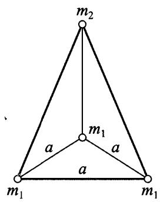
图 37

答案：

答案：

b) 半径为 $R$ 的球体.

$$
I _ { 1 } = I _ { 2 } = I _ { 3 } = \frac { 2 } { 5 } \mu \ R ^ { 2 }
$$

（通过计算 $I _ { 1 } + I _ { 2 } + I _ { 3 } = 2 \rho \int r ^ { 2 } \mathrm { d } V$ 求出).

c）半径为 $R$ 高为 $h$ 的圆柱体.

答案：

$$
I _ { 1 } = I _ { 2 } = \frac { \mu } { 4 } \bigg ( R ^ { 2 } + \frac { h ^ { 2 } } { 3 } \bigg ) , \quad I _ { 3 } = \frac \mu 2 R ^ { 2 }
$$

（圆柱轴为 $x _ { 3 }$ 轴）.

d) 棱边为 $a , b , c$ 的长方体.

答案：

$$
I _ { 1 } = \frac { \mu } { 1 2 } \big ( b ^ { 2 } + c ^ { 2 } \big ) , \qquad I _ { 2 } = \frac { \mu } { 1 2 } \big ( c ^ { 2 } + a ^ { 2 } \big ) , \qquad I _ { 3 } = \frac { \mu } { 1 2 } \big ( a ^ { 2 } + b ^ { 2 } \big )
$$

$( x _ { 1 } , x _ { 2 } , x _ { 3 }$ 轴分别平行于棱边 $\alpha , b , c )$ .

e) 高为 $h$ 底面半径为 $R$ 的圆锥体.

解：首先相对于以圆锥顶点为原点的坐标轴 (图 38)，计算张量 $I _ { \imath k } ^ { \prime }$ .用柱坐标很容易计算得

$$
I _ { 1 } ^ { \prime } = I _ { 2 } ^ { \prime } = \frac { 3 } { 5 } \mu \left( \frac { R ^ { 2 } } { 4 } + h ^ { 2 } \right) \qquad I _ { 3 } ^ { \prime } = \frac { 3 } { 1 0 } \mu \ R ^ { 2 } .
$$

经过简单的计算可知，质 $\aleph _ { }$ 位于圆锥轴上，距离顶点 $\alpha = 3 h / 4$ .根据公式 (32.12) 因而可得

$$
I _ { 1 } = I _ { 2 } = I _ { 1 } ^ { \prime } - \mu \alpha ^ { 2 } = \frac { 3 } { 2 0 } \mu \left( R ^ { 2 } + \frac { h ^ { 2 } } { 4 } \right)
$$

$$
I _ { 3 } = I _ { 3 } ^ { \prime } = { \frac { 3 } { 1 0 } } \mu \ R ^ { 2 } .
$$

f）半轴为 $a , b , c$ 的三轴椭球体.

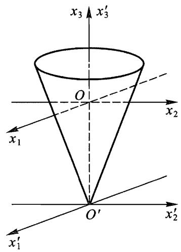
图 38

解: 质心与椭球中 $\aleph$ 重合，惯量主轴与椭球主轴重合.用坐标变换 $x = a \xi , y = b \eta , z = c \zeta$ 将椭球方程

$$
{ \frac { x ^ { 2 } } { a ^ { 2 } } } + { \frac { y ^ { 2 } } { b ^ { 2 } } } + { \frac { z ^ { 2 } } { c ^ { 2 } } } = 1
$$

变为单位球方程

$$
\xi ^ { 2 } + \eta ^ { 2 } + \zeta ^ { 2 } = 1 .
$$

通过这个坐标变换可将对椭球体的体积积分转化为对圆球体的体积积分.

例如，对 $_ { x }$ 轴的转动惯量为

$$
\begin{array} { l } { { I _ { 1 } = \rho \displaystyle \iint _ { } ^ { } \left( y ^ { 2 } + z ^ { 2 } \right) \mathrm { d } x \mathrm { d } y \mathrm { d } z = \rho a b c \ \displaystyle \iint _ { } ^ { } \left( b ^ { 2 } \eta ^ { 2 } + c ^ { 2 } \zeta ^ { 2 } \right) \mathrm { d } \xi \mathrm { d } \eta \mathrm { d } \zeta } } \\ { { \displaystyle \quad = \frac { a b c } 2 I ^ { \prime } ( b ^ { 2 } + c ^ { 2 } ) , } } \end{array}
$$

其中 $I ^ { \prime }$ 是单位球的转动惯量.

考虑到椭球体积等于 4πabc/3,最后可得转动惯量

$$
I _ { 1 } = \frac { \mu } { 5 } \big ( b ^ { 2 } + c ^ { 2 } \big ) , \qquad I _ { 2 } = \frac { \mu } { 5 } \big ( a ^ { 2 } + c ^ { 2 } \big ) , \qquad I _ { 3 } = \frac { \mu } { 5 } \big ( a ^ { 2 } + b ^ { 2 } \big ) .
$$

习题 3 试求物理摆 (在重力场中绕着固定的水平轴摆动的刚体) 的微振动频率.

解：设 $l$ 为刚体质 $\therefore \Delta$ 到转动轴的距离，而 $\alpha , \beta , \gamma$ 是惯量主轴与转动轴之间的夹角.从质心作垂线到转动轴，它与竖直方向夹角 $\varphi$ 作为坐标变量.质 $\aleph$ 速度为 $V = l { \dot { \varphi } }$ ，而角速度在主轴上投影为 $\dot { \varphi } \mathrm { c o s } \alpha , \dot { \varphi } \mathrm { c o s } \beta , \dot { \varphi } \mathrm { c o s } \gamma$ .假设 $\varphi$ 很小，求得势

能

$$
U = \mu g l ( 1 - \cos \varphi ) { \approx } \frac 1 2 \mu g l \varphi ^ { 2 } .
$$

所以拉格朗日函数为

$$
L = { \frac { \mu l ^ { 2 } } { 2 } } { \dot { \varphi } } ^ { 2 } + { \frac { 1 } { 2 } } ( I _ { 1 } \cos ^ { 2 } \alpha + I _ { 2 } \cos ^ { 2 } \beta + I _ { 3 } \cos ^ { 2 } \gamma ) { \dot { \varphi } } ^ { 2 } - { \frac { \mu g l } { 2 } } \varphi ^ { 2 } .
$$

由此，可得振动频率

$$
\omega ^ { 2 } = \frac { \mu g l } { \mu l ^ { 2 } + I _ { 1 } \cos ^ { 2 } \alpha + I _ { 2 } \cos ^ { 2 } \beta + I _ { 3 } \cos ^ { 2 } \gamma } .
$$

习题 4 试求图 39 所示系统的动能，其中 OA 和 $A B$ 是长为 $l$ 的均质细杆，铰接于 $A$ 点.杆 $O A$ 绕 $O$ 点 (在图示平面内) 转动，杆 $A B$ 的端点 $B$ 沿着 $O x$ 轴滑动.

解：桿 $O A$ 质 $\therefore \Delta$ （位于杆中心）的速度为 $l \dot { \varphi } / 2$ ，其中 $\varphi$ 为角 AOB.所以杆 $O A$ 的动能为

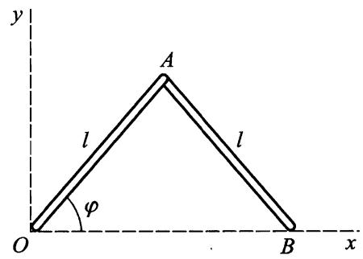
图 39

$$
T _ { 1 } = \frac { \mu \ l ^ { 2 } } { 8 } \dot { \varphi } ^ { 2 } + \frac { I } { 2 } \dot { \varphi } ^ { 2 }
$$

$\mu$ 是一根杆的质量).

杆 $A B$ 的质心的笛卡儿坐标为： $X = ( 3 l / 2 ) \cos \varphi$ , $Y = ( \mathrm { \it { l } } / 2 ) \sin \varphi$ .因为这根杆的转动角速度也是 $\dot { \varphi }$ ,故其动能为

$$
T _ { 2 } = { \frac { \mu } { 2 } } ( { \dot { X } } ^ { 2 } + { \dot { Y } } ^ { 2 } ) + { \frac { I } { 2 } } { \dot { \varphi } } ^ { 2 } = { \frac { \mu l ^ { 2 } } { 8 } } ( 1 + 8 \sin ^ { 2 } \varphi ) { \dot { \varphi } } ^ { 2 } + { \frac { I } { 2 } } { \dot { \varphi } } ^ { 2 } .
$$

系统的总动能等于

$$
T = { \frac { \mu \ l ^ { 2 } } { 3 } } { \big ( } 1 + 3 \sin ^ { 2 } \varphi { \big ) } { \dot { \varphi } } ^ { 2 }
$$

(根据习题 2 的 a)，代入了 $I = \mu \ l ^ { 2 } / 1 2 )$ ·

习题 5 试求在平面上滚动的圆柱 (半径为 $R$ ) 的动能.圆柱的质量分布使得其惯量主轴之一平行于圆柱轴，且与其相距为 $^ a$ ，圆柱对该惯量主轴的转动惯量为 $I$ .

解: 从质心作圆柱轴的垂线，该垂线与竖直方向夹角为 $\varphi$ (图 40).在每一时刻圆柱的运动可以看作绕瞬时转动轴的转动，瞬时转动轴就是圆柱与平面的交线，这个转动的角速度为 $\dot { \varphi }$ (绕所有平行轴的转动角速度都相同）．质心距离瞬时转动轴为 $\sqrt { a ^ { 2 } + R ^ { 2 } - 2 a R \cos \varphi }$ ，所以质 $\therefore \Delta$ 速度为 $\begin{array} { r l } { V } & { { } = } \end{array}$ ${ \dot { \varphi } } { \sqrt { a ^ { 2 } + R ^ { 2 } - 2 a R \cos \varphi } }$ .动能为

图 40

$$
T = { \frac { \mu } { 2 } } ( { \alpha } ^ { 2 } + R ^ { 2 } - 2 a R \mathrm { c o s } { \varphi } ) { \dot { \varphi } } ^ { 2 } + { \frac { I } { 2 } } { \dot { \varphi } } ^ { 2 } .
$$

习题 6 半径为 $_ { a }$ 的均质圆柱在半径为 $R$ 的圆柱形曲面内滚动，试求圆柱 的动能 (图 41).

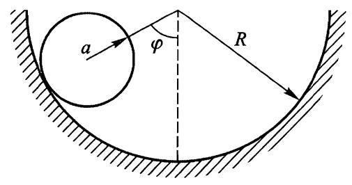
图 41

解：设 $\varphi$ 是两个圆柱中 $\therefore \because$ 连线与竖直方向的夹角.滚动的圆柱质心在轴上，其速度为 $V = \dot { \varphi } ( R - \alpha )$ .瞬时转动轴是两个圆柱的交线，由关于该瞬时转轴的纯滚动可以求出圆柱的角速度为

$$
\Omega = \frac { V } { a } = \dot { \varphi } \frac { R - \alpha } { a } .
$$

如果 $I _ { 3 }$ 是圆柱对其轴的转动惯量，则

$$
T = { \frac { \mu } { 2 } } ( R - \alpha ) ^ { 2 } \dot { \varphi } ^ { 2 } + { \frac { I _ { 3 } } { 2 } } { \frac { ( R - \alpha ) ^ { 2 } } { \alpha ^ { 2 } } } \dot { \varphi } ^ { 2 } = { \frac { 3 } { 4 } } \mu ( R - \alpha ) ^ { 2 } \dot { \varphi } ^ { 2 }
$$

$I _ { 3 }$ 已由习题 2 的 c) 求得.

习题 7 试求在平面上滚动的匀质圆锥的动能.

解：设圆锥与平面交线为 $O A$ ,用 $\theta$ 表示 OA 与平面上某固定方向的夹角（图 42).质心位于圆锥轴上，其速度为 $V = a ~ { \dot { \theta } } \cos \alpha$ ,这里 $2 \alpha$ 是圆锥顶角， $\alpha$ 为质心到顶点的距离.我们计算转动角速度，即绕瞬时转动轴 $O A$ 的角速度：

$$
\Omega = \frac { V } { \alpha \sin \alpha } = \dot { \theta } \cot \alpha .
$$

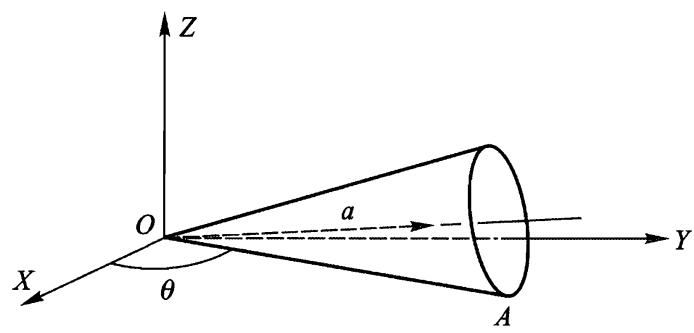
图 42

惯量主轴之一 ( $x _ { 3 }$ 轴) 与圆锥轴重合，选择另一个轴 ( $x _ { 2 }$ 轴) 垂直于圆锥轴和直线 $O A$ .角速度矢量 $\pmb { \Omega }$ （平行于 OA) 在惯量主轴上的投影为 $\Omega \sin \alpha , 0$ $\Omega \cos \alpha$ .最后可得动能

$$
T = { \frac { \mu \ a ^ { 2 } } { 2 } } { \dot { \theta } } ^ { 2 } \cos ^ { 2 } \alpha + { \frac { I _ { 1 } } { 2 } } { \dot { \theta } } ^ { 2 } \cos ^ { 2 } \alpha + { \frac { I _ { 3 } } { 2 } } { \frac { \cos ^ { 4 } \alpha } { \sin ^ { 2 } \alpha } } { \dot { \theta } } ^ { 2 } = { \frac { 3 \mu \ h ^ { 2 } } { 4 0 } } { \dot { \theta } } ^ { 2 } ( 1 + 5 \cos ^ { 2 } \alpha )
$$

$h$ 是圆锥的高度， $I _ { 1 } , I _ { 3 } , \alpha$ 由习题 2 的 e) 给出.

习题 8 试求匀质圆锥的动能.圆锥的底面在平面上滚动，而顶点与平面的距离始终等于圆锥底面半径 (因而圆锥轴平行于平面).

解：设 $\theta$ 表示平面上给定方向与圆锥轴在平面上的投影之间的夹角（图 43).质心速度为 $V = \alpha \stackrel { . } { \theta }$ (符号同习题 7).瞬时转动轴是圆锥母线 OA，其中 A 是圆锥与平面的切点.质心到该轴的距离为 $\alpha \sin \alpha$ ，所以

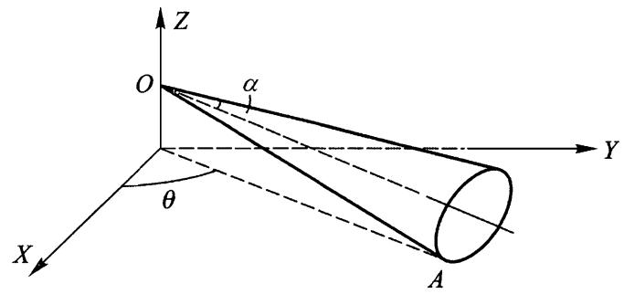
图 43

$$
\Omega = \frac { V } { a \sin \alpha } = \frac { \dot { \theta } } { \sin \alpha } .
$$

矢量 $\pmb { \Omega }$ 在惯量主轴上的投影为 (选择 $x _ { 2 }$ 轴垂直于圆锥轴和线 OA）： $\Omega \sin \alpha = \dot { \theta }$ ,$0 , \Omega \cos \alpha = \dot { \theta } \mathrm { c o t } \alpha$ .所以动能为

$$
T = { \frac { \mu \ a ^ { 2 } } { 2 } } { \dot { \theta } } ^ { 2 } + { \frac { I _ { 1 } } { 2 } } { \dot { \theta } } ^ { 2 } + { \frac { I _ { 3 } } { 2 } } { \dot { \theta } } ^ { 2 } \cot ^ { 2 } \alpha = { \frac { 3 \mu h ^ { 2 } } { 4 0 } } { \dot { \theta } } ^ { 2 } \left( { \frac { 1 } { \cos ^ { 2 } \alpha } } + 5 \right) .
$$

习题 9 均质三轴椭球绕自己的一个轴 ( $A B$ ,图 44) 旋转，并且这个轴本身又绕着过椭球中心与其垂直的直线 $C D$ 转动.试求椭球的动能.

解：用 $\theta$ 表示绕 $C D$ 的转角，而用 $\varphi$ 表示绕 $A B$ 的转角 (即 $C D$ 与垂直 AB 的惯量主轴 $x _ { 1 }$ 的夹角）.如果 $x _ { 3 }$ 轴与 $A B$ 轴重合，那么 $\pmb { \Omega }$ 在惯量主轴上投影为

$$
\dot { \theta } \mathrm { c o s } \varphi , \dot { \theta } \mathrm { s i n } \varphi , \dot { \varphi } .
$$

由于系统的质 $\therefore \Delta$ ,即椭球中 $\aleph _ { }$ 是静止的，所以动能为

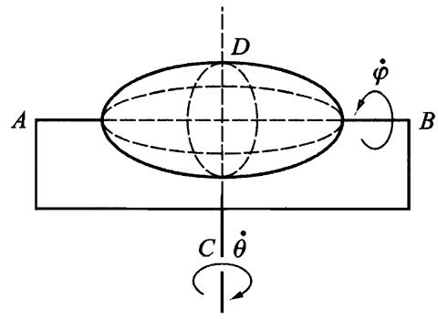
图 44

$$
T = { \frac { 1 } { 2 } } ( I _ { 1 } { \cos } ^ { 2 } \varphi + I _ { 2 } { \sin } ^ { 2 } \varphi ) { \dot { \theta } } ^ { 2 } + { \frac { 1 } { 2 } } I _ { 3 } { \dot { \varphi } } ^ { 2 } .
$$

习题 10 同上题，但轴 $A B$ 与 $C D$ 不垂直 (图 45)，且椭球相对这个轴是对称的.

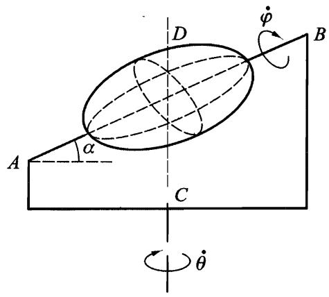
图 45

解：矢量 $\pmb { \Omega }$ 在 $A B$ 轴和垂直于 $A B$ 的另外任意选取的两条惯量主轴上的投影为

$$
\dot { \theta } \cos \alpha \cos \varphi , \dot { \theta } \cos \alpha \sin \varphi , \dot { \varphi } + \dot { \theta } \sin \alpha .
$$

动能为

$$
T = { \frac { I _ { 1 } } { 2 } } { \dot { \theta } } ^ { 2 } { \cos } ^ { 2 } \alpha + { \frac { I _ { 3 } } { 2 } } ( { \dot { \varphi } } + { \dot { \theta } } { \sin } \alpha ) ^ { 2 } .
$$

# $\S 3 3$ 刚体的角动量

我们知道，系统的角动量取决于它相对哪个点定义.在刚体力学中最合适选取的点是动坐标系的原点，即刚体的质心.以后我们将这样定义的角动量记为 $M$ .

根据公式 (9.6)，当选择刚体质心为坐标原点时， $M$ 就是“内禀”角动量，仅与刚体相对质心的运动有关.换句话说，在定义 $\begin{array} { r } { \pmb { M } = \sum m \pmb { r } \times \pmb { v } } \end{array}$ 中应该用 $\pmb { \Omega } \times \pmb { r }$ 代替 ${ \bf \Pi } _ { { \pmb v } }$

$$
\begin{array} { r } { \pmb { M } = \sum m \pmb { r } \times ( \pmb { \Omega } \times \pmb { r } ) = \sum m \left[ \boldsymbol { r } ^ { 2 } \pmb { \Omega } - \boldsymbol { r } \cdot ( \pmb { \Omega } \cdot \boldsymbol { r } ) \right] , } \end{array}
$$

或者用张量表示为

$$
\begin{array} { r } { M _ { \iota } = \sum m \left( \boldsymbol { x } _ { l } ^ { 2 } \boldsymbol { \Omega } _ { \iota } - \boldsymbol { x } _ { i } \boldsymbol { x } _ { k } \boldsymbol { \Omega } _ { k } \right) = \boldsymbol { \Omega } _ { k } \sum m \left( \boldsymbol { x } _ { l } ^ { 2 } \boldsymbol { \hat { \partial } } _ { \iota k } - \boldsymbol { x } _ { i } \boldsymbol { x } _ { k } \right) . } \end{array}
$$

最后,考虑到惯量张量定义 (32.2) 得

$$
\boldsymbol { M } _ { \iota } = \boldsymbol { I } _ { \iota } \Omega _ { k } .
$$

如果坐标轴 $x _ { 1 } , x _ { 2 } ^ { \prime } , x _ { 3 }$ 的方向沿着刚体惯量主轴，则公式 (33.1) 给出

$$
\begin{array} { r } { M _ { 1 } = I _ { 1 } \Omega _ { 1 } , \qquad M _ { 2 } = I _ { 2 } \Omega _ { 2 } , \qquad M _ { 3 } = I _ { 3 } \Omega _ { 3 } . } \end{array}
$$

对于球形陀螺的特殊情况，3 个主转动惯量都相等，有

$$
M = I { \pmb \Omega } ,
$$

即角动量矢量正比于角速度矢量，并且有相同的指向.

然而，对任意刚体，矢量 $M$ 一般不与矢量 $\pmb { \Omega }$ 方向相同，只有在刚体绕某个惯量主轴转动时， $M$ 和 $\pmb { \Omega }$ 方向才相同.

我们研究不受任何外力作用的自由刚体的运动.我们假定消除了不感兴趣的任何匀速平动，仅考虑刚体的自由转动.

像所有封闭系统一样，自由转动刚体的角动量是常量.对于球形陀螺， $M =$ const 导致 $\pmb { \Omega } = \mathrm { c o n s t }$ .这就是说，球形陀螺的最一般自由运动是绕空间固定轴的匀速转动.

转子的情况同样简单.这时也有 $M = I \pmb { \Omega }$ ,并且矢量 $\pmb { \Omega }$ 垂直于转子轴.所以，转子的自由转动是在一个平面内绕着垂直于该平面的轴匀速转动.

利用角动量守恆定律可以确定更复杂的对称陀螺的自由转动.

利用惯量主轴 $x _ { 1 } , x _ { 2 }$ 方向（垂直于陀螺对称轴 $x _ { 3 }$ ) 选择的任意性，我们选 $x _ { 2 }$ 垂直于矢量 $M$ 和 $x _ { 3 }$ 轴的瞬时位置确定的平面.那么 $M _ { 2 } = 0$ ，由公式 (33.2) 可知， $\varOmega _ { 2 } = 0$ .这就是说，在每个时刻 $M , \pmb { \Omega }$ 的方向和陀螺对称轴位于同一个平面（图 46).由此可得，在陀螺对称轴上所有点的速度 $\pmb { v }$ $= \pmb { \Omega } \times \pmb { r }$ ,在每个时刻都垂直于这个平面，换言之，陀螺轴绕 $M$ 的方向匀速（见下面) 转动，画出一个圆锥，这称为陀螺的规则进动）.同时，陀螺绕自身的轴匀速转动.

图 46

这两个转动的角速度可以容易地用给定的角动量 $M$ 以及陀螺轴与 $M$ 方向的夹角 $\theta$ 表示.陀螺绕自身轴的转动角速度就是矢量 $\pmb { \Omega }$ 在该轴上的投影 $\varOmega _ { 3 }$

$$
\Omega _ { 3 } = \frac { M _ { 3 } } { I _ { 3 } } = \frac { M } { I _ { 3 } } \mathrm { c o s } \theta .
$$

为了求进动角速度 $\varOmega _ { \mathrm { p r } }$ ，应该利用平行四边形法则将矢量 $\pmb { \Omega }$ 沿着 $x _ { 3 }$ 和 $M$ 方向分解.第一个分量不会使陀螺轴产生任何位移，第二个分量因而给出所要求的进动角速度.由图 46 可知， $\Omega _ { \mathrm { p r } } \sin \theta = \Omega _ { 1 }$ ,由于 $\Omega _ { 1 } = M _ { 1 } / I _ { 1 } = M \sin \theta / I _ { 1 }$ ，所以得

$$
\Omega _ { \mathrm { p r } } = M / I _ { 1 } .
$$

# $\S 3 4$ 刚体运动方程

由于一般情况下刚体有 6 个自由度，因此总计应该有 6 个独立的方程.这些方程可以写成刚体的动量和角动量这两个矢量对时间的导数形式.

得到第一个矢量方程只需将刚体中每个质点的方程 ${ \dot { p } } = f$ 求和，其中 $\pmb { p }$ 是质点的动量， $f$ 是作用在质点上的力.引入刚体的总动量：

$$
\begin{array} { r } { \pmb { P } = \sum \pmb { p } = \mu \pmb { V } } \end{array}
$$

和作用在刚体上总的力 $\scriptstyle \sum f = F$ ,可得

$$
{ \frac { \mathrm { d } { \pmb P } } { \mathrm { d } t } } = { \pmb F } .
$$

尽管我们定义 $\pmb { F }$ 为作用在每个质点上的所有力 $f$ 之和，包括刚体的质点之间相互作用力，但事实上 $\pmb { F }$ 中仅包含外力.刚体内部所有质点之间的作用力必须相互抵消，事实上，当没有外力时刚体的动量应该守恒，就像所有封闭系统一样，即应该有 $\pmb { F } = \mathbf { 0 }$ .

如果 $U$ 为刚体在外场中的势能，则力 $\pmb { F }$ 可以用势能对刚体质心坐标的导数确定：

$$
\mathbf { } F = \mathbf { } - { \frac { \partial U } { \partial \mathbf { } R } } .
$$

事实上，当刚体平移 $\delta \pmb R$ 时,刚体的每个质点的径矢 $\pmb { \tau }$ 也产生同样的变化，所以势能变化为

$$
\delta \boldsymbol { U } = \Sigma \frac { \partial \boldsymbol { U } } { \partial \boldsymbol { \tau } } \cdot \delta \boldsymbol { \tau } = \delta \boldsymbol { R } \cdot \Sigma \frac { \partial \boldsymbol { U } } { \partial \boldsymbol { \tau } } = - \delta \boldsymbol { R } \cdot \Sigma \boldsymbol { f } = - \boldsymbol { F } \cdot \delta \boldsymbol { R } .
$$

注意到，方程 (34.1) 也可由对质心坐标的拉格朗日方程：

$$
\frac { \mathrm { d } } { \mathrm { d } t } \ \frac { \partial L } { \partial \textbf { V } } = \frac { \partial L } { \partial \textbf { R } }
$$

得到，其中拉格朗日函数为 (32.4)，对此有

$$
\frac { \partial L } { \partial \mathbf { V } } = \mu \mathbf { V } = \pmb { P } , \qquad \frac { \partial L } { \partial \pmb { R } } = - \frac { \partial U } { \partial \pmb { R } } = \pmb { F } .
$$

下面推导角动量 $M$ 对时间导数确定的第二个运动方程.为了简化推导，我们选择固定 (惯性) 参考系，使得在所考虑的瞬间，刚体质心相对于该参考系静止.

我们有

$$
\dot { \pmb { M } } = \frac { \mathrm { d } } { \mathrm { d } t } \sum \pmb { r } \times \pmb { p } = \sum \dot { \pmb { r } } \times \pmb { p } + \sum \pmb { r } \times \dot { \pmb { p } } .
$$

对于我们所选的参考系 $\mathbf { \nabla } \cdot \mathbf { V } = 0 ) ,$ ，在给定时刻 $\dot { \boldsymbol { r } }$ 与速度 ${ \textbf { \em v } } = { \dot { \tau } }$ 相等.由于矢量 $\pmb { v }$ 和 $\mathbf { \omega } _ { \mathbf { p } } = m \mathbf { \omega } _ { \mathbf { \omega } }$ 方向相同，故 $\dot { \pmb { r } } \times \pmb { p } = 0$ .将 $\dot { \pmb { p } }$ 替换为 $f$ ,最后可得

$$
\frac { \mathrm { d } \boldsymbol { M } } { \mathrm { d } t } = \boldsymbol { K } ,
$$

其中

$$
\begin{array} { r } { K = \sum r \times f . } \end{array}
$$

由于角动量 $M$ 是相对质心定义的（参见 $\ S 3 3$ 的开头部分）,在从一个惯性参考系变换到另一个惯性参考系时保持不变.由 $\pmb { R } = 0$ 从公式 (9.5) 来看这是显然的.由此可知，根据伽利略相对性原理，这里在特定参考系下得到的公式 (34.3),对所有惯性参考系都成立.

矢量 $r \times f$ 称为 $f$ 的力矩，因此 $\pmb { K }$ 是总力矩，即作用在刚体上的所有的力产生的力矩之和.正如总力 $\pmb { F }$ 一样，在和 (34.4) 中实际上只需计及外力的力矩，根据角动量守恒定律，封闭系统的所有内力的力矩之和必须等于零.

力矩像角动量一样，一般依赖于坐标原点 (相对于其定义力矩) 的选择.在 (34.3) 和 (34.4) 中力矩和角动量是相对刚体质心定义的.

当坐标原点平移 $\pmb { a }$ 时，刚体中每一个质点的新径矢 $\boldsymbol { r ^ { \prime } }$ 与老径矢 $r$ 的关系为 $\pmb { r } = \pmb { r } ^ { \prime } + \pmb { a }$ .所以

$$
\begin{array} { r } { \pmb { K } = \sum \pmb { r } \times \pmb { f } = \sum \pmb { r } ^ { \prime } \times \pmb { f } + \sum \pmb { a } \times \pmb { f } } \end{array}
$$

或者

$$
\pmb { K } = \pmb { K } ^ { \prime } + \pmb { a } \times \pmb { F } .
$$

特别是，由此可见，如果总力 $\pmb { F } = 0$ （这时称力偶作用在刚体上），则力矩之值不依赖于坐标原点的选择.

方程 (34.3) 可以看作对于“转动坐标”的拉格朗日方程

$$
{ \frac { \mathrm { d } } { \mathrm { d } t } } \ { \frac { \partial L } { \partial \pmb { \Omega } } } = { \frac { \partial L } { \partial \pmb { \varphi } } } .
$$

事实上，将拉格朗日函数 (32.4) 对矢量 $\pmb { \Omega }$ 的分量求导可得

$$
{ \frac { \partial L } { \partial \Omega _ { \ i } } } = I _ { \iota k } \Omega _ { \boldsymbol { k } } = M _ { i } .
$$

当刚体转动无穷小角度 $\delta \varphi$ 时，势能改变量为

$$
\begin{array} { r } { \hat { \delta } \boldsymbol { U } = - \sum \pmb { f } \cdot \hat { \delta } \pmb { \tau } = - \sum \pmb { f } \cdot \left( \hat { \delta } \varphi \times \pmb { r } \right) = - \hat { \delta } \pmb { \varphi } \cdot \sum \pmb { r } \times \pmb { f } = - \ \boldsymbol { K } \cdot \hat { \delta } \pmb { \varphi } , } \end{array}
$$

由此可得

$$
\kappa = - \frac { \partial U } { \partial \pmb { \varphi } } ,
$$

因此有

$$
\frac { \partial { \cal L } } { \partial \pmb { \varphi } } = - \frac { \partial { \cal U } } { \partial \pmb { \varphi } } = { \bf K } .
$$

假设矢量 $\pmb { F }$ 和 $\pmb { K }$ 相互垂直.这种情况下总可以找到矢量 $\pmb { a }$ ,使得公式 (34.5) 中 $\pmb { K } ^ { \prime }$ 等于零，进而

$$
\pmb { K } = \pmb { a } \times \pmb { F } .
$$

$\pmb { a }$ 的选择不是唯一的，给它加上任何平行于 $\pmb { F }$ 的矢量，都不会改变等式 (34.7)，因此条件 $\pmb { K } ^ { \prime } = 0$ 不是给出动坐标系中的一个点，而是一条直线.于是，在 $\pmb { K } \bot \pmb { F }$ 情况下，所有作用力的效果可以归结为沿着给定直线作用的一个力 $\pmb { F }$ 的效果.

均匀力场就属于这种情况，作用在质点上的力为 $\mathbf { \boldsymbol { f } } = e \mathbf { \boldsymbol { E } }$ ,其中 $\pmb { { \cal E } }$ 是刻画力场的常矢量， $e$ 刻画质点相对于给定力场的性质①.在这种情况下有

$$
\begin{array} { r } { \pmb { F } = \pmb { E } \sum \pmb { e } , \qquad \pmb { K } = \sum \pmb { e } \pmb { r } \times \pmb { E } . } \end{array}
$$

假设 $\textstyle \sum e \neq 0$ ,引入径矢

$$
r _ { 0 } = \frac { \sum e r } { \sum e } .
$$

总的力矩可以简单表示为：

$$
\pmb { K } = \pmb { r } _ { 0 } \times \pmb { F } .
$$

于是，当刚体在均匀力场中运动时，力场的效果归结为作用在径矢为 (34.8) 的点上的一个单一力 $\pmb { F }$ 的作用.这个点的位置完全由刚体自身的性质决定，例如，在重力场中该点就是刚体的质心.

# $\S 3 5$ 欧拉角

我们已经提到，描述刚体运动可以用质心的 3 个坐标和 3 个描述动坐标轴 $x _ { 1 } , x _ { 2 } , x _ { 3 }$ 相对固定坐标轴 $X , Y , Z$ 取向的角度.这些角常常可以方便地取为所谓的欧拉角.

因为我们现在只对坐标轴之间的夹角感兴趣，可以选择同一个点为两个坐标系的原点 (图 47).动坐标系的平面 $x _ { 1 } x _ { 2 }$ 与固定平面 $X Y$ 相交于某一直线（在图 47 上的 $O N$ )，该直线称为节线.节线显然垂直于 $Z$ 轴和 $x _ { 3 }$ 轴，我们选择矢量积 ${ \pmb z } \times { \pmb x } _ { 3 }$ 的方向为节线正方向 (其中 $z , x _ { 3 }$ 分别是坐标轴 $Z , x _ { 3 }$ 方向的单位

矢量）.

我们用下面 3 个角确定动坐标轴 $x _ { 1 }$ $x _ { 2 } , x _ { 3 }$ 相对固定坐标轴 $X , Y , Z$ 的位置： $Z$ 轴和 $x _ { 3 }$ 轴之间的夹角 $\theta , X$ 轴和 ON 轴之间的夹角 $\varphi , O N$ 轴和 $x _ { 1 }$ 轴之间的夹角 $\psi$ .按螺旋法则确定的方向分别绕 $Z$ 和 $x _ { 3 }$ 轴转动来计算角 $\varphi$ 和 $\psi$ .角 $\theta$ 取值范围是从零到 $\pi$ ,而角 $\varphi$ 和 $\psi$ 的取值范围是从零到 $2 \pi ^ { \textcircled { 1 } }$ .

下面我们用欧拉角及其导数表示角速度矢量 $\pmb { \Omega }$ 在动坐标轴 $x _ { 1 } , x _ { 2 } , x _ { 3 }$ 上的分量.为此需要将角速度 $\dot { \theta } , \dot { \varphi } , \dot { \psi }$ 向这些轴投影.角速度 $\dot { \theta }$ 的方向沿着节线 $O N$ ,它沿着 $x _ { 1 } , x _ { 2 } , x _ { 3 }$ 的分量等于

图 47

$$
\begin{array} { r } { \dot { \theta } _ { 1 } = \dot { \theta } \cos \phi , \qquad \dot { \theta } _ { 2 } = - \dot { \theta } \sin \phi , \quad \dot { \theta } _ { 3 } = 0 . } \end{array}
$$

角速度 $\dot { \varphi }$ 的方向沿着 $Z$ 轴，它沿着 $x _ { 3 }$ 的分量等于 $\dot { \varphi } _ { 3 } = \dot { \varphi } \cos \theta$ ,而在平面 $x _ { 1 } x _ { 2 }$ 上的投影等於 $\dot { \varphi } \mathrm { s i n } \theta$ .将后者再分解到 $x _ { 1 }$ 和 $x _ { 2 }$ 轴,可得

$$
\dot { \varphi } _ { 1 } = \dot { \varphi } \mathrm { s i n } \theta \mathrm { s i n } \psi , \quad \dot { \varphi } _ { 2 } = \dot { \varphi } \mathrm { s i n } \theta \mathrm { c o s } \psi .
$$

最后，角速度 $\dot { \psi }$ 的方向沿着 $x _ { 3 }$ 轴.

汇集这些沿着每个轴的分量，最终得

$$
\begin{array} { r l } & { \Omega _ { 1 } = \dot { \varphi } \mathrm { s i n } \theta \mathrm { s i n } \psi + \dot { \theta } \mathrm { c o s } \psi , } \\ & { } \\ & { \Omega _ { 2 } = \dot { \varphi } \mathrm { s i n } \theta \mathrm { c o s } \psi - \dot { \theta } \mathrm { s i n } \psi , } \\ & { } \\ & { \Omega _ { 3 } = \dot { \varphi } \mathrm { c o s } \theta + \dot { \psi } . } \end{array}
$$

如果选择刚体的惯量主轴为坐标轴 $x _ { 1 } , x _ { 2 } , x _ { 3 }$ ,则将 (35.1) 代入 (32.8),可得用欧拉角表示的转动动能.

对于对称陀螺， $I _ { 1 } = I _ { 2 } { \neq } I _ { 3 }$ ，经过简单推导可得

$$
T _ { \mathrm { r o t } } = { \frac { I _ { 1 } } { 2 } } ( { \dot { \varphi } } ^ { 2 } { \sin } ^ { 2 } \theta + { \dot { \theta } } ^ { 2 } ) + { \frac { I _ { 3 } } { 2 } } ( { \dot { \varphi } } { \cos } \theta + { \dot { \psi } } ) ^ { 2 } .
$$

应该指出，利用对称陀螺惯量主轴 $x _ { 1 } , x _ { 2 }$ 方向选择的任意性，也可以更简单地得到这些表达式.如果认为 $x _ { 1 }$ 轴沿着节线 $O N$ ,即 $\psi = 0$ ,可得角速度分量的简单表达式

$$
\begin{array} { r } { \Omega _ { 1 } = \dot { \theta } , \qquad \Omega _ { 2 } = \dot { \varphi } \mathrm { s i n } \theta , \qquad \Omega _ { 3 } = \dot { \varphi } \mathrm { c o s } \theta + \dot { \psi } . } \end{array}
$$

作为应用欧拉角的一个简单的例子，我们研究对称陀螺的自由运动，这在 $\ S \ 3 3$ 已经求出.

我们取固定坐标系的 $Z$ 轴沿着陀螺的定常角动量 $\pmb { M }$ 的方向，取动坐标系的 $x _ { 3 }$ 轴沿着陀螺对称轴，而 $x _ { 1 }$ 轴在给定时刻与节线重合.利用公式 (35.3) 可得矢量 $M$ 的分量

$M _ { 1 } = I _ { 1 } \Omega _ { 1 } = I _ { 1 } { \dot { \theta } } , M _ { 2 } = I _ { 2 } \Omega _ { 2 } = I _ { 2 } { \dot { \varphi } } { \sin } \theta , M _ { 3 } = I _ { 3 } \Omega _ { 3 } = I _ { 3 } ( \dot { \varphi } \mathrm { c o s } \theta + \dot { \psi } ) .$ 另一方面，因为 $x _ { 1 }$ 轴（节线）垂直于 $Z$ 轴，我们有

$$
M _ { 1 } = 0 , \qquad M _ { 2 } = M \sin \theta , \qquad M _ { 3 } = M \cos \theta .
$$

比较这些等式可得下面方程：

$$
\dot { \theta } = 0 , \quad I _ { 1 } \dot { \varphi } = M , \quad I _ { 3 } ( \dot { \varphi } \mathrm { c o s } \theta + \dot { \phi } ) = M \mathrm { c o s } \theta .
$$

第一个方程给出 $\theta = \mathrm { c o n s t }$ ,即陀螺轴与 $M$ 方向的夹角为常数.第二个方程确定进动角速度 (与 (33.5) 一致) $\dot { \varphi } = M / I _ { 1 }$ .最后，第三个方程确定陀螺绕自身轴转动的角速度 $\Omega _ { 3 } = M \mathrm { c o s } \theta / I _ { 3 }$ .

# 习 题

习题 1 试将下端点固定的对称重陀螺的运动问题约化为积分问题（图 48).

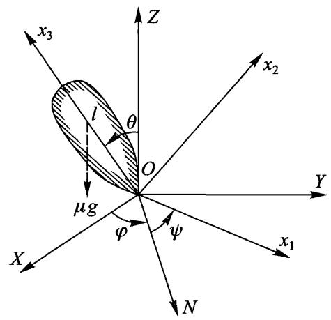
图 48

解: 取动坐标系和固定坐标系的共同原点位於陀螺的固定点 $O$ ,而 $Z$ 轴沿着竖直方向 (图 48).重力场中陀螺的拉格朗日函数为

$$
\dot { L } = \frac { I _ { 1 } + \mu \ l ^ { 2 } } { 2 } ( \dot { \theta } ^ { 2 } + \dot { \varphi } ^ { 2 } \mathrm { s i n } ^ { 2 } \theta ) + \frac { I _ { 3 } } { 2 } ( \dot { \psi } + \dot { \varphi } \mathrm { c o s } \theta ) ^ { 2 } - \mu g l \mathrm { c o s } \theta
$$

其中 $\mu$ 为陀螺的质量， $l$ 是质 $\therefore \Delta$ 到固定点的距离.

$\psi$ 和 $\varphi$ 是循环坐标.所以有两个运动积分：

$$
\dot { p } _ { \psi } = \frac { \partial L } { \partial \dot { \psi } } = I _ { 3 } ( \dot { \psi } + \dot { \varphi } \mathrm { c o s } \theta ) = \mathrm { c o n s t } { } \equiv M _ { 3 } ,
$$

$$
\mathbf { \nabla } _ { \phi _ { \varphi } } = \frac { \partial L } { \partial \dot { \varphi } } = ( \mathbf { \nabla } _ { I _ { 1 } } ^ { \prime } \mathrm { s i n } ^ { 2 } \theta + I _ { 3 } \mathrm { c o s } ^ { 2 } \theta ) \dot { \varphi } + I _ { 3 } \ \dot { \psi } \mathrm { c o s } \theta = \mathrm { c o n s t } \mathrm { = } { M _ { Z } } \mathrm { , }
$$

其中引入了记号 $I _ { 1 } ^ { \prime } = I _ { 1 } + \mu l ^ { 2 } , \phi _ { \psi }$ 和 $\phi _ { \varphi }$ 是相对 $O$ 点定义的转动角动量分别在 $x _ { 3 }$ 轴和 $Z$ 轴上的分量.此外还有能量守恒：

$$
E = { \frac { I _ { 1 } ^ { \prime } } { 2 } } ( { \dot { \theta } } ^ { 2 } + { \dot { \varphi } } ^ { 2 } \mathrm { s i n } ^ { 2 } \theta ) + { \frac { I _ { 3 } } { 2 } } ( { \dot { \phi } } + { \dot { \varphi } } \mathrm { c o s } \theta ) ^ { 2 } + \mu g l \mathrm { c o s } \theta .
$$

由方程 (1) 和 (2) 求得

$$
\dot { \varphi } = \frac { M _ { Z } - M _ { 3 } \mathrm { c o s } \theta } { I _ { 1 } ^ { ' } \mathrm { s i n } ^ { 2 } \theta } ,
$$

$$
\dot { \psi } = \frac { M _ { 3 } } { I _ { 3 } } - \mathrm { c o s } \theta \frac { M _ { Z } - M _ { 3 } \mathrm { c o s } \theta } { I _ { 1 } ^ { ' } \mathrm { s i n } ^ { 2 } \theta } .
$$

利用方程 (4) 和 (5) 从能量方程 (3) 中消去 $\dot { \varphi }$ 和 $\dot { \psi }$ ,得

$$
E ^ { ' } = \frac { I _ { 1 } ^ { ' } } { 2 } { \dot { \theta } } ^ { 2 } + U _ { \mathrm { e f f } } ( \theta ) ,
$$

其中引入了记号

$$
E ^ { ' } = E - \frac { M _ { 3 } ^ { 2 } } { 2 I _ { 3 } } - \mu g l , \quad \quad U _ { \mathrm { e f f } } ( \theta ) = \frac { ( M _ { Z } - M _ { 3 } \cos \theta ) ^ { 2 } } { 2 I _ { 1 } ^ { ' } \sin ^ { 2 } \theta } - \mu g l \left( 1 - \cos \theta \right) .
$$

由此求出 $\dot { \theta }$ 并分离变量得

$$
t = \int { \frac { \mathrm { d } \theta } { \sqrt { { \frac { 2 } { I _ { 1 } ^ { \prime } } } \bigl [ E ^ { ' } - U _ { \mathrm { e f f } } ( \theta ) \bigr ] } } } \ ,
$$

该积分是椭圆积分.然后，利用方程 (4) 和 (5) 所得的积分将角 $\varphi$ 和 $\psi$ 写成 $\theta$ 的函数形式.

在运动过程中，角 $\theta$ 的变化范围由条件 $E ^ { \prime } \geqslant U _ { \mathrm { e f f } } ( \theta )$ 确定.当 $\theta$ 趋于 0 或 $\pi$ 时，函数 $U _ { \mathrm { e f f } } ( \theta )$ (如果 $M _ { 3 } \ne M _ { Z }$ ) 趋于 $+ \infty$ ，而当处于 $0 , \pi$ 之间时函数有一个极小值.所以方程 $E ^ { \prime } = U _ { \mathrm { e f f } } ( \theta )$ 有两个根，它们确定陀螺轴偏离竖直方向的两个极限值 $\theta _ { 1 }$ 和 $\theta _ { 2 }$ .

当角 $\theta$ 从 $\theta _ { 1 }$ 变化到 $\theta _ { 2 } , \dot { \varphi }$ 的符号是否改变取決於 $M _ { 2 } - M _ { 3 } { \cos \theta }$ 的符号在 $\theta$ 角的变化范围内是否改变.如果它不改变符号，陀螺轴绕竖直方向单调进动，同时上下振动 (称为章动)(见图 $4 9 \mathrm { a }$ ，曲线是陀螺轴在以固定点为球心的球面上所画的轨迹).如果 $\dot { \varphi }$ 改变符号下，在两个极限圆上进动方向相反，因此陀螺轴绕竖直方向移动时画出环路 (图 49b).最后，如果 $\theta _ { 1 }$ 和 $\theta _ { 2 }$ 之中有一个与 $M _ { Z } - M _ { 3 } { \cos } \theta$ 的零点重合,则在相应的极限圆上 $\dot { \varphi }$ 和 $\dot { \theta }$ 同时等于零，陀螺轴画出图 $4 9 \mathrm { c }$ 类型的轨迹.

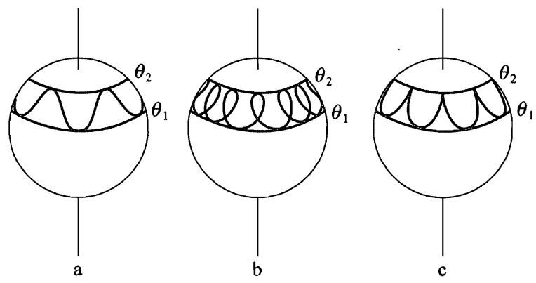
图 49

习题 2 试求陀螺轴绕竖直方向转动稳定的条件.

解：当 $\theta = 0$ 时 $Z$ 和 $x _ { 3 }$ 轴重合,因此 $M _ { 3 } = M _ { Z }$ , $E ^ { \prime } = 0$ .如果 $\theta = 0$ 相应于 $U _ { \mathrm { e f f } } ( \theta )$ 的极小值，则陀螺绕该轴的转动是稳定的.当 $\theta$ 很小时有

$$
U _ { \mathrm { e f f } } { \approx } \left( \frac { M _ { 3 } ^ { 2 } } { 8 { \cal I } _ { 1 } ^ { \prime } } - \frac { \mu g l } { 2 } \right) \theta ^ { 2 } ,
$$

由此可得稳定条件为 $M _ { 3 } ^ { 2 } > 4 I _ { 1 } ^ { \prime } \mu g l$ 或者

$$
\Omega _ { 3 } ^ { 2 } > \frac { 4 I _ { 1 } ^ { \prime } \mu g l } { I _ { 3 } ^ { 2 } } .
$$

习题 3 试求自转动能远大于重力势能情况下陀螺的运动 (称为快陀螺）.

解：在一阶近似下，即忽略重力场时，陀螺轴绕着角动量 $M$ 的方向自由进动.这种情况对应于陀螺的章动),根据 (33.5)，进行角速度为

$$
\Omega _ { \mathrm { n u t } } = \frac { M } { I _ { 1 } ^ { ' } } .
$$

在下一级近似中会出现 $M$ 绕竖直方向的慢速进动 (图 50).为了求这种进动的角速度，我们将精确的运动方程 (34.3)

$$
\frac { \mathrm { d } \boldsymbol { M } } { \mathrm { d } t } = \boldsymbol { \kappa }
$$

按章动周期平均.作用在陀螺上的重力矩等於 $\pmb { K } = \mu l \pmb { n } _ { 3 } \times \pmb { g }$ ，其中 ${ \pmb n } _ { 3 }$ 是沿陀螺轴方向的单位矢量.很显然，由对称性， $\pmb { K }$ 按“章动锥”平均的结果是将矢量 $\pmb { n } _ { 3 }$ 替换为其在 $M$ 方向的投影 $\cos \alpha M / M ( \alpha$ 是 $M$ 与陀螺轴之间的夹角）.于是得方程

$$
\frac { \overline { { { \mathrm { d } } } } \overline { { { \bf M } } } } { \mathrm { d } t } = - \cos \alpha \frac { \mu l } { M ^ { 8 } } { \bf \times } { \bf \nabla } M .
$$

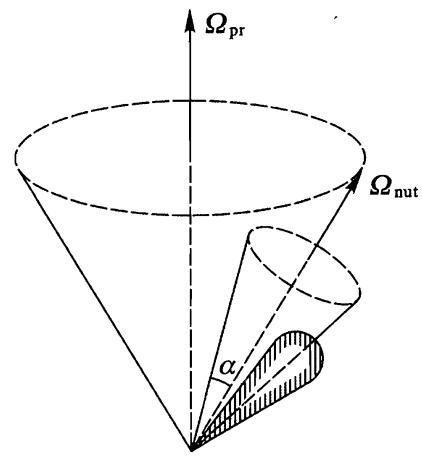
图 50

这表明，矢量 $M$ 以比 $\Omega _ { \mathrm { n u t } }$ 小得多的平均角速度

$$
\overline { { \Omega } } _ { \mathrm { p r } } = \mathrm { - } \frac { \mu l \mathrm { c o s } \alpha } { M } g
$$

绕 $\pmb { g }$ 的方向 (即竖直方向) 进动.

在我们所进行的近似中，公式 (1) 和 (2) 中的量 $M$ 和 $\mathtt { c o s } \alpha$ 都是常数，尽管严格地说，它们不是精确的运动积分.在相同的准确度下，它们与严格的守恒量 $E$ 和 $M _ { 3 }$ 之间的关系为

$$
M _ { 3 } = M \mathrm { c o s } \alpha , \qquad E { \approx } \frac { M ^ { 2 } } { 2 } \biggl ( \frac { \mathrm { c o s } ^ { 2 } \alpha } { I _ { 3 } } + \frac { \mathrm { s i n } ^ { 2 } \alpha } { I _ { 1 } ^ { ' } } \biggr ) .
$$

# $\S 36$ 欧拉方程

在 $\ S 3 4$ 中的运动方程是相对固定坐标系的：在方程 (34.1) 和 (34.3) 中的导数 $\mathrm { d } \boldsymbol { P } / \mathrm { d } t$ 和 ${ \mathrm { d } } M / { \mathrm { d } } t$ 是矢量 $\mathbfcal { P }$ 和 $M$ 相对这个坐标系的变化率.但是，刚体转动角动量 $M$ 的分量与角速度分量之间的关系，在以惯量主轴为坐标轴的动坐标系中更简单.为了利用这个关系，必须先将运动方程变换到相对动坐标系 $x _ { 1 }$ ,$x _ { 2 } , x _ { 3 }$ 表示的形式.

设 $\mathrm { d } \mathbf { A } / \mathrm { d } t$ 是任意矢量 $\mathbf { A }$ 相对固定坐标系的变化率.如果矢量 $\pmb { A }$ 相对动坐标系不变化，则它相对固定坐标系的变化率只是由转动引起的，于是

$$
\frac { \mathrm { d } \boldsymbol { A } } { \mathrm { d } t } = \boldsymbol { \Omega \times A }
$$

参见 $\ S 9$ ,其中已指出公式 (9.1) 和 (9.2) 等对任意矢量都成立.一般情况下，这个等式右端也应该加人矢量 $\mathbf { A }$ 相对动坐标系的变化率，我们记这个变化率为 d $\mathbf { \delta A } / \mathrm { d } t$ ,可得

$$
\frac { \mathrm { d } \boldsymbol { A } } { \mathrm { d } t } = \frac { \mathrm { d } ^ { \prime } \boldsymbol { A } } { \mathrm { d } t } + \pmb { \Omega } \times \boldsymbol { A } .
$$

利用这个一般公式，我们立即可以将方程 (34.1) 和 (34.3) 写成

$$
\frac { \mathrm { d } ^ { \prime } \boldsymbol { P } } { \mathrm { d } t } + \pmb { \Omega } \times \boldsymbol { P } = \boldsymbol { F } , \qquad \frac { \mathrm { d } ^ { \prime } \boldsymbol { M } } { \mathrm { d } t } + \pmb { \Omega } \times \boldsymbol { M } = \boldsymbol { K } .
$$

因为是在动坐标系中对时间的求导，我们可以将方程 (36.2) 写成沿动坐标系各坐标轴的分量形式，并记

$$
\left( { \frac { \mathrm { d } ^ { \prime } \mathbf { \Delta } P } { \mathrm { d } t } } \right) _ { 1 } = { \frac { \mathrm { d } \mathbf { \Delta } P _ { 1 } } { \mathrm { d } t } } , \quad \cdots , \quad \left( { \frac { \mathrm { d } ^ { \prime } \mathbf { \Delta } M } { \mathrm { d } t } } \right) _ { 1 } = { \frac { \mathrm { d } M _ { 1 } } { \mathrm { d } t } } , \cdots , .
$$

其中下标 1，2,3 表示沿坐标轴 $x _ { 1 } , x _ { 2 } , x _ { 3 }$ 的分量.在第一个方程中用 $\mu { \pmb V }$ 代替 $\pmb { P }$ ,得

$$
\begin{array} { r l } & { \mu \left( \cfrac { \mathrm { d } V _ { 1 } } { \mathrm { d } t } + \Omega _ { 2 } V _ { 3 } - \Omega _ { 3 } V _ { 2 } \right) = F _ { 1 } , } \\ & { } \\ & { \mu \left( \cfrac { \mathrm { d } V _ { 2 } } { \mathrm { d } t } + \Omega _ { 3 } V _ { 1 } - \Omega _ { 1 } V _ { 3 } \right) = F _ { 2 } , } \end{array}
$$

$$
\mu \left( \frac { \mathrm { d } V _ { 3 } } { \mathrm { d } t } + \Omega _ { 1 } V _ { 2 } - \Omega _ { 2 } V _ { 1 } \right) = F _ { 3 } .
$$

如果轴 $x _ { 1 } , x _ { 2 } , x _ { 3 }$ 是三个惯量主轴，则 (36.2) 的第二个方程中 $M _ { 1 } = I _ { 1 } \Omega _ { 1 }$ ,等等，有

$$
\begin{array} { r c l } { { } } & { { } } & { { I _ { 1 } \displaystyle \frac { \mathrm { d } \Omega _ { 1 } } { \mathrm { d } t } + \left( I _ { 3 } - I _ { 2 } \right) \Omega _ { 2 } \Omega _ { 3 } = \dot { K _ { 1 } } , } } \\ { { } } & { { } } & { { } } \\ { { } } & { { } } & { { I _ { 2 } \displaystyle \frac { \mathrm { d } \Omega _ { 2 } } { \mathrm { d } t } + \left( I _ { 1 } - I _ { 3 } \right) \Omega _ { 3 } \Omega _ { 1 } = K _ { 2 } , } } \\ { { } } & { { } } & { { } } \\ { { } } & { { } } & { { I _ { 3 } \displaystyle \frac { \mathrm { d } \Omega _ { 3 } } { \mathrm { d } t } + \left( I _ { 2 } - I _ { 1 } \right) \Omega _ { 1 } \Omega _ { 2 } = K _ { 3 } . } } \end{array}
$$

方程 (36.4) 称为欧拉方程.

在自由转动时 ${ \pmb K } = 0$ ，欧拉方程变为

$$
\begin{array} { r } { \frac { \displaystyle { \mathrm { d } } \Omega _ { 1 } } { \displaystyle { \mathrm { d } } t } + \frac { I _ { 3 } - I _ { 2 } } { I _ { 1 } } \Omega _ { 2 } \Omega _ { 3 } = 0 , } \\ { \frac { \displaystyle { \mathrm { d } } \Omega _ { 2 } } { \displaystyle { \mathrm { d } } t } + \frac { I _ { 1 } - I _ { 3 } } { I _ { 2 } } \Omega _ { 3 } \Omega _ { 1 } = 0 , } \\ { \frac { \displaystyle { \mathrm { d } } \Omega _ { 3 } } { \displaystyle { \mathrm { d } } t } + \frac { I _ { 2 } - I _ { 1 } } { I _ { 3 } } \Omega _ { 1 } \Omega _ { 2 } = 0 . } \end{array}
$$

作为例子，我们将这些方程应用于已经讨论过的对称陀螺的自由转动.设 $I _ { 1 } = I _ { 2 }$ ，由第 3 个方程可知， $\dot { \Omega } _ { 3 } = 0$ ,即 $\varOmega _ { 3 } = \mathrm { c o n s t }$ .第 1 和第 2 个方程于是可写成

$$
\dot { \Omega } _ { 1 } = - \omega \Omega _ { 2 } , \quad \dot { \Omega } _ { 2 } = \omega \Omega _ { 1 } ,
$$

其中引入了常量

$$
\omega = \Omega _ { 3 } \frac { I _ { 3 } - I _ { 1 } } { I _ { 1 } } .
$$

将第 2 个方程乘以 i 加上第 1 个方程，得

$$
\frac { \mathrm { d } } { \mathrm { d } t } \big ( \Omega _ { 1 } + \mathrm { i } \Omega _ { 2 } \big ) = \mathrm { i } \omega \big ( \Omega _ { 1 } + \mathrm { i } \Omega _ { 2 } \big ) ,
$$

由此得

$$
\Omega _ { 1 } + \mathrm { i } \Omega _ { 2 } = A \mathrm { e } ^ { \mathrm { i } \omega t } ,
$$

其中 $A$ 为常数，只要选取适当的时间起始点，就可以使 $A$ 为实数，那么

$$
\Omega _ { 1 } = A \cos \omega t , \quad \Omega _ { 2 } = A \sin \omega t .
$$

这个结果表明，角速度在垂直陀螺对称轴的平面上的分量的大小为常量 $( \sqrt { \Omega _ { 1 } ^ { 2 } + \Omega _ { 2 } ^ { 2 } } = A )$ ，并且该分量以角速度 $\omega$ 旋转.由于在陀螺轴上的投影 $\varOmega _ { 3 }$ 也是常量，故可以断定矢量 $\pmb { \Omega }$ 的大小不变，并以角速度 $\omega$ 绕陀螺轴匀速旋转.由于 $M$ 和 $\pmb { \Omega }$ 的分量之间的关系为 $\begin{array} { r } { M _ { 1 } = I _ { 1 } \Omega _ { 1 } , M _ { 2 } = I _ { 2 } \Omega _ { 2 } , M _ { 3 } = I _ { 3 } \Omega _ { 3 } } \end{array}$ ，显然，角动量矢量 $M$ 相对于陀螺的对称轴也作类似的运动.

这里所得的结果本质上是 $\ S 3 3$ 和 $\ S 3 5$ 中相对固定坐标系研究结果的另一种表示.特别地，角动量矢量 $M$ （沿图 48 中的 $Z$ 轴方向）绕 $x _ { 3 }$ 轴转动的角速度用欧拉角表示时等於角速度 $- \dot { \psi }$ .利用方程 (35.4) 有

$$
{ \dot { \psi } } = { \frac { M \cos \theta } { I _ { 3 } } } - { \dot { \varphi } } \mathrm { c o s } \theta = M \mathrm { c o s } \theta \left( { \frac { 1 } { I _ { 3 } } } - { \frac { 1 } { I _ { 1 } } } \right)
$$

或者有

$$
- \ : \dot { \psi } = \Omega _ { 3 } \ : \frac { I _ { 3 } - I _ { 1 } } { I _ { 1 } } .
$$

这与 (36.6) 一致.

# $\S 3 7$ 非对称陀螺

我们利用欧拉方程研究更复杂的问题，即研究 3 个主转动惯量各不相等的非对称陀螺的自由转动.为确定起见，假定

$$
I _ { 3 } > I _ { 2 } > I _ { 1 } .
$$

我们早就知道欧拉方程的两个积分，分别由能量守恒定律和角动量守恆定律给出

$$
\begin{array} { r } { I _ { 1 } \Omega _ { 1 } ^ { 2 } + I _ { 2 } \Omega _ { 2 } ^ { 2 } + I _ { 3 } \Omega _ { 3 } ^ { 2 } = 2 E , } \\ { I _ { 1 } ^ { 2 } \Omega _ { 1 } ^ { 2 } + I _ { 2 } ^ { 2 } \Omega _ { 2 } ^ { 2 } + I _ { 3 } ^ { 2 } \Omega _ { 3 } ^ { 2 } = M ^ { 2 } , } \end{array}
$$

其中能量 $E$ 和角动量的大小 $M$ 是给定常数.这两个等式可以用 $M$ 的分量表示为

$$
\frac { M _ { 1 } ^ { 2 } } { I _ { 1 } } + \frac { M _ { 2 } ^ { 2 } } { I _ { 2 } } + \frac { M _ { 3 } ^ { 2 } } { I _ { 3 } } = 2 E ,
$$

$$
M _ { 1 } ^ { 2 } + M _ { 2 } ^ { 2 } + M _ { 3 } ^ { 2 } = M ^ { 2 } .
$$

由这些方程可以得出陀螺运动的一些特性.为此我们注意到，在以 $M _ { 1 }$ ,$M _ { 2 } , M _ { 3 }$ 为轴的坐标系中，方程 (37.3) 和 (37.4) 分别是半轴为

$$
\sqrt { 2 E I _ { 1 } } , ~ \sqrt { 2 E I _ { 2 } } , ~ \sqrt { 2 E I _ { 3 } }
$$

图 51

的椭球面方程和半径为 $M$ 的球面方程.当矢量 $M$ 相对陀螺的惯量轴移动时，其端点沿着这两个曲面的交线运动.图 51 中画出了椭球与不同半径的球面的一系列这样的交线.交线存在的条件由显然成立的不等式给出

$$
2 E I _ { 1 } < M ^ { 2 } < 2 E I _ { 3 } ,
$$

它表示球 (37.4) 的半径介于椭球 (37.3) 的长半轴和短半轴之间.

我们研究 (给定能量 $E$ 时） $M$ 的变化引起矢量 $M$ 端点 $\textcircled{1}$ 的轨迹性质的变化.当 $M ^ { 2 }$ 略大於 $2 E I _ { 1 }$ 时，球和椭球相交于椭球极点附近围绕 $x _ { 1 }$ 轴的两条很小的封闭曲线.当 $M ^ { 2 } {  } 2 E I _ { 1 }$ 时，两条曲线分别收缩到极点.随着 $M ^ { 2 }$ 继续增大曲线扩大，当 $M ^ { 2 } = 2 E I _ { 2 }$ 时，曲线变成两条平面曲线 (椭圆），并相交于椭球在 $x _ { 2 }$ 轴上的极点. $M ^ { 2 }$ 再继续增大，两条分离的封闭曲线重现，但这次是围绕 $x _ { 3 }$ 轴上的极点.当 $M ^ { 2 } {  } 2 E I _ { 3 }$ 时，这两条曲线收缩到两个极点.

首先应该指出，轨迹的封闭性意味着矢量 $M$ 相对陀螺的运动是周期性的，在一个周期内矢量 $M$ 画出某条圆锥曲线并回到原来位置.

其次，应该注意到，在椭球不同极点附近的轨迹的性质有本质的差别.在 $x _ { 1 }$ 轴和 $x _ { 3 }$ 轴附近，轨迹完全位于相应的极点周围，但是，通过 $x _ { 2 }$ 轴上的极点附近的轨迹将远离这些极点.这种差别相应于陀螺绕 3 个惯量主轴转动有不同的稳定性.绕 $x _ { 1 }$ 轴和 $x _ { 3 }$ 轴（相应于陀螺 3 个转动惯量中的最小值和最大值）的转动是稳定的，即如果使陀螺偏离这些状态很小时，陀螺将继续在初始状态附近运动.然而，绕 $x _ { 2 }$ 轴的转动是不稳定的，即任意小的偏离都足以引起陀螺远离其初始位置的运动.

为了确定 $\pmb { \Omega }$ 的分量 (或者正比于它们的 $M$ 的分量) 对时间的依赖关系，我们利用欧拉方程 (36.5).利用方程 (37.2) 将 $\varOmega _ { 1 }$ 和 $\varOmega _ { 3 }$ 用 $\Omega _ { 2 }$ 表示：

$$
\Omega _ { 1 } ^ { 2 } = \frac { 1 } { I _ { 1 } ( I _ { 3 } - I _ { 1 } ) } [ \left( 2 E I _ { 3 } - M ^ { 2 } \right) - I _ { 2 } ( I _ { 3 } - I _ { 2 } ) \Omega _ { 2 } ^ { 2 } ] ,
$$

$$
\Omega _ { 3 } ^ { 2 } = \frac { 1 } { I _ { 3 } ( I _ { 3 } - I _ { 1 } ) } [ ( M ^ { 2 } - 2 E I _ { 1 } ) - I _ { 2 } ( I _ { 2 } - I _ { 1 } ) \Omega _ { 2 } ^ { 2 } ] ,
$$

并代入 (36.5) 的第二个方程，得

$$
\frac { \mathrm { d } \Omega _ { 2 } } { \mathrm { d } t } = \frac { I _ { 3 } - I _ { 1 } } { I _ { 2 } } \Omega _ { 1 } \Omega _ { 3 } = \frac { 1 } { I _ { 2 } \sqrt { I _ { 1 } I _ { 3 } } } \{ \left[ 2 E I _ { 3 } - M ^ { 2 } \right) -
$$

$$
I _ { 2 } ( I _ { 3 } - I _ { 2 } ) \varOmega _ { 2 } ^ { 2 } ] \bigl [ \left( M ^ { 2 } - 2 E I _ { 1 } \right) - I _ { 2 } ( I _ { 2 } - I _ { 1 } ) \varOmega _ { 2 } ^ { 2 } \bigr ] \bigr \} ^ { 1 / 2 } .
$$

将这个方程分离变量并积分，得到用椭圆积分表示的函数 $t \left( \varOmega _ { 2 } \right)$ .在化为标准形式时，为确定起见我们假设

$$
M ^ { 2 } > 2 E I _ { 2 }
$$

如果不等式反向，在下面的所有公式中对调下标 1 和 3.我们用下列新变量替换 $t$ 和 $\boldsymbol { \varOmega } _ { 2 }$

$$
\tau = t \sqrt { \frac { ( I _ { 3 } - I _ { 2 } ) ( M ^ { 2 } - 2 E I _ { 1 } ) } { I _ { 1 } I _ { 2 } I _ { 3 } } } , \quad s = \Omega _ { 2 } \sqrt { \frac { I _ { 2 } ( I _ { 3 } - I _ { 2 } ) } { 2 E I _ { 3 } - M ^ { 2 } } } ,
$$

并引进正参数 $k ^ { 2 } < 1$ 如下：

$$
k ^ { 2 } = \frac { \big ( I _ { 2 } - I _ { 1 } \big ) \big ( 2 E I _ { 3 } - M ^ { 2 } \big ) } { \big ( I _ { 3 } - I _ { 2 } \big ) \big ( M ^ { 2 } - 2 E I _ { 1 } \big ) } .
$$

于是有

$$
\tau = \int _ { 0 } ^ { s } \frac { \mathrm { d } s } { \sqrt { ( 1 - s ^ { 2 } ) ( 1 - k ^ { 2 } s ^ { 2 } ) } }
$$

（选择时间起始点为 $\varOmega _ { 2 } = 0$ 时刻）.反解这个积分可得雅可比椭圆函数

$$
s = \mathsf { s n } \tau ,
$$

由此函数给出 $\boldsymbol { \Omega } _ { 2 }$ 对时间的依赖关系.根据等式 (37.6),函数 $\Omega _ { 1 } ( t )$ 和 $\varOmega _ { 3 } ( t )$ 可由 $\Omega _ { 2 } ( t )$ 的代数函数给出.考虑到另外两个椭圆函数的定义

$$
\mathtt { c n } \tau = \sqrt { 1 - \mathrm { s n } ^ { 2 } \tau } , \quad \mathtt { d n } \tau = \sqrt { 1 - k ^ { 2 } \mathrm { s n } ^ { 2 } \tau } ,
$$

最后可得下面公式：

$$
\begin{array} { r } { \Omega _ { 1 } = \sqrt { \displaystyle \frac { 2 E I _ { 3 } - M ^ { 2 } } { I _ { 1 } ( I _ { 3 } - I _ { 1 } ) } } \mathrm { c n } \tau , } \\ { \Omega _ { 2 } = \sqrt { \displaystyle \frac { 2 E I _ { 3 } - M ^ { 2 } } { I _ { 2 } ( I _ { 3 } - I _ { 2 } ) } } \mathrm { s n } \tau , } \\ { \Omega _ { 3 } = \sqrt { \displaystyle \frac { M ^ { 2 } - 2 E I _ { 1 } } { I _ { 3 } ( I _ { 3 } - I _ { 1 } ) } } \mathrm { d n } \tau . } \end{array}
$$

函数 (37.10) 是周期的,对变量 $\tau$ 的周期为 $4 K$ ,其中 $K$ 是第一类完全椭圆积分：

$$
K = \int _ { 0 } ^ { 1 } { \frac { \mathrm { d } s } { \sqrt { ( 1 - s ^ { 2 } ) ( 1 - k ^ { 2 } s ^ { 2 } ) } } } = \int _ { 0 } ^ { \pi / 2 } { \frac { \mathrm { d } u } { \sqrt { 1 - k ^ { 2 } \sin ^ { 2 } u } } } .
$$

因而对时间 $t$ 的周期为

$$
T = 4 K \sqrt { \frac { I _ { 1 } I _ { 2 } I _ { 3 } } { ( I _ { 3 } - I _ { 2 } ) ( M ^ { 2 } - 2 E I _ { 1 } ) } } .
$$

经过这段时间 $T$ 之后，相对于陀螺的轴而言，矢量 $\pmb { \Omega }$ 回到原位置.然而相对固定坐标系，陀螺自身并不会回到原位置，见下文.

当 $I _ { 1 } = I _ { 2 }$ 时，公式 (37.10) 当然退化为 $\ S 3 6$ 得到的对称陀螺的公式.事实上，当 $I _ { 1 } {  } I _ { 2 }$ 时，参数 $k ^ { 2 } {  } 0$ ，椭圆函数退化为三角函数

$$
\sin \tau {  } \sin \tau , ~ \cos \tau {  } \cos \tau , ~ \sin \tau {  } 1 ,
$$

于是公式 (37.10) 就变回到公式 (36.7).

当 $M ^ { 2 } = 2 E I _ { 3 }$ 时有： $\Omega _ { 1 } = \Omega _ { 2 } = 0 , \Omega _ { 3 } = \mathrm { c o n s t }$ ，即矢量 $\pmb { \Omega }$ 方向总是沿着对称轴 $x _ { 3 }$ ,这相应于陀螺绕 $x _ { 3 }$ 轴匀速转动.类似地，当 $M ^ { 2 } = 2 E I _ { 1 }$ 时（这时 $\scriptstyle \tau \equiv 0 .$ ),陀螺绕 $x _ { 1 }$ 轴匀速转动.

下面我们研究陀螺在空间中的绝对运动，即相对于固定坐标系 $X , Y , Z$ 的运动.为此我们利用陀螺轴 $x _ { 1 } , x _ { 2 } , x _ { 3 }$ 和坐标轴 $X , Y , Z$ 之间的欧拉角 $\psi , \varphi , \theta ,$ 并选取固定的 $Z$ 轴沿着常矢量 $M$ 的方向.由于方向 $Z$ 相对 $x _ { 1 } , x _ { 2 } , x _ { 3 }$ 轴的极角和方位角分别等于 $\theta$ 和 $\pi / 2 - \phi$ （参见 $\ S 3 5$ 中的脚注)，则取矢量 $\pmb { M }$ 沿 $x _ { 1 } , x _ { 2 } , x _ { 3 }$

轴的分量可得

$$
M \mathrm { s i n } \theta \mathrm { s i n } \psi = M _ { 1 } = I _ { 1 } \Omega _ { 1 } ,
$$

$$
M \mathrm { s i n } \theta \mathrm { c o s } \phi = M _ { 2 } = I _ { 2 } \Omega _ { 2 } ,
$$

$$
M \mathrm { c o s } \theta = M _ { 3 } = I _ { 3 } \Omega _ { 3 } .
$$

由此得

$$
\mathrm { c o s } \theta = \frac { I _ { 3 } \Omega _ { 3 } } { M } , \quad \mathrm { t a n } \psi = \frac { I _ { 1 } \Omega _ { 1 } } { I _ { 2 } \Omega _ { 2 } } ,
$$

利用公式 (37.10) 得

$$
\mathrm { c o s } \theta = \sqrt { \frac { I _ { 3 } ( M ^ { 2 } - 2 E I _ { 1 } ) } { M ^ { 2 } ( I _ { 3 } - I _ { 1 } ) } } \mathrm { d n } \tau ,
$$

$$
{ \tan \psi } = \sqrt { \frac { I _ { 1 } ( I _ { 3 } - I _ { 2 } ) } { I _ { 2 } ( I _ { 3 } - I _ { 1 } ) } } \ \frac { \mathrm { c n } \tau } { \mathrm { s n } \tau } ,
$$

由此获得角 $\theta$ 和 $\psi$ 对时间的依赖关系，与矢量 $\pmb { \mathscr { L } }$ 的分量一样，它们是时间的周期为 (37.12) 的周期函数.

在公式 (37.13) 中没有角 $\varphi$ ,为了计算这个角，需要利用公式 (35.1),该公式用欧拉角对时间的导数表示 $\pmb { \Omega }$ 的分量.从等式

$$
\begin{array} { r } { \Omega _ { 1 } = \dot { \varphi } \mathrm { s i n } \theta \mathrm { s i n } \phi + \dot { \theta } \mathrm { c o s } \psi , } \\ { \Omega _ { 2 } = \dot { \varphi } \mathrm { s i n } \theta \mathrm { c o s } \psi - \dot { \theta } \mathrm { s i n } \psi , } \end{array}
$$

消去 $\dot { \theta }$ ,可得

$$
\dot { \varphi } = \frac { \Omega _ { 1 } \mathrm { s i n } \psi + \Omega _ { 2 } \mathrm { c o s } \psi } { \mathrm { s i n } \theta } ,
$$

然后利用公式 (37.13),可得

$$
\frac { \mathrm { d } \varphi } { \mathrm { d } t } = M \frac { I _ { 1 } \Omega _ { 1 } ^ { 2 } + I _ { 2 } \Omega _ { 2 } ^ { 2 } } { I _ { 1 } ^ { 2 } \Omega _ { 1 } ^ { 2 } + I _ { 2 } ^ { 2 } \Omega _ { 2 } ^ { 2 } } .
$$

由此可通过积分来确定函数 $\varphi ( t )$ ，但被积表达式以复杂的方式涉及椭圆函数.经过一系列复杂的变换，可以将这个积分表示为 $\Theta ^ { - }$ 函数，我们这里不进行具体计算仅给出最后结果. $\textcircled{1}$

函数 $\varphi ( \iota )$ (除了任意的可加常数外) 可以写成下面两项之和

$$
\varphi ( t ) = \varphi _ { 1 } ( t ) + \varphi _ { 2 } ( t ) ,
$$

$\varphi _ { 1 } ( t )$ 由下式给出：

$$
\mathrm { e } ^ { 2 \mathrm { i } \varphi _ { 1 } ( t ) } = { \frac { \vartheta _ { 0 1 } \big ( 2 t / T - \mathrm { i } \alpha \big ) } { \vartheta _ { 0 1 } \big ( 2 t / T + \mathrm { i } \alpha \big ) } } ,
$$

其中 $\vartheta _ { 0 1 }$ 是 $\Theta ^ { - }$ 函数， $\alpha$ 是实常数，并由下式确定：

$$
\mathrm { s n } ( \mathrm { i } \cdot 2 \alpha K ) = \mathrm { i } \sqrt { \frac { I _ { 3 } ( M ^ { 2 } - 2 E I _ { 1 } ) } { I _ { 1 } ( 2 E I _ { 3 } - M ^ { 2 } ) } }
$$

$K$ 和 $T$ 由公式 (37.11) 和 (37.12) 给出）.(37.18) 右端是周期为 $T / 2$ 的周期函数，因此 $\varphi _ { 1 } ( \boldsymbol { t } )$ 在时间 $T$ 内变化 $2 \pi$ .(37.17) 中的 $\varphi _ { 2 } ( t )$ 由下面公式给出：

$$
\varphi _ { 2 } ( t ) = 2 \pi \frac { t } { T ^ { \prime } } , \frac { 1 } { T ^ { \prime } } { = } \frac { M } { 2 \pi I _ { 1 } } - \frac { \mathrm { i } } { \pi T } \frac { \vartheta _ { 0 1 } ^ { \prime } ( \mathrm { i } \alpha ) } { \vartheta _ { 0 1 } ( \mathrm { i } \alpha ) } .
$$

这个函数在时间 $T ^ { \prime }$ 內增加 $2 \pi$ .

可见， $\varphi$ 是两个周期函数之和，并且一个的周期 $( T )$ 与角 $\psi$ 和 $\theta$ 的变化周期相同,另一个的周期 $( T ^ { \prime } )$ 与前一个是无公度的.这种无公度性导致陀螺永远不可能精确地回到它的初始位置.

# 习 题

习题 1 试求陀螺绕惯量主轴 $x _ { 3 }$ (或 $x _ { 1 }$ ) 附近轴的自由转动.

解：设 $x _ { 3 }$ 轴靠近 $M$ 的方向.那么分量 $M _ { 1 }$ 和 $M _ { 2 }$ 是小量，而 $M _ { 3 } { \approx } M$ (精确到一阶小量).在相同的精度下，欧拉方程 (36.5) 的前两个可写为

$$
\frac { \mathrm { d } M _ { 1 } } { \mathrm { d } t } = \left( 1 - \frac { I _ { 3 } } { I _ { 2 } } \right) \Omega _ { 0 } M _ { 2 } , \quad \frac { \mathrm { d } M _ { 2 } } { \mathrm { d } t } = \left( \frac { I _ { 3 } } { I _ { 1 } } - 1 \right) \Omega _ { 0 } M _ { 1 } ,
$$

这里我们引入了记号 $\Omega _ { 0 } = M / I _ { 3 }$ .我们来求 $M _ { 1 } , M _ { 2 }$ 的正比于 ${ \mathrm { e } } ^ { { \mathrm { i } } \omega t }$ 的解，对于频率 $\omega$ 可得

$$
\omega = \Omega _ { 0 } \sqrt { \left( \frac { I _ { 3 } } { I _ { 1 } } - 1 \right) \left( \frac { I _ { 3 } } { I _ { 2 } } - 1 \right) } .
$$

对于 $M _ { 1 } , M _ { 2 }$ ,我们有

$$
M _ { 1 } = M a \sqrt { \frac { I _ { 3 } } { I _ { 2 } } - 1 } \mathrm { c o s } \omega t , M _ { 2 } = M a \sqrt { \frac { I _ { 3 } } { I _ { 1 } } - 1 } \mathrm { s i n } \omega t ,
$$

其中 $^ a$ 是任意的小常数.矢量 $M$ 相对陀螺的运动由这些公式确定，在图 51 中矢量 $M$ 的端点 (以频率 $\omega$ ) 绕着 $x _ { 3 }$ 轴上的极点画出小椭圆.

为了确定陀螺在空间中的绝对运动，我们来求其欧拉角.在现在的情况下，$x _ { 3 }$ 轴和 $Z$ 轴（沿 $M$ 的方向) 之间的夹角 $\theta$ 是小量，根据公式 (37.14) 有

$$
\tan \psi = \frac { M _ { 1 } } { M _ { 2 } } , \quad \theta ^ { 2 } \approx 2 \left( 1 - \cos \theta \right) = 2 \left( 1 - \frac { M _ { 3 } } { M } \right) \approx \frac { M _ { 1 } ^ { 2 } + M _ { 2 } ^ { 2 } } { M ^ { 2 } } ,
$$

将 (2) 代入，得

$$
\tan \psi = \sqrt { \frac { I _ { 1 } ( I _ { 3 } - I _ { 2 } ) } { I _ { 2 } ( I _ { 3 } - I _ { 1 } ) } } \cot \omega t \ ,
$$

$$
\theta ^ { 2 } = { { a } ^ { 2 } } \bigg [ \bigg ( \frac { { { I _ { 3 } } } } { { { I _ { 2 } } } } - 1 \bigg ) \cos ^ { 2 } { \omega t } + \bigg ( \frac { { { I _ { 3 } } } } { { { I _ { 1 } } } } - 1 \bigg ) \sin ^ { 2 } { \omega t } \bigg ] .
$$

为了计算角 $\varphi$ ,我们注意到，根据 (35.1) 中的第 3 个方程，当 $\theta \ll 1$ 时有

$$
\Omega _ { 0 } { \approx } \Omega _ { 3 } { \approx } \dot { \psi } + \dot { \varphi } .
$$

所以

$$
\varphi = \varOmega _ { 0 } t - \psi
$$

(略去了任意积分常数).

如果直接观察陀螺 3 个惯性主轴方向的变化 (沿着这些轴的单位矢量为 ${ \pmb n } _ { 1 } , { \pmb n } _ { 2 } , { \pmb n } _ { 3 } )$ ，可以获得陀螺运动性质的更清晰的理解.矢量 $\pmb { n } _ { 1 }$ 和 $\pmb { n } _ { 2 }$ 在平面 XY 内以频率 $\varOmega _ { 0 }$ 匀速转动，同时以频率 $\omega$ 沿着横向作微振动，这些振动由这两个单位矢量的 $Z$ 方向分量确定，对这些分量有

$$
\begin{array} { l } { { n _ { 1 } z \approx \displaystyle \frac { { \cal M } _ { 1 } } { { \cal M } } = \alpha \sqrt { \displaystyle \frac { I _ { 3 } } { I _ { 2 } } - 1 } \mathrm { c o s } \omega t \ : , } } \\ { { \displaystyle ~ n _ { 2 Z } \approx \displaystyle \frac { { \cal M } _ { 2 } } { { \cal M } } = \alpha \sqrt { \displaystyle \frac { I _ { 3 } } { I _ { 1 } } - 1 } \mathrm { s i n } \omega t \ : . } } \end{array}
$$

在相同的精度下，对于矢量 ${ \pmb n } _ { 3 }$ 有

$$
n _ { 3 X } { \approx } \theta \mathrm { s i n } \varphi , \quad n _ { 3 Y } { \approx } - \theta \mathrm { c o s } \varphi , \quad n _ { 3 Z } { \approx } 1
$$

( ${ \pmb n } _ { 3 }$ 的方向相对 $X , Y , Z$ 轴的极角和方位角等于 $\theta$ 和 $\varphi - \pi / 2$ ,参见第 $\ S 3 5$ 的腳注).进而有 (利用公式 (37.13))：

$$
\begin{array} { l } { { \displaystyle n _ { 3 X } = \theta \mathrm { s i n } ( \Omega _ { 0 } t - \psi ) = \theta \mathrm { s i n } \Omega _ { 0 } t \mathrm { c o s } \psi - \theta \mathrm { c o s } \Omega _ { 0 } t \mathrm { s i n } \psi } } \\ { ~ = \displaystyle \frac { M _ { 2 } } { M } \mathrm { s i n } \Omega _ { 0 } t - \frac { M _ { 1 } } { M } \mathrm { c o s } \Omega _ { 0 } t } \\ { ~ = \displaystyle a \sqrt { \frac { I _ { 3 } } { I _ { 1 } } - 1 } \mathrm { s i n } \Omega _ { 0 } t \mathrm { s i n } \omega t - \alpha \sqrt { \frac { I _ { 3 } } { I _ { 2 } } - 1 } \mathrm { c o s } \Omega _ { 0 } t \mathrm { c o s } \omega t , } \end{array}
$$

或者最后得

$$
\begin{array} { c } { \displaystyle { n _ { 3 X } = - \frac { \alpha } { 2 } \left[ \sqrt { \frac { I _ { 3 } } { I _ { 1 } } - 1 } + \sqrt { \frac { I _ { 3 } } { I _ { 2 } } - 1 } \right] \cos [ \left( \Omega _ { 0 } + \omega \right) t ] + } } \\ { \displaystyle { \frac { \alpha } { 2 } \left[ \sqrt { \frac { I _ { 3 } } { I _ { 1 } } - 1 } - \sqrt { \frac { I _ { 3 } } { I _ { 2 } } - 1 } \right] \cos [ \left( \Omega _ { 0 } - \omega \right) t ] . } } \end{array}
$$

类似地，

$$
n _ { 3 Y } = - \frac { \alpha } { 2 } \left( \sqrt { \frac { I _ { 3 } } { I _ { 1 } } - 1 } + \sqrt { \frac { I _ { 3 } } { I _ { 2 } } - 1 } \right) \sin \bigl [ \left( \Omega _ { 0 } + \omega \right) t \bigr ] +
$$

$$
\frac { \alpha } { 2 } \left( \sqrt { \frac { I _ { 3 } } { I _ { 1 } } - 1 } - \sqrt { \frac { I _ { 3 } } { I _ { 2 } } - 1 } \right) \sin [ \left( \Omega _ { 0 } - \omega \right) t ] .
$$

由此可知，矢量 ${ \pmb n } _ { 3 }$ 的运动是以频率 $( \Omega _ { 0 } \pm \omega )$ 绕 $Z$ 轴的两个转动的叠加.

习题 2 试求 $M ^ { 2 } = 2 E I _ { 2 }$ 情况下陀螺的自由转动.

解: 在图 51 上，这种情况相应于矢量 $M$ 的端点沿着过 $x _ { 2 }$ 轴上极点的曲线运动.

方程 (37.7) 和 (37.8) 变为如下形式：

$$
\frac { \mathrm { d } s } { \mathrm { d } \tau } = 1 - s ^ { 2 } , \quad \tau = t \sqrt { \frac { \left( I _ { 2 } - I _ { 1 } \right) \left( I _ { 3 } - I _ { 2 } \right) } { I _ { 1 } I _ { 3 } } } \Omega _ { 0 } , \quad s = \frac { \Omega _ { 2 } } { \Omega _ { 0 } } ,
$$

其中引入了记号 $\Omega _ { 0 } = M / I _ { 2 } = 2 E / M$ .积分这个方程，然后利用公式 (37.6)，可得

$$
\begin{array} { l } { \displaystyle \Omega _ { 1 } = \Omega _ { 0 } \sqrt { \frac { I _ { 2 } ( I _ { 3 } - I _ { 2 } ) } { I _ { 1 } ( I _ { 3 } - I _ { 1 } ) } } \ \frac { 1 } { \cosh \tau } , } \\ { \displaystyle \Omega _ { 2 } = \Omega _ { 0 } \mathrm { t a n h } \tau , } \\ { \displaystyle \Omega _ { 3 } = \Omega _ { 0 } \sqrt { \frac { I _ { 2 } ( I _ { 2 } - I _ { 1 } ) } { I _ { 3 } ( I _ { 3 } - I _ { 1 } ) } } \ \frac { 1 } { \cosh \tau } . } \end{array}
$$

为了确定陀螺的绝对运动，我们引入欧拉角，定义 $\theta$ 为 $Z$ 轴（ $M$ 的方向) 与陀螺惯量主轴 $x _ { 2 }$ (不是正文中的 $x _ { 3 }$ ) 之间的夹角.在给出矢量 $\pmb { \Omega }$ 的分量与欧拉角关系的公式 (37.14) 和 (37.16) 中，将下标循环置换 $1 2 3 \substack {  3 1 2 }$ .然后将 (1) 式代入这些公式，可得

$$
\cos \theta = \operatorname { t a n h } \tau , \quad \varphi = \varOmega _ { 0 } t + \mathrm { c o n s t } , \quad \tan \psi = \sqrt { \frac { I _ { 3 } \big ( I _ { 2 } - I _ { 1 } \big ) } { I _ { 1 } \big ( I _ { 3 } - I _ { 2 } \big ) } } .
$$

由所得公式可知，当 $t \to \infty$ 时，矢量 $\pmb { \Omega }$ 渐近地趋于 $x _ { 2 }$ 轴，同时 $x _ { 2 }$ 轴渐近地趋于固定轴 $Z$ .

# $\S 38$ 刚体的接触

由运动方程 (34.1) 和 (34.3) 可知，刚体平衡条件是作用在刚体上的总力和总力矩等于零：

$$
\begin{array} { r } { \pmb { F } = \sum \pmb { f } = 0 , \quad \pmb { K } = \sum \pmb { r } \times \pmb { f } = 0 . } \end{array}
$$

这里的求和是对作用在刚体上的所有外力，而 $r$ 是力的作用点的径矢.这时定义力矩的点 (坐标原点) 可以任意选择: 因为当 $\pmb { F } = 0$ 时， $\pmb { K }$ 的值不依赖于这个点的选择 (参见 (34.5)).

如果我们研究两个相互接触的刚体系统，则平衡条件 (38.1) 应该对每个刚体成立.这时外力应该包括作用在给定刚体上的其它与之接触的刚体的作用力.这些作用在刚体接触点上的力称为反作用力.显然，任意两个刚体的相互反作用力大小相等方向相反.

一般情况下，确定反作用力的大小和方向，需要联立求解所有刚体的平衡方程组 (38.1).然而，在某些情况下，反作用力的方向可以由问题的条件直接给出.例如，如果两个刚体可以沿着接触面相互自由滑动，则反作用力的方向沿着接触面的法线.

如果两个接触刚体相对运动，则除了反作用力，还会出现摩擦力这样的耗散力.

接触的刚体有两种可能类型的相对运动: 滑动和滚动.在滑动时反作用力垂直于接触面，而摩擦力则与接触面相切.

纯滚动的特点是在接触点各刚体没有相对运动，换句话说，在每个瞬间，滚动刚体的接触点就如同被固定一样.这时反作用力的方向是任意的，即不一定垂直接触面.滚动摩擦力以附加力矩的形式阻碍滚动.

如果滑动摩擦力足够小，可以忽略，则称刚体接触面绝对光滑.反之，如果接触面的性质决定刚体只能作无滑动的纯滚动，而滚动摩擦力可以忽略，则称接触面绝对粗糙.

在这两种情况下，摩擦力不明显地出现在刚体运动问题中，因此问题是纯力学的.如果摩擦力的性质在确定运动时起着非常重要的作用，则该运动不是纯力学过程 (参见 $\ S 2 5 \AA ,$

两个刚体的接触使它们的自由度比自由运动时有所减少.到目前为止，在讨论这样的问题时，我们通过使用直接对应于实际自由度数的坐标考虑了这种自由度的减少.然而，对于刚体的滚动，可能不能作这样一种坐标的选择.

对滚动刚体的运动所施加的条件是两个刚体上接触点速度相等.例如，刚体沿固定表面滚动时，接触点速度应该等于零.一般情况下，这个条件可表示为下列形式的约束方程

$$
\sum _ { \ i } c _ { \alpha i } { \dot { q } } _ { \ i } = 0 ,
$$

其中 $c _ { \alpha \iota }$ 只是坐标的函数（下标 $\alpha$ 是约束方程的编号）.如果这些方程的左边不是坐标的某些函数对时间的全导数，则这些方程是不可积的.换句话说，这些方程不能转化为仅仅是一些坐标之间的关系式，利用这些关系式，可以用与实际自由度数相应的较少坐标来描述刚体的位置.这样的约束称为非完整约束，与仅在坐标之间施加关系的完整约束相反.

例如，我们研究球沿着平面的滚动.如通常那样，我们用 $\mathbf { \nabla } \mathbf { V }$ 表示平动速度（即球心的速度），用 $\pmb { \Omega }$ 表示球转动角速度.如果在一般公式 ${ \pmb v } = { \pmb V } + { \pmb \Omega } \times { \pmb r }$ 中令 $\pmb { r } = - \alpha \pmb { n } ( \alpha$ 为球的半径， $\pmb { n }$ 为平面在接触点的法向单位矢量），则可得球与平面接触点的速度.我们要求的约束是在接触点没有滑动的条件，即由下面方程给出的条件

$$
\pmb { V } - a \left( \pmb { \Omega } \times \pmb { n } \right) = 0 .
$$

这个方程不可积：虽然速度 $\mathbf { V }$ 是球心径矢对时间的全导数，但角速度一般情况

下不是某个坐标对时间的全导数.因此，(38.3) 是非完整约束①.

由于非完整约束的方程不能用来减少坐标数，所以存在这样的约束就必须使用非全部独立的坐标.为了导出相应的拉格朗日方程，我们重新回到最小作用量原理.

存在形式为 (38.2) 的约束对坐标变分的可能取值附加了某些限制.就是说，在该方程两边乘以 $\delta t$ ,我们可以发现变分 $\delta \boldsymbol { q } _ { \iota }$ 不是独立的，它们满足关系式

$$
\sum _ { \ i } c _ { \alpha \ i } \delta q _ { \ i } \ = \ 0 .
$$

在对作用量变分时必须考虑这个关系式.根据求条件极值的拉格朗日方法，应该给作用量变分

$$
\delta S = \int \sum _ { \imath } \delta q _ { i } \left( { \frac { \partial L } { \partial q _ { i } } } - { \frac { \mathrm { d } } { \mathrm { d } t } } { \frac { \partial L } { \partial { \dot { q } } _ { i } } } \right) \mathrm { d } t
$$

的被积函数加上方程 (38.4) 的左边与不定乘子 $\lambda _ { \alpha }$ （坐标的函数）相乘以后的表达式，然后令积分等于零.这时可以认为所有变分 $\delta \boldsymbol { q } _ { \iota }$ 是完全独立的，可得方程

$$
\frac { \mathrm { d } } { \mathrm { d } t } \frac { \partial L } { \partial \dot { q } _ { i } } - \frac { \partial L } { \partial q _ { \ i } } = \sum _ { \alpha } \lambda _ { \alpha } c _ { \alpha i } .
$$

该方程与约束方程 (38.2) 一起构成了未知量 ${ q _ { i } } , \lambda _ { \alpha }$ 的完备方程组.

在上述方法中不出现反作用力，刚体的接触完全反映在约束方程中.然而，另有一种建立接触刚体运动方程的方法，反作用力明显地出现在方程中.这种方法 (有时也称达朗贝尔原理) 的实质是对接触刚体中的每一个写出方程

$$
\frac { \mathrm { d } \boldsymbol { P } } { \mathrm { d } t } = \sum \boldsymbol { f } , \quad \frac { \mathrm { d } \boldsymbol { M } } { \mathrm { d } t } = \sum \boldsymbol { r } \times \boldsymbol { f } ,
$$

其中在作用力 $f$ 中包括反作用力，这些反作用力起初是未知的，在求解运动方程时与刚体的运动一起被确定.这种方法对完整约束和非完整约束同样适用.

# 习 题

习题 1 均质球在力 $\pmb { F }$ 和力矩 $\pmb { K }$ 作用下，沿着平面滚动，试利用达朗贝尔原理求运动方程.

解: 在正文中已经写出约束方程 (38.3).在平面和球的接触点的反作用力用 $\pmb R$ 表示，则方程 (38.6) 具有形式：

$$
\mu \ { \frac { \mathrm { d } { \boldsymbol { \mathbf { V } } } } { \mathrm { d } t } } = { \boldsymbol { F } } + { \boldsymbol { R } } ,
$$

$$
I \frac { \mathrm { d } \pmb { \Omega } } { \mathrm { d } t } { = \pmb { K } - \alpha \left( \pmb { n } \times \pmb { R } \right) }
$$

(这里考虑了 $P = \mu V$ 以及对于球形陀螺 $M = I \pmb { \Omega }$ ).将约束方程 (38.3) 对时间求导，得

$$
\dot { \pmb { V } } = \alpha \left( \dot { \pmb { \Omega } } \times \pmb { n } \right) .
$$

代入方程 (1) 并与方程 (2) 联立消去 $\dot { \pmb { \Omega } }$ ,可得方程

$$
{ \frac { I } { \alpha \mu } } \big ( \boldsymbol { F } + \boldsymbol { R } \big ) = \boldsymbol { K } \times \boldsymbol { n } - \alpha \boldsymbol { R } + \alpha \boldsymbol { n } \big ( \boldsymbol { n } \cdot \boldsymbol { R } \big ) .
$$

这个方程建立了 $\boldsymbol { R } , \boldsymbol { F }$ 和 $\pmb { K }$ 之间的关系.将这个方程写成分量形式并代入 $I =$ $( 2 / 5 ) \mu a ^ { 2 }$ （参见 $\ S 3 2$ 习题 2 的 b)，得

$$
R _ { x } = \frac { 5 } { 7 \alpha } K _ { y } - \frac { 2 } { 7 } F _ { x } , \quad R _ { y } = { } - \frac { 5 } { 7 \alpha } K _ { x } - \frac { 2 } { 7 } F _ { y } , \quad R _ { z } = { } - F _ { z }
$$

(这里将滚动平面取为 $x y$ 平面).最后，将这些表达式代入方程 (1)，可得仅包含给定外力和力矩的运动方程

$$
\frac { \mathrm { d } V _ { x } } { \mathrm { d } t } = \frac { 5 } { 7 \mu } \bigg ( F _ { x } + \frac { K _ { y } } { \alpha } \bigg ) , \quad \frac { \mathrm { d } V _ { y } } { \mathrm { d } t } = \frac { 5 } { 7 \mu } \bigg ( F _ { y } - \frac { K _ { x } } { \alpha } \bigg ) .
$$

利用约束方程 (38.3)，可以将角速度的分量 $\varOmega _ { x } , \varOmega _ { y }$ 用 $V _ { x } , V _ { y }$ 表示，而对于 $\Omega _ { z }$ 有方程

$$
\frac { 2 } { 5 } \mu a ^ { 2 } \frac { \mathrm { d } \varOmega _ { z } } { \mathrm { d } t } = K _ { z }
$$

这是方程 (2) 的 $\mathfrak { z }$ 方向分量.

习题 2 重为 $P$ 长为 $l$ 的均质杆 BD 靠在墙上，如图 52 所示，其下端 $B$ 用绳 $A B$ 固定.试求支撑点的反作用力和绳的张力.

解: 杆的重量可以用作用在杆中点的竖直向下的力 $P$ 表示.反作用力 $R _ { B } , R _ { C }$ 的方向分別竖直向上和垂直于杆，绳张力 $T$ 的方向是从 $B$ 指向 $A$ .解平衡方程可得

$$
R _ { C } = \frac { P \mathit { l } } { 4 h } { \sin } 2 \alpha , \quad R _ { B } = P - R _ { C } { \sin } \alpha , \quad T = R _ { C } { \cos } \alpha .
$$

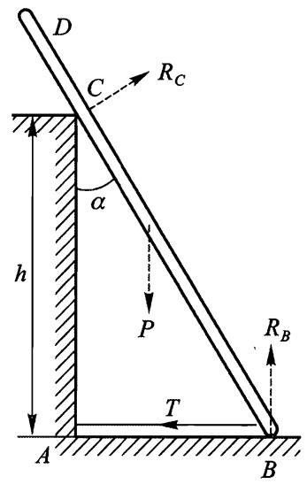
图 52

习题 3 重为 $P$ 的桿 AB 以两个端点分別靠在水平面和竖直面上，并用两条水平绳 $A D$ 和 BC 拉着固定在适当的位置上，绳 $B C$ 与杆 $A B$ 位于同一个竖直面内 (图 53).试求支撑点的反作用力和绳的张力.

解：张力 $T _ { A } , T _ { B }$ 的方向分别从 $A$ 到 $D$ 和从 $B$ 到 $C$ .反作用力 $R _ { A } , R _ { B }$ 分别

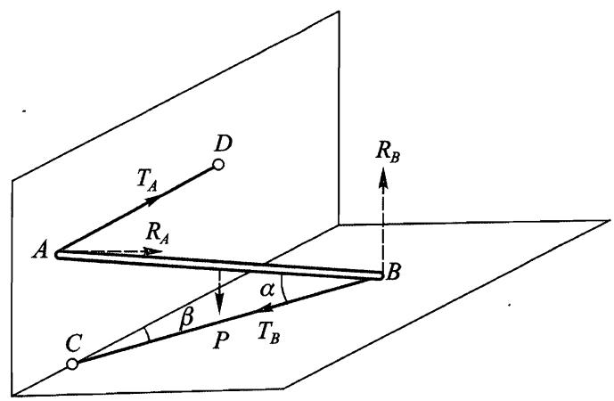
图 53

垂直相应的平面.解平衡方程得

$$
R _ { B } = P , T _ { B } = { \frac { P } { 2 } } \mathrm { c o t } \alpha ,
$$

$$
R _ { A } = T _ { B } \mathrm { s i n } \beta , \quad T _ { A } = T _ { B } \mathrm { c o s } \beta .
$$

习题 4 两根长为 $l$ 重量可以忽略的杆上面以铰链相连，下面用绳连接 (图 54).杆立于一平面上，在一根杆的中点作用一个力 $F$ .试求反作用力.

解：作用在 $A$ 点的张力从 $A$ 指向 $B$ ,而作用在 $B$ 点的张力从 $B$ 指向 $A$ .在 $A$ 点和 $B$ 点的反作用力 $R _ { A }$ 和 $R _ { B }$ 垂直于支撑平面.用 $R _ { C }$ 表示铰链作用在 $A C$ 杆上的反作用力，则铰链作用在 $B C$ 杆上的反作用力为 $\mathit { \Pi } - R _ { C }$ .根据平衡条件，作用在 $B C$ 杆上的力 $R _ { B } , T , - R _ { C }$ 的力矩之和等于零，由此可知矢量 $R _ { C }$ 的方向沿着 $B C$ .再利用其它平衡条件 (对两根杆分别列出)，可得

$$
\begin{array} { l } { { \displaystyle R _ { A } = \frac { 3 } { 4 } F , ~ R _ { B } = \frac { F } { 4 } , } } \\ { { \displaystyle R _ { C } = \frac { F } { 4 \sin \alpha } , ~ T = \frac { 1 } { 4 } F \cot \alpha } } \end{array}
$$

其中 $\alpha$ 是角 $\angle C A B$ .

# $\S 39$ 非惯性参考系中的运动

到现在为止，我们总是相对惯性参考系研究力学系统的运动.例如，对于在外场中的单个质点，仅在惯性参考系中才有拉格朗日函数

$$
L _ { 0 } = \frac { m \mathbf { v } _ { 0 } ^ { 2 } } { 2 } - U ,
$$

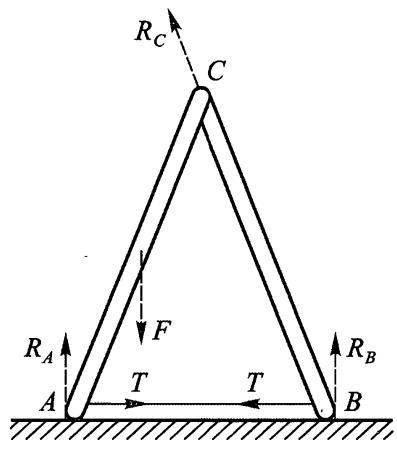
图 54

和相应的运动方程

$$
m \ { \frac { \mathrm { d } { \pmb { v } } _ { 0 } } { \mathrm { d } t } } = - { \frac { \partial U } { \partial { \pmb { r } } } }
$$

（我们在本节用下标 0 表示在惯性参考系中的物理量）.

现在我们研究在非惯性参考系中质点运动方程将具有的形式.解决这个问题的出发点仍是最小作用量原理，它的适用性不受参考系选择的限制，同时，拉格朗日方程

$$
{ \frac { \mathrm { d } } { \mathrm { d } t } } \ { \frac { \partial L } { \partial { \textbf { \em u } } } } = { \frac { \partial L } { \partial r } }
$$

也同样有效.但拉格朗日函数已经不是 (39.1) 的形式，为了求得它，需要对函数 $L _ { 0 }$ 进行必要的变换.

我们分两步进行这个变换.我们首先研究以平动速度 $\mathbf { } V ( \mathbf { \sigma } _ { t } )$ 相对惯性参考系 $\mathrm { K } _ { 0 }$ 运动的参考系 $\mathrm { K } ^ { \prime }$ .质点相对参考系 $\mathrm { K } _ { 0 }$ 和 $\mathrm { K } ^ { \prime }$ 的速度 ${ \bf \dot { v } } _ { 0 }$ 和 ${ \pmb v } ^ { \prime }$ 之间的关系为

$$
{ \pmb v } _ { 0 } = { \pmb v } ^ { \prime } + { \pmb V } \left( \frac { } { } t \right) .
$$

将这个等式代入 (39.1),可得在参考系 $\mathrm { K } ^ { \prime }$ 中的拉格朗日函数

$$
L ^ { ' } = { \frac { m v ^ { ' 2 } } { 2 } } + m \mathbf { \nabla } v ^ { ' } \cdot \mathbf { V } + { \frac { m } { 2 } } \mathbf { V } ^ { 2 } - U .
$$

但 $V ^ { 2 } ( t )$ 是时间的给定函数，可以当作某个函数对时间的全导数，所以上式中第 3 项可以略去.其次， ${ \pmb v } ^ { \prime } = \mathrm { d } { \pmb r } ^ { \prime } / \mathrm { d } t$ ,其中 $\boldsymbol { r } ^ { \prime }$ 是质点在参考系 $\mathrm { K } ^ { \prime }$ 中的径矢，所以有

$$
m \mathbf { V } ( t ) \cdot { \boldsymbol { v } } ^ { \prime } = m \mathbf { V } \cdot { \frac { \mathrm { d } { \boldsymbol { r } } ^ { \prime } } { \mathrm { d } t } } = { \frac { \mathrm { d } } { \mathrm { d } t } } ( \mathbf { \nabla } m \mathbf { V } \cdot { \boldsymbol { r } } ^ { \prime } ) - m { \boldsymbol { r } } ^ { \prime } \cdot { \frac { \mathrm { d } \mathbf { V } } { \mathrm { d } t } } .
$$

代入拉格朗日函数并略去对时间的全导数项，最后可得

$$
L ^ { ' } = \frac { m v ^ { ' 2 } } { 2 } - m \mathbf { W } ( \mathbf { \Phi } _ { t } ) \cdot \mathbf { { r } ^ { ' } } - \mathbf { \Phi } U ,
$$

其中 $\pmb { W } = \mathrm { d } \pmb { V } / \mathrm { d } t$ 是参考系 $\mathrm { K } ^ { \prime }$ 的平动加速度.

利用 (39.4) 可得拉格朗日方程

$$
m \ { \frac { \mathrm { d } \ v ^ { ' } } { \mathrm { d } t } } = \ - \ { \frac { \partial U } { \partial r ^ { ' } } } - m W ( \ t ) .
$$

可见，参考系的加速平动对质点运动方程的影响，等价于施加一个均匀力场，质点在该场内受到的力等于质点的质量乘以加速度 $\mathbf { \Delta } \mathbf { W }$ ,且方向与加速度相反.

下面我们再引进另外一个参考系 K，与 $\mathrm { K } ^ { \prime }$ 有共同的原点，但是以角速度 $\pmb { \Omega } \left( \mathbf { \Omega } _ { t } \right)$ 相对于 $\mathrm { K } ^ { \prime }$ 转动，于是相对惯性参考系 $\mathrm { K } _ { 0 }$ ,参考系 $\mathrm { K }$ 既平动又转动.

质点相对参考系 $\mathrm { K } ^ { \prime }$ 的速度 $\overrightarrow { \mathbfit { v } }$ 等于相对参考系 K 的速度 $\pmb { v }$ 加上随同参考系 K 转动的速度 $\pmb { \Omega } \times \pmb { r }$

$$
{ \pmb v } ^ { \prime } = { \pmb v } + { \pmb \Omega } \times { \pmb r }
$$

（因为质点在参考系 K 和 $\mathrm { K } ^ { \prime }$ 中的径矢 $r$ 和 $\boldsymbol { r ^ { \prime } }$ 相同).将这个表达式代入拉格朗日

函数 (39.4),可得

$$
L = \frac { m v ^ { 2 } } { 2 } + m \pmb { v } \cdot ( \pmb { \Omega } \times \pmb { r } ) + \frac { m } { 2 } ( \pmb { \Omega } \times \pmb { r } ) ^ { 2 } - m \pmb { W } \cdot \pmb { r } - U .
$$

这是在任意参考系 (未必是惯性系) 中质点的拉格朗日函数的一般形式.我们注意到，参考系转动导致拉格朗日函数中出现一个特别的项，它对质点速度是线性的：

为了计算拉格朗日方程中的导数，我们写出全微分

$$
\mathrm d \boldsymbol { L } = \boldsymbol { m } \boldsymbol { v } \boldsymbol { \cdot } \mathrm d \boldsymbol { v } + m \mathrm { d } \boldsymbol { v } \boldsymbol { \cdot } ( \boldsymbol { \Omega } \times \boldsymbol { r } ) + m \boldsymbol { v } \boldsymbol { \cdot } ( \boldsymbol { \Omega } \times \mathrm d \boldsymbol { r } ) + m ( \boldsymbol { \Omega } \times \boldsymbol { r } ) \boldsymbol { \cdot } ( \boldsymbol { \Omega } \times \mathrm d \boldsymbol { r } ) + m ( \boldsymbol { \Omega } \times \boldsymbol { r } ) \boldsymbol { \cdot } ( \boldsymbol { \Omega } \times \mathrm d \boldsymbol { r } ) .
$$

$$
m \pmb { W } \mathbf { \cdot } \mathrm { d } \pmb { r } - \frac { \partial \pmb { U } } { \partial \pmb { r } } \mathbf { \cdot } \mathrm { d } \pmb { r } = m \pmb { v } \ \mathbf { \cdot } \mathrm { d } \pmb { v } \ + \ m \mathrm { d } \pmb { v } \ \mathbf { \cdot } \left( \pmb { \Omega } \times \pmb { r } \right) +
$$

$$
m \mathrm { d } \pmb { r } \cdot ( \pmb { v } \times \pmb { \Omega } ) + m \big [ ( \pmb { \Omega } \times \pmb { r } ) \times \pmb { \Omega } \big ] \cdot \mathrm { d } \pmb { r } - m \pmb { W } \cdot \mathrm { d } \pmb { r } - \frac { \partial \pmb { U } } { \partial \pmb { r } } \bullet \mathrm { d } \pmb { r } .
$$

合并包含 ${ \mathrm { d } } \pmb { v }$ 和 $\mathrm { d } r$ 的项,可得

$$
\frac { \partial L } { \partial \pmb { v } } = \pmb { m } \pmb { v } + \boldsymbol { m } \left( \pmb { \Omega } \times \pmb { r } \right) , \quad \frac { \partial L } { \partial \pmb { r } } = \boldsymbol { m } \left( \pmb { v } \times \pmb { \Omega } \right) + \boldsymbol { m } \left[ \left( \pmb { \Omega } \times \pmb { r } \right) \times \pmb { \Omega } \right] - \boldsymbol { m } \pmb { W } - \frac { \partial L } { \partial \pmb { r } } = \pmb { W } \pmb { W } .
$$

将这些表达式代入 (39.2)，可得所要求的方程

$$
m \ { \frac { \mathrm { d } \pmb v } { \mathrm { d } t } } = \ - \frac { \partial U } { \partial \pmb r } - m { \pmb W } + m ( \pmb r \times \dot { \pmb \Omega } ) + 2 m ( \pmb v \times \pmb \Omega ) + m [ \pmb \Omega \times ( \pmb r \times \pmb \Omega ) ] .
$$

我们发现，因参考系转动产生的“惯性力”由 3 部分组成.力 $m \left( \boldsymbol { r } \times \dot { \boldsymbol { \Omega } } \right)$ 与非匀速转动有关，而其它两个部分即使在匀速转动时也存在.力 $2 m \left( \pmb { v } \times \pmb { \Omega } \right)$ 称为科里奥利力，与以前研究的所有（非耗散) 力不同，它依赖于质点的速度.力 $m \left[ \pmb { \Omega } \times \left( \pmb { r } \times \pmb { \Omega } \right) \right]$ 称为离 $\therefore \because$ 力.它位于过 $\boldsymbol { r }$ 和 $\pmb { \Omega }$ 的平面上，垂直于转动轴 (即 $\pmb { \mathcal { L } }$ 方向），方向背离转动轴.离心力的大小等于 $m \rho \Omega ^ { 2 }$ ,其中 $\rho$ 是质点到转动轴的距离：

我们现在考虑参考系没有平动加速度且匀速转动的特殊情况.在 (39.6) 和 (39.7) 中令 $\pmb { \Omega } = \mathrm { c o n s t }$ , $W = 0$ ,可得拉格朗日函数

$$
L = { \frac { m v ^ { 2 } } { 2 } } + m { \boldsymbol { \ v } } \cdot ( { \boldsymbol { \Omega } } \times { \boldsymbol { r } } ) + { \frac { m } { 2 } } ( { \boldsymbol { \Omega } } \times { \boldsymbol { r } } ) ^ { 2 } - U
$$

以及运动方程

$$
m \ { \frac { \mathrm { d } \pmb { v } } { \mathrm { d } t } } = \ - \ { \frac { \partial U } { \partial \pmb { r } } } + 2 m \left( \pmb { v } \times \pmb { \Omega } \right) + m \left[ \pmb { \Omega } \times \left( \pmb { r } \times \pmb { \Omega } \right) \right] .
$$

我们计算这种情况下质点的能量.将

$$
\pmb { p } = \frac { \partial L } { \partial \pmb { v } } = m \ \pmb { v } \ + \ m \left( \pmb { \Omega } \times \pmb { r } \right)
$$

代入 $E = \pmb { p } \cdot \pmb { v } \textrm { -- } L$ ,可得

$$
E = \frac { m v ^ { 2 } } { 2 } - \frac { m } { 2 } ( \pmb { \Omega } \times \pmb { r } ) ^ { 2 } + U .
$$

应该注意，能量中没有速度的线性项.参考系的转动导致能量中出现仅依赖于质点坐标且正比于速度平方的附加项.这个附加势能 $- \left( m / 2 \right) ( \pmb { \Omega } \times \pmb { r } ) ^ { 2 }$ 称为离 $\therefore \Delta$ 势能.

质点相对匀速转动参考系的速度 $\pmb { v }$ 与相对惯性参考系 $\mathrm { K } _ { 0 }$ 的速度 ${ \pmb v } _ { 0 }$ 的关系为

$$
\pmb { v } _ { 0 } = \pmb { v } + \pmb { \Omega } \times \pmb { r } .
$$

所以质点在参考系 K 中的动量 $\pmb { p }$ (参见 (39.10)) 等于质点在惯性参考系 $\mathrm { K } _ { 0 }$ 中的动量 $\pmb { p } _ { 0 } = \textnormal { \ r { m } } \pmb { v } _ { 0 }$ .同时相应的角动量 $\pmb { M } = \pmb { r } \times \pmb { p }$ 和 $\pmb { M } _ { 0 } = \pmb { r } \times \pmb { p } _ { 0 }$ 也相等.但质点在参考系 K 和 $\mathrm { K } _ { 0 }$ 中的能量不同.由 (39.12) 求出 $\pmb { v }$ 代入 (39.11),可得

$$
E = \frac { m v _ { 0 } ^ { 2 } } { 2 } - m { \bf \nabla } v _ { 0 } \cdot ( { \bf \nabla } \Omega \times r ) + U _ { \mathrm { \Omega } } = \frac { m v _ { 0 } ^ { 2 } } { 2 } + U - m ( r \times { \bf v } _ { 0 } ) \cdot \Omega .
$$

前两项是质点在惯性参考系 $\mathrm { K } _ { 0 }$ 中的能量 $E _ { 0 }$ .在最后一项中代入角动量，可得

$$
E = E _ { 0 } - \boldsymbol { M } \cdot \boldsymbol { \Omega } .
$$

这个公式确定了转换到匀速转动参考系时的能量的变换规律.虽然推导是对一个质点的情况进行的，但是可以直接推广到任意质点系，并得到相同的公式 (39.13).

# 习 题

习题 1 试求地球自转 (转动角速度很小) 引起自由落体对竖直方向的偏移．

解：在重力场中 $U = - \mathbf { \nabla } m \mathbf { g } \cdot \mathbf { r }$ ，其中 $\pmb { g }$ 是重力加速度，在公式 (39.9) 中忽略包含 $\pmb { \Omega }$ 的平方的离 $\therefore \Delta$ 力，可得运动方程

$$
\dot { \pmb { v } } = 2 \ \pmb { v } \times \pmb { \Omega } + \pmb { g } .
$$

可用逐阶近似法求解这个方程.为此假设 ${ \pmb v } = { \pmb v } _ { 1 } + { \pmb v } _ { 2 }$ ，其中 ${ \pmb v } _ { 1 }$ 是方程 $\dot { \pmb { v } } _ { 1 } = \pmb { g }$ 的解，即 ${ \pmb v } _ { 1 } = { \pmb g } t + { \pmb v } _ { 0 } ( { \pmb v } _ { 0 }$ 是初始速度）.将 ${ \pmb v } = { \pmb v } _ { 1 } + { \pmb v } _ { 2 }$ 代入 (1) 并仅将 ${ \pmb v } _ { 1 }$ 留在右端，可得 $\pmb { v } _ { 2 }$ 的方程

$$
\dot { \pmb { v } } _ { 2 } = 2 \ \pmb { v } _ { 1 } \times \pmb { \Omega } = 2 t \left( \pmb { g } \times \pmb { \Omega } \right) + 2 \pmb { v } _ { 0 } \times \pmb { \Omega } .
$$

积分得

$$
\pmb { r } = \pmb { h } + \pmb { v _ { 0 } } t + \frac { { \pmb { g } } t ^ { 2 } } { 2 } + \frac { t ^ { 3 } } { 3 } ( \pmb { g } \times \pmb { \Omega } ) + t ^ { 2 } ( \pmb { v _ { 0 } } \times \pmb { \Omega } ) ,
$$

其中 $\pmb { h }$ 是质点的初始位置矢量.

取 $\mathfrak { z }$ 轴竖直向上， $_ { x }$ 轴沿着经线指向极点，那么

$g _ { x } = g _ { y } = 0 , \quad g _ { z } = - \ g , \quad \varOmega _ { x } = \varOmega \cos \lambda , \quad \varOmega _ { y } = 0 , \quad \varOmega _ { z } = \varOmega \sin \lambda ,$ 其中 $\lambda$ 是纬度 (为明确起见，假设为北纬）.在 (2) 中令 ${ \pmb v } _ { 0 } = 0$ ,得

$$
x = 0 , \quad y = - \frac { t ^ { 3 } } { 3 } g \Omega \cos { \lambda } .
$$

代入下落时间 $\scriptstyle t \approx { \sqrt { 2 h / g } }$ ,最后得

$$
x = 0 , \quad y = - \frac { 1 } { 3 } \bigg ( \frac { 2 h } { g } \bigg ) ^ { 3 / 2 } g \Omega \cos \lambda
$$

$_ y$ 值为负表示向东偏移.

习题 2 试求以初始速度 ${ \pmb v } _ { 0 }$ 从地球表面向上拋出的质点的轨迹对平面的偏移.

解：设初始速度 ${ \pmb v } _ { 0 }$ 位于 $_ { x z }$ 平面内，初始高度为 $h = 0$ .由方程 (2)(习题 1) 可得侧向偏移为

$$
y = - \frac { t ^ { 3 } } { 3 } g \Omega _ { x } + t ^ { 2 } ( \Omega _ { x } v _ { 0 z } - \Omega _ { z } v _ { 0 x } ) ,
$$

或者，代入飞行时间 ${ t \approx } 2 \mathrm { v } _ { 0 z } / g$ 有

$$
y = \frac { 4 v _ { 0 z } ^ { 2 } } { g ^ { 2 } } \bigg ( \frac { 1 } { 3 } v _ { 0 z } \Omega _ { x } - v _ { 0 x } \Omega _ { z } \bigg ) .
$$

习题 3 试确定地球转动对单摆微振动的影响 (傅科摆问题）.

解: 忽略摆的竖直方向位移这个二阶小量，可以认为运动在水平的 $x y$ 平面内.略去包含 $\Omega ^ { 2 }$ 的项，写出运动方程为

$$
\ddot { x } + \omega ^ { 2 } x = 2 \Omega _ { z } \dot { y } , \quad \ddot { y } + \omega ^ { 2 } y = - 2 \Omega _ { z } \dot { x } ,
$$

其中 $\omega$ 为不考虑地球转动时摆的振动频率.将第二个方程乘 $\aleph \ \mathrm { i }$ 加上第一个方程，可得关于复变量 $\xi = x + \mathrm { i } y$ 的单一方程

$$
\ddot { \pmb { \xi } } + 2 \mathrm { i } \Omega _ { z } \dot { \pmb { \xi } } + { \omega } ^ { 2 } \pmb { \xi } = 0 .
$$

当 $\varOmega _ { z } \ll \omega$ 时这个方程的解有如下形式：

$$
\xi = \mathrm { e } ^ { - \mathrm { i } \Omega _ { z } t } \big ( A _ { 1 } \mathrm { e } ^ { \mathrm { i } \omega t } + A _ { 2 } \mathrm { e } ^ { - \mathrm { i } \omega t } \big )
$$

或者

$$
x + \mathrm { i } y = \mathrm { e } ^ { - \mathrm { i } \Omega _ { z } t } \big ( x _ { 0 } + \mathrm { i } { y _ { 0 } } \big ) ,
$$

其中函数 $x _ { 0 } ( t ) , y _ { 0 } ( t )$ 给出不考虑地球转动时单摆的轨迹.因此，地球转动的影响是使轨迹绕竖直方向以角速度 $\varOmega _ { z }$ 转动.
